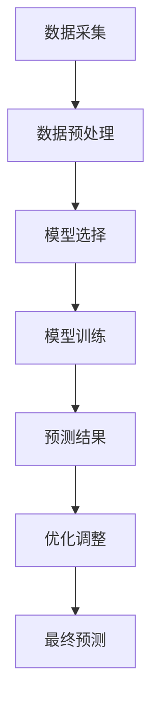
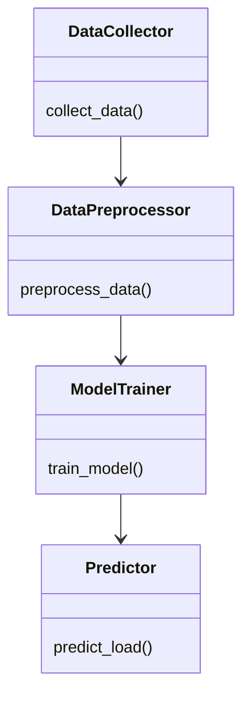
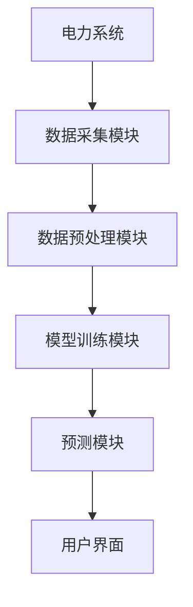
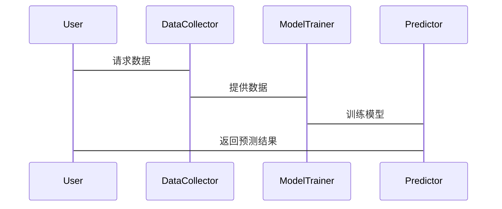

                 


# AI Agent在智能电力负载预测中的应用

> 关键词：AI Agent，智能电力负载预测，机器学习，电力系统，时间序列分析

> 摘要：随着人工智能技术的快速发展，AI Agent在智能电力负载预测中的应用越来越受到关注。本文从背景与概述出发，详细探讨了AI Agent的核心概念、算法原理、系统架构设计、项目实战以及最佳实践。通过理论与实践相结合的方式，深入剖析了AI Agent在智能电力负载预测中的优势与挑战，并为读者提供了丰富的技术细节和实用建议。

---

## 第1章: 智能电力负载预测的背景与挑战

### 1.1 电力系统的基本概念

#### 1.1.1 电力系统的组成与功能
电力系统是由发电、输电、变电、配电和用电五个环节组成的复杂系统。其核心功能是将电能从发电端输送到用户端，并确保电能的质量和可靠性。

#### 1.1.2 电力负载预测的定义与重要性
电力负载预测是指根据历史用电数据、天气情况、用户行为等因素，预测未来某一时刻的电力需求。其重要性体现在电网调度、电力生产计划、减少能源浪费以及提高供电稳定性等方面。

#### 1.1.3 传统电力负载预测的局限性
传统电力负载预测方法通常基于统计学模型（如ARIMA）和简单的机器学习算法。这些方法在处理复杂场景时存在以下问题：
- 数据维度低，难以捕捉非线性关系。
- 无法实时更新模型，适应动态变化的用户需求。
- 缺乏智能决策能力，难以应对极端天气或突发事件。

### 1.2 AI Agent的基本概念

#### 1.2.1 AI Agent的定义与特点
AI Agent（人工智能代理）是一种能够感知环境、自主决策并执行任务的智能实体。其特点包括：
- **自主性**：能够在没有外部干预的情况下完成任务。
- **反应性**：能够实时感知环境并做出响应。
- **学习能力**：能够通过数据和经验不断优化自身行为。
- **社交能力**：能够与其他系统或用户进行交互。

#### 1.2.2 AI Agent在智能系统中的作用
AI Agent在智能系统中充当决策者和执行者的角色。它能够通过分析大量数据，识别模式和趋势，并做出最优决策。在电力负载预测中，AI Agent能够实时调整预测模型，确保预测结果的准确性。

#### 1.2.3 AI Agent与传统算法的区别
AI Agent的核心优势在于其智能化和自主性。与传统算法相比，AI Agent能够：
- 处理非结构化数据。
- 实时更新模型。
- 自动适应复杂环境。

### 1.3 智能电力负载预测的应用场景

#### 1.3.1 电力需求预测的实际需求
电力需求预测是电力系统规划和运营的核心任务之一。准确的预测结果能够帮助电力公司优化电力生产计划，减少能源浪费，降低运营成本。

#### 1.3.2 AI Agent在电力系统中的潜在应用
AI Agent在电力系统中的潜在应用包括：
- 实时电力负载预测。
- 自动调整发电计划。
- 应对突发事件（如极端天气）。
- 优化电力分配。

#### 1.3.3 智能电力负载预测的挑战与机遇
智能电力负载预测的挑战主要在于数据的复杂性和模型的实时性。而AI Agent的引入为解决这些问题提供了新的思路。通过结合大数据、机器学习和智能决策技术，AI Agent能够显著提高预测的准确性和实时性。

---

## 第2章: AI Agent在智能电力负载预测中的核心概念

### 2.1 AI Agent的核心原理

#### 2.1.1 AI Agent的基本工作原理
AI Agent的核心原理可以分为感知、决策和执行三个步骤：
1. **感知**：通过传感器、数据库等获取环境数据。
2. **决策**：基于获取的数据，利用机器学习模型生成预测结果。
3. **执行**：根据预测结果采取相应的行动。

#### 2.1.2 AI Agent与电力负载预测的结合
在电力负载预测中，AI Agent能够通过以下步骤实现智能预测：
1. **数据采集**：从电力系统中获取历史用电数据、天气数据等。
2. **数据预处理**：对数据进行清洗、归一化等处理。
3. **模型训练**：利用机器学习算法训练预测模型。
4. **实时预测**：基于当前数据实时更新预测结果。

#### 2.1.3 AI Agent的智能决策机制
AI Agent的智能决策机制包括以下几个步骤：
1. **数据分析**：对数据进行深度分析，识别潜在模式。
2. **模型选择**：根据数据特征选择最优预测模型。
3. **预测优化**：通过不断迭代优化预测结果。
4. **决策反馈**：根据预测结果调整系统参数。

### 2.2 电力负载预测的核心要素

#### 2.2.1 数据采集与处理
电力负载预测的数据来源包括：
- **历史用电数据**：用户的用电记录。
- **天气数据**：温度、湿度等气象数据。
- **节假日数据**：节假日对电力需求的影响。

#### 2.2.2 模型选择与优化
电力负载预测的模型选择需要考虑以下因素：
- **数据特征**：数据的时序性、周期性等。
- **预测精度**：模型的预测能力。
- **计算效率**：模型的训练时间和预测速度。

#### 2.2.3 预测结果的分析与反馈
预测结果的分析与反馈是优化预测模型的重要步骤。通过分析预测误差，可以不断调整模型参数，提高预测准确性。

### 2.3 AI Agent与电力负载预测的关系

#### 2.3.1 AI Agent在电力负载预测中的角色
AI Agent在电力负载预测中充当智能决策者，能够实时调整模型参数，优化预测结果。

#### 2.3.2 AI Agent与传统预测方法的对比
AI Agent的优势在于其智能化和自主性。与传统预测方法相比，AI Agent能够更好地处理复杂数据和动态变化。

#### 2.3.3 AI Agent在智能电力系统中的地位
AI Agent是智能电力系统的核心组件之一，其作用贯穿整个电力系统的运行过程。

---

## 第3章: AI Agent在智能电力负载预测中的算法原理

### 3.1 时间序列分析的数学模型

#### 3.1.1 ARIMA模型的数学公式
ARIMA（自回归积分滑动平均模型）是一种常用的时间序列分析模型。其数学公式如下：
$$
ARIMA(p, d, q) = y_t = \phi_1 y_{t-1} + \dots + \phi_p y_{t-p} + \theta_1 \epsilon_{t-1} + \dots + \theta_q \epsilon_{t-q} + \epsilon_t
$$
其中，$p$为自回归阶数，$d$为差分阶数，$q$为滑动平均阶数。

#### 3.1.2 LSTM模型的数学公式
LSTM（长短期记忆网络）是一种深度学习模型，适用于处理长序列数据。其核心公式包括输入门、遗忘门和输出门：
$$
i_t = \sigma(W_i h_{t-1} + U_i x_t)
$$
$$
f_t = \sigma(W_f h_{t-1} + U_f x_t)
$$
$$
o_t = \sigma(W_o h_{t-1} + U_o x_t)
$$
$$
h_t = i_t \cdot \cosh(W_c h_{t-1} + U_c x_t) + f_t \cdot \cosh_{t-1}
$$
$$
o_t = o_t \cdot \sinh(h_t)
$$

#### 3.1.3 AI Agent的预测模型选择
AI Agent可以根据数据特征选择最优预测模型。例如，对于具有明显周期性数据，可以选择LSTM模型；对于平稳数据，可以选择ARIMA模型。

### 3.2 AI Agent的算法实现

#### 3.2.1 数据预处理
数据预处理包括数据清洗、归一化、缺失值处理等步骤。例如，使用Python的pandas库进行数据清洗：
```python
import pandas as pd
data = pd.read_csv('electricity_load.csv')
data = data.dropna()
data = (data - data.mean()) / data.std()
```

#### 3.2.2 模型训练
以LSTM模型为例，使用Keras进行模型训练：
```python
from keras.models import Sequential
from keras.layers import LSTM, Dense

model = Sequential()
model.add(LSTM(64, input_shape=(timesteps, features)))
model.add(Dense(1))
model.compile(optimizer='adam', loss='mean_squared_error')
model.fit(x_train, y_train, epochs=100, batch_size=32)
```

#### 3.2.3 预测与优化
通过不断迭代优化模型参数，提高预测准确性。例如，使用网格搜索进行超参数优化：
```python
from sklearn.model_selection import GridSearchCV
from keras.wrappers.scikit_learn import KerasRegressor

def create_model(neurons=64):
    model = Sequential()
    model.add(LSTM(neurons, input_shape=(timesteps, features)))
    model.add(Dense(1))
    return model

param_grid = {'neurons': [32, 64, 128]}
grid = GridSearchCV(KerasRegressor(build_fn=create_model), param_grid, cv=3)
grid.fit(x_train, y_train)
best_model = grid.best_estimator_
```

### 3.3 算法流程图



---

## 第4章: AI Agent在智能电力负载预测中的系统架构设计

### 4.1 系统功能设计

#### 4.1.1 领域模型


#### 4.1.2 系统架构


### 4.2 系统接口设计

#### 4.2.1 数据接口
电力系统与数据采集模块之间的接口需要支持多种数据格式，如CSV、JSON等。

#### 4.2.2 模型接口
模型训练模块与预测模块之间的接口需要定义输入输出格式，例如输入为时间序列数据，输出为预测结果。

### 4.3 系统交互流程



---

## 第5章: AI Agent在智能电力负载预测中的项目实战

### 5.1 项目环境安装

#### 5.1.1 安装Python环境
使用Anaconda安装Python环境，并激活环境：
```bash
conda create -n ai_agent python=3.8
conda activate ai_agent
```

#### 5.1.2 安装依赖库
安装所需的依赖库：
```bash
pip install numpy pandas keras scikit-learn matplotlib
```

### 5.2 系统核心实现源代码

#### 5.2.1 数据预处理代码
```python
import pandas as pd
import numpy as np

def preprocess_data(data_path):
    data = pd.read_csv(data_path)
    data = data.dropna()
    data = (data - data.mean()) / data.std()
    return data
```

#### 5.2.2 模型训练代码
```python
from keras.models import Sequential
from keras.layers import LSTM, Dense
import numpy as np

def create_model(input_shape):
    model = Sequential()
    model.add(LSTM(64, input_shape=input_shape))
    model.add(Dense(1))
    model.compile(optimizer='adam', loss='mean_squared_error')
    return model

# 示例输入
timesteps = 24
features = 1
input_shape = (timesteps, features)

model = create_model(input_shape)
model.fit(x_train, y_train, epochs=100, batch_size=32)
```

#### 5.2.3 预测与优化代码
```python
from sklearn.model_selection import GridSearchCV
from keras.wrappers.scikit_learn import KerasRegressor

def create_model(neurons=64):
    model = Sequential()
    model.add(LSTM(neurons, input_shape=input_shape))
    model.add(Dense(1))
    return model

# 示例参数搜索
param_grid = {'neurons': [32, 64, 128]}
grid = GridSearchCV(KerasRegressor(build_fn=create_model), param_grid, cv=3)
grid.fit(x_train, y_train)
best_model = grid.best_estimator_
```

### 5.3 项目小结
通过以上步骤，我们可以实现一个基于AI Agent的智能电力负载预测系统。通过数据预处理、模型训练和优化，我们可以显著提高预测的准确性和实时性。

---

## 第6章: AI Agent在智能电力负载预测中的最佳实践

### 6.1 小结与总结
AI Agent在智能电力负载预测中的应用具有显著的优势，能够显著提高预测的准确性和实时性。通过结合大数据、机器学习和智能决策技术，AI Agent为电力系统的优化运营提供了新的思路。

### 6.2 注意事项与建议
- 数据质量是预测准确性的关键，需确保数据的完整性和准确性。
- 模型选择需根据数据特征和业务需求进行调整。
- 预测结果需结合实际业务场景进行解释和优化。

### 6.3 拓展阅读与深入学习
- 《Deep Learning》（Ian Goodfellow等著）
- 《时间序列分析》（Shumway和Stoffer著）
- 《人工智能：一种现代方法》（Peter Russell著）

---

## 作者信息

作者：AI天才研究院/AI Genius Institute & 禅与计算机程序设计艺术/Zen And The Art of Computer Programming

---

感谢您的阅读！希望本文能为您提供有价值的技术见解和实践指导！

