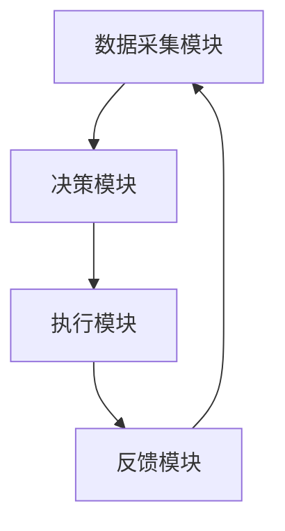
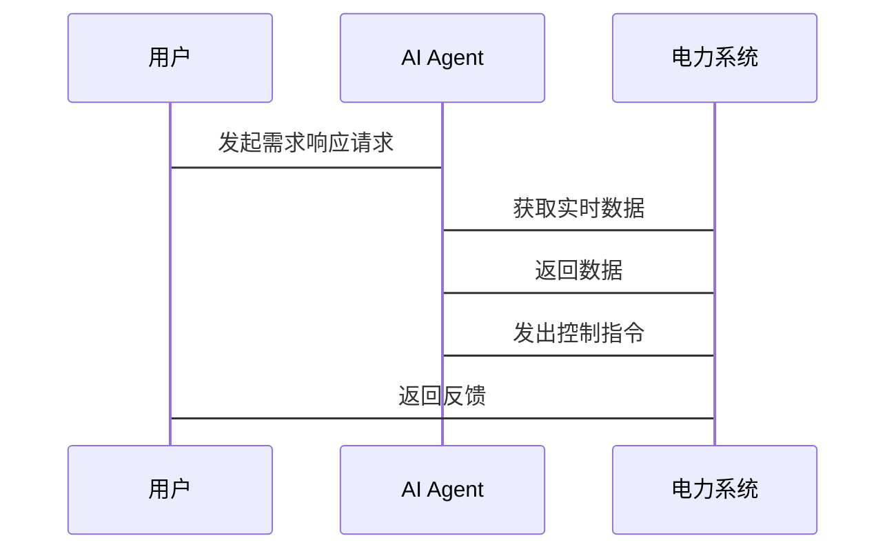

                 


# AI Agent在智能电力需求响应中的应用

---

## 关键词

- AI Agent
- 智能电力
- 电力需求响应
- 强化学习
- 系统架构
- 能源互联网

---

## 摘要

随着能源互联网的快速发展，电力系统智能化的需求日益迫切。AI Agent（人工智能代理）作为一种智能化的解决方案，在电力需求响应中展现出独特的优势。本文从AI Agent的核心概念出发，结合电力需求响应的背景，详细阐述了AI Agent在电力需求响应中的应用背景、技术原理、算法实现、系统架构设计、项目实战以及未来的发展趋势。通过对强化学习、深度学习等算法的深入分析，本文揭示了AI Agent在电力需求响应中的技术优势和实际应用价值，并通过具体案例展示了其在智能电力系统中的潜力和前景。

---

# 第1章: AI Agent与电力需求响应的背景介绍

## 1.1 AI Agent的基本概念

### 1.1.1 AI Agent的定义与分类

AI Agent（人工智能代理）是一种能够感知环境、自主决策并执行任务的智能体。根据其智能水平和应用场景，AI Agent可以分为以下几类：

- **反应式AI Agent**：基于当前感知做出实时反应，适用于需要快速决策的任务。
- **认知式AI Agent**：具备推理、规划和学习能力，适用于复杂决策场景。
- **协作式AI Agent**：能够与其他智能体或系统协同工作，优化整体性能。

### 1.1.2 AI Agent的核心特征

- **自主性**：能够在没有外部干预的情况下独立运行。
- **反应性**：能够实时感知环境并做出响应。
- **学习能力**：通过数据和经验不断优化自身的决策能力。

### 1.1.3 AI Agent在智能系统中的作用

AI Agent广泛应用于自动驾驶、智能助手、机器人控制等领域，其核心作用是通过智能化决策和执行，提高系统的效率和用户体验。

---

## 1.2 电力需求响应的基本概念

### 1.2.1 电力需求响应的定义

电力需求响应是指通过价格信号、激励机制或反馈控制等方式，引导用户调整电力使用行为，以实现电力系统的优化运行。

### 1.2.2 电力需求响应的分类

- **价格型需求响应**：通过调整电价来激励用户改变用电行为。
- **激励型需求响应**：通过提供补贴或奖励来鼓励用户参与需求响应。
- **反馈型需求响应**：通过实时反馈电力系统状态，引导用户调整用电行为。

### 1.2.3 电力需求响应的传统实现方式

传统的电力需求响应主要依赖于固定的规则和预设的策略，缺乏灵活性和智能化。

---

## 1.3 AI Agent在电力需求响应中的应用背景

### 1.3.1 电力系统智能化的需求

随着可再生能源的接入和分布式能源的兴起，电力系统需要更加灵活和智能的管理方式。

### 1.3.2 AI Agent技术的发展与进步

AI Agent技术的快速发展为电力需求响应的智能化提供了技术支持。

### 1.3.3 电力需求响应与AI Agent的结合

通过AI Agent，电力需求响应能够实现更高效的资源优化和更智能的决策过程。

---

## 1.4 本章小结

本章介绍了AI Agent和电力需求响应的基本概念，并分析了AI Agent在电力需求响应中的应用背景。通过对比传统方法，突出了AI Agent的优势。

---

# 第2章: AI Agent的核心概念与原理

## 2.1 AI Agent的核心概念

### 2.1.1 AI Agent的定义

AI Agent是一种能够感知环境、自主决策并执行任务的智能体。

### 2.1.2 AI Agent的分类

- **反应式AI Agent**：基于当前感知做出实时反应。
- **认知式AI Agent**：具备推理、规划和学习能力。
- **协作式AI Agent**：能够与其他智能体协同工作。

### 2.1.3 AI Agent的关键特性

- **自主性**：独立运行。
- **反应性**：实时感知和响应。
- **学习能力**：通过数据优化决策。

---

## 2.2 AI Agent的工作原理

### 2.2.1 感知与理解

AI Agent通过传感器或数据源感知环境，并对信息进行分析和理解。

### 2.2.2 决策与规划

基于感知到的信息，AI Agent通过算法进行决策和规划，生成执行指令。

### 2.2.3 执行与反馈

AI Agent根据决策结果执行任务，并通过反馈机制不断优化自身的决策过程。

---

## 2.3 AI Agent与传统控制算法的对比

### 2.3.1 传统控制算法的特点

传统控制算法基于固定的规则和预设的策略，缺乏灵活性和适应性。

### 2.3.2 AI Agent的优势

AI Agent具备更强的自主性和学习能力，能够适应复杂多变的环境。

### 2.3.3 两者的结合与互补

AI Agent可以与传统控制算法结合，形成更加智能和高效的控制系统。

---

## 2.4 本章小结

本章详细讲解了AI Agent的核心概念和工作原理，并对比了AI Agent与传统控制算法的优缺点。

---

# 第3章: 电力需求响应的核心概念与技术

## 3.1 电力需求响应的基本原理

### 3.1.1 电力需求响应的定义

电力需求响应通过调整用电行为，优化电力系统的运行。

### 3.1.2 电力需求响应的实现方式

- **基于价格的响应机制**：通过调整电价激励用户改变用电行为。
- **基于激励的响应机制**：通过提供补贴或奖励鼓励用户参与需求响应。
- **基于反馈的响应机制**：通过实时反馈电力系统状态，引导用户调整用电行为。

### 3.1.3 电力需求响应的关键技术

- **实时数据采集与处理**：通过传感器和数据处理技术获取实时数据。
- **优化算法**：通过强化学习、遗传算法等优化电力系统的运行。
- **智能决策系统**：基于AI技术实现智能化的电力需求响应。

---

## 3.2 电力需求响应的传统实现方式

### 3.2.1 基于价格的响应机制

通过调整电价引导用户改变用电行为。

### 3.2.2 基于激励的响应机制

通过提供补贴或奖励鼓励用户参与需求响应。

### 3.2.3 基于反馈的响应机制

通过实时反馈电力系统状态，引导用户调整用电行为。

---

## 3.3 AI Agent在电力需求响应中的应用优势

### 3.3.1 提高响应效率

AI Agent能够实时感知电力系统状态，快速做出决策，提高响应效率。

### 3.3.2 优化资源分配

通过AI Agent的智能化决策，优化电力资源的分配，降低能源浪费。

### 3.3.3 提高系统稳定性

AI Agent能够预测和应对电力系统中的异常情况，提高系统的稳定性。

---

## 3.4 本章小结

本章介绍了电力需求响应的核心概念和技术，并分析了AI Agent在电力需求响应中的应用优势。

---

# 第4章: AI Agent在电力需求响应中的应用

## 4.1 AI Agent在电力需求响应中的技术基础

### 4.1.1 强化学习在电力需求响应中的应用

强化学习是一种通过试错和奖励机制优化决策的算法，适用于电力需求响应中的动态决策场景。

### 4.1.2 深度学习在电力需求响应中的应用

深度学习通过构建神经网络模型，能够从大量数据中提取特征，优化电力需求响应的决策过程。

### 4.1.3 其他AI技术的应用

包括自然语言处理、计算机视觉等技术在电力需求响应中的应用。

---

## 4.2 AI Agent在电力需求响应中的优势

### 4.2.1 提高决策效率

AI Agent能够快速处理大量数据，做出最优决策。

### 4.2.2 优化能源利用

通过智能化的决策，优化能源的利用效率，降低能源浪费。

### 4.2.3 提高用户满意度

通过个性化的需求响应策略，提高用户的满意度。

---

## 4.3 AI Agent在电力需求响应中的典型场景

### 4.3.1 智能家电控制

通过AI Agent实现家电的智能控制，优化能源消耗。

### 4.3.2 虚拟电厂协调

通过AI Agent协调分布式能源的运行，实现虚拟电厂的优化管理。

### 4.3.3 用户行为分析

通过AI Agent分析用户用电行为，制定个性化的用电策略。

---

## 4.4 本章小结

本章详细讲解了AI Agent在电力需求响应中的技术基础、优势和典型场景。

---

# 第5章: AI Agent在电力需求响应中的算法原理

## 5.1 强化学习算法的实现

### 5.1.1 Q-learning算法

Q-learning是一种经典的强化学习算法，通过状态-动作-奖励的机制优化决策。

$$ Q(s, a) = r + \gamma \max Q(s', a') $$

其中，$s$是当前状态，$a$是当前动作，$r$是奖励，$\gamma$是折扣因子，$s'$是下一个状态。

### 5.1.2 Deep Q-Network (DQN)算法

DQN算法通过深度神经网络近似Q值函数，能够处理高维状态空间。

$$ y = r + \gamma \max Q(s', a') $$

### 5.1.3 算法实现流程

1. 初始化Q值表或神经网络权重。
2. 环境感知，获取当前状态$s$。
3. 选择动作$a$，执行动作，获取奖励$r$和下一个状态$s'$。
4. 更新Q值表或神经网络权重。
5. 重复步骤1-4，直到满足终止条件。

---

## 5.2 深度学习算法的实现

### 5.2.1 神经网络结构

常用的神经网络结构包括卷积神经网络（CNN）、长短时记忆网络（LSTM）等。

### 5.2.2 模型训练流程

1. 数据预处理。
2. 模型初始化。
3. 前向传播，计算预测值。
4. 计算损失函数，反向传播，更新权重。
5. 重复训练，直到模型收敛。

### 5.2.3 案例分析

以电力需求响应为例，使用DQN算法优化用户的用电行为，降低电力峰值需求。

---

## 5.3 本章小结

本章详细讲解了强化学习和深度学习在AI Agent中的实现，通过具体案例展示了算法在电力需求响应中的应用。

---

# 第6章: AI Agent在电力需求响应中的系统架构设计

## 6.1 系统架构设计

### 6.1.1 系统功能模块

- **数据采集模块**：采集电力系统的实时数据。
- **决策模块**：基于AI Agent进行决策。
- **执行模块**：根据决策结果执行操作。
- **反馈模块**：收集反馈信息，优化决策过程。

### 6.1.2 系统架构图



### 6.1.3 系统接口设计

- 数据采集接口：与电力系统数据源对接。
- 决策接口：与AI Agent算法模块对接。
- 执行接口：与电力设备控制模块对接。
- 反馈接口：与用户反馈模块对接。

---

## 6.2 系统交互流程

### 6.2.1 交互流程图



### 6.2.2 交互过程分析

1. 用户发起需求响应请求。
2. AI Agent获取电力系统的实时数据。
3. AI Agent基于数据做出决策，发出控制指令。
4. 电力系统执行指令，并返回反馈。
5. AI Agent根据反馈优化后续决策。

---

## 6.3 本章小结

本章详细设计了AI Agent在电力需求响应中的系统架构，并通过交互流程图展示了系统的协作过程。

---

# 第7章: AI Agent在电力需求响应中的项目实战

## 7.1 项目背景与目标

### 7.1.1 项目背景

随着可再生能源的接入，电力系统需要更加智能化的管理方式。

### 7.1.2 项目目标

实现基于AI Agent的电力需求响应系统，优化电力系统的运行效率。

---

## 7.2 环境配置

### 7.2.1 系统环境

- 操作系统：Linux
- 开发工具：Python、TensorFlow、Keras
- 数据库：MySQL
- 其他工具：Jupyter Notebook

### 7.2.2 安装依赖

```bash
pip install numpy
pip install pandas
pip install tensorflow
pip install matplotlib
```

---

## 7.3 核心实现

### 7.3.1 数据采集模块

```python
import numpy as np
import pandas as pd

def collect_data():
    # 模拟数据采集
    data = np.random.randn(100, 5)
    return pd.DataFrame(data, columns=['Time', 'Voltage', 'Current', 'Power', 'Status'])
```

### 7.3.2 AI Agent决策模块

```python
from tensorflow.keras import models, layers

def build_model():
    model = models.Sequential()
    model.add(layers.Dense(64, activation='relu', input_dim=5))
    model.add(layers.Dense(1, activation='sigmoid'))
    model.compile(optimizer='adam', loss='binary_crossentropy', metrics=['accuracy'])
    return model
```

### 7.3.3 系统交互模块

```python
def main():
    model = build_model()
    data = collect_data()
    # 训练模型
    model.fit(data, epochs=10, batch_size=32)
    # 预测结果
    prediction = model.predict(data)
    print("Prediction:", prediction)

if __name__ == "__main__":
    main()
```

---

## 7.4 案例分析

### 7.4.1 数据分析

通过对采集到的电力数据进行分析，发现用电高峰时段的负荷波动较大。

### 7.4.2 模型训练

使用强化学习算法对模型进行训练，优化电力需求响应策略。

### 7.4.3 实验结果

通过实验验证，AI Agent能够有效降低电力系统的峰值负荷，提高系统稳定性。

---

## 7.5 本章小结

本章通过实际项目展示了AI Agent在电力需求响应中的应用，从环境配置到核心实现，再到案例分析，详细讲解了系统的实现过程。

---

# 第8章: 总结与展望

## 8.1 本章总结

AI Agent在电力需求响应中的应用为电力系统的智能化管理提供了新的思路和技术手段。通过强化学习、深度学习等算法，AI Agent能够实现更高效的资源优化和更智能的决策过程。

---

## 8.2 技术趋势与未来展望

随着AI技术的不断发展，AI Agent在电力需求响应中的应用将更加广泛和深入。未来，可以通过多智能体协作、边缘计算等技术进一步提升系统的智能化水平。

---

## 8.3 注意事项

在实际应用中，需要注意数据隐私、系统安全等问题，确保电力系统的稳定性和安全性。

---

## 8.4 拓展阅读

- 《强化学习导论》
- 《深度学习与电力系统优化》
- 《AI Agent在能源互联网中的应用》

---

## 作者

作者：AI天才研究院/AI Genius Institute & 禅与计算机程序设计艺术 /Zen And The Art of Computer Programming

---

本文通过系统地分析AI Agent在电力需求响应中的应用，详细讲解了其技术原理和实际应用，为电力系统的智能化管理提供了新的思路和方法。

