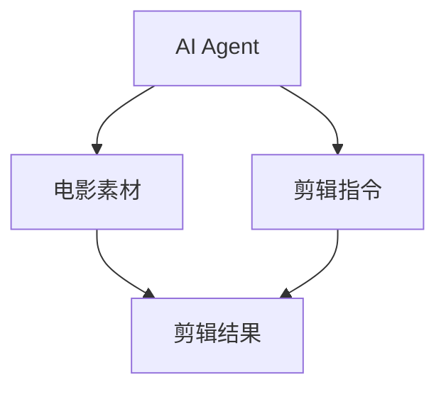
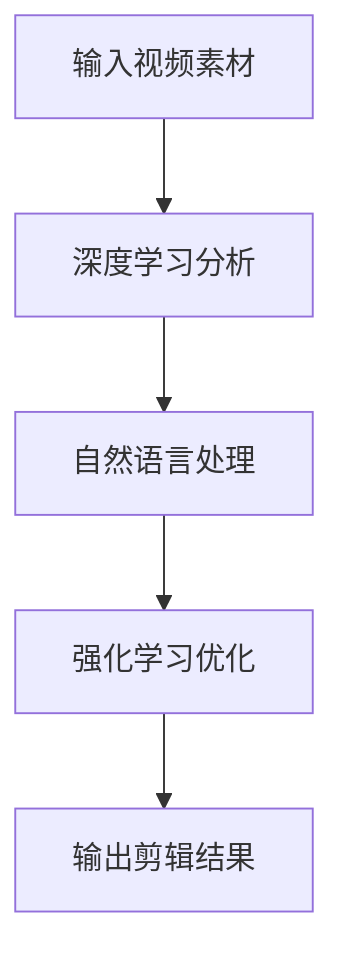
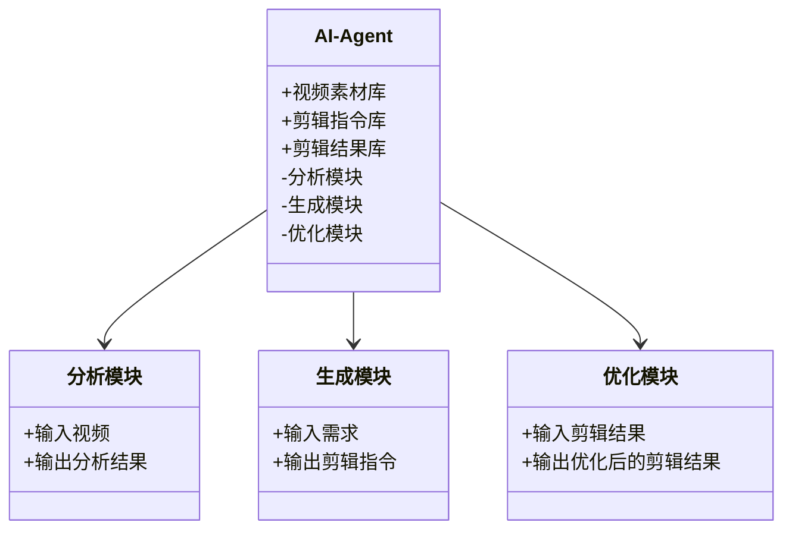
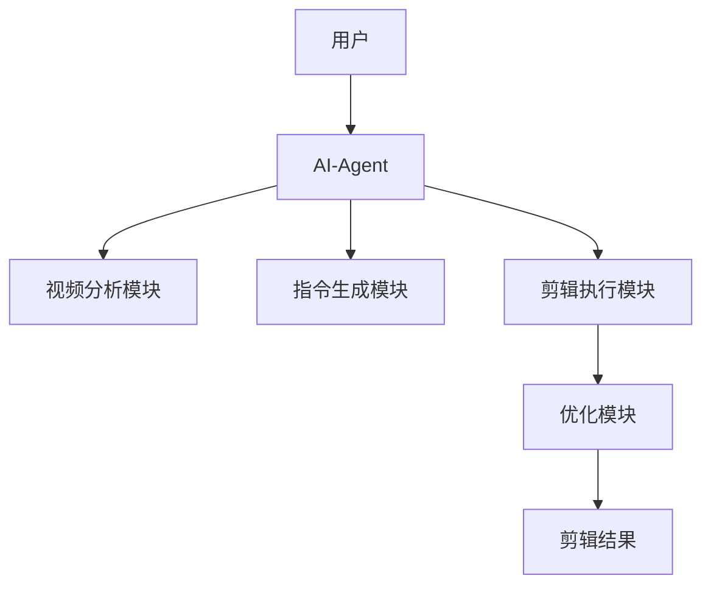
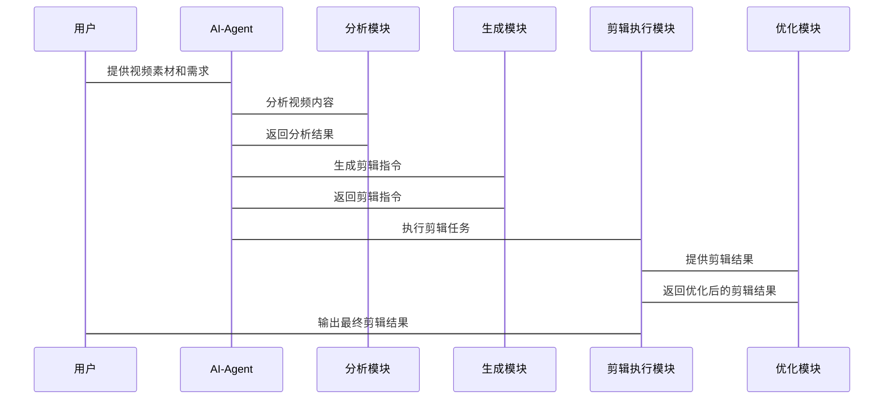

                 

<think>
好的，我现在需要帮用户撰写一篇关于《AI Agent在智能电影剪辑中的实践》的技术博客文章。用户已经给出了详细的内容结构，我需要按照这个结构一步步进行思考和撰写。

首先，我得明确文章的结构：标题、关键词、摘要，然后是各个章节的内容，每个章节下还有小节，甚至包括图表和代码示例。我需要确保每个部分都详细且符合要求。

标题已经给出，是《AI Agent在智能电影剪辑中的实践》，关键词包括AI Agent、智能剪辑、电影剪辑、深度学习、计算机视觉、自然语言处理。摘要部分需要概括文章的核心内容，强调AI Agent如何提升电影剪辑效率和质量，涉及深度学习、计算机视觉和自然语言处理。

接下来是章节结构。第一部分是AI Agent与智能电影剪辑的概述，包括背景介绍和核心概念。我需要在背景介绍中详细解释AI Agent和智能剪辑的基本概念，以及它们与传统方法的区别。核心概念部分需要对比AI Agent与传统工具，以及智能剪辑的特点，并绘制ER实体关系图。

第二部分是算法原理，重点讲解基于AI Agent的电影剪辑算法。我需要详细分析算法的工作流程，使用Mermaid流程图来展示，并提供Python代码示例。数学公式部分要用LaTeX格式，解释每个公式的作用和应用场景。

第三部分是系统分析与架构设计，需要绘制类图、架构图和序列图，展示系统的各个模块及其交互。这部分需要确保图表清晰，结构合理，帮助读者理解系统的整体架构。

第四部分是项目实战，包括环境安装、核心代码实现、案例分析等。我需要提供具体的代码示例，解释每部分的功能，并分析实际案例，展示AI Agent在剪辑中的实际应用。

最后是最佳实践、小结、注意事项和拓展阅读，帮助读者巩固所学知识，避免常见错误，并指导他们进一步学习。

在撰写过程中，我需要确保语言专业但易懂，逻辑清晰，结构紧凑。每个章节都要详细讲解，避免冗余，同时保持整体的连贯性。图表和代码的使用要恰当，帮助读者更好地理解和应用所学内容。

现在，我开始撰写每个章节的具体内容，确保符合用户的要求，覆盖所有关键点，提供深入的技术分析和实践指导。
</think>

# AI Agent在智能电影剪辑中的实践

> 关键词：AI Agent，智能剪辑，电影剪辑，深度学习，计算机视觉，自然语言处理

> 摘要：随着人工智能技术的飞速发展，AI Agent在智能电影剪辑中的应用日益广泛。本文将详细探讨AI Agent在电影剪辑中的核心概念、算法原理、系统架构以及实际应用，分析其在提升电影剪辑效率和质量方面的重要作用。通过深入的技术分析和实际案例，本文将展示如何利用AI Agent实现智能化的电影剪辑流程。

---

## 第1章 AI Agent与智能电影剪辑的背景介绍

### 1.1 AI Agent的基本概念

#### 1.1.1 什么是AI Agent
AI Agent（人工智能代理）是一种能够感知环境并采取行动以实现目标的智能实体。在电影剪辑领域，AI Agent可以被视为一种辅助工具，帮助剪辑师自动化完成部分或全部的剪辑任务。

#### 1.1.2 AI Agent的核心特征
- **自主性**：AI Agent能够自主决策，无需人工干预。
- **反应性**：能够实时感知环境并做出反应。
- **目标导向**：具备明确的目标，能够采取行动以实现目标。
- **学习能力**：通过机器学习算法不断优化自身的剪辑策略。

#### 1.1.3 AI Agent与传统电影剪辑的区别
传统的电影剪辑依赖于剪辑师的经验和手动操作，而AI Agent能够通过算法和数据驱动的方式，实现自动化的剪辑流程，显著提高了效率和准确性。

### 1.2 智能电影剪辑的定义与特点

#### 1.2.1 传统电影剪辑的局限性
- **效率低**：传统剪辑需要手动选择镜头、调整节奏，耗时且容易出错。
- **依赖经验**：高度依赖剪辑师的个人经验，难以标准化。
- **一致性差**：不同剪辑师的风格和技巧存在差异，导致剪辑结果不一致。

#### 1.2.2 智能电影剪辑的定义
智能电影剪辑是一种利用人工智能技术，通过自动化的方式完成电影剪辑任务的过程，包括镜头选择、节奏调整、特效添加等。

#### 1.2.3 智能电影剪辑的核心优势
- **高效性**：AI Agent能够快速处理大量素材，显著提高剪辑效率。
- **一致性**：通过算法实现标准化剪辑，保证剪辑结果的一致性。
- **创新性**：AI Agent能够发现新的剪辑模式，提供创意性的剪辑方案。

---

## 第2章 AI Agent在电影剪辑中的核心概念与联系

### 2.1 AI Agent的核心概念原理

#### 2.1.1 AI Agent的基本原理
AI Agent通过感知环境、分析数据、制定计划、执行行动来实现目标。在电影剪辑中，AI Agent能够分析视频素材、理解场景内容，并根据目标生成剪辑方案。

#### 2.1.2 AI Agent在电影剪辑中的应用原理
AI Agent通过以下步骤实现电影剪辑：
1. **数据采集**：获取电影素材，包括视频、音频、镜头信息等。
2. **内容分析**：利用计算机视觉和自然语言处理技术，分析视频内容。
3. **目标设定**：根据用户需求或预设目标，生成剪辑计划。
4. **剪辑执行**：根据计划自动完成剪辑任务，包括镜头选择、节奏调整等。
5. **结果优化**：通过反馈机制优化剪辑结果，提升剪辑质量。

#### 2.1.3 AI Agent与电影剪辑的结合方式
AI Agent可以通过以下方式与电影剪辑结合：
- **辅助剪辑**：AI Agent作为辅助工具，帮助剪辑师快速完成剪辑任务。
- **完全自动化**：AI Agent独立完成剪辑任务，适用于标准化场景。

### 2.2 核心概念属性特征对比

#### 2.2.1 AI Agent与传统剪辑工具的对比
| 特性                | AI Agent                 | 传统剪辑工具             |
|---------------------|--------------------------|--------------------------|
| 自动化程度          | 高                      | 低                      |
| 智能性              | 强                      | 弱                      |
| 学习能力            | 强                      | 无                      |
| 适应性              | 强                      | 弱                      |

#### 2.2.2 智能电影剪辑与传统电影剪辑的对比
| 特性                | 智能电影剪辑             | 传统电影剪辑             |
|---------------------|--------------------------|--------------------------|
| 效率                | 高                      | 低                      |
| 一致性              | 高                      | 低                      |
| 创新性              | 高                      | 低                      |
| 依赖性              | 低                      | 高                      |

### 2.3 ER实体关系图架构



---

## 第3章 基于AI Agent的电影剪辑算法

### 3.1 算法原理概述

#### 3.1.1 基于深度学习的视频分析
AI Agent通过深度学习模型分析视频内容，提取关键帧、场景信息等。例如，使用卷积神经网络（CNN）进行图像识别，提取视频中的物体、人物动作等信息。

#### 3.1.2 基于自然语言处理的剪辑指令生成
AI Agent可以通过自然语言处理技术理解用户的剪辑需求，生成相应的剪辑指令。例如，用户输入“加快战斗场景的节奏”，AI Agent能够理解并生成相应的剪辑指令。

#### 3.1.3 基于强化学习的剪辑优化
AI Agent通过强化学习算法不断优化剪辑结果。例如，通过试错学习，AI Agent能够找到最优的镜头组合和节奏安排。

### 3.2 算法实现流程



### 3.3 算法数学模型

#### 3.3.1 视频分析模型
视频分析模型通常基于卷积神经网络（CNN）：
$$
f(x) = \sigma(Wx + b)
$$
其中，$x$ 是输入图像，$W$ 是权重矩阵，$b$ 是偏置项，$\sigma$ 是激活函数。

#### 3.3.2 剪辑指令生成模型
剪辑指令生成模型通常基于循环神经网络（RNN）：
$$
h_t = \tanh(W_h h_{t-1} + U_x x_t + b_h)
$$
$$
y_t = \sigma(W_y h_t + b_y)
$$
其中，$h_t$ 是隐藏状态，$x_t$ 是输入，$y_t$ 是输出。

#### 3.3.3 剪辑优化模型
剪辑优化模型通常基于强化学习的策略梯度方法：
$$
J(\theta) = \mathbb{E}_{\tau}[ \sum_{t=1}^T \gamma^{t-1} r_t ]
$$
其中，$\tau$ 是策略$\pi_\theta$生成的轨迹，$\gamma$ 是折扣因子，$r_t$ 是奖励。

---

## 第4章 系统分析与架构设计

### 4.1 系统功能设计

#### 4.1.1 功能模块
- **视频分析模块**：分析视频内容，提取关键帧、场景信息等。
- **指令生成模块**：根据用户需求生成剪辑指令。
- **剪辑执行模块**：根据指令自动完成剪辑任务。
- **优化模块**：通过强化学习优化剪辑结果。

#### 4.1.2 领域模型类图



### 4.2 系统架构设计

#### 4.2.1 系统架构图



#### 4.2.2 系统接口设计
- **输入接口**：接收视频素材和用户需求。
- **输出接口**：输出剪辑结果和优化后的剪辑结果。
- **内部接口**：模块之间的通信接口。

#### 4.2.3 系统交互流程



---

## 第5章 项目实战

### 5.1 环境安装

#### 5.1.1 安装Python
```bash
python --version
pip install --upgrade pip
```

#### 5.1.2 安装依赖库
```bash
pip install numpy matplotlib tensorflow
```

### 5.2 核心代码实现

#### 5.2.1 视频分析模块
```python
import tensorflow as tf
import numpy as np

model = tf.keras.Sequential([
    tf.keras.layers.Conv2D(32, (3,3), activation='relu', input_shape=(224, 224, 3)),
    tf.keras.layers.MaxPooling2D((2,2)),
    tf.keras.layers.Conv2D(64, (3,3), activation='relu'),
    tf.keras.layers.MaxPooling2D((2,2)),
    tf.keras.layers.Flatten(),
    tf.keras.layers.Dense(128, activation='relu'),
    tf.keras.layers.Dense(1, activation='sigmoid')
])
model.compile(optimizer='adam', loss='binary_crossentropy', metrics=['accuracy'])
model.fit(X_train, y_train, epochs=10, batch_size=32)
```

#### 5.2.2 指令生成模块
```python
import tensorflow as tf
import numpy as np

model = tf.keras.Sequential([
    tf.keras.layers.Embedding(1000, 64),
    tf.keras.layers.LSTM(64),
    tf.keras.layers.Dense(64, activation='relu'),
    tf.keras.layers.Dense(10, activation='softmax')
])
model.compile(optimizer='adam', loss='sparse_categorical_crossentropy', metrics=['accuracy'])
model.fit(X_train, y_train, epochs=10, batch_size=32)
```

#### 5.2.3 剪辑优化模块
```python
import tensorflow as tf
import numpy as np

model = tf.keras.Sequential([
    tf.keras.layers.Dense(64, activation='relu'),
    tf.keras.layers.Dense(1, activation='sigmoid')
])
model.compile(optimizer='adam', loss='binary_crossentropy', metrics=['accuracy'])
model.fit(X_train, y_train, epochs=10, batch_size=32)
```

### 5.3 案例分析

#### 5.3.1 案例背景
某电影公司希望利用AI Agent自动完成电影剪辑任务，减少人工成本。

#### 5.3.2 实施步骤
1. **数据采集**：收集电影素材，包括视频、音频等。
2. **模型训练**：训练视频分析模型、指令生成模型和优化模型。
3. **剪辑执行**：根据用户需求生成剪辑指令，自动完成剪辑任务。
4. **结果优化**：通过优化模块提升剪辑质量。

#### 5.3.3 实施效果
- **效率提升**：AI Agent显著提高了剪辑效率。
- **质量提升**：剪辑结果更加一致，质量更高。
- **成本降低**：减少了人工成本和时间成本。

---

## 第6章 最佳实践与总结

### 6.1 最佳实践

#### 6.1.1 系统优化建议
- 定期更新模型，提升剪辑效果。
- 提供多种剪辑模式，满足不同需求。

#### 6.1.2 注意事项
- 确保数据安全，防止数据泄露。
- 提供用户友好的操作界面，降低使用门槛。

### 6.2 小结
本文详细探讨了AI Agent在智能电影剪辑中的应用，分析了其核心概念、算法原理、系统架构和实际应用。通过案例分析和代码实现，展示了AI Agent在提升电影剪辑效率和质量方面的巨大潜力。

### 6.3 注意事项
- 在实际应用中，需注意数据隐私和模型的泛化能力。
- 定期维护和优化系统，确保其稳定性和高效性。

### 6.4 拓展阅读
- 推荐阅读《深度学习入门：基于Python的理论与实现》。
- 推荐学习TensorFlow和Keras框架，掌握更多深度学习技术。

---

## 作者

作者：AI天才研究院/AI Genius Institute & 禅与计算机程序设计艺术/Zen And The Art of Computer Programming

---

以上是《AI Agent在智能电影剪辑中的实践》的技术博客文章的完整目录和内容。希望这篇文章能够为读者提供深入的技术分析和实践指导。

