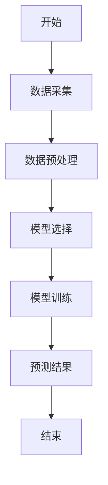
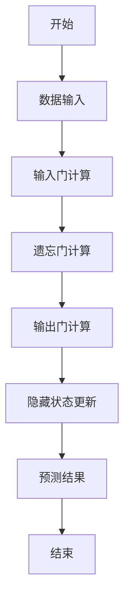
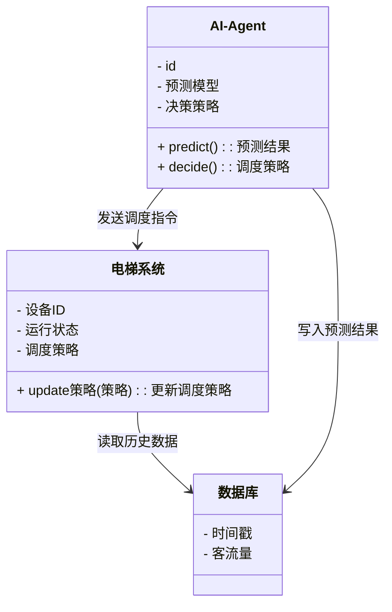
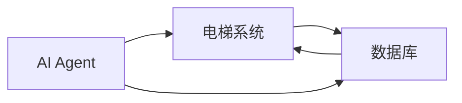

                 

<think>
嗯，用户希望我设计一本关于《AI Agent在智能电梯中的人流预测》的详细技术博客文章。首先，我需要理解用户的具体需求。用户希望文章结构清晰，内容专业，涵盖背景、概念、算法、系统设计、项目实战等部分，并且使用Markdown格式，包含图表和数学公式。

我应该先确定文章的结构，确保每个部分都有足够的细节。比如，引言部分需要介绍智能电梯的发展背景，说明AI Agent的重要性。然后，核心概念部分需要详细解释AI Agent和人流预测的基本原理，可能还要对比传统方法和AI方法的优缺点。

接下来是算法部分，我需要选择合适的算法，比如时间序列分析或机器学习模型，并用流程图展示预测过程。数学模型部分，可能需要涉及ARIMA或LSTM模型，用LaTeX公式来表达。

系统架构设计部分，我需要画出电梯系统与AI Agent的交互图，展示数据采集、处理、预测和反馈的过程。项目实战部分，需要提供具体的代码实现，解读代码的作用，并分析实际案例。

最后，我需要确保文章符合字数要求，大约1万到1万2千字，并且在结尾加上作者信息。整体结构需要逻辑紧凑，语言专业但易懂，满足技术博客的高质量要求。
</think>

# AI Agent在智能电梯中的人流预测

> **关键词**：AI Agent, 智能电梯, 人流预测, 时间序列分析, LSTM神经网络

> **摘要**：本文深入探讨了AI Agent在智能电梯中的人流预测应用。通过分析智能电梯的发展历程、AI Agent的核心原理、人流预测的算法模型以及系统架构设计，本文详细阐述了如何利用AI技术优化电梯调度和提升用户体验。文章从背景介绍、核心概念、算法原理、系统设计到项目实战，层层展开，为读者提供了全面的技术解析。

---

# 第1章: AI Agent与智能电梯的背景介绍

## 1.1 智能电梯的发展历程

### 1.1.1 传统电梯的工作原理

传统电梯是一种通过机械和电气控制来实现楼层间人员运输的设备。它依赖于按钮操作和固定的运行时间表，无法根据实时需求动态调整运行策略。传统电梯的核心功能包括楼层选择、门的开闭控制、运行状态监控等，但缺乏智能化的人流预测和优化调度能力。

### 1.1.2 智能电梯的概念与特点

智能电梯是将物联网、人工智能和大数据分析技术引入电梯系统中，使其能够实时感知和预测人流需求，并根据预测结果优化电梯的运行策略。智能电梯的特点包括：

- **实时感知**：通过传感器和摄像头采集电梯内外的人流数据。
- **智能预测**：利用AI算法预测未来一段时间内的人流需求。
- **动态调度**：根据预测结果优化电梯的运行路线和等待时间。

### 1.1.3 AI技术在电梯中的应用前景

AI技术的应用使得电梯系统能够更高效地响应用户需求，减少等待时间，降低能耗，提升用户体验。通过AI Agent（智能体）的引入，电梯系统能够实现从被动响应到主动预测的转变，从而显著提高电梯的运行效率和服务质量。

---

## 1.2 人流预测的核心问题

### 1.2.1 人流预测的定义与目标

人流预测是指通过分析历史数据和当前状态，预测未来一段时间内电梯轿厢内外的人流变化趋势。其目标是为电梯系统的调度和优化提供数据支持，从而实现资源的最优配置。

### 1.2.2 智能电梯中的人流预测场景

在智能电梯中，人流预测主要应用于以下几个场景：

1. **高峰时段调度**：在上班高峰期，预测办公楼内的人流需求，优化电梯的运行路线，减少等待时间。
2. **节假日客流管理**：在商场或酒店的高峰期，预测客流量，提前调整电梯运行策略。
3. **动态应急响应**：根据实时人流变化，动态调整电梯的运行状态，应对突发情况。

### 1.2.3 人流预测的边界与外延

人流预测的边界主要集中在电梯轿厢内外的人流变化，外延则包括与电梯运行相关的其他因素，如设备状态、网络延迟等。

---

## 1.3 AI Agent在智能电梯中的作用

### 1.3.1 AI Agent的定义与特点

AI Agent（智能体）是一种能够感知环境并采取行动以实现目标的实体。在智能电梯中，AI Agent的核心功能包括数据采集、信息处理、决策制定和行动执行。

### 1.3.2 AI Agent在电梯人流预测中的应用

AI Agent通过分析电梯内外的人流数据，利用机器学习算法进行预测，并根据预测结果优化电梯的运行策略。例如，AI Agent可以预测下一个小时内电梯轿厢的需求变化，并据此调整电梯的运行频率和停靠时间。

### 1.3.3 AI Agent与其他预测方法的对比

传统的电梯调度方法主要依赖于固定的运行时间表和按钮操作，无法适应实时变化的人流需求。而AI Agent通过实时数据采集和动态预测，能够显著提高电梯的运行效率和服务质量。

---

## 1.4 本章小结

本章通过介绍智能电梯的发展历程、AI Agent的核心原理以及人流预测的应用场景，为读者提供了理解AI Agent在智能电梯中作用的背景知识。接下来的章节将深入探讨AI Agent与人流预测的核心概念、算法原理和系统架构设计。

---

# 第2章: AI Agent与人流预测的核心概念

## 2.1 AI Agent的基本原理

### 2.1.1 AI Agent的组成与功能

AI Agent在智能电梯中主要由以下几部分组成：

- **感知模块**：采集电梯内外的人流数据。
- **决策模块**：基于数据进行预测和决策。
- **执行模块**：根据决策结果调整电梯的运行状态。

### 2.1.2 AI Agent的决策机制

AI Agent的决策机制包括以下几个步骤：

1. **数据采集**：通过传感器和摄像头获取实时数据。
2. **数据处理**：对数据进行清洗、归一化处理。
3. **预测模型**：利用机器学习算法进行预测。
4. **决策制定**：根据预测结果优化电梯的运行策略。

### 2.1.3 AI Agent的学习与优化

AI Agent通过机器学习算法不断优化自身的预测模型，提高预测的准确性和响应速度。

---

## 2.2 人流预测的核心算法

### 2.2.1 时间序列分析的基本原理

时间序列分析是一种基于历史数据预测未来趋势的方法。其核心步骤包括数据分解、模型选择和预测验证。

### 2.2.2 机器学习在人流预测中的应用

机器学习算法，如随机森林和支持向量机，可以用于分类和回归问题。在人流预测中，这些算法可以用于分类不同的客流时段或预测具体的客流量。

### 2.2.3 深度学习在人流预测中的优势

深度学习算法，如LSTM（长短期记忆网络），能够捕捉时间序列数据中的长期依赖关系，适用于复杂的人流预测场景。

---

## 2.3 AI Agent与人流预测的结合

### 2.3.1 AI Agent在电梯人流预测中的任务分解

AI Agent的任务分解包括数据采集、数据处理、预测模型构建和决策优化。

### 2.3.2 AI Agent与电梯控制系统的关系

AI Agent通过与电梯控制系统交互，实现预测结果的实时应用。例如，AI Agent可以向电梯控制系统发送指令，调整电梯的运行频率和停靠时间。

### 2.3.3 AI Agent在电梯调度中的具体应用

AI Agent可以根据预测结果优化电梯的调度策略，例如在高峰期增加电梯的运行频率，减少等待时间。

---

## 2.4 核心概念对比表

### 2.4.1 传统预测方法与AI Agent预测方法对比

| 对比维度       | 传统预测方法 | AI Agent预测方法 |
|----------------|--------------|------------------|
| 数据依赖性     | 较低         | 较高             |
| 预测准确性     | 较低         | 较高             |
| 实时性         | 较差         | 较好             |

### 2.4.2 不同AI算法在电梯人流预测中的性能对比

| 算法名称       | 预测准确率 | 计算复杂度 | 适用场景             |
|----------------|------------|------------|----------------------|
| 线性回归       | 一般       | 低          | 线性关系明显           |
| 随机森林       | 较高       | 中          | 非线性关系复杂         |
| LSTM           | 最高       | 高          | 时间序列数据           |

---

## 2.5 实体关系图

### 2.5.1 AI Agent与电梯系统的ER图

```mermaid
er
  entity AI-Agent {
    id
   预测模型
    决策策略
  }
  entity 电梯系统 {
    设备ID
    运行状态
    调度策略
  }
  AI-Agent --> 电梯系统: 发送调度指令
  电梯系统 --> AI-Agent: 提供实时数据
```

### 2.5.2 人流数据与预测结果的关系图

```mermaid
er
  entity 人流数据 {
    时间戳
    客流量
  }
  entity 预测结果 {
    时间戳
    预测客流量
  }
  AI-Agent --> 预测结果: 输出预测结果
  人流数据 --> AI-Agent: 输入历史数据
```

---

## 2.6 本章小结

本章详细介绍了AI Agent与人流预测的核心概念，包括AI Agent的基本原理、人流预测的核心算法以及AI Agent与电梯系统的关系。接下来的章节将从算法原理、系统架构设计和项目实战等方面展开讨论。

---

# 第3章: 人流预测的算法原理与数学模型

## 3.1 时间序列分析的基本原理

### 3.1.1 时间序列的特征分析

时间序列数据通常具有趋势性、周期性和随机性三种特征。例如，办公楼的客流量可能在每天上午有明显的高峰时段。

### 3.1.2 时间序列的分解方法

时间序列分解是将数据分解为趋势、周期和随机三部分。常用的分解方法包括移动平均法和指数平滑法。

### 3.1.3 时间序列的预测模型

时间序列预测模型包括ARIMA（自回归积分滑动平均模型）和Prophet模型。ARIMA模型适用于线性趋势，而Prophet模型适用于非线性趋势。

---

## 3.2 机器学习算法在人流预测中的应用

### 3.2.1 线性回归模型

线性回归模型是一种简单的回归模型，适用于线性关系明显的人流预测场景。

### 3.2.2 支持向量机模型

支持向量机是一种强大的分类和回归模型，适用于非线性关系复杂的人流预测场景。

### 3.2.3 随机森林模型

随机森林是一种基于树模型的集成算法，适用于数据特征较多的人流预测场景。

---

## 3.3 深度学习算法在人流预测中的应用

### 3.3.1 LSTM神经网络的基本原理

LSTM（长短期记忆网络）是一种特殊的RNN（循环神经网络），能够捕捉时间序列数据中的长期依赖关系。

### 3.3.2 LSTM在时间序列预测中的优势

LSTM能够处理时间序列数据中的长距离依赖关系，适用于复杂的人流预测场景。

### 3.3.3 LSTM的数学模型与公式

LSTM的数学模型包括输入门、遗忘门和输出门：

$$
i_t = \sigma(W_i x_t + U_i h_{t-1} + b_i)
$$

$$
f_t = \sigma(W_f x_t + U_f h_{t-1} + b_f)
$$

$$
o_t = \sigma(W_o x_t + U_o h_{t-1} + b_o)
$$

$$
h_t = i_t \cdot \tanh(W_c x_t + U_c h_{t-1} + b_c)
$$

$$
c_t = f_t \cdot c_{t-1} + i_t \cdot h_t
$$

---

## 3.4 算法流程图

### 3.4.1 时间序列分析的流程图



### 3.4.2 LSTM算法的流程图



---

## 3.5 本章小结

本章详细介绍了时间序列分析和机器学习算法在人流预测中的应用，重点讲解了LSTM神经网络的数学模型和流程图。接下来的章节将从系统架构设计和项目实战等方面展开讨论。

---

# 第4章: 智能电梯系统的人流预测架构设计

## 4.1 系统功能设计

### 4.1.1 数据采集模块

数据采集模块负责采集电梯内外的人流数据，包括电梯轿厢内的人数、电梯门口的排队人数等。

### 4.1.2 数据处理模块

数据处理模块对采集到的数据进行清洗、归一化处理，并将其存储在数据库中。

### 4.1.3 预测模型模块

预测模型模块利用机器学习算法对历史数据进行训练，构建预测模型，并根据实时数据生成预测结果。

### 4.1.4 调度控制模块

调度控制模块根据预测结果优化电梯的运行策略，例如调整电梯的运行频率和停靠时间。

---

## 4.2 系统架构设计

### 4.2.1 领域模型类图



### 4.2.2 系统架构图



---

## 4.3 本章小结

本章详细介绍了智能电梯系统的人流预测架构设计，包括系统功能设计和系统架构设计。接下来的章节将从项目实战和最佳实践等方面展开讨论。

---

# 第5章: 项目实战

## 5.1 环境安装

### 5.1.1 Python环境安装

安装Python和相关库：

```bash
pip install numpy
pip install pandas
pip install keras
pip install tensorflow
pip install matplotlib
```

### 5.1.2 数据集准备

准备电梯内外的人流数据，格式为CSV文件。

---

## 5.2 系统核心实现源代码

### 5.2.1 数据采集模块

```python
import pandas as pd
import numpy as np

def load_data(file_path):
    data = pd.read_csv(file_path)
    return data['客流量'].values
```

### 5.2.2 数据处理模块

```python
from sklearn.preprocessing import MinMaxScaler

def preprocess(data):
    scaler = MinMaxScaler()
    data_scaled = scaler.fit_transform(data.reshape(-1, 1))
    return data_scaled
```

### 5.2.3 预测模型模块

```python
from keras.models import Sequential
from keras.layers import LSTM, Dense

def build_model(input_shape):
    model = Sequential()
    model.add(LSTM(50, input_shape=input_shape))
    model.add(Dense(1))
    model.compile(loss='mean_squared_error', optimizer='adam')
    return model
```

### 5.2.4 调度控制模块

```python
def optimize_scheduling(predicted_flow):
    # 根据预测结果调整电梯的运行策略
    pass
```

---

## 5.3 代码应用解读与分析

### 5.3.1 数据采集模块解读

数据采集模块通过读取CSV文件获取电梯内外的人流数据，并将其转换为数组格式。

### 5.3.2 数据处理模块解读

数据处理模块对数据进行归一化处理，使其适应模型的输入要求。

### 5.3.3 预测模型模块解读

预测模型模块利用LSTM神经网络构建预测模型，并对历史数据进行训练。

### 5.3.4 调度控制模块解读

调度控制模块根据预测结果优化电梯的运行策略，例如在高峰期增加电梯的运行频率。

---

## 5.4 实际案例分析

### 5.4.1 数据分析

通过对历史数据的分析，找出电梯内外的人流变化规律。

### 5.4.2 模型训练

利用训练数据对预测模型进行训练，并验证模型的预测精度。

### 5.4.3 模型优化

根据验证结果优化模型的参数，提高预测的准确率。

### 5.4.4 实际应用

将优化后的模型部署到实际电梯系统中，实时预测和优化电梯的运行策略。

---

## 5.5 本章小结

本章通过具体的项目实战，详细讲解了AI Agent在智能电梯中的人流预测应用。从环境安装、代码实现到案例分析，为读者提供了全面的技术指导。

---

# 第6章: 最佳实践与注意事项

## 6.1 最佳实践

### 6.1.1 数据质量的重要性

高质量的数据是模型准确预测的基础。建议在数据采集阶段进行严格的质量控制。

### 6.1.2 模型调参的技巧

通过交叉验证和网格搜索等方法，找到最优的模型参数组合。

### 6.1.3 模型部署的注意事项

在实际部署中，需要注意模型的实时性和可扩展性，确保模型能够适应不同的运行环境。

---

## 6.2 注意事项

### 6.2.1 数据隐私保护

在实际应用中，需要注意电梯用户的数据隐私保护，避免数据泄露。

### 6.2.2 模型的可解释性

在模型部署前，需要对模型的可解释性进行评估，确保模型的决策过程透明。

### 6.2.3 系统的容错性

在系统设计中，需要考虑模型的容错性，避免因模型故障导致电梯系统崩溃。

---

## 6.3 未来发展趋势

### 6.3.1 更智能的预测算法

未来，随着深度学习和强化学习技术的发展，预测算法的准确性和实时性将进一步提高。

### 6.3.2 更高效的系统架构

未来的电梯系统将更加注重系统的高效性和可扩展性，支持更多的设备接入和数据处理。

### 6.3.3 更人性化的用户体验

未来的电梯系统将更加注重用户体验，通过智能化的调度策略，提升用户的满意度。

---

## 6.4 本章小结

本章总结了AI Agent在智能电梯中的人流预测应用中的最佳实践和注意事项，并展望了未来的发展趋势。

---

# 作者：AI天才研究院/AI Genius Institute & 禅与计算机程序设计艺术 /Zen And The Art of Computer Programming

