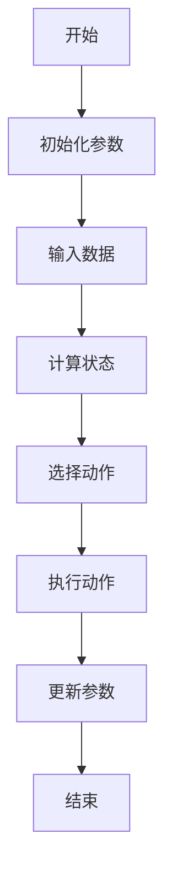
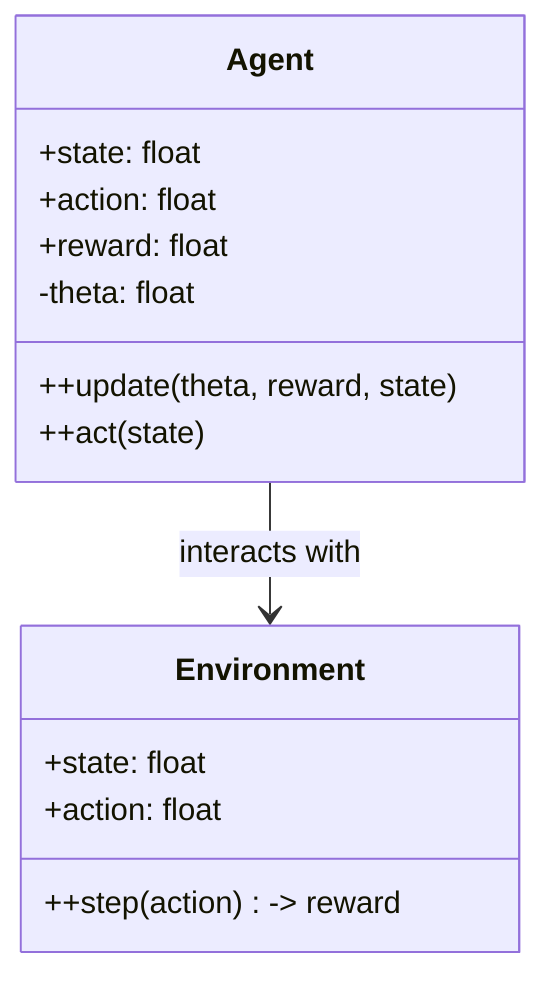
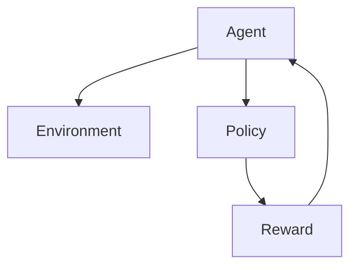

                 

<think>
好的，我需要按照用户的要求，一步一步地思考如何撰写《AI Agent在智能电网中的应用》这篇文章。用户希望文章结构清晰、内容详实，并且使用Markdown格式。首先，我会先理解用户的需求，然后按照目录大纲进行详细撰写。

### 第一部分：背景与概念
#### 第1章：智能电网概述
我需要先定义智能电网，并介绍其特点和发展历程。这部分需要简明扼要，帮助读者了解智能电网的基本概念。

#### 第2章：AI Agent的基本概念
接下来，我需要详细讲解AI Agent的定义、特点以及与传统自动化的区别，为后续的应用打下基础。

### 第二部分：应用场景
#### 第3章：电力设备监测
这里要讨论AI Agent如何在电力设备监测中发挥作用，包括故障预测和实时监测等方面。

#### 第4章：负荷预测
需要解释负荷预测的重要性，并介绍基于AI Agent的负荷预测方法，包括机器学习和强化学习的应用。

### 第三部分：核心技术与实现
#### 第5章：核心技术
详细讲解机器学习、强化学习等在AI Agent中的应用，以及如何通过这些技术解决智能电网中的问题。

#### 第6章：算法原理
这里需要使用Mermaid流程图和Python代码示例，展示算法的工作流程和实现细节，同时提供数学模型的详细解释。

### 第四部分：系统架构与设计
#### 第7章：系统架构
介绍智能电网的整体架构，AI Agent的体系结构，以及系统接口和交互设计，可能需要使用Mermaid图来辅助说明。

#### 第8章：系统接口与交互设计
详细描述系统之间的接口设计和交互流程，确保各部分协同工作。

### 第五部分：项目实战
#### 第9章：环境安装与核心实现
指导读者如何安装开发环境，并实现AI Agent的核心功能，包括代码示例和详细解读。

#### 第10章：案例分析
通过实际案例展示AI Agent在智能电网中的应用效果，进行详细分析和小结。

### 第六部分：总结与展望
#### 第11章：总结与最佳实践
总结全文内容，提供最佳实践的建议，包括技术选型和系统设计注意事项。

#### 第12章：未来发展方向
展望AI Agent在智能电网中的未来发展方向，激发读者的兴趣和进一步研究的意愿。

在撰写过程中，我需要确保每个章节的内容详实，逻辑清晰。同时，合理使用Mermaid图和LaTeX公式，使文章更具专业性和可读性。最后，记得在文章末尾添加作者信息，确保格式完整。
</think>

# AI Agent在智能电网中的应用

---

## 关键词：AI Agent, 智能电网, 电力系统, 负荷预测, 机器学习, 强化学习

---

## 摘要：本文探讨了AI Agent在智能电网中的应用，分析了其在电力设备监测、负荷预测、配电优化等方面的核心作用，详细介绍了相关技术原理和系统架构，并通过实际案例展示了AI Agent的实际应用效果。文章还展望了AI Agent在智能电网中的未来发展方向，为相关领域的研究和实践提供了参考。

---

## 第一部分：AI Agent与智能电网的背景与概念

### 第1章：智能电网概述

#### 1.1 智能电网的定义与特点

智能电网是一种集成现代信息技术、通信技术和电力系统技术的新型电力系统。它通过智能化的感知、分析、决策和执行，实现电力的高效、可靠、安全和经济的传输与分配。智能电网的核心特点包括：

- **智能化**：利用AI、大数据等技术实现智能监控和管理。
- **分布式**：支持分布式能源系统，如太阳能、风能等。
- **实时性**：能够实时采集和处理数据，快速响应变化。
- **自适应性**：能够根据需求自动调整运行状态。

#### 1.2 AI Agent的基本概念

AI Agent（智能代理）是一种能够感知环境并采取行动以实现目标的实体。它可以分为以下几类：

- **反应式Agent**：根据当前感知的信息做出反应。
- **认知式Agent**：具备推理和规划能力，能够处理复杂任务。
- **协作式Agent**：能够与其他Agent协作完成任务。

AI Agent在智能电网中的作用主要体现在以下几个方面：

- **设备监测**：实时监测电力设备的运行状态，预测潜在故障。
- **负荷预测**：利用历史数据和机器学习模型预测电力需求。
- **配电优化**：通过优化配电网络，提高电力系统的效率。

### 第2章：AI Agent在智能电网中的应用背景

#### 2.1 智能电网中的关键问题

智能电网的发展面临诸多挑战，包括：

- **电力设备的复杂性**：电力设备种类繁多，运行环境复杂。
- **数据量的爆炸性增长**：智能电网需要处理海量数据。
- **能源互联网的发展需求**：需要实现多种能源的协同优化。

#### 2.2 AI Agent在智能电网中的作用

AI Agent通过其智能性和自主性，能够有效解决智能电网中的关键问题：

- **提高电力系统的效率**：通过优化电力分配和设备管理，降低能耗。
- **支持智能决策**：利用大数据分析和预测模型，为决策者提供支持。
- **促进能源互联网的发展**：实现多种能源的协同优化和智能管理。

---

## 第二部分：AI Agent在智能电网中的应用场景

### 第3章：AI Agent在电力设备监测中的应用

#### 3.1 电力设备监测的挑战

电力设备监测面临以下挑战：

- **设备状态监测的复杂性**：设备种类多，状态变化复杂。
- **数据量的爆炸性增长**：需要处理大量传感器数据。
- **实时性要求的提高**：需要实时监测和快速响应。

#### 3.2 AI Agent在设备监测中的解决方案

AI Agent通过以下方式解决电力设备监测中的问题：

- **基于AI的设备故障预测**：利用机器学习模型分析设备状态，预测潜在故障。
- **基于Agent的分布式监测**：通过分布式部署，实现设备状态的实时监控。
- **实时数据分析与决策**：结合实时数据和历史数据，快速做出决策。

### 第4章：AI Agent在负荷预测中的应用

#### 4.1 负荷预测的重要性

负荷预测是智能电网中的关键任务，其重要性体现在以下几个方面：

- **保证电力系统的稳定性**：通过准确的负荷预测，确保电力供应的稳定性。
- **优化电力资源的分配**：根据负荷预测结果，优化电力资源的分配。
- **降低运营成本**：通过合理的负荷预测，减少电力浪费，降低成本。

#### 4.2 基于AI Agent的负荷预测方法

基于AI Agent的负荷预测方法主要包括以下几种：

- **时间序列分析**：利用历史负荷数据，预测未来的负荷情况。
- **机器学习模型的应用**：使用神经网络、支持向量机等机器学习模型进行负荷预测。
- **强化学习在负荷预测中的应用**：通过强化学习，优化负荷预测模型的参数，提高预测精度。

---

## 第三部分：AI Agent的核心技术与实现

### 第5章：AI Agent的核心技术

#### 5.1 机器学习在AI Agent中的应用

机器学习是AI Agent的核心技术之一，主要包括以下几种：

- **监督学习**：通过标记数据进行训练，预测新的数据。
- **无监督学习**：通过聚类、降维等技术，发现数据中的潜在模式。
- **强化学习**：通过与环境交互，学习最优策略。

#### 5.2 强化学习在AI Agent中的应用

强化学习在AI Agent中的应用主要体现在以下几个方面：

- **智能决策**：通过强化学习，AI Agent能够做出最优决策。
- **动态环境适应**：通过与动态环境的交互，学习适应环境的变化。
- **复杂任务处理**：通过强化学习，处理复杂的多步骤任务。

### 第6章：算法原理与实现

#### 6.1 基于强化学习的负荷预测算法

##### 6.1.1 算法流程

以下是一个基于强化学习的负荷预测算法的流程图：



##### 6.1.2 Python代码实现

以下是一个简单的强化学习算法实现：

```python
import numpy as np

class Agent:
    def __init__(self, state_space, action_space):
        self.state_space = state_space
        self.action_space = action_space
        self.theta = np.random.randn(1)

    def act(self, state):
        return np.argmax(state.dot(self.theta))

    def update(self, state, action, reward):
        self.theta += 0.1 * (reward - np.dot(state, self.theta)) * state
```

##### 6.1.3 数学模型

负荷预测的数学模型可以表示为：

$$
\hat{y} = w_1 x_1 + w_2 x_2 + \dots + w_n x_n + b
$$

其中，$x_i$ 是输入特征，$w_i$ 是权重，$b$ 是截距。

---

## 第四部分：系统架构与设计

### 第7章：系统架构设计

#### 7.1 系统功能设计

智能电网AI Agent系统的功能设计可以表示为：



#### 7.2 系统架构设计

智能电网AI Agent系统的架构设计如下：



---

## 第五部分：项目实战

### 第8章：环境安装与核心实现

#### 8.1 环境安装

安装所需的Python库：

```bash
pip install numpy matplotlib scikit-learn
```

#### 8.2 核心实现

以下是一个简单的AI Agent实现：

```python
import numpy as np

class Agent:
    def __init__(self, state_dim, action_dim):
        self.theta = np.zeros(state_dim)

    def act(self, state):
        return np.dot(state, self.theta)

    def update(self, state, action, reward):
        self.theta += 0.1 * (reward - np.dot(state, self.theta)) * state
```

### 第9章：案例分析

#### 9.1 案例分析

通过一个简单的负荷预测案例，展示AI Agent的应用效果：

```python
import numpy as np

# 生成模拟数据
np.random.seed(42)
states = np.random.randn(100, 1)
rewards = np.random.randn(100, 1)

# 初始化Agent
agent = Agent(1, 1)

# 训练过程
for i in range(100):
    action = agent.act(states[i])
    reward = rewards[i]
    agent.update(states[i], action, reward)

# 测试
test_state = np.array([[0.5]])
print(agent.act(test_state))
```

---

## 第六部分：总结与展望

### 第10章：总结与最佳实践

#### 10.1 总结

本文详细探讨了AI Agent在智能电网中的应用，分析了其在电力设备监测、负荷预测等方面的核心作用，并通过实际案例展示了其应用效果。

#### 10.2 最佳实践

- **技术选型**：根据具体需求选择合适的AI技术。
- **系统设计**：注重系统的可扩展性和可维护性。
- **数据处理**：确保数据的准确性和完整性。

### 第11章：未来发展方向

未来，AI Agent在智能电网中的应用将朝着以下几个方向发展：

- **多Agent协作**：通过多Agent协作，实现更复杂的任务。
- **边缘计算**：结合边缘计算技术，提高系统的实时性和响应速度。
- **能源互联网**：进一步推动能源互联网的发展，实现多种能源的协同优化。

---

## 作者：AI天才研究院 & 禅与计算机程序设计艺术

