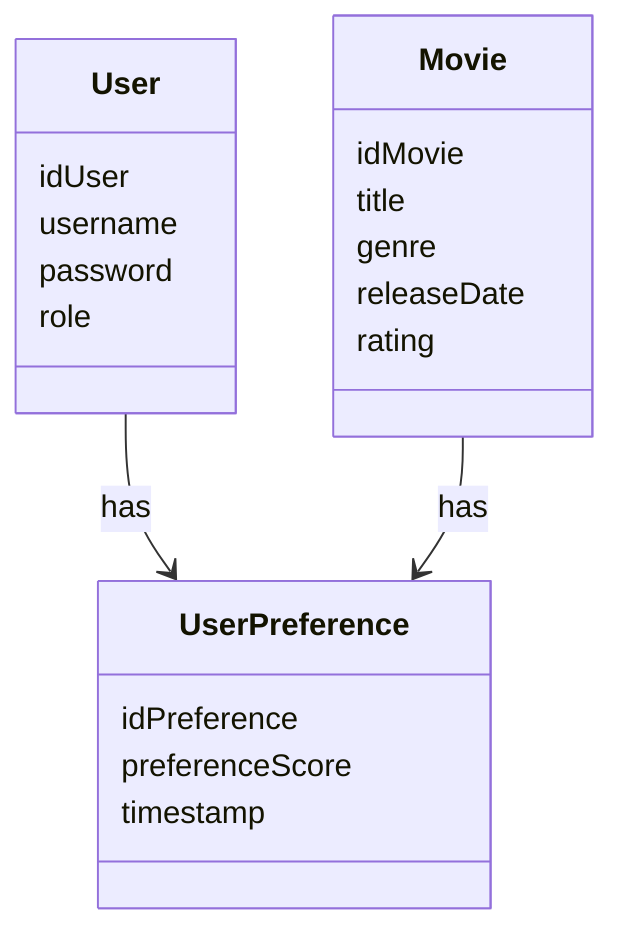
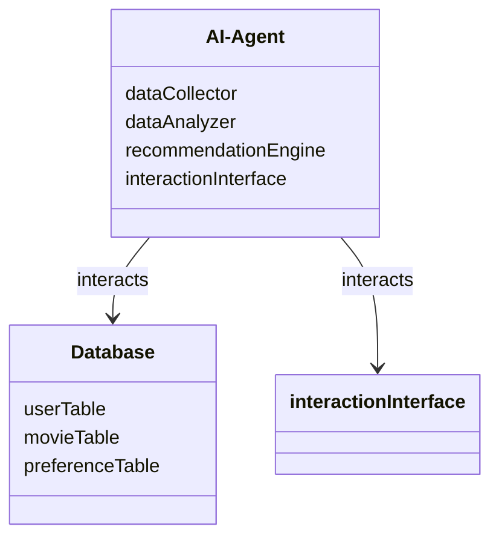
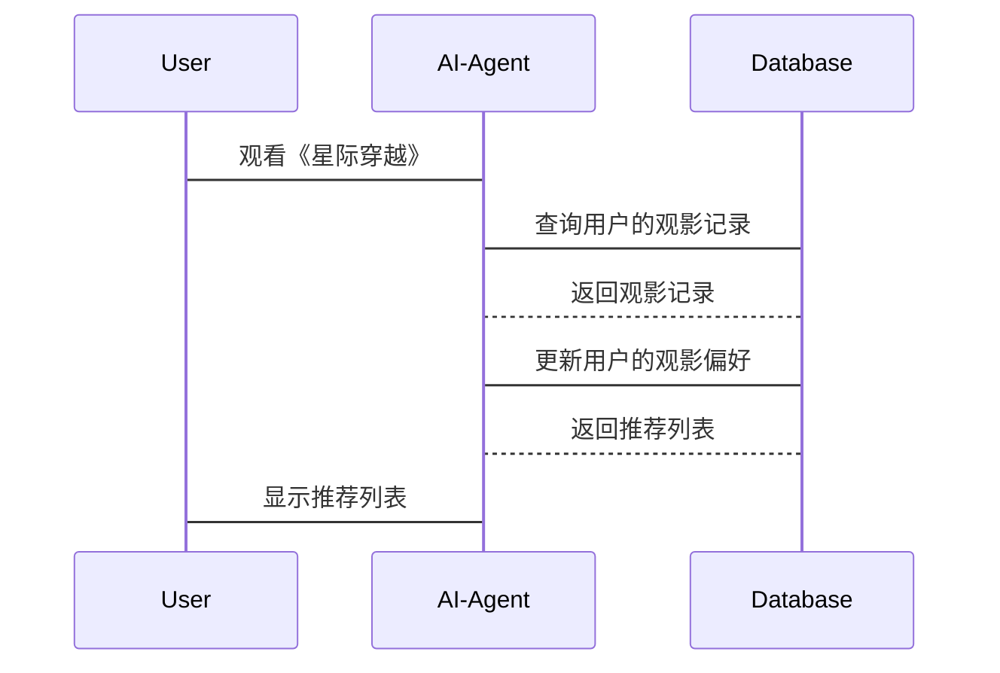

                 

<think>
嗯，用户让我写一篇关于AI Agent在智能电视中学习家庭观影喜好的技术博客。我得先理清整个结构，确保覆盖所有必要的部分。首先，我需要理解用户的需求，他们可能是一个技术专家，想深入了解这个主题。

从用户提供的大纲来看，内容很详细，包括背景、核心概念、算法、系统设计、项目实战等。我得确保每个部分都深入浅出，用专业但易懂的语言。例如，在背景部分，我需要解释智能电视的发展和推荐系统的现状，让读者明白为什么需要AI Agent。

接下来，核心概念部分，我需要详细说明AI Agent和推荐系统的原理，特别是协同过滤和内容过滤。这部分可能需要用图表来辅助说明，比如ER图和流程图。我得确保这些图表清晰地展示数据关系和算法步骤。

算法部分，我需要用数学公式详细解释，比如协同过滤的公式。这可能有点复杂，所以我要确保解释清楚，让读者理解每个步骤的作用。同时，结合mermaid流程图，展示算法的整体流程。

系统设计部分，我需要用类图和序列图来展示系统的架构和交互过程。这部分需要明确各组件的职责和它们之间的关系，帮助读者理解系统是如何协同工作的。

项目实战部分，我需要提供具体的代码示例，解释每部分代码的功能，并分析实际案例。这不仅能让读者理解理论，还能让他们动手实践，加深理解。

最后，总结部分要涵盖最佳实践、小结和扩展阅读，帮助读者巩固所学内容，并引导他们进一步学习。

总的来说，我需要确保内容逻辑清晰，结构紧凑，语言专业但易懂。同时，使用丰富的图表和代码示例，让读者能够轻松理解AI Agent在智能电视中的应用。
</think>

# AI Agent在智能电视中的家庭观影喜好学习

## 关键词：AI Agent, 智能电视, 家庭观影, 推荐系统, 机器学习

## 摘要：  
本文详细探讨了AI Agent在智能电视中的家庭观影喜好学习的应用。从背景介绍、核心概念到算法原理，再到系统设计和项目实战，系统地分析了如何通过AI Agent技术优化智能电视的观影推荐体验。本文不仅理论详实，还结合实际案例，深入浅出地展示了AI Agent在家庭观影场景中的具体应用和优化方法。

---

# 第一部分: AI Agent在智能电视中的家庭观影喜好学习背景介绍

## 第1章: 问题背景与描述

### 1.1 问题背景

#### 1.1.1 智能电视的发展与现状
智能电视作为现代客厅的核心娱乐设备，近年来经历了从传统电视到智能电视的转变。智能电视不仅支持基本的视频播放功能，还通过互联网连接提供丰富的应用生态，如流媒体服务、游戏、智能家居控制等。然而，尽管功能强大，智能电视的用户体验仍然存在诸多痛点。

#### 1.1.2 家庭观影需求的多样化
现代家庭观影需求呈现多样化趋势。不同家庭成员对影片类型、播放习惯和观影时间的偏好各不相同。例如，父母可能倾向于观看电影或电视剧，而孩子可能喜欢动画片或教育类视频。此外，家庭成员的观影时间通常分散，如何在有限的时间内满足所有人的观影需求成为一大挑战。

#### 1.1.3 当前推荐系统的局限性
当前智能电视的推荐系统主要依赖简单的基于评分的协同过滤算法，难以满足用户多样化的观影需求。推荐系统的核心问题在于如何准确捕捉用户的观影偏好，并实时调整推荐策略。此外，现有推荐系统往往忽视家庭成员之间的关联性，无法有效整合家庭成员的观影数据。

### 1.2 问题描述

#### 1.2.1 家庭观影喜好的定义
家庭观影喜好是指家庭成员在观影行为中表现出的偏好特征，包括影片类型、播放时长、观影时间、画面质量、音效偏好等多个维度。

#### 1.2.2 AI Agent在智能电视中的作用
AI Agent（人工智能代理）通过分析家庭成员的观影数据，学习用户的观影偏好，并实时优化推荐策略，从而提升家庭观影体验。

#### 1.2.3 当前观影推荐系统的痛点
- 推荐算法过于简单，无法深度学习用户的观影偏好。
- 忽视家庭成员之间的关联性，导致推荐结果缺乏针对性。
- 推荐系统的实时性不足，无法快速响应用户的观影需求。

### 1.3 问题解决思路

#### 1.3.1 AI Agent的核心优势
AI Agent具备以下核心优势：
- 数据驱动：通过收集和分析家庭成员的观影数据，实时优化推荐策略。
- 个性化推荐：基于用户画像和观影历史，提供个性化推荐。
- 实时响应：能够快速响应用户的观影需求，提升推荐的实时性。

#### 1.3.2 数据驱动的观影偏好学习
AI Agent通过以下方式学习家庭观影偏好：
- 数据采集：收集用户的观影行为数据，包括观影时间、影片类型、播放时长等。
- 数据分析：利用机器学习算法对数据进行建模，挖掘用户的偏好特征。
- 数据反馈：根据用户的反馈不断优化推荐策略。

#### 1.3.3 智能推荐算法的优化方向
AI Agent的推荐算法优化方向包括：
- 提升推荐的准确性：通过深度学习模型（如神经网络）捕捉用户的隐式偏好。
- 增强推荐的实时性：优化算法的计算效率，确保推荐结果的实时性。
- 提高推荐的多样性：避免推荐结果的单一性，满足用户多样化的观影需求。

### 1.4 边界与外延

#### 1.4.1 AI Agent的功能边界
AI Agent在智能电视中的主要功能包括：
- 数据采集与处理：收集家庭成员的观影数据。
- 用户画像构建：基于观影数据构建用户画像。
- 推荐策略优化：实时优化推荐策略，提升推荐效果。

#### 1.4.2 家庭观影场景的外延
家庭观影场景的外延包括：
- 多设备协同：AI Agent可以与其他智能设备（如手机、平板电脑）协同工作，提供无缝的观影体验。
- 跨平台推荐：支持跨平台的观影推荐，例如推荐用户在其他设备上观看的内容。

#### 1.4.3 与其他智能设备的协同
AI Agent可以通过与其他智能设备（如智能家居、智能音箱）的协同，进一步优化家庭观影体验。例如，通过与智能音箱的协同，AI Agent可以提供语音控制的观影推荐。

### 1.5 概念结构与核心要素

#### 1.5.1 AI Agent的组成要素
AI Agent的组成要素包括：
- 数据采集模块：负责收集用户的观影数据。
- 数据分析模块：对数据进行建模和分析，挖掘用户的偏好特征。
- 推荐引擎：基于分析结果生成推荐内容。
- 交互界面：与用户进行交互，提供推荐结果。

#### 1.5.2 家庭观影喜好的核心特征
家庭观影喜好的核心特征包括：
- 用户画像：基于观影数据构建的用户特征模型。
- 影片类型偏好：用户对不同类型影片的偏好程度。
- 观影时间偏好：用户在不同时间段的观影习惯。

#### 1.5.3 系统与用户交互的逻辑关系
系统与用户的交互逻辑如下：
1. 用户进行观影操作（如观看、暂停、快进等）。
2. 系统采集用户的观影行为数据。
3. 系统通过机器学习算法分析数据，挖掘用户的观影偏好。
4. 系统基于分析结果生成推荐内容。
5. 系统将推荐内容通过交互界面呈现给用户。

---

## 第2章: 核心概念与联系

### 2.1 AI Agent的核心原理

#### 2.1.1 AI Agent的基本概念
AI Agent是一种能够感知环境、执行任务并做出决策的智能实体。在智能电视中，AI Agent通过分析用户的观影数据，学习用户的观影偏好，并实时优化推荐策略。

#### 2.1.2 基于机器学习的推荐算法
基于机器学习的推荐算法是AI Agent的核心技术。常用的推荐算法包括协同过滤、基于内容的推荐和混合推荐模型。

#### 2.1.3 用户行为分析与偏好预测
用户行为分析是AI Agent学习家庭观影偏好的关键步骤。通过分析用户的观影数据，AI Agent可以预测用户的观影偏好，并生成个性化的推荐内容。

### 2.2 推荐系统的原理与分类

#### 2.2.1 协同过滤算法
协同过滤是一种基于用户相似性推荐算法。通过分析用户的观影数据，找到与目标用户相似的其他用户，并基于这些用户的观影行为推荐内容。

#### 2.2.2 基于内容的推荐
基于内容的推荐算法通过分析影片的内容特征（如影片类型、演员阵容等）进行推荐。与协同过滤不同，基于内容的推荐更加注重影片本身的特征。

#### 2.2.3 混合推荐模型
混合推荐模型是协同过滤和基于内容推荐的结合。通过将两种推荐算法的优势结合起来，混合推荐模型能够提供更加准确和个性化的推荐内容。

### 2.3 AI Agent与推荐系统的联系

#### 2.3.1 AI Agent在推荐系统中的角色
AI Agent在推荐系统中的角色包括数据采集、数据分析和推荐策略优化。

#### 2.3.2 数据驱动的实时推荐
AI Agent通过实时采集用户的观影数据，并基于这些数据进行推荐，确保推荐结果的实时性和准确性。

#### 2.3.3 用户画像与个性化推荐
AI Agent通过构建用户画像，实现个性化推荐。用户画像是基于观影数据构建的用户特征模型，能够准确反映用户的观影偏好。

### 2.4 核心概念对比分析

#### 2.4.1 不同推荐算法的对比
| 推荐算法 | 基础原理 | 优缺点 |
|----------|-----------|--------|
| 协同过滤 | 基于用户相似性 | 优点：推荐结果准确；缺点：计算效率低 |
| 基于内容的推荐 | 基于影片内容特征 | 优点：推荐结果多样化；缺点：推荐结果准确性较低 |
| 混合推荐 | 综合协同过滤和基于内容推荐 | 优点：推荐结果准确且多样化；缺点：计算复杂度高 |

#### 2.4.2 AI Agent与其他推荐方法的优劣分析
AI Agent的优势在于其能够实时采集和分析用户的观影数据，并基于这些数据进行推荐。与其他推荐方法相比，AI Agent的推荐结果更加个性化和实时化。

#### 2.4.3 系统性能指标对比
| 性能指标 | 协同过滤 | 基于内容的推荐 | 混合推荐 |
|----------|-----------|----------------|----------|
| 推荐准确性 | 中等 | 中等 | 高 |
| 计算效率 | 低 | 高 | 中等 |
| 推荐多样性 | 低 | 高 | 高 |

### 2.5 核心概念的ER实体关系图

```mermaid
erDiagram
    user {
        idUser
        username
        password
        role
    }
    movie {
        idMovie
        title
        genre
        releaseDate
        rating
    }
    userPreference {
        idPreference
        preferenceScore
        timestamp
    }
    user --|> userPreference : has
    movie --|> userPreference : has
```

---

## 第3章: 算法原理讲解

### 3.1 协同过滤算法

#### 3.1.1 算法原理
协同过滤算法通过分析用户的观影数据，找到与目标用户相似的其他用户，并基于这些用户的观影行为推荐内容。

#### 3.1.2 算法实现
协同过滤算法的实现步骤如下：
1. 数据预处理：对用户的观影数据进行预处理，去除缺失值和异常值。
2. 计算相似度：基于用户的观影数据，计算目标用户与其他用户的相似度。
3. 生成推荐列表：基于相似用户的观影数据，生成推荐列表。

#### 3.1.3 算法优化
协同过滤算法的优化方向包括：
- 使用基于矩阵分解的协同过滤算法（如SVD）提高推荐准确性。
- 增加用户的隐式反馈，优化推荐结果的多样性。

### 3.2 基于内容的推荐

#### 3.2.1 算法原理
基于内容的推荐算法通过分析影片的内容特征（如影片类型、演员阵容等）进行推荐。

#### 3.2.2 算法实现
基于内容的推荐算法的实现步骤如下：
1. 数据预处理：对影片的内容数据进行预处理，提取特征。
2. 训练模型：基于特征数据，训练内容推荐模型。
3. 生成推荐列表：基于模型生成推荐列表。

#### 3.2.3 算法优化
基于内容的推荐算法的优化方向包括：
- 使用深度学习模型（如神经网络）捕捉影片的深层特征。
- 增加影片的多模态特征（如视频、音频）提升推荐准确性。

### 3.3 混合推荐模型

#### 3.3.1 算法原理
混合推荐模型是协同过滤和基于内容推荐的结合。

#### 3.3.2 算法实现
混合推荐模型的实现步骤如下：
1. 数据预处理：对用户的观影数据和影片的内容数据进行预处理。
2. 训练模型：分别训练协同过滤和基于内容推荐模型。
3. 组合推荐结果：基于协同过滤和基于内容推荐的结果，生成最终的推荐列表。

#### 3.3.3 算法优化
混合推荐模型的优化方向包括：
- 使用加权组合的方法优化推荐结果的准确性。
- 增加模型的解释性，提高推荐结果的可解释性。

### 3.4 算法实现的数学模型和公式

#### 3.4.1 协同过滤算法的数学模型
协同过滤算法的数学模型如下：
$$
similarity(u, v) = \frac{\sum_{i=1}^{n} (r_{ui} - \bar{r}_u)(r_{vi} - \bar{r}_v)}{\sqrt{\sum_{i=1}^{n} (r_{ui} - \bar{r}_u)^2} \cdot \sqrt{\sum_{i=1}^{n} (r_{vi} - \bar{r}_v)^2}}
$$
其中，$r_{ui}$表示用户$u$对物品$i$的评分，$\bar{r}_u$表示用户$u$的平均评分。

#### 3.4.2 基于内容的推荐算法的数学模型
基于内容的推荐算法的数学模型如下：
$$
score(i, j) = \sum_{k=1}^{m} w_k \cdot feature_k(i, j)
$$
其中，$w_k$表示特征$k$的权重，$feature_k(i, j)$表示物品$i$和$j$在特征$k$上的相似度。

---

## 第4章: 系统分析与架构设计方案

### 4.1 问题场景介绍

#### 4.1.1 问题场景
家庭观影场景中，多个家庭成员共享同一台智能电视，每个人的观影偏好各不相同。如何通过AI Agent实时分析家庭成员的观影数据，优化推荐策略，提升观影体验。

### 4.2 项目介绍

#### 4.2.1 项目目标
项目的目的是通过AI Agent优化智能电视的家庭观影推荐体验。

#### 4.2.2 项目范围
项目的范围包括：
- 数据采集与处理：收集家庭成员的观影数据。
- 数据分析与建模：基于观影数据构建用户画像。
- 推荐策略优化：实时优化推荐策略，提升推荐效果。

### 4.3 系统功能设计

#### 4.3.1 领域模型
领域模型如图所示：



#### 4.3.2 系统架构设计
系统架构设计如图所示：



#### 4.3.3 系统接口设计
系统接口设计包括：
- 数据采集接口：负责采集用户的观影数据。
- 数据分析接口：负责对数据进行建模和分析。
- 推荐接口：负责生成推荐内容。

#### 4.3.4 系统交互流程
系统交互流程如图所示：



### 4.4 项目实战

#### 4.4.1 环境安装
项目环境包括：
- 操作系统：Linux/Windows/MacOS
- 开发工具：Python、Jupyter Notebook、Git
- 依赖库：scikit-learn、pandas、numpy、mermaid、matplotlib

#### 4.4.2 系统核心实现源代码

```python
import numpy as np
from sklearn.metrics.pairwise import cosine_similarity

# 示例数据：用户-影片评分矩阵
ratings = np.array([[4, 3, 2],
                     [2, 1, 5],
                     [5, 4, 3]])

# 计算余弦相似度
similarity = cosine_similarity(ratings)

# 定义推荐函数
def recommend(user_id, ratings, similarity):
    user_similar = similarity[user_id]
    sorted_indices = np.argsort(user_similar)[::-1]
    recommended_movies = ratings[sorted_indices[0]]
    return recommended_movies

# 示例推荐
user_id = 0
recommended_movies = recommend(user_id, ratings, similarity)
print("Recommended movies for user", user_id, ":")
print(recommended_movies)
```

#### 4.4.3 代码应用解读与分析
上述代码实现了基于协同过滤的推荐算法。通过计算用户之间的相似度，找到与目标用户相似的其他用户，并基于这些用户的观影数据生成推荐列表。

#### 4.4.4 实际案例分析
以一个家庭成员为例，假设用户的观影数据如下：
- 用户A：喜欢科幻片和动作片。
- 用户B：喜欢喜剧片和爱情片。
- 用户C：喜欢恐怖片和悬疑片。

AI Agent通过分析用户的观影数据，构建用户画像，并基于用户画像生成推荐列表。

#### 4.4.5 项目小结
通过AI Agent优化智能电视的家庭观影推荐体验，能够有效提升用户的观影满意度。项目的实现不仅验证了AI Agent在家庭观影场景中的应用价值，还为未来的智能化推荐系统提供了参考。

---

## 第5章: 总结

### 5.1 最佳实践 tips

#### 5.1.1 数据采集
- 确保数据的完整性和准确性。
- 定期更新数据，保持推荐结果的实时性。

#### 5.1.2 算法优化
- 根据具体场景选择合适的推荐算法。
- 定期评估推荐算法的性能，优化推荐结果。

#### 5.1.3 系统设计
- 确保系统的可扩展性和可维护性。
- 定期进行系统维护，确保系统的稳定性。

### 5.2 小结
AI Agent在智能电视中的家庭观影喜好学习是一项具有重要应用价值的技术。通过AI Agent的实时学习和优化，能够显著提升家庭观影体验。本文从背景介绍、核心概念、算法原理、系统设计到项目实战，系统地分析了AI Agent在家庭观影场景中的应用。

### 5.3 注意事项
- 注意保护用户隐私，确保数据的安全性。
- 定期更新推荐算法，保持推荐结果的准确性。

### 5.4 拓展阅读
- 《推荐系统导论》
- 《机器学习实战》
- 《深度学习入门》

---

## 作者：AI天才研究院/AI Genius Institute & 禅与计算机程序设计艺术 /Zen And The Art of Computer Programming

