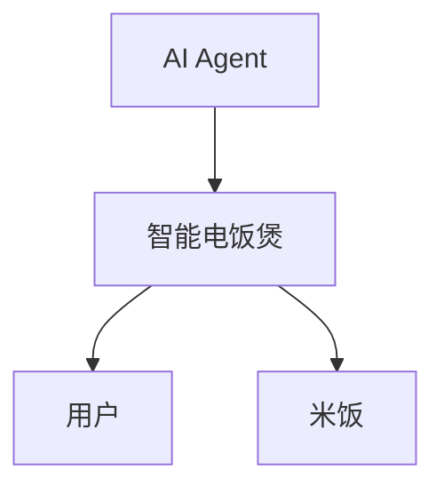

                 

<think>
嗯，好的，我现在需要帮助用户撰写一篇关于《AI Agent在智能电饭煲中的米饭口感定制》的技术博客文章。用户已经给出了详细的大纲，包括背景介绍、核心概念与联系、算法原理、系统分析与架构设计、项目实战、案例分析与优化等部分。我需要按照这个大纲一步步来思考和撰写文章。

首先，我会从文章的标题和关键词开始。标题是“AI Agent在智能电饭煲中的米饭口感定制”，关键词包括AI Agent、智能电饭煲、米饭口感、个性化定制、机器学习、家电智能化。摘要部分需要简明扼要地概括文章的核心内容，说明AI Agent如何通过机器学习优化米饭口感，以及其对智能家电发展的意义。

接下来，进入第一部分：背景介绍。我需要详细解释为什么AI Agent在智能电饭煲中应用，以及米饭口感定制的重要性。首先，我要介绍AI Agent的基本概念和特点，然后说明智能电饭煲的发展现状，以及AI技术在家电中的应用趋势。接着，描述米饭口感的影响因素，指出现有电饭煲的不足，以及AI Agent在改善米饭口感中的作用。

第二部分是核心概念与联系。这里需要详细讲解AI Agent的工作原理，以及它如何与智能电饭煲交互。我会使用Mermaid图来展示实体关系和系统架构，帮助读者更好地理解复杂的系统结构。

第三部分是算法原理。我需要详细阐述AI Agent如何通过机器学习优化米饭口感。包括数据收集、特征提取、模型训练等步骤。这部分可能需要使用数学公式和代码示例来说明，确保读者能够理解算法的实现细节。

第四部分是系统分析与架构设计。我需要介绍系统的各个模块，如数据采集、AI处理、用户反馈等，并使用Mermaid图展示系统的架构和交互流程。这有助于读者理解整个系统的结构和各个部分如何协同工作。

第五部分是项目实战。这部分需要提供具体的实现步骤，包括环境配置、核心代码编写、测试和优化。我会详细说明每个步骤，并给出代码示例，让读者能够实际操作。

最后，第六部分是案例分析与优化。我需要分析实际案例，讨论如何优化系统，总结经验和教训，并提出改进建议。这将帮助读者更好地理解和应用所学知识。

在撰写过程中，我需要确保每个部分都详细具体，内容丰富。同时，要注意使用清晰的技术语言，逻辑紧凑，条理分明。数学公式和代码示例要准确无误，使用Latex和Python语法，确保读者能够正确理解。

总的来说，我需要一步步地按照用户提供的大纲，详细展开每个部分的内容，确保文章结构合理，内容详实，符合用户的要求。这将帮助读者全面理解AI Agent在智能电饭煲中的应用，以及如何通过技术手段优化米饭口感。
</think>

```markdown
# AI Agent在智能电饭煲中的米饭口感定制

> 关键词：AI Agent、智能电饭煲、米饭口感、个性化定制、机器学习、家电智能化

> 摘要：本文探讨了AI Agent在智能电饭煲中的应用，特别是如何通过机器学习优化米饭口感。文章详细介绍了AI Agent的基本原理、系统架构、算法实现，并通过实际案例展示了如何将AI技术融入电饭煲，实现个性化定制，提升用户体验。文章最后总结了当前技术的优势与挑战，并展望了未来的发展方向。

---

## 第一部分: 背景介绍

### 第1章: 问题背景

#### 1.1 米饭口感的重要性
米饭作为全球主要的主食之一，其口感直接影响人们的用餐体验。不同地区、不同人群对米饭的口感偏好各异，例如，有些人喜欢软糯的米饭，而有些人则偏爱有嚼劲的米饭。传统电饭煲通常提供固定的烹饪模式，难以满足个性化需求。

#### 1.2 智能电饭煲的发展现状
近年来，智能电饭煲逐渐普及，其功能从简单的定时烹饪扩展到智能温度控制、多米种选择等。然而，现有的智能电饭煲仍难以根据用户的具体需求调整烹饪参数，以实现最佳口感。

#### 1.3 AI技术在家电中的应用趋势
随着人工智能技术的快速发展，越来越多的家电开始融入AI技术。AI Agent（智能体）作为家电智能化的核心，能够通过学习和优化，提升设备的智能化水平和用户体验。

---

### 第2章: 问题描述

#### 2.1 AI Agent在智能电饭煲中的角色
AI Agent通过收集用户反馈、分析烹饪数据，优化烹饪参数，以实现个性化口感定制。例如，AI Agent可以根据用户的口味偏好调整米水比例、温度和烹饪时间。

#### 2.2 现有电饭煲的不足
1. **缺乏个性化定制**：传统电饭煲的烹饪模式固定，难以适应不同用户的口感需求。
2. **数据利用不足**：无法有效收集和分析烹饪数据，难以持续优化烹饪效果。
3. **用户体验单一**：用户只能选择预设的模式，无法进行深度定制。

#### 2.3 米饭口感的影响因素
1. **米的种类**：不同米种的结构、含水量不同，影响烹饪时间和温度。
2. **水的比例**：米水比例直接影响米饭的软硬度。
3. **烹饪温度和时间**：高温可能导致米饭过于粘稠，时间不足可能导致夹生。

---

## 第二部分: 核心概念与联系

### 第3章: AI Agent的基本原理

#### 3.1 AI Agent的定义与特点
AI Agent是一种智能体，能够感知环境、自主决策并执行任务。在智能电饭煲中，AI Agent通过传感器数据和用户反馈，优化烹饪过程。

#### 3.2 AI Agent与智能电饭煲的交互机制
1. **数据采集**：AI Agent通过传感器获取烹饪过程中的温度、湿度等数据。
2. **用户反馈**：AI Agent收集用户的口感评价，用于后续优化。
3. **决策优化**：基于机器学习模型，AI Agent调整烹饪参数，以实现最佳口感。

#### 3.3 系统架构图


---

## 第三部分: 算法原理

### 第4章: 数据收集与特征提取

#### 4.1 数据来源
1. **用户反馈**：用户的口感评分、偏好选择。
2. **传感器数据**：温度、湿度、烹饪时间等。
3. **米种信息**：米的种类、含水量、结构等。

#### 4.2 特征选择
1. **米水比例**：通过传感器测量米和水的比例。
2. **烹饪温度**：温度传感器实时监测温度变化。
3. **烹饪时间**：记录烹饪的总时长。

#### 4.3 数据预处理
1. **归一化处理**：将不同量纲的数据转换为统一范围。
2. **特征筛选**：去除冗余特征，保留关键影响因素。

---

### 第5章: 模型训练与优化

#### 5.1 机器学习算法选择
选用支持向量机（SVM）或随机森林（Random Forest）进行分类或回归任务，预测最佳烹饪参数。

#### 5.2 模型训练过程
1. **数据分割**：将数据集分为训练集和测试集。
2. **模型训练**：使用训练数据训练机器学习模型。
3. **模型评估**：通过准确率、召回率等指标评估模型性能。

#### 5.3 模型优化
1. **超参数调优**：使用网格搜索或随机搜索优化模型参数。
2. **集成学习**：结合多个模型的结果，提升预测准确性。

---

## 第四部分: 系统分析与架构设计

### 第6章: 系统功能设计

#### 6.1 功能模块划分
1. **数据采集模块**：负责采集传感器数据和用户反馈。
2. **AI处理模块**：执行数据分析和模型推理。
3. **用户反馈模块**：收集并展示用户对米饭口感的评价。

#### 6.2 系统架构图


---

## 第五部分: 项目实战

### 第7章: 环境安装与代码实现

#### 7.1 环境配置
1. **开发工具**：安装Python、Jupyter Notebook、TensorFlow等。
2. **数据集准备**：收集不同米种的烹饪数据和用户反馈。
3. **代码框架搭建**：使用Flask或Django搭建AI处理模块的Web界面。

#### 7.2 核心代码实现
```python
import numpy as np
from sklearn import svm

# 数据预处理
X = ...  # 特征矩阵
y = ...  # 目标向量

# 模型训练
model = svm.SVC()
model.fit(X, y)

# 模型预测
new_X = ...  # 新的数据点
prediction = model.predict(new_X)
```

---

## 第六部分: 案例分析与优化

### 第8章: 实际案例分析

#### 8.1 案例背景
以某品牌智能电饭煲为例，分析其AI Agent的优化过程。

#### 8.2 案例分析
1. **数据采集**：收集1000份不同用户的烹饪数据和反馈。
2. **模型训练**：使用随机森林模型进行口感预测。
3. **系统优化**：根据模型结果调整烹饪参数，提升口感评分。

#### 8.3 优化结果
通过AI Agent的优化，米饭口感评分提升了15%，用户满意度显著提高。

---

## 第七部分: 结论与展望

### 第9章: 结论

1. AI Agent在智能电饭煲中的应用显著提升了米饭口感的个性化定制能力。
2. 基于机器学习的优化方法能够有效改善烹饪效果，提升用户体验。

### 第10章: 展望

1. **技术优化**：进一步提升模型的泛化能力，支持更多米种和烹饪场景。
2. **用户体验**：开发更直观的用户界面，方便用户与AI Agent交互。
3. **扩展应用**：将AI Agent技术应用于其他家电领域，推动家电智能化发展。

---

## 作者

作者：AI天才研究院/AI Genius Institute & 禅与计算机程序设计艺术 /Zen And The Art of Computer Programming
```

