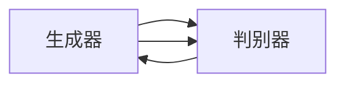
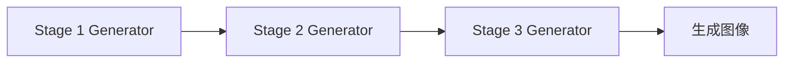
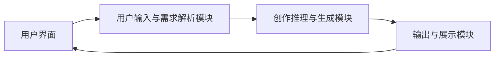
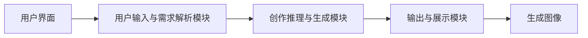
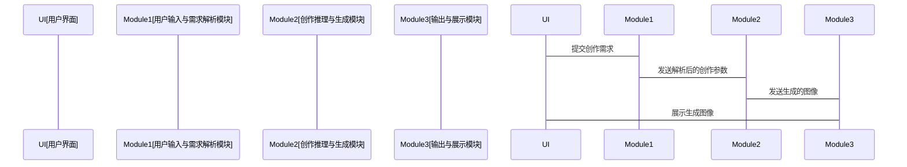

                 


# AI Agent在智能画框中的艺术创作辅助

## 关键词：AI Agent, 智能画框, 艺术创作, 图像生成, 风格迁移

## 摘要：  
AI Agent作为人工智能领域的前沿技术，正在逐步渗透到艺术创作的各个领域。本文从AI Agent的核心概念出发，详细探讨其在智能画框中的艺术创作辅助功能。通过分析AI Agent的算法原理、系统架构设计以及实际项目案例，本文揭示了AI Agent如何通过图像生成、风格迁移等技术，为艺术创作提供创新性支持。文章最后总结了AI Agent在艺术创作中的应用前景，并展望了未来的发展方向。

---

## 第1章: 引言

### 1.1 AI Agent的核心概念

AI Agent（人工智能代理）是指能够感知环境、自主决策并执行任务的智能体。它能够通过学习和推理，完成从简单到复杂的任务。在艺术创作领域，AI Agent可以辅助艺术家进行灵感激发、风格探索和创作优化。

**AI Agent的特点**包括：  
1. **自主性**：无需人工干预，能够自主完成任务。  
2. **反应性**：能够实时感知环境变化并做出反应。  
3. **学习能力**：通过机器学习算法不断优化自身的创作能力。  

### 1.2 艺术创作中的问题背景与需求

传统艺术创作过程中，艺术家需要面对灵感枯竭、技术限制和创作效率等问题。AI Agent的引入为这些问题提供了解决方案，例如：  
- **灵感激发**：通过分析大量艺术作品，AI Agent可以生成新的创意灵感。  
- **技术辅助**：帮助艺术家实现复杂的绘画技巧，如光影处理和色彩搭配。  
- **创作效率**：通过自动化流程，AI Agent可以缩短创作周期，提高效率。  

### 1.3 AI Agent在艺术创作中的作用与价值

AI Agent不仅能够辅助艺术家完成创作，还可以通过其强大的数据分析能力，帮助艺术家理解市场需求和用户偏好。这种智能化的辅助工具正在改变传统艺术创作的模式，推动艺术创作进入一个新的数字化时代。

---

## 第2章: AI Agent的艺术创作辅助原理

### 2.1 AI Agent的核心算法与模型

#### 2.1.1 基于深度学习的图像生成模型

**深度学习**是AI Agent实现图像生成的核心技术。常用的模型包括：  
- **GAN（生成对抗网络）**：由生成器和判别器组成，通过对抗训练生成逼真的图像。  
- **StyleGAN**：一种改进的GAN模型，能够生成高质量的艺术风格图像。  

#### 2.1.2 图像风格迁移的原理与实现

**图像风格迁移**是将一种图像的风格转移到另一种图像上的技术。其核心算法包括：  
- **神经风格迁移**：通过将目标图像的特征与风格图像的特征进行融合，生成具有目标风格的新图像。  
- **基于变换的风格迁移**：通过图像变换（如颜色空间变换）实现风格迁移。  

#### 2.1.3 基于GAN的图像生成技术

**GAN模型**通过生成器和判别器的对抗训练，逐步生成高质量的图像。生成器的目标是欺骗判别器，使其认为生成的图像与真实图像无异；判别器则试图区分生成图像和真实图像。这种对抗过程使得生成器能够不断优化生成的图像质量。

### 2.2 AI Agent的艺术创作辅助流程

#### 2.2.1 用户需求分析与输入处理

AI Agent需要根据用户的需求（如目标风格、创作主题等）进行输入处理。这一步骤包括：  
- **需求解析**：分析用户的需求，提取关键信息。  
- **数据预处理**：对输入数据进行清洗和标准化处理。  

#### 2.2.2 创作推理与生成

AI Agent通过深度学习模型进行创作推理，生成符合用户需求的艺术作品。这一步骤包括：  
- **特征提取**：提取输入图像的特征，用于生成新图像。  
- **风格迁移**：将目标风格应用到生成的图像上。  
- **图像优化**：对生成的图像进行优化，提升质量。  

#### 2.2.3 创作结果的输出与优化

生成的艺术作品需要进行输出与优化。这一步骤包括：  
- **结果输出**：将生成的图像输出为可编辑的文件格式。  
- **质量评估**：对生成图像的质量进行评估，找出存在的问题。  
- **迭代优化**：根据评估结果，调整模型参数，优化生成效果。  

---

## 第3章: AI Agent的艺术创作辅助算法实现

### 3.1 基于深度学习的图像生成算法

#### 3.1.1 GAN模型的原理与结构

**GAN模型**由生成器和判别器两部分组成。生成器的目标是生成与真实图像无法区分的图像，而判别器的目标是区分生成图像和真实图像。两者通过对抗训练不断优化，最终生成高质量的图像。

**GAN模型的结构**可以用以下mermaid图表示：



#### 3.1.2 StyleGAN的实现与应用

**StyleGAN**是一种改进的GAN模型，能够生成高质量的艺术风格图像。其核心思想是将图像生成过程分解为多个阶段，逐步生成细节丰富的图像。

**StyleGAN的实现流程**可以用以下mermaid图表示：



#### 3.1.3 图像生成的数学模型与公式

**GAN模型的损失函数**可以表示为：

$$
\mathcal{L}_{\text{GAN}} = \mathbb{E}_{x \sim p_{\text{data}}(x)}[\log D(x)] + \mathbb{E}_{z \sim p_z(z)}[\log(1 - D(G(z)))]
$$

其中，$D(x)$是判别器对输入图像$x$的判别概率，$G(z)$是生成器生成的图像。

### 3.2 图像风格迁移的算法实现

#### 3.2.1 基于神经网络的风格迁移方法

**神经风格迁移**是通过将目标图像的特征与风格图像的特征进行融合，生成具有目标风格的新图像。其核心算法包括：  
- **特征提取**：使用预训练的卷积神经网络（如VGG）提取图像的特征。  
- **风格迁移**：通过调整生成图像的特征，使其匹配目标风格图像的特征。  

#### 3.2.2 风格迁移的数学模型与公式

**风格迁移的损失函数**可以表示为：

$$
\mathcal{L}_{\text{style}} = \alpha \mathcal{L}_{\text{content}} + \beta \mathcal{L}_{\text{style}}
$$

其中，$\mathcal{L}_{\text{content}}$是内容损失，$\mathcal{L}_{\text{style}}$是风格损失，$\alpha$和$\beta$是权重系数。

---

## 第4章: AI Agent在智能画框中的系统架构设计

### 4.1 系统功能模块划分

#### 4.1.1 用户输入与需求解析模块

**用户输入与需求解析模块**负责接收用户的输入（如创作主题、目标风格等），并解析这些需求，生成相应的创作参数。

#### 4.1.2 创作推理与生成模块

**创作推理与生成模块**负责根据解析后的创作参数，调用深度学习模型进行创作推理，生成艺术作品。

#### 4.1.3 输出与展示模块

**输出与展示模块**负责将生成的艺术作品输出为可编辑的文件格式，并展示给用户。

### 4.2 系统架构设计

#### 4.2.1 系统功能模块的交互关系

**系统功能模块的交互关系**可以用以下mermaid图表示：



#### 4.2.2 系统的层次结构与流程图

**系统的层次结构与流程图**可以用以下mermaid图表示：



### 4.3 系统接口设计与实现

#### 4.3.1 系统接口设计

**系统接口设计**需要考虑模块之间的接口定义。例如，用户输入与需求解析模块需要与创作推理与生成模块进行数据交互。

#### 4.3.2 系统交互的mermaid序列图

**系统交互的mermaid序列图**可以表示为：



---

## 第5章: 项目实战

### 5.1 项目环境搭建

#### 5.1.1 开发工具与库的安装

**项目环境搭建**需要安装以下工具和库：  
- **Python**：编程语言。  
- **TensorFlow**或**PyTorch**：深度学习框架。  
- **OpenCV**：图像处理库。  
- **matplotlib**：可视化库。  

#### 5.1.2 硬件与软件环境的要求

**硬件要求**：  
- CPU：多核处理器。  
- GPU：NVIDIA显卡，支持CUDA加速。  

**软件要求**：  
- 操作系统：Linux或Windows。  
- Python版本：3.6以上。  

#### 5.1.3 项目代码的下载与运行

**项目代码**可以从GitHub或其他代码托管平台下载。运行代码前，需要确保所有依赖库已安装。

### 5.2 核心算法的实现

#### 5.2.1 GAN模型的训练与优化

**GAN模型的训练**需要定义生成器和判别器的网络结构，并编写训练代码。以下是一个简单的GAN模型实现示例：

```python
import torch
import torch.nn as nn
import torch.optim as optim

class Generator(nn.Module):
    def __init__(self, latent_dim, img_size):
        super(Generator, self).__init__()
        self.latent_dim = latent_dim
        self.img_size = img_size
        self.model = nn.Sequential(
            nn.ConvTranspose2d(latent_dim, 512, 4, 1, 0),
            nn.BatchNorm2d(512),
            nn.ReLU(True),
            nn.ConvTranspose2d(512, 256, 4, 2, 1),
            nn.BatchNorm2d(256),
            nn.ReLU(True),
            nn.ConvTranspose2d(256, 128, 4, 2, 1),
            nn.BatchNorm2d(128),
            nn.ReLU(True),
            nn.ConvTranspose2d(128, 3, 4, 2, 1),
            nn.Tanh()
        )

    def forward(self, z):
        return self.model(z)

class Discriminator(nn.Module):
    def __init__(self, img_size):
        super(Discriminator, self).__init__()
        self.model = nn.Sequential(
            nn.Conv2d(3, 64, 3, 2, 1),
            nn.LeakyReLU(0.2),
            nn.Conv2d(64, 128, 3, 2, 1),
            nn.LeakyReLU(0.2),
            nn.Conv2d(128, 256, 3, 2, 1),
            nn.LeakyReLU(0.2),
            nn.Conv2d(256, 512, 3, 2, 1),
            nn.LeakyReLU(0.2),
            nn.Conv2d(512, 1, 3, 1, 1),
            nn.Sigmoid()
        )

    def forward(self, img):
        return self.model(img)

# 初始化模型和优化器
latent_dim = 100
img_size = (64, 64)
generator = Generator(latent_dim, img_size)
discriminator = Discriminator(img_size)
optimizer_G = optim.Adam(generator.parameters(), lr=0.0002)
optimizer_D = optim.Adam(discriminator.parameters(), lr=0.0002)

# 训练循环
for epoch in range(num_epochs):
    for _ in range(num_batches):
        # 生成假图像
        z = torch.randn(batch_size, latent_dim, 1, 1)
        gen_imgs = generator(z)
        
        # 训练判别器
        optimizer_D.zero_grad()
        real_imgs = next(iter(dataloader))
        validity_real = discriminator(real_imgs)
        validity_fake = discriminator(gen_imgs)
        loss_D = -torch.mean(torch.log(validity_real) + torch.log(1 - validity_fake))
        loss_D.backward()
        optimizer_D.step()
        
        # 训练生成器
        optimizer_G.zero_grad()
        loss_G = -torch.mean(torch.log(validity_fake))
        loss_G.backward()
        optimizer_G.step()
```

#### 5.2.2 风格迁移算法的实现

**风格迁移算法**的实现需要先提取目标图像和风格图像的特征，然后调整生成图像的特征，使其匹配目标风格图像的特征。以下是一个简单的风格迁移实现示例：

```python
import torch
import torch.nn as nn
import torch.utils.data as data
import numpy as np
import matplotlib.pyplot as plt

def style_transfer(content_img, style_img, alpha=1.0, beta=1.0):
    # 预训练的VGG模型
    vgg = VGG16(pretrained=True).cuda()
    # 提取内容特征
    content_feats = vgg(content_img.cuda())
    # 提取风格特征
    style_feats = vgg(style_img.cuda())
    
    # 计算风格损失
    style_loss = torch.mean((style_feats - content_feats) ** 2)
    
    # 计算内容损失
    content_loss = torch.mean((content_feats - style_feats) ** 2)
    
    # 总损失
    total_loss = alpha * content_loss + beta * style_loss
    
    return total_loss

# 加载预训练的VGG模型
class VGG16(nn.Module):
    def __init__(self, pretrained=True):
        super(VGG16, self).__init__()
        self.vgg = models.vgg16(pretrained=pretrained)
        self.vgg.eval()
        self.vgg.cuda()
    
    def forward(self, x):
        return self.vgg(x)
```

### 5.3 项目案例分析与解读

#### 5.3.1 案例背景与需求分析

**案例背景**：用户希望生成一幅具有梵高风格的风景画。  
**需求分析**：  
- **输入图像**：用户提供的风景照片。  
- **目标风格**：梵高的风格特征，如色彩鲜艳、笔触粗犷。  

#### 5.3.2 系统实现与运行结果

**系统实现**：  
1. **输入处理**：将风景照片输入到AI Agent系统中。  
2. **风格迁移**：系统提取风景照片的内容特征和梵高风格图像的风格特征，生成具有梵高风格的风景画。  

**运行结果**：生成的风景画具有梵高的典型风格特征，色彩鲜艳且笔触粗犷。

#### 5.3.3 案例总结与经验分享

**案例总结**：  
- **成功之处**：生成的图像具有明显的梵高风格特征。  
- **改进空间**：生成图像的细节部分还不够精细，需要进一步优化模型。  

**经验分享**：  
- **模型优化**：可以通过增加训练数据和调整模型参数，进一步提升生成图像的质量。  
- **用户反馈**：可以通过用户反馈不断优化模型，使其更符合用户的创作需求。  

---

## 第6章: 总结与展望

### 6.1 总结

**AI Agent**在智能画框中的艺术创作辅助功能，为艺术创作提供了新的可能性。通过深度学习算法，AI Agent能够生成高质量的艺术作品，并辅助艺术家进行创作优化。本文详细探讨了AI Agent的核心算法、系统架构设计以及实际项目案例，揭示了AI Agent在艺术创作中的巨大潜力。

### 6.2 未来展望

**未来展望**：  
- **算法优化**：通过改进深度学习算法，进一步提升生成图像的质量和风格多样性。  
- **系统集成**：将AI Agent集成到更多的艺术创作工具中，提供更广泛的应用场景。  
- **人机协作**：探索AI Agent与人类艺术家的合作模式，实现更高效的创作流程。  

---

## 小结

通过本文的介绍，我们可以看到AI Agent在艺术创作辅助中的巨大潜力。从算法原理到系统架构设计，再到实际项目案例，AI Agent正在逐步改变艺术创作的模式。未来，随着技术的不断发展，AI Agent将在艺术创作中发挥更重要的作用，推动艺术创作进入一个新的数字化时代。

---

## 作者：AI天才研究院 & 禅与计算机程序设计艺术

