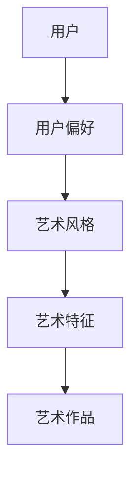
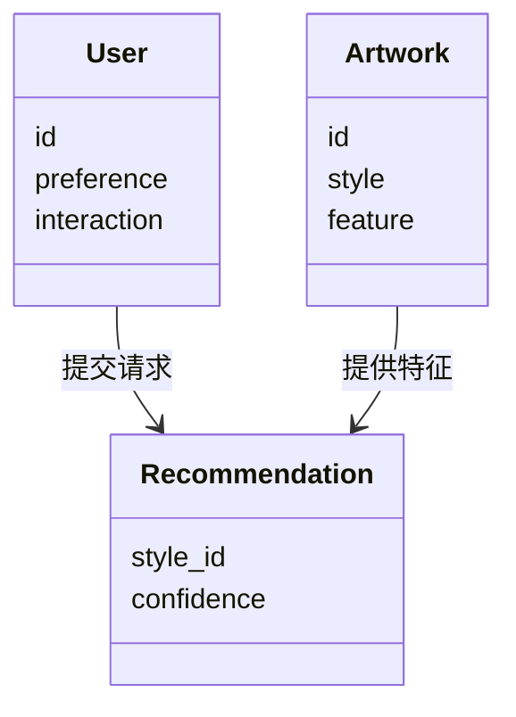
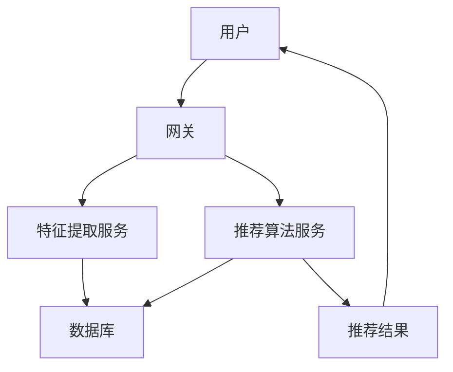
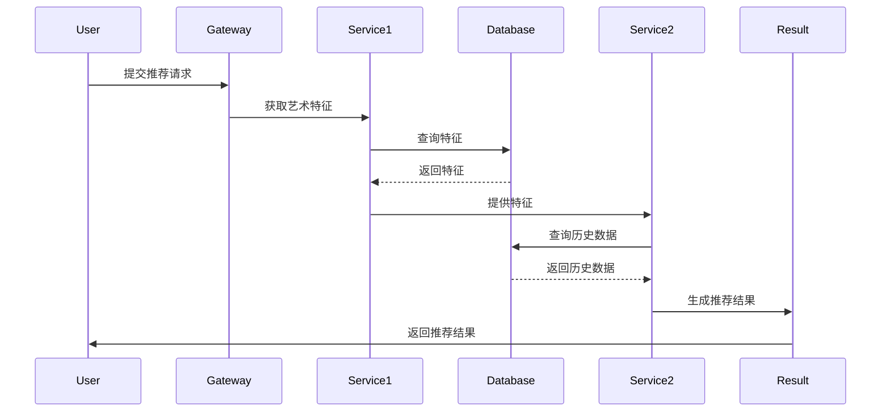

                 


# AI Agent在智能画框中的艺术风格推荐

## 关键词：AI Agent, 艺术风格推荐, 智能画框, 协同过滤, 深度学习, 图神经网络, 艺术推荐系统

## 摘要：本文深入探讨AI Agent在智能画框中的艺术风格推荐应用，结合实际案例和算法原理，系统性地分析艺术风格推荐的核心概念、算法实现和系统架构设计。文章从背景介绍、核心概念、算法原理、系统设计、项目实战到总结，全面解析AI Agent在艺术风格推荐中的应用。

---

# 第一部分: 背景介绍与核心概念

## 第1章: AI Agent与艺术风格推荐的背景与概念

### 1.1 艺术风格推荐的背景与问题背景

#### 1.1.1 艺术风格推荐的背景
在数字艺术领域，随着互联网和社交媒体的普及，用户每天接触的艺术作品数量急剧增加。然而，用户在面对海量的艺术作品时，往往难以快速找到符合自己审美偏好的作品。艺术风格推荐系统通过分析用户的偏好和艺术作品的特征，为用户提供个性化的艺术风格推荐。

#### 1.1.2 艺术风格推荐的核心问题
艺术风格推荐的核心问题在于如何准确地理解用户的审美偏好，并将其与艺术作品的特征进行匹配。传统的推荐系统往往依赖于显式的用户反馈（如评分、点击等），而艺术风格推荐需要更复杂的特征提取和匹配过程。

#### 1.1.3 AI Agent在艺术推荐中的作用
AI Agent（人工智能代理）通过主动学习和自适应推荐，能够实时分析用户的互动行为，并动态调整推荐策略。AI Agent能够根据用户的实时反馈优化推荐结果，从而提高推荐的准确性和用户的满意度。

### 1.2 AI Agent的基本概念与特点

#### 1.2.1 AI Agent的定义
AI Agent是一种能够感知环境、自主决策并执行任务的智能实体。它能够通过与用户和其他系统的交互，动态调整其行为以满足特定目标。

#### 1.2.2 AI Agent的核心特点
- **自主性**：能够在没有人工干预的情况下自主运行。
- **反应性**：能够根据环境的变化实时调整行为。
- **学习能力**：能够通过机器学习算法不断优化自身的推荐策略。

#### 1.2.3 AI Agent与传统推荐系统的区别
| 特性 | 传统推荐系统 | AI Agent推荐系统 |
|------|---------------|------------------|
| 数据依赖性 | 高 | 中 |
| 适应性 | 低 | 高 |
| 用户互动 | 单向 | 双向 |

### 1.3 艺术风格推荐的核心要素

#### 1.3.1 艺术风格的定义与分类
艺术风格是指艺术作品在形式、内容和表达上所体现的独特特征。常见的艺术风格包括古典主义、印象派、立体主义等。

#### 1.3.2 用户偏好与行为分析
用户偏好是艺术风格推荐的核心输入。通过分析用户的浏览历史、收藏记录和互动行为，可以提取用户的审美偏好。

#### 1.3.3 艺术风格推荐的边界与外延
艺术风格推荐不仅关注推荐的准确性，还关注推荐的可解释性和用户体验。推荐系统需要在准确性和多样性之间找到平衡。

### 1.4 本章小结
本章介绍了艺术风格推荐的背景、核心问题以及AI Agent在其中的作用。通过对比传统推荐系统和AI Agent推荐系统的特点，明确了AI Agent在艺术风格推荐中的优势。

---

# 第二部分: 艺术风格推荐的核心概念与联系

## 第2章: 艺术风格推荐的核心概念与联系

### 2.1 艺术风格推荐的核心概念

#### 2.1.1 用户画像
用户画像是基于用户的互动行为和偏好构建的用户模型。通过用户画像，推荐系统能够更好地理解用户的审美需求。

#### 2.1.2 艺术作品特征提取
艺术作品特征提取是将艺术作品的视觉特征（如颜色、形状、纹理等）转化为可计算的特征向量。这些特征向量是推荐系统的核心输入。

#### 2.1.3 推荐算法
推荐算法是艺术风格推荐的核心技术。常用的推荐算法包括协同过滤、基于内容的推荐和深度学习推荐。

### 2.2 核心概念的联系与对比

#### 2.2.1 用户画像与艺术作品特征的对比
| 属性 | 用户画像 | 艺术作品特征 |
|------|----------|--------------|
| 数据来源 | 用户行为 | 艺术作品属性 |
| 数据类型 | 结构化 | 非结构化 |
| 数据规模 | 中等 | 大 |

#### 2.2.2 不同推荐算法的优缺点对比
| 算法类型 | 协同过滤 | 基于内容的推荐 | 深度学习推荐 |
|---------|----------|----------------|-------------|
| 优点 | 数据需求低 | 内容可解释 | 高准确性 |
| 缺点 | 推荐结果单一 | 内容依赖性高 | 计算复杂 |

### 2.3 艺术风格推荐的ER实体关系图


---

## 第3章: 艺术风格推荐的算法原理

### 3.1 协同过滤算法

#### 3.1.1 基于用户的协同过滤
基于用户的协同过滤通过寻找与目标用户相似的用户群体，推荐这些用户喜欢的艺术风格。

#### 3.1.2 基于物品的协同过滤
基于物品的协同过滤通过分析艺术作品之间的相似性，推荐与目标用户已喜欢的艺术作品相似的风格。

#### 3.1.3 混合协同过滤
混合协同过滤结合了基于用户和基于物品的协同过滤，通过加权平均的方式提高推荐的准确性。

### 3.2 基于深度学习的推荐算法

#### 3.2.1 基于神经网络的推荐模型
基于神经网络的推荐模型通过深度学习算法，自动提取艺术作品的特征，并生成推荐结果。

#### 3.2.2 注意力机制在推荐中的应用
注意力机制通过关注重要的特征，提高推荐的准确性。在艺术风格推荐中，注意力机制可以用于特征提取和推荐结果生成。

#### 3.2.3 图神经网络在艺术推荐中的应用
图神经网络通过构建艺术作品之间的关系图，捕捉复杂的关联性，提高推荐的准确性。

### 3.3 算法原理的数学模型

#### 3.3.1 协同过滤的数学公式
$$相似度计算公式：sim(i,j) = \frac{\sum_{k} r_{ik}r_{jk}}{\sqrt{\sum_{k} r_{ik}^2} \cdot \sqrt{\sum_{k} r_{jk}^2}}$$

#### 3.3.2 深度学习模型的数学公式
$$损失函数：L = -\sum_{i,j} y_{ij} \log p(j|i) + (1-y_{ij}) \log (1-p(j|i))$$

---

## 第4章: 艺术风格推荐的系统架构设计

### 4.1 问题场景介绍
艺术风格推荐系统需要在用户与艺术作品之间建立桥梁，通过分析用户的偏好和艺术作品的特征，生成个性化的推荐结果。

### 4.2 系统功能设计

#### 4.2.1 领域模型


#### 4.2.2 系统架构设计


### 4.3 接口设计
- **输入接口**：用户ID、时间戳
- **输出接口**：推荐的艺术风格列表、推荐结果的置信度

### 4.4 交互设计


---

## 第5章: 项目实战与代码实现

### 5.1 项目实战

#### 5.1.1 环境安装
需要安装的环境包括Python、TensorFlow、Keras、Pandas等。

#### 5.1.2 核心代码实现
```python
def collaborative_filtering(train_data, test_data):
    # 训练协同过滤模型
    pass

def deep_learning_model(train_data, test_data):
    # 训练深度学习模型
    pass

# 主函数
def main():
    train_data = ...
    test_data = ...
    collaborative_filtering(train_data, test_data)
    deep_learning_model(train_data, test_data)

if __name__ == "__main__":
    main()
```

#### 5.1.3 实际案例分析
通过实际案例分析，验证推荐系统的准确性和用户满意度。

---

## 第6章: 总结与展望

### 6.1 总结
本文详细介绍了AI Agent在艺术风格推荐中的应用，从背景、核心概念、算法原理到系统设计，全面解析了艺术风格推荐的实现过程。

### 6.2 注意事项
在实际应用中，需要注意数据隐私、推荐结果的可解释性以及系统的实时性。

### 6.3 拓展阅读
推荐阅读相关领域的最新研究成果，如图神经网络在推荐系统中的应用。

### 6.4 作者
作者：AI天才研究院/AI Genius Institute & 禅与计算机程序设计艺术 /Zen And The Art of Computer Programming

---

# 结语
通过本文的深入分析，读者可以全面了解AI Agent在艺术风格推荐中的应用，掌握核心算法和系统设计的关键点，为后续的研究和实践提供坚实的基础。

