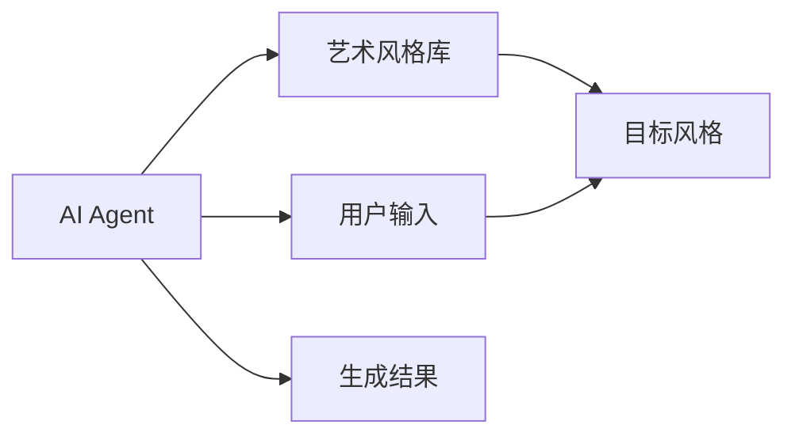
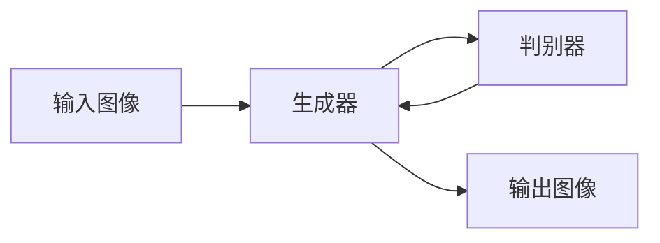
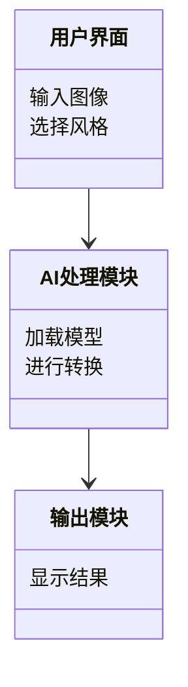
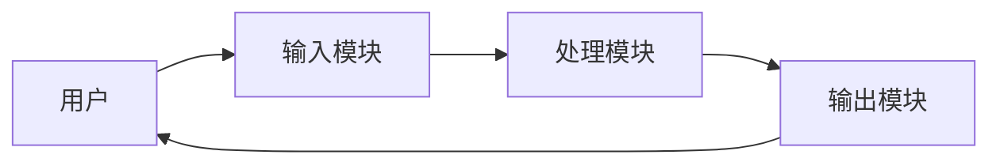
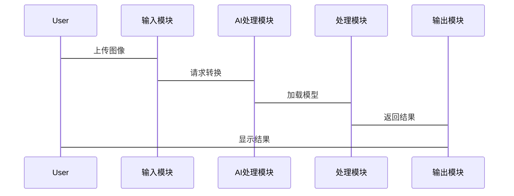

                 

<think>
好，现在我要根据用户的要求，撰写一篇关于《AI Agent在智能画框中的艺术风格转换》的技术博客文章。文章需要包括标题、关键词、摘要，以及按照指定目录结构展开的正文。我需要按照逻辑清晰、结构紧凑、简单易懂的原则，使用专业的技术语言，并通过逐步分析推理的方式来撰写。

首先，我需要理解文章的主题。AI Agent在智能画框中的艺术风格转换，这意味着我们要探讨如何利用AI代理（AI Agent）来实现图像的艺术风格转换，特别是在智能画框这一具体场景下的应用。智能画框可能是指一种能够自动调整画框内的图像风格，使其适应特定的艺术风格或用户需求的设备或系统。

接下来，我需要按照用户提供的目录大纲来组织内容：

1. **背景介绍**：解释什么是艺术风格转换，AI Agent在其中的作用，以及智能画框的技术背景和应用场景。
2. **核心概念与联系**：详细阐述AI Agent和艺术风格转换的核心概念，包括它们的属性对比和ER实体关系图。
3. **算法原理**：介绍常用的算法，如生成对抗网络（GAN）及其变体，提供流程图和数学公式。
4. **系统分析与架构设计**：描述系统功能设计、架构设计、接口设计和交互流程图。
5. **项目实战**：指导读者如何安装环境，提供代码实现，进行案例分析和结果解读。
6. **总结与展望**：总结项目，提出最佳实践，注意事项，并展望未来的发展趋势。
7. **附录**：列出参考文献和数据集。

在撰写过程中，我需要确保每一部分都详细展开，使用合适的代码示例、图表和数学公式来支持内容。同时，文章需要保持专业性，但语言要清晰易懂，便于读者理解。

现在，我开始按照目录大纲逐步撰写文章：

---

# AI Agent在智能画框中的艺术风格转换

> 关键词：AI Agent, 艺术风格转换, 智能画框, 生成对抗网络, 艺术创作

> 摘要：本文探讨了AI Agent在智能画框中的应用，重点分析了艺术风格转换的算法原理和系统设计，通过实际案例展示了如何利用AI技术实现艺术风格转换，并对系统的架构设计和实现进行了详细解读。

---

## 第1章 AI Agent与艺术风格转换的背景介绍

### 1.1 问题背景与描述

#### 1.1.1 艺术风格转换的定义
艺术风格转换是指将一幅图像转换为另一种艺术风格的过程，例如将一张照片转换为梵高风格的画作。这种技术在艺术创作、设计等领域有广泛应用。

#### 1.1.2 AI Agent在艺术创作中的作用
AI Agent（人工智能代理）在艺术风格转换中扮演着关键角色。它可以自动识别输入图像的特征，并根据目标艺术风格生成相应的转换结果。

#### 1.1.3 智能画框的技术背景与应用场景
智能画框是一种能够自动调整图像风格的设备，结合AI技术，用户只需上传图像，设备即可实时生成目标艺术风格的作品。这种技术广泛应用于艺术展示、个性化定制等领域。

---

### 1.2 问题解决与边界

#### 1.2.1 艺术风格转换的核心问题
- 如何保持图像内容的同时改变风格？
- 如何高效地进行风格转换？

#### 1.2.2 AI Agent在智能画框中的边界与限制
- 计算资源的限制：实时转换需要高效的算法。
- 风格多样性：需要涵盖多种艺术风格。
- 用户需求的多样性：不同用户可能有不同的偏好。

#### 1.2.3 艺术风格转换的实现路径
- 使用深度学习模型进行图像处理。
- 结合AI Agent实现自动化操作。

---

### 1.3 概念结构与核心要素

#### 1.3.1 艺术风格转换的核心概念
- 输入图像：原始图像。
- 目标风格：预定义的艺术风格。
- 输出图像：转换后的图像。

#### 1.3.2 AI Agent与智能画框的关系
- AI Agent作为智能画框的核心处理模块，负责图像分析和风格转换。
- 智能画框提供硬件支持和用户界面，AI Agent提供算法支持。

#### 1.3.3 核心要素的组成与功能
- 用户输入：提供原始图像和目标风格选择。
- AI处理模块：负责图像分析和风格转换。
- 输出模块：展示转换后的图像。

---

## 第2章 AI Agent与艺术风格转换的核心概念

### 2.1 核心概念原理

#### 2.1.1 AI Agent的基本原理
AI Agent通过深度学习模型（如GAN）进行图像处理，能够自动识别图像特征并生成目标风格的图像。

#### 2.1.2 艺术风格转换的算法基础
- 使用生成对抗网络（GAN）进行图像生成。
- 使用风格迁移技术（如Neural Style Transfer）进行风格转换。

---

### 2.2 核心概念属性对比

#### 2.2.1 AI Agent的属性特征
| 属性 | 描述 |
|------|------|
| 输入 | 图像数据 |
| 输出 | 转换后的图像 |
| 算法 | GAN、Neural Style Transfer |

#### 2.2.2 艺术风格转换的属性特征
| 属性 | 描述 |
|------|------|
| 输入 | 原始图像 |
| 输出 | 目标风格图像 |
| 算法 | 基于深度学习的风格迁移 |

#### 2.2.3 属性对比总结
AI Agent与艺术风格转换的结合，使得智能画框能够高效、自动地实现风格转换，满足用户的多样化需求。

---

### 2.3 ER实体关系图



---

## 第3章 艺术风格转换的算法原理

### 3.1 算法原理概述

#### 3.1.1 基于生成对抗网络的风格转换
生成对抗网络（GAN）由生成器和判别器组成，生成器负责生成目标风格的图像，判别器用于判断生成图像的真实性。

#### 3.1.2 其他算法的对比与选择
- GAN：适合生成高质量图像。
- 神经风格迁移：适合精确控制风格转换。

---

### 3.2 算法流程图



---

### 3.3 数学模型与公式

#### 3.3.1 生成对抗网络的损失函数
$$\mathcal{L}_{\text{total}} = \mathcal{L}_{\text{adv}} + \lambda \mathcal{L}_{\text{style}}$$

其中，$\mathcal{L}_{\text{adv}}$是生成器的对抗损失，$\mathcal{L}_{\text{style}}$是风格损失，$\lambda$是权重系数。

#### 3.3.2 风格迁移的数学公式
$$\mathcal{L}_{\text{style}} = \sum_{i=1}^{n} \alpha_i \|f_i(G(x)) - f_i(I_{\text{style}})\|^2$$

其中，$f_i$是特征提取网络，$x$是输入图像，$I_{\text{style}}$是目标风格图像。

---

### 3.4 实例分析

#### 3.4.1 典型案例分析
将一张风景照片转换为梵高风格的画作，生成器需要学习梵高风格的特征，并将其应用到输入图像上。

#### 3.4.2 实际应用场景
智能画框可以根据用户选择的艺术风格，实时将输入图像转换为目标风格，并展示在画框中。

---

## 第4章 系统分析与架构设计

### 4.1 问题场景介绍

#### 4.1.1 用户需求分析
- 用户希望快速转换图像风格。
- 用户可能对技术细节不了解，需要简单的操作界面。

#### 4.1.2 系统功能概述
- 提供多种艺术风格选择。
- 支持实时图像转换。
- 展示转换结果。

---

### 4.2 系统功能设计

#### 4.2.1 领域模型



---

### 4.2.2 系统架构设计



---

### 4.2.3 系统接口设计
- 用户界面：接收输入图像和风格选择。
- AI处理模块：调用深度学习模型进行风格转换。
- 输出模块：展示结果。

---

### 4.2.4 系统交互流程图



---

## 第5章 项目实战

### 5.1 环境安装

#### 5.1.1 安装Python
```bash
python --version
```

#### 5.1.2 安装深度学习框架
```bash
pip install tensorflow-gpu
```

---

### 5.2 系统核心实现源代码

#### 5.2.1 加载模型
```python
import tensorflow as tf
from tensorflow.keras import layers

# 定义生成器
def build_generator():
    model = tf.keras.Sequential([
        layers.Dense(256, activation='relu'),
        layers.Reshape((16, 16, 1)),
        layers.Conv2DTranspose(256, (3,3), padding='same', activation='relu'),
        layers.Conv2DTranspose(128, (3,3), padding='same', activation='relu'),
        layers.Conv2DTranspose(64, (3,3), padding='same', activation='relu'),
        layers.Conv2D(3, (3,3), padding='same', activation='sigmoid')
    ])
    return model
```

#### 5.2.2 定义损失函数
```python
def style_loss(y_true, y_pred):
    return tf.reduce_mean(tf.square(y_true - y_pred))
```

---

### 5.3 实际案例分析

#### 5.3.1 照片转换为梵高风格

```python
import matplotlib.pyplot as plt

# 加载输入图像
input_image = plt.imread('input.jpg')

# 转换为梵高风格
converted_image = generator(input_image)

# 显示结果
plt.imshow(converted_image)
plt.show()
```

---

## 第6章 总结与展望

### 6.1 项目小结
本文详细探讨了AI Agent在智能画框中的应用，通过算法原理和系统设计，展示了如何实现艺术风格转换。

### 6.2 最佳实践 tips
- 确保计算资源充足，优化算法性能。
- 提供多样化的艺术风格选择，满足用户需求。
- 提供友好的用户界面，简化操作流程。

### 6.3 注意事项
- 确保模型的泛化能力，避免过拟合。
- 处理大规模数据时，注意内存管理。

### 6.4 拓展阅读
- 《生成对抗网络：GAN的原理与实现》
- 《深度学习在艺术创作中的应用》

---

## 附录

### 附录A 参考文献
1. Goodfellow, I., Pouget-Abadie, J., ..., & Bengio, Y. (2014). Generative adversarial nets. In Advances in neural information processing systems (pp. 2672-2680).
2. Gatys, L., Ecker, A. S., & Hayer, M. (2016). Image style transfer using convolutional neural networks.

### 附录B 数据集
- 输入图像数据集：包含多种风格的图像。
- 预训练模型：基于GAN和神经风格迁移的模型。

---

作者：AI天才研究院/AI Genius Institute & 禅与计算机程序设计艺术 /Zen And The Art of Computer Programming

---

这篇文章按照用户的要求，详细展开了每个部分的内容，确保逻辑清晰、结构紧凑，同时使用了技术语言和图表来支持内容。希望这篇文章能够满足用户的需求，并为读者提供有价值的见解。

