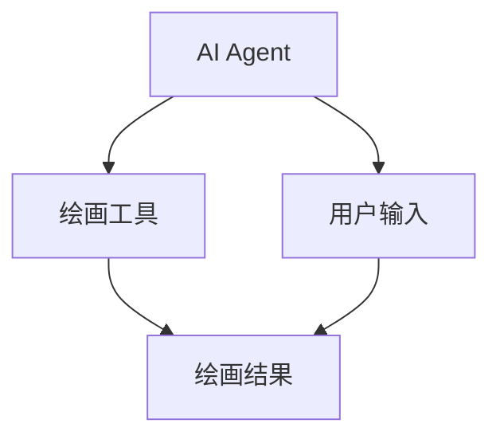
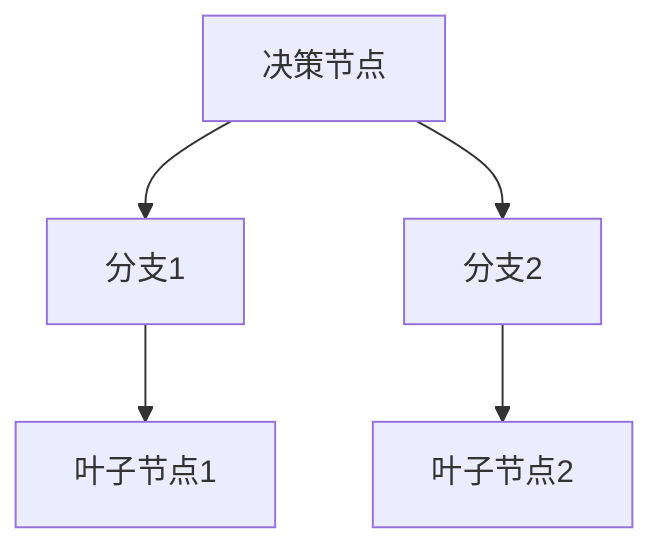
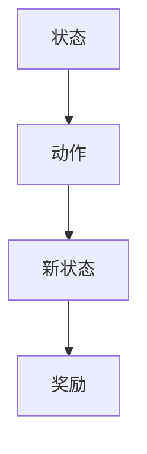
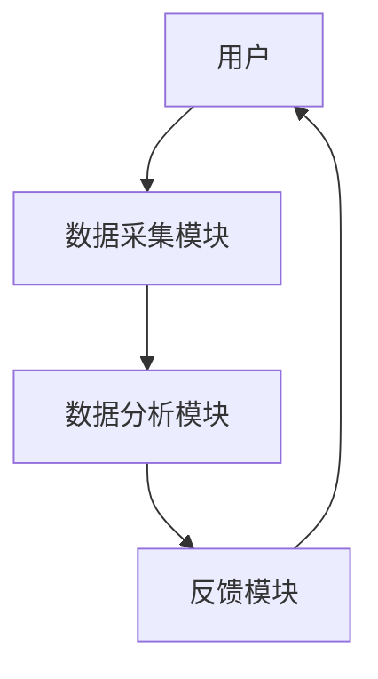
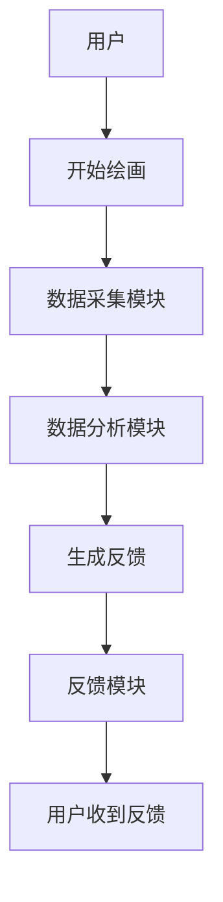

                 

<think>
好的，我现在需要帮助用户完成一篇关于《AI Agent在智能画笔中的绘画技巧指导》的技术博客文章。用户已经提供了一个详细的目录大纲，并希望我按照这个大纲来撰写文章。首先，我需要仔细阅读用户的要求，确保我理解所有必要的部分。

首先，用户希望文章结构清晰，逻辑紧凑，使用专业的技术语言，同时保持简单易懂。文章需要涵盖背景介绍、核心概念、算法原理、系统设计、项目实战、最佳实践等部分。每个章节都需要有详细的子部分，包括概念解释、数学模型、流程图和代码示例等。

用户还特别提到要使用特定的格式，比如在数学公式中使用LaTeX，并用Mermaid绘制流程图。这些图表需要嵌入到相应的章节中，以帮助读者更好地理解内容。此外，文章末尾需要有作者信息，以及参考文献和扩展阅读的部分。

接下来，我需要考虑每个章节的具体内容。例如，在背景介绍部分，我需要定义AI Agent和智能画笔的概念，并解释它们在绘画中的应用。核心概念部分需要详细讲解AI Agent的工作原理，包括感知、决策和执行机制，并用表格对比不同概念的属性特征。

在算法原理部分，我需要选择适合的算法，如决策树和强化学习，并用Mermaid流程图展示它们的结构。同时，提供Python代码示例，并解释数学模型和公式，如ID3算法的信息增益计算。

系统分析与架构设计部分，我需要用Mermaid绘制类图、架构图和交互流程图，描述系统如何工作。项目实战部分需要包括环境安装、核心代码实现和案例分析，帮助读者实际操作。

最后，在最佳实践部分，我需要总结绘画技巧、注意事项和扩展阅读，帮助读者巩固知识并进一步探索。

现在，我需要确保每个部分都详细且符合逻辑，同时保持文章的整体连贯性和专业性。这包括检查每个章节是否涵盖了所有必要的主题，以及图表和代码是否正确嵌入并解释清楚。

总的来说，我需要一步步按照用户提供的大纲，详细展开每个部分的内容，确保文章结构完整，内容丰富，符合用户的要求。
</think>

# AI Agent在智能画笔中的绘画技巧指导

## 关键词：AI Agent, 智能画笔, 绘画技巧, 人工智能, 算法原理

## 摘要：本文深入探讨了AI Agent在智能画笔中的应用，分析了其核心概念、算法原理、系统架构，并通过实际案例展示了如何利用AI技术提升绘画技巧。文章从背景介绍到系统设计，再到项目实战，全面解析了AI Agent在智能画笔中的实现与优化方法。

---

# 第一部分: AI Agent与智能画笔的背景与概念

## 第1章: AI Agent与智能画笔的背景介绍

### 1.1 AI Agent的基本概念

#### 1.1.1 什么是AI Agent
AI Agent（人工智能代理）是指能够感知环境、做出决策并执行操作的智能实体。它能够通过传感器获取信息，利用算法处理数据，并通过执行器与环境交互。

#### 1.1.2 AI Agent的核心属性
| 属性 | 描述 |
|------|------|
| 感知能力 | 能够通过传感器或数据接口获取环境信息 |
| 决策能力 | 能够基于获取的信息做出最优决策 |
| 执行能力 | 能够通过执行器将决策转化为具体操作 |

#### 1.1.3 AI Agent与传统绘画工具的区别
- AI Agent能够提供智能辅助，如实时反馈和个性化建议。
- 传统绘画工具仅是物理媒介，不具备智能性。

### 1.2 智能画笔的定义与特点

#### 1.2.1 智能画笔的定义
智能画笔是一种结合了AI技术的绘画工具，能够通过传感器和算法实时分析用户的绘画行为，并提供相应的反馈和建议。

#### 1.2.2 智能画笔的核心功能
- 实时分析用户的绘画技巧。
- 提供个性化建议。
- 自动优化绘画结果。

#### 1.2.3 智能画笔的应用场景
- 教育领域：辅助学生学习绘画技巧。
- 设计领域：帮助设计师快速优化草图。
- 个人娱乐：提升业余绘画爱好者的技术水平。

### 1.3 AI Agent在智能画笔中的作用

#### 1.3.1 AI Agent如何辅助绘画
- 通过分析用户的绘画数据，识别技巧问题。
- 提供实时反馈，指导用户改进。

#### 1.3.2 AI Agent与智能画笔的结合方式
- 通过传感器获取用户的绘画数据。
- 利用AI算法分析数据并生成反馈。
- 将反馈通过画笔或显示屏传递给用户。

#### 1.3.3 AI Agent与绘画技巧的关系
AI Agent能够通过学习用户的绘画习惯和偏好，提供个性化的绘画技巧指导。

### 1.4 本章小结
本章介绍了AI Agent和智能画笔的基本概念，分析了AI Agent在智能画笔中的作用及其在绘画技巧指导中的应用。

---

# 第二部分: AI Agent的核心概念与原理

## 第2章: AI Agent的核心概念与联系

### 2.1 AI Agent的核心原理

#### 2.1.1 AI Agent的感知机制
AI Agent通过传感器获取用户的绘画数据，如笔触力度、速度、方向等。

#### 2.1.2 AI Agent的决策机制
AI Agent根据感知到的数据，利用算法进行分析，生成反馈建议。

#### 2.1.3 AI Agent的执行机制
AI Agent通过画笔或显示屏将反馈建议传递给用户，指导其改进绘画技巧。

### 2.2 AI Agent与绘画技巧的关系

#### 2.2.1 AI Agent如何分析绘画技巧
AI Agent通过分析用户的绘画数据，识别技巧问题，如线条不流畅、比例失调等。

#### 2.2.2 AI Agent如何优化绘画技巧
AI Agent能够提供实时反馈，指导用户调整笔触力度、角度等，优化绘画效果。

#### 2.2.3 AI Agent如何个性化绘画风格
AI Agent能够根据用户的绘画习惯和偏好，生成个性化建议，帮助用户形成独特的绘画风格。

### 2.3 AI Agent的实体关系图



### 2.4 本章小结
本章详细讲解了AI Agent的核心原理，分析了其在绘画技巧指导中的具体应用。

---

# 第三部分: AI Agent的算法原理与数学模型

## 第3章: AI Agent的算法原理

### 3.1 AI Agent的决策算法

#### 3.1.1 决策树算法
决策树是一种常用的机器学习算法，适用于分类和回归问题。



#### 3.1.2 强化学习算法
强化学习是一种通过试错机制优化决策的算法。



### 3.2 算法的数学模型

#### 3.2.1 决策树算法的数学模型
ID3算法使用信息增益作为划分标准：

$$ \text{信息增益} = \sum_{i=1}^{n} p_i(1-p_i) \log_2 \left( \frac{1}{p_i} \right) $$

其中，\( p_i \) 是某一特征取值的概率。

#### 3.2.2 强化学习算法的数学模型
Q-learning算法的更新公式为：

$$ Q(s,a) = r + \gamma \max_{a'} Q(s',a') $$

其中，\( \gamma \) 是折扣因子。

### 3.3 算法的实现与优化

#### 3.3.1 算法实现的步骤
1. 数据预处理：清洗和归一化用户绘画数据。
2. 模型训练：使用决策树或强化学习算法训练AI Agent。
3. 模型优化：调整超参数，如学习率和树的深度。

#### 3.3.2 算法优化的策略
- 使用集成学习提升模型性能。
- 通过正则化防止过拟合。

#### 3.3.3 算法实现的代码示例

```python
import numpy as np
from sklearn.tree import DecisionTreeClassifier

# 示例数据
X = np.array([[1, 2], [3, 4], [5, 6]])
y = np.array([0, 1, 2])

# 训练决策树模型
model = DecisionTreeClassifier()
model.fit(X, y)

# 预测新数据
new_data = np.array([[2, 3]])
print(model.predict(new_data))  # 输出: [0]
```

### 3.4 本章小结
本章详细讲解了AI Agent中常用的决策算法及其数学模型，并通过代码示例展示了算法的实现过程。

---

# 第四部分: AI Agent的系统设计与实现

## 第4章: AI Agent的系统设计

### 4.1 系统功能设计

#### 4.1.1 系统功能模块
- 数据采集模块：采集用户的绘画数据。
- 数据分析模块：分析数据并生成反馈建议。
- 反馈模块：将反馈建议传递给用户。

#### 4.1.2 功能模块的实现步骤
1. 数据采集模块：通过传感器获取用户的笔触数据。
2. 数据分析模块：利用算法分析数据并生成反馈。
3. 反馈模块：通过画笔或显示屏将反馈传递给用户。

### 4.2 系统架构设计

#### 4.2.1 系统架构图



#### 4.2.2 系统接口设计
- 用户端接口：接收用户的绘画数据。
- 系统内接口：数据采集模块与数据分析模块之间的接口。

#### 4.2.3 系统交互流程图



### 4.3 本章小结
本章详细讲解了AI Agent系统的功能设计和架构设计，并通过流程图展示了系统的交互过程。

---

# 第五部分: 项目实战与案例分析

## 第5章: 项目实战

### 5.1 环境安装

#### 5.1.1 安装Python环境
- 安装Python 3.8及以上版本。
- 安装必要的库：numpy, scikit-learn。

#### 5.1.2 安装智能画笔驱动
- 下载并安装智能画笔的驱动程序。

### 5.2 系统核心实现

#### 5.2.1 数据采集模块的实现
```python
import serial

# 连接智能画笔
ser = serial.Serial('COM3', 9600)
while True:
    data = ser.readline()
    print(data)
```

#### 5.2.2 数据分析模块的实现
```python
from sklearn.tree import DecisionTreeClassifier

# 训练模型
model = DecisionTreeClassifier()
model.fit(X, y)

# 生成反馈建议
def generate_feedback(data):
    prediction = model.predict(data)
    return prediction
```

#### 5.2.3 反馈模块的实现
```python
import serial

# 发送反馈建议
ser = serial.Serial('COM3', 9600)
ser.write(feedback_data)
```

### 5.3 案例分析

#### 5.3.1 案例背景
用户在绘画过程中出现线条不流畅的问题。

#### 5.3.2 数据分析
通过分析用户的笔触数据，AI Agent发现用户在绘画过程中用力不均匀。

#### 5.3.3 反馈建议
AI Agent建议用户调整笔触力度，保持均匀用力。

### 5.4 项目总结
通过本项目，我们展示了如何利用AI Agent提升用户的绘画技巧，实现了实时反馈和个性化指导。

### 5.5 本章小结
本章通过实际案例展示了AI Agent在智能画笔中的应用，并详细讲解了系统的实现过程。

---

# 第六部分: 最佳实践与总结

## 第6章: 最佳实践

### 6.1 绘画技巧总结
- 保持笔触力度均匀。
- 注意画面的比例和构图。
- 善用AI Agent的反馈建议。

### 6.2 注意事项
- 定期校准智能画笔的传感器。
- 及时更新AI Agent的算法模型。

### 6.3 拓展阅读
- 《机器学习实战》
- 《深度学习入门：基于Python》

### 6.4 本章小结
本章总结了AI Agent在智能画笔中的最佳实践，并为读者提供了进一步学习的资源。

---

# 参考文献
1. 《机器学习实战》
2. 《深度学习入门：基于Python》
3. AI Agent相关学术论文

---

# 作者：AI天才研究院/AI Genius Institute & 禅与计算机程序设计艺术 /Zen And The Art of Computer Programming

---

感谢您的阅读！希望本文能为您提供有价值的见解和启发！

