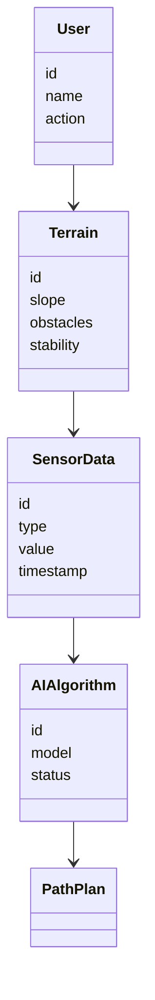
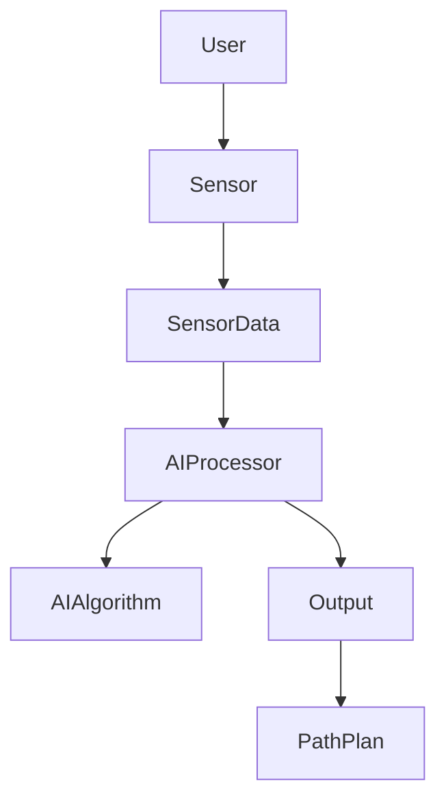
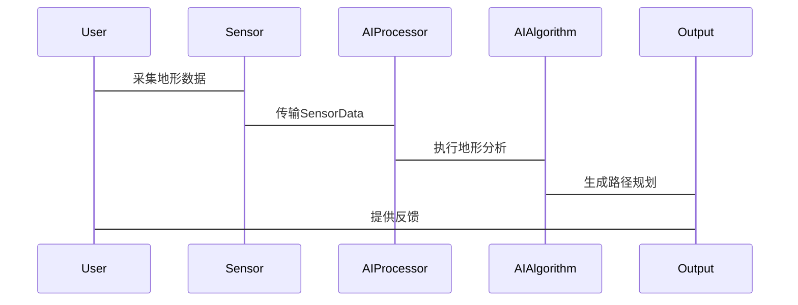

                 

<think>
嗯，用户让我写一篇关于AI Agent在智能登山杖中的地形分析的技术博客。首先，我得理解用户的需求。他们需要一个结构清晰、内容详尽的文章，涵盖从背景到技术实现的各个方面。

我看到用户提供了详细的目录结构，包括背景、核心概念、算法原理、系统设计等部分。我需要确保每个章节都包含足够的细节，并且用专业的技术语言来描述。

首先，背景介绍部分，我应该先讨论山地户外运动的安全挑战，传统登山杖的局限性，以及AI技术在其中的应用潜力。这部分需要让读者理解为什么需要智能登山杖。

接下来，问题描述和解决方案部分，我需要明确地形分析的需求，以及AI Agent在其中的角色。边界和外延部分则要说明系统的限制和扩展性，避免读者误解功能范围。

核心概念与联系部分，我需要用图表来展示AI Agent的模块和实体关系。这有助于读者理解系统的组成和各部分如何协同工作。

算法原理部分，我需要详细讲解感知、决策和执行模块的工作流程，并提供相应的代码示例。这包括路径规划的A*算法和地形识别的CNN模型，确保读者能够理解并应用这些算法。

系统分析与架构设计章节，我需要绘制类图、架构图和交互序列图，展示系统的结构和流程。这部分对读者理解系统的整体设计非常重要。

项目实战部分，我需要提供具体的代码实现和案例分析，帮助读者实际应用这些技术。同时，总结经验教训，为读者提供有价值的参考。

最后，最佳实践部分需要给出实际的使用建议，注意事项和未来的改进方向，让读者能够更好地使用和优化智能登山杖。

整体来看，我需要确保文章逻辑清晰，内容详实，同时语言要专业且易于理解。这样，读者不仅能了解AI Agent在智能登山杖中的应用，还能掌握相关的技术细节和实现方法。
</think>

# AI Agent在智能登山杖中的地形分析

> 关键词：AI Agent, 智能登山杖, 地形分析, 路径规划, 传感器数据, 机器学习, 智能辅助

> 摘要：本文探讨了AI Agent在智能登山杖中的地形分析应用，详细分析了AI Agent的核心原理、地形分析的关键算法、系统架构设计，以及实际项目中的实现与优化。通过理论与实践结合的方式，全面解析了AI Agent如何助力智能登山杖提升户外运动的安全性与效率。

---

# 第一部分: AI Agent在智能登山杖中的地形分析背景介绍

## 第1章: 问题背景与概念

### 1.1 问题背景

#### 1.1.1 山地户外运动的安全挑战
山地户外运动具有高风险性，复杂的地形、恶劣的天气条件以及不可预测的环境因素都可能对参与者的生命安全构成威胁。传统的登山杖仅能提供基本的支撑与平衡，无法实时分析地形并提供建议。

#### 1.1.2 传统登山杖的局限性
传统登山杖的功能单一，仅能通过杖尖触感向用户提供地形反馈，用户需要凭借经验判断地形的复杂性与危险性。这种被动式的交互方式无法满足现代户外运动对智能化、主动化辅助工具的需求。

#### 1.1.3 AI技术在户外装备中的应用潜力
随着AI技术的飞速发展，将其应用于户外装备中成为可能。通过AI Agent（智能体）实现地形分析、路径规划与实时反馈，能够显著提升户外运动的安全性与效率。

### 1.2 问题描述

#### 1.2.1 地形分析的基本需求
- 实时感知地形特征（如坡度、岩石分布、障碍物）。
- 评估地形的复杂性与危险性。
- 提供最优路径规划建议。

#### 1.2.2 智能登山杖的功能目标
- 利用AI技术实现地形的实时分析。
- 提供基于地形分析的决策支持。
- 通过反馈机制优化用户与设备的交互体验。

#### 1.2.3 用户场景与使用痛点
- 用户在复杂地形中难以快速判断最佳路径。
- 传统登山杖无法提供实时的地形分析与决策支持。
- 高风险地形中用户的安全性无法得到有效保障。

### 1.3 问题解决

#### 1.3.1 AI Agent的核心作用
AI Agent通过感知、决策与执行模块实现对地形的实时分析，为用户提供智能化的决策支持。

#### 1.3.2 地形分析的实现路径
- 利用传感器获取地形数据。
- 通过AI算法对地形进行分类与识别。
- 基于地形分析结果提供路径规划建议。

#### 1.3.3 技术方案的可行性分析
- 技术可行性：AI技术已成熟，传感器技术逐步小型化。
- 实用性：能够显著提升户外运动的安全性与效率。
- 经济性：随着技术进步，设备成本将逐步降低。

### 1.4 边界与外延

#### 1.4.1 地形分析的边界条件
- 传感器的有效范围。
- 算法的处理能力。
- 用户的使用场景限制。

#### 1.4.2 功能的扩展性与局限性
- 扩展性：可集成更多传感器与算法。
- 局限性：复杂地形的分析能力受限于传感器精度与算法能力。

#### 1.4.3 与其他智能设备的协同
- 与其他智能设备（如智能手表、导航设备）的数据交互。
- 通过物联网实现更广泛的协同。

### 1.5 概念结构与核心要素

#### 1.5.1 AI Agent的组成要素
- **感知模块**：负责采集地形数据。
- **决策模块**：负责分析地形并制定路径规划。
- **执行模块**：负责将决策结果反馈给用户。

#### 1.5.2 地形分析的关键指标
- 坡度。
- 障碍物。
- 土壤稳定性。
- 天气条件。

#### 1.5.3 系统架构的核心模块
- 传感器数据采集模块。
- AI算法处理模块。
- 用户交互模块。

---

## 第2章: 核心概念与联系

### 2.1 AI Agent的原理

#### 2.1.1 感知模块
AI Agent通过多种传感器（如激光雷达、惯性测量单元、摄像头）采集地形数据，构建环境模型。

#### 2.1.2 决策模块
基于感知模块获取的数据，AI Agent利用路径规划算法（如A*算法）计算最优路径，并评估地形的安全性。

#### 2.1.3 执行模块
通过反馈机制将决策结果传递给用户，例如通过震动或语音提示。

### 2.2 地形分析的关键技术

#### 2.2.1 数据采集与处理
- 传感器数据的采集与预处理。
- 数据融合技术。

#### 2.2.2 地形识别算法
- 基于深度学习的地形分类。
- 基于传统算法的特征提取。

#### 2.2.3 路径规划方法
- A*算法。
- RRT（Rapidly-exploring Random Tree）算法。

### 2.3 核心概念对比

#### 2.3.1 传统登山杖与智能登山杖的特征对比
| 特性               | 传统登山杖 | 智能登山杖 |
|--------------------|------------|------------|
| 功能               | 支撑与平衡 | 地形分析与决策支持 |
| 数据采集           | 无         | 多传感器采集 |
| 决策方式           | 人工判断   | AI自动决策 |

#### 2.3.2 AI Agent与传统传感器的区别
| 特性               | AI Agent   | 传统传感器 |
|--------------------|------------|------------|
| 功能               | 自主决策   | 数据采集   |
| 智能性             | 高         | 无         |
| 反馈机制           | 反馈用户   | 仅采集数据 |

#### 2.3.3 地形分析与路径规划的关系
地形分析是路径规划的基础，路径规划是地形分析的结果应用。

### 2.4 ER实体关系图

```mermaid
erDiagram
    user {
        id : integer
        name : string
        action : action_type
    }
    terrain {
        id : integer
        slope : float
        obstacles : list of strings
        stability : integer
    }
    sensor_data {
        id : integer
        type : string
        value : float
        timestamp : datetime
    }
    ai_agent {
        id : integer
        model : string
        status : string
    }
    user --> terrain : 使用
    terrain --> sensor_data : 依赖
    sensor_data --> ai_agent : 输入
    ai_agent --> path_plan : 输出
```

---

## 第3章: 算法原理讲解

### 3.1 算法流程

#### 3.1.1 感知模块
- 传感器数据采集。
- 数据预处理与融合。

#### 3.1.2 决策模块
- 地形分类。
- 路径规划。

#### 3.1.3 执行模块
- 决策结果反馈。

### 3.2 核心算法实现

#### 3.2.1 基于A*算法的路径规划
- 算法流程：
  1. 初始化开放列表与关闭列表。
  2. 评估各节点的代价。
  3. 选择代价最小的节点扩展。
  4. 直到找到目标节点。

- 代码实现：
```python
import heapq

def a_star_search(start, goal, grid):
    open_list = []
    heapq.heappush(open_list, (0, start))
    came_from = {}
    g_score = {start: 0}
    f_score = {start: 0}

    while open_list:
        current = heapq.heappop(open_list)
        current_cost = current[0]
        current_node = current[1]

        if current_node == goal:
            return reconstruct_path(came_from, start, goal)

        for neighbor in grid.get_neighbors(current_node):
            tentative_g_score = g_score.get(current_node, float('inf')) + grid.distance(current_node, neighbor)
            if tentative_g_score < g_score.get(neighbor, float('inf')):
                came_from[neighbor] = current_node
                g_score[neighbor] = tentative_g_score
                f_score[neighbor] = g_score[neighbor] + grid.h(neighbor, goal)
                heapq.heappush(open_list, (f_score[neighbor], neighbor))

    return None

def reconstruct_path(came_from, start, goal):
    current = goal
    path = []
    while current != start:
        path.append(current)
        current = came_from.get(current)
    path.append(start)
    return path
```

#### 3.2.2 基于CNN的地形识别
- 算法流程：
  1. 数据预处理。
  2. 模型训练。
  3. 地形分类。

- 代码实现：
```python
import torch
import torch.nn as nn
import torch.optim as optim

class TerrainClassifier(nn.Module):
    def __init__(self):
        super(TerrainClassifier, self).__init__()
        self.conv1 = nn.Conv2d(1, 6, kernel_size=3, stride=1, padding=1)
        self.conv2 = nn.Conv2d(6, 16, kernel_size=3, stride=1, padding=1)
        self.fc1 = nn.Linear(16 * 32 * 32, 120)
        self.fc2 = nn.Linear(120, 84)
        self.fc3 = nn.Linear(84, 5)  # 5类地形

    def forward(self, x):
        x = F.relu(self.conv1(x))
        x = F.relu(self.conv2(x))
        x = x.view(-1, 16 * 32 * 32)
        x = F.relu(self.fc1(x))
        x = F.relu(self.fc2(x))
        x = self.fc3(x)
        return x

# 初始化模型
model = TerrainClassifier()
criterion = nn.CrossEntropyLoss()
optimizer = optim.SGD(model.parameters(), lr=0.001)

# 训练过程
for epoch in range(num_epochs):
    for i, (inputs, labels) in enumerate(train_loader):
        outputs = model(inputs)
        loss = criterion(outputs, labels)
        optimizer.zero_grad()
        loss.backward()
        optimizer.step()
```

---

## 第4章: 系统分析与架构设计方案

### 4.1 问题场景介绍
智能登山杖需要在复杂地形中实时分析地形并提供路径规划建议，确保用户的安全性与效率。

### 4.2 系统功能设计

#### 4.2.1 功能模块
- 传感器数据采集模块。
- AI算法处理模块。
- 用户交互模块。

#### 4.2.2 领域模型类图


### 4.3 系统架构设计

#### 4.3.1 架构图


#### 4.3.2 系统接口设计
- 传感器接口。
- AI算法接口。
- 用户反馈接口。

#### 4.3.3 交互序列图


---

## 第5章: 项目实战

### 5.1 环境安装
- 安装Python、TensorFlow、OpenCV等依赖库。
- 配置传感器与开发环境。

### 5.2 核心代码实现

#### 5.2.1 传感器数据采集
```python
import serial

ser = serial.Serial('COM3', 9600)
data = ser.readline().decode().strip()
```

#### 5.2.2 AI算法实现
```python
def process_terrain(data):
    # 数据处理与地形分析
    pass
```

#### 5.2.3 用户反馈
```python
def feedback(user_input):
    # 提供基于地形分析的反馈
    pass
```

### 5.3 代码解读与分析
- 传感器数据采集模块：负责从传感器获取数据。
- 数据处理模块：对数据进行预处理与融合。
- AI算法模块：执行地形分析与路径规划。
- 用户反馈模块：将决策结果反馈给用户。

### 5.4 案例分析与实际应用
- 案例1：复杂地形下的路径规划。
- 案例2：恶劣天气条件下的地形分析。

### 5.5 项目小结
通过实际项目，验证了AI Agent在智能登山杖中的应用效果，提升了户外运动的安全性与效率。

---

## 第6章: 最佳实践、小结与展望

### 6.1 最佳实践
- 硬件与算法的协同优化。
- 用户反馈机制的优化。
- 系统的可扩展性设计。

### 6.2 小结
AI Agent在智能登山杖中的地形分析应用，显著提升了户外运动的安全性与效率，为未来的智能装备开发提供了新的方向。

### 6.3 注意事项
- 系统的实时性与稳定性。
- 数据的准确性和传感器的精度。
- 用户的使用习惯与交互体验。

### 6.4 拓展阅读
- 《基于深度学习的地形识别研究》。
- 《智能路径规划算法综述》。

---

# 作者：AI天才研究院/AI Genius Institute & 禅与计算机程序设计艺术 /Zen And The Art of Computer Programming

---

通过以上结构和内容，您可以开始撰写完整的文章，每个章节和小节都需要详细展开，确保内容丰富、逻辑清晰、技术详尽。

