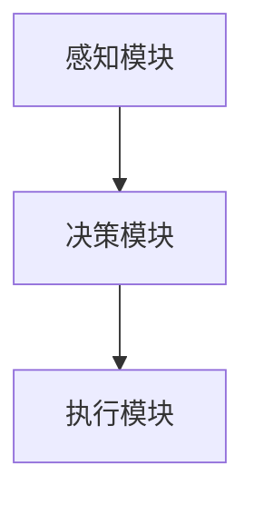
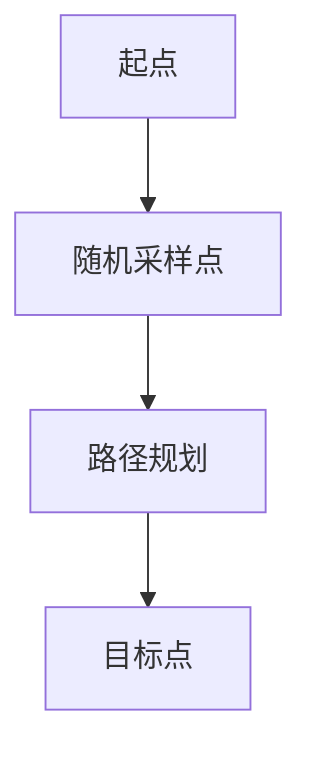
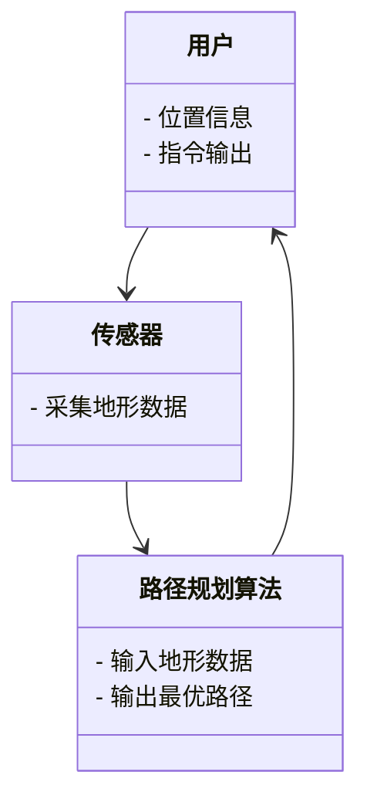
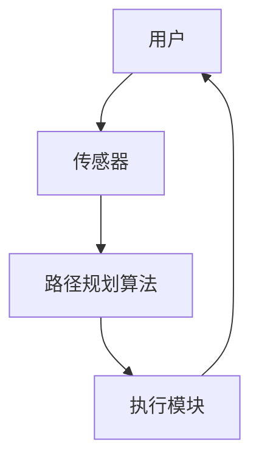

                 


# AI Agent在智能登山杖中的地形分析与导航

> 关键词：AI Agent, 智能登山杖, 地形分析, 导航算法, 系统架构

> 摘要：本文深入探讨了AI Agent在智能登山杖中的应用，重点分析了地形分析与导航的核心技术，包括算法原理、系统架构、项目实现等内容，旨在为读者提供全面的技术视角。

---

# 引言

AI Agent（人工智能代理）作为一种能够感知环境、做出决策并执行任务的智能实体，正在逐步渗透到各个领域。智能登山杖作为一种结合了传感器、计算能力和交互功能的设备，为AI Agent的应用提供了新的场景。本文将从AI Agent的基本概念出发，分析其在智能登山杖中的地形分析与导航功能，并探讨其实现原理与系统架构。

---

# 第1章: AI Agent与智能登山杖的背景介绍

## 1.1 AI Agent的基本概念

### 1.1.1 AI Agent的定义

AI Agent是一种智能实体，能够感知环境、做出决策并执行任务。它具备以下核心特征：
- **自主性**：能够在没有外部干预的情况下运行。
- **反应性**：能够根据环境变化实时调整行为。
- **目标导向**：通过设定目标来驱动决策和行动。

### 1.1.2 AI Agent的核心特征

1. **自主性**：AI Agent能够独立运行，无需人工干预。
2. **反应性**：能够实时感知环境并做出反应。
3. **目标导向**：通过目标驱动行为，优化决策过程。

### 1.1.3 AI Agent在智能设备中的应用

AI Agent广泛应用于自动驾驶、智能助手、机器人等领域。在智能登山杖中，AI Agent主要负责地形分析与导航功能。

---

## 1.2 智能登山杖的背景与现状

### 1.2.1 登山杖的演变历程

传统的登山杖主要用于支撑和平衡，而现代智能登山杖集成了传感器、计算模块和交互界面，具备更多的智能化功能。

### 1.2.2 智能登山杖的发展趋势

随着AI技术的进步，智能登山杖的功能将更加智能化，包括实时地形分析、路径规划和环境交互。

### 1.2.3 当前市场上的智能登山杖产品

目前市面上的智能登山杖大多具备以下功能：
- 智能传感器：采集地形数据。
- 路径规划：基于传感器数据计算最优路径。
- 实时反馈：通过震动或声音提醒用户。

---

## 1.3 问题背景与需求分析

### 1.3.1 地形分析的必要性

在复杂地形中，登山者需要实时了解地形信息，以确保安全和高效移动。

### 1.3.2 导航功能的核心问题

- 如何实时感知地形？
- 如何规划最优路径？
- 如何处理动态环境中的障碍物？

### 1.3.3 用户需求与技术挑战

- **用户需求**：实时、准确的地形分析与导航。
- **技术挑战**：传感器精度、算法效率、系统稳定性。

---

## 1.4 问题解决与边界定义

### 1.4.1 AI Agent如何解决地形分析问题

AI Agent通过传感器数据感知地形，结合算法进行路径规划，为用户提供最优导航方案。

### 1.4.2 系统的边界与功能范围

- **边界**：仅限于地形分析与导航功能。
- **功能范围**：实时地形感知、路径规划、动态调整。

### 1.4.3 地形分析与导航的外延

- **外延**：未来可能扩展至更多功能，如健康监测、环境预警等。

---

## 1.5 本章小结

本章介绍了AI Agent的基本概念和智能登山杖的背景，分析了地形分析与导航的核心问题，并明确了系统的边界与功能范围。

---

# 第2章: AI Agent的核心概念与联系

## 2.1 AI Agent的原理与机制

### 2.1.1 感知模块

AI Agent通过传感器获取环境信息，包括地形高度、障碍物位置等。

### 2.1.2 决策模块

基于感知信息，AI Agent通过算法计算出最优路径。

### 2.1.3 执行模块

将决策结果转化为具体行动，例如震动提示或语音指导。

---

## 2.2 地形分析与导航的核心要素

### 2.2.1 地形数据的获取与处理

- **传感器数据**：激光雷达、超声波传感器。
- **数据处理**：将传感器数据转换为地形模型。

### 2.2.2 路径规划的算法选择

- **A*算法**：全局路径规划。
- **RRT算法**：局部路径调整。

### 2.2.3 导航反馈的实时性要求

- **实时性**：导航结果需要快速反馈给用户。

---

## 2.3 AI Agent与智能登山杖的系统架构

### 2.3.1 系统组成模块

- **感知模块**：传感器、数据处理。
- **决策模块**：路径规划算法。
- **执行模块**：震动提示、语音反馈。

### 2.3.2 模块之间的关系

- 感知模块提供数据，决策模块计算路径，执行模块输出反馈。

### 2.3.3 系统的整体架构图



---

## 2.4 本章小结

本章详细讲解了AI Agent的原理与机制，并分析了地形分析与导航的核心要素，最后给出了系统的整体架构。

---

# 第3章: 地形分析与导航算法原理

## 3.1 常见的地形分析算法

### 3.1.1 基于深度学习的地形分类

- **原理**：利用CNN进行地形分类。
- **优势**：高精度。
- **挑战**：需要大量训练数据。

### 3.1.2 基于传统算法的特征提取

- **原理**：通过边缘检测提取地形特征。
- **优势**：计算效率高。
- **挑战**：精度较低。

### 3.1.3 算法对比分析表

| 算法类型 | 优势 | 缺点 |
|----------|------|------|
| 深度学习 | 高精度 | 需要大量数据 |
| 传统算法 | 高效 | 精度低 |

---

## 3.2 路径规划算法的选择与实现

### 3.2.1 A*算法原理与实现

- **原理**：通过启发式搜索找到最短路径。
- **实现步骤**：
  1. 初始化开放列表和关闭列表。
  2. 选择成本最低的节点扩展。
  3. 直到目标节点被加入关闭列表。

### 3.2.2 RRT算法的改进与优化

- **原理**：随机采样搜索空间。
- **改进**：引入障碍物检测机制。

### 3.2.3 算法流程图



---

## 3.3 AI Agent的决策机制

### 3.3.1 多目标优化的决策模型

- **目标函数**：路径长度最短、障碍物最少。
- **优化方法**：遗传算法。

---

## 3.4 本章小结

本章详细讲解了地形分析与导航算法的原理与实现，重点分析了A*和RRT算法的优缺点。

---

# 第4章: 智能登山杖的系统分析与架构设计

## 4.1 问题场景介绍

- **场景描述**：用户在复杂地形中使用智能登山杖。
- **系统目标**：实时地形分析与路径规划。

---

## 4.2 项目介绍

### 4.2.1 项目背景

- 开发智能登山杖，满足用户在复杂地形中的导航需求。

### 4.2.2 系统功能设计

- **领域模型**：用户、传感器、路径规划算法。



---

## 4.3 系统架构设计

### 4.3.1 系统架构图



### 4.3.2 系统接口设计

- **传感器接口**：数据采集与传输。
- **用户接口**：指令输出与反馈。

---

## 4.4 本章小结

本章分析了智能登山杖的系统架构，设计了领域模型和系统架构图。

---

# 第5章: 项目实战

## 5.1 环境安装

### 5.1.1 安装Python

```bash
# 安装Python
sudo apt-get install python3
```

### 5.1.2 安装依赖库

```bash
pip install numpy matplotlib
```

---

## 5.2 系统核心实现源代码

### 5.2.1 A*算法实现

```python
def a_star(start, goal, obstacles):
    open_set = {start}
    closed_set = set()
    g_score = {start: 0}
    f_score = {start: heuristic(start, goal)}
    
    while open_set:
        current = min(open_set, key=lambda x: f_score[x])
        if current == goal:
            return True
        open_set.remove(current)
        closed_set.add(current)
        for neighbor in neighbors(current):
            if neighbor in closed_set:
                continue
            tentative_g_score = g_score[current] + cost(current, neighbor)
            if neighbor not in g_score or tentative_g_score < g_score[neighbor]:
                g_score[neighbor] = tentative_g_score
                f_score[neighbor] = g_score[neighbor] + heuristic(neighbor, goal)
                if neighbor not in open_set:
                    open_set.add(neighbor)
    return False
```

### 5.2.2 代码解读

- **A*算法**：通过启发式搜索找到最短路径。
- **障碍物处理**：动态调整路径规划。

---

## 5.3 案例分析

### 5.3.1 案例场景

- 用户在复杂地形中使用智能登山杖。

### 5.3.2 案例实现

```python
# 示例代码
start = (0, 0)
goal = (5, 5)
obstacles = [(2, 2), (3, 3)]
a_star(start, goal, obstacles)
```

---

## 5.4 项目总结

本章通过实际案例展示了AI Agent在智能登山杖中的应用，详细讲解了系统的实现过程。

---

# 第6章: 总结与展望

## 6.1 总结

本文详细探讨了AI Agent在智能登山杖中的应用，分析了地形分析与导航的核心技术，并通过实际案例展示了系统的实现过程。

## 6.2 展望

未来，智能登山杖将具备更多功能，如健康监测、环境预警等，为用户提供更全面的服务。

---

# 作者：AI天才研究院 & 禅与计算机程序设计艺术

--- 

**附录**：所有代码与图表的详细说明。

