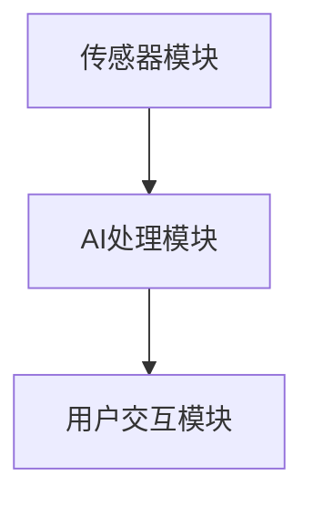

                 


# AI Agent在智能登山杖中的地形适应指导

> 关键词：AI Agent, 智能登山杖, 地形适应, 强化学习, 路径规划, 多传感器融合

> 摘要：本文深入探讨了AI Agent在智能登山杖中的应用，特别是其在地形适应指导中的作用。文章首先介绍了AI Agent和智能登山杖的基本概念及其结合的意义，然后详细分析了AI Agent的核心原理和地形适应算法，包括路径规划、强化学习和多传感器融合等技术。接着，文章从系统架构设计的角度，详细阐述了智能登山杖的系统功能、架构设计、接口设计和交互流程。最后，通过实际案例分析了AI Agent在智能登山杖中的具体应用，并总结了其优势和未来发展方向。

---

## 第1章: AI Agent与智能登山杖的背景与应用

### 1.1 AI Agent的基本概念

#### 1.1.1 AI Agent的定义与特点
AI Agent（人工智能代理）是指能够感知环境、自主决策并执行任务的智能实体。它具有以下特点：
- **自主性**：能够在没有外部干预的情况下独立运行。
- **反应性**：能够实时感知环境并做出反应。
- **目标导向**：具有明确的目标，能够为实现目标而采取行动。
- **学习能力**：能够通过经验改进自身的决策能力。

#### 1.1.2 AI Agent的核心功能与应用场景
AI Agent的核心功能包括：
- **知识表示**：将环境中的信息表示为可处理的数据结构。
- **状态感知**：通过传感器或其他信息源感知当前环境状态。
- **决策规划**：基于感知到的信息，制定行动计划并执行。

AI Agent的应用场景非常广泛，包括自动驾驶、智能助手、机器人导航等领域。

#### 1.1.3 AI Agent在智能设备中的作用
在智能设备中，AI Agent通常作为核心模块，负责处理设备与环境之间的交互。它能够通过传感器获取环境信息，分析这些信息并制定相应的行动计划，从而实现设备的智能化操作。

### 1.2 智能登山杖的定义与技术特点

#### 1.2.1 智能登山杖的功能概述
智能登山杖是一种结合了人工智能和物联网技术的登山辅助设备。它能够通过多种传感器感知环境信息，利用AI算法为用户提供地形适应指导。

#### 1.2.2 智能登山杖的技术实现
智能登山杖的技术实现主要包括以下几个方面：
- **传感器技术**：包括GPS、IMU（惯性测量单元）、激光雷达等，用于感知环境信息。
- **通信技术**：通过蓝牙、Wi-Fi等技术与用户设备或其他设备进行数据传输。
- **AI算法**：包括路径规划、强化学习、目标识别等算法，用于实现地形适应指导。

#### 1.2.3 智能登山杖的应用场景与用户需求
智能登山杖的主要应用场景包括登山、徒步旅行、越野探险等。用户的需求主要集中在以下几个方面：
- **地形识别**：能够快速识别复杂的地形环境。
- **路径规划**：能够根据地形信息为用户提供最优路径。
- **实时指导**：能够在用户行进过程中实时提供调整建议。

### 1.3 AI Agent在智能登山杖中的应用背景

#### 1.3.1 地形适应的挑战与需求
地形适应是指在复杂地形中找到最优路径并安全行进的能力。传统的人工导航方法往往效率低下，且容易受到环境变化的影响。AI Agent的引入能够显著提高导航的效率和准确性。

#### 1.3.2 AI Agent在地形适应中的优势
AI Agent在地形适应中的优势主要体现在以下几个方面：
- **自主学习**：能够通过经验不断优化路径规划算法。
- **实时感知**：能够快速响应环境变化，提供实时指导。
- **多目标优化**：能够在复杂环境中实现多目标优化，如路径最短、风险最小等。

#### 1.3.3 智能登山杖与AI Agent结合的意义
智能登山杖与AI Agent的结合，不仅能够提高登山的安全性，还能显著提升用户的体验。通过AI Agent的强大计算能力，智能登山杖能够为用户提供更加智能化、个性化的服务。

### 1.4 本章小结
本章主要介绍了AI Agent和智能登山杖的基本概念及其在地形适应中的应用背景。通过分析AI Agent的核心功能和智能登山杖的技术特点，我们能够更好地理解两者结合的意义和价值。

---

## 第2章: AI Agent的核心概念与原理

### 2.1 AI Agent的核心概念

#### 2.1.1 知识表示与推理
知识表示是AI Agent的核心能力之一。通过知识表示，AI Agent能够将环境中的信息转化为可处理的数据结构，并通过推理能力进行逻辑推理。

#### 2.1.2 状态感知与决策
状态感知是AI Agent通过传感器获取环境信息的过程。基于这些信息，AI Agent能够进行状态评估，并根据评估结果制定相应的决策。

#### 2.1.3 行为规划与执行
行为规划是AI Agent根据当前状态和目标，制定行动计划的过程。通过行为规划，AI Agent能够选择最优的行为策略，并通过执行机构完成任务。

### 2.2 AI Agent的感知与交互机制

#### 2.2.1 多传感器融合技术
多传感器融合技术是AI Agent实现环境感知的重要手段。通过将来自不同传感器的数据进行融合，AI Agent能够更准确地感知环境信息。

#### 2.2.2 用户意图识别与反馈
用户意图识别是AI Agent与用户交互的关键环节。通过分析用户的输入，AI Agent能够理解用户的意图，并通过反馈机制与用户进行有效沟通。

#### 2.2.3 环境动态感知与响应
环境动态感知是指AI Agent能够实时感知环境中的动态变化，并根据变化情况调整自身的行为策略。

### 2.3 AI Agent的算法原理

#### 2.3.1 基于强化学习的决策算法
强化学习是一种通过试错机制优化决策策略的算法。通过强化学习，AI Agent能够在复杂环境中实现自主决策。

#### 2.3.2 基于图搜索的路径规划算法
图搜索算法是路径规划的经典方法。通过将环境表示为图结构，AI Agent能够通过图搜索找到最优路径。

#### 2.3.3 基于知识图谱的地形推理
知识图谱是一种结构化的知识表示形式。通过知识图谱，AI Agent能够对地形信息进行推理，从而实现更高级的地形适应能力。

### 2.4 本章小结
本章详细介绍了AI Agent的核心概念与原理，包括知识表示与推理、状态感知与决策、行为规划与执行等方面。通过分析这些核心概念，我们可以更好地理解AI Agent在智能登山杖中的具体应用。

---

## 第3章: AI Agent在智能登山杖中的地形适应算法

### 3.1 地形适应算法的设计与实现

#### 3.1.1 基于A*算法的路径规划
A*算法是一种经典的图搜索算法，常用于路径规划。其基本思想是在搜索过程中优先探索具有较低代价的节点，从而找到最优路径。

#### 3.1.2 基于Dijkstra算法的最短路径计算
Dijkstra算法是一种用于计算图中单源最短路径的算法。通过优先队列，Dijkstra算法能够高效地找到最短路径。

#### 3.1.3 基于强化学习的动态地形适应
强化学习是一种通过试错机制优化决策策略的算法。在动态地形适应中，强化学习能够帮助AI Agent快速调整路径规划策略。

### 3.2 算法实现的数学模型

#### 3.2.1 A*算法的数学模型
$$f(n) = g(n) + h(n)$$
其中，\( g(n) \)表示从起点到节点n的已知成本，\( h(n) \)表示从节点n到目标节点的估计成本。

#### 3.2.2 强化学习的奖励函数设计
$$R(s, a) = r_1 + r_2 + \cdots + r_n$$
其中，\( s \)表示当前状态，\( a \)表示动作，\( r_i \)表示奖励。

### 3.3 算法实现的代码示例

#### 3.3.1 A*算法实现
```python
def a_star_search(start, goal):
    open_set = {start}
    came_from = {}
    g_score = {start: 0}
    f_score = {start: heuristic(start, goal)}
    while open_set:
        current = node_with_min_f_score(open_set, f_score)
        if current == goal:
            break
        open_set.remove(current)
        for neighbor in neighbors(current):
            tentative_g_score = g_score[current] + cost(current, neighbor)
            if neighbor not in g_score or tentative_g_score < g_score[neighbor]:
                came_from[neighbor] = current
                g_score[neighbor] = tentative_g_score
                f_score[neighbor] = g_score[neighbor] + heuristic(neighbor, goal)
    return came_from, g_score
```

### 3.4 本章小结
本章详细介绍了AI Agent在智能登山杖中的地形适应算法，包括A*算法、Dijkstra算法和强化学习的应用。通过这些算法，AI Agent能够实现高效的路径规划和动态地形适应。

---

## 第4章: 智能登山杖的系统分析与架构设计

### 4.1 系统功能设计

#### 4.1.1 系统功能模块
智能登山杖的系统功能模块包括：
- **传感器模块**：负责环境感知。
- **AI处理模块**：负责路径规划和决策。
- **用户交互模块**：负责与用户的通信。

#### 4.1.2 系统功能流程
系统功能流程包括：
1. 传感器模块感知环境信息。
2. AI处理模块根据感知信息进行路径规划。
3. 用户交互模块将规划结果反馈给用户。

### 4.2 系统架构设计

#### 4.2.1 系统架构图


#### 4.2.2 系统模块交互
系统模块交互包括传感器模块、AI处理模块和用户交互模块之间的数据流。

### 4.3 接口设计

#### 4.3.1 系统接口描述
系统接口包括：
- **传感器接口**：用于与传感器模块通信。
- **AI处理接口**：用于与AI处理模块通信。
- **用户交互接口**：用于与用户交互模块通信。

#### 4.3.2 接口交互流程
接口交互流程包括：
1. 传感器模块向AI处理模块发送环境信息。
2. AI处理模块根据环境信息进行路径规划。
3. 用户交互模块将路径规划结果反馈给用户。

### 4.4 本章小结
本章详细介绍了智能登山杖的系统架构设计，包括功能模块、架构图和接口设计。通过这些设计，我们可以更好地理解智能登山杖的实现过程。

---

## 第5章: AI Agent在智能登山杖中的项目实战

### 5.1 项目环境安装

#### 5.1.1 系统要求
系统要求包括：
- 操作系统：Linux/Windows/MacOS
- Python版本：Python 3.x
- 依赖库：numpy, matplotlib, scikit-learn等

#### 5.1.2 安装步骤
安装步骤包括：
1. 安装Python环境。
2. 安装所需的依赖库。
3. 下载项目代码。

### 5.2 系统核心实现

#### 5.2.1 核心代码实现
```python
import numpy as np
import matplotlib.pyplot as plt

def visualize_path(start, goal, path):
    plt.plot([start[0], goal[0]], [start[1], goal[1]], 'b-')
    plt.scatter(start[0], start[1], c='r')
    plt.scatter(goal[0], goal[1], c='g')
    for point in path:
        plt.scatter(point[0], point[1], c='b')
    plt.show()
```

#### 5.2.2 代码应用解读与分析
代码应用解读与分析包括：
- **路径规划**：通过算法找到最优路径。
- **可视化**：将路径以图形化方式展示出来。

### 5.3 实际案例分析

#### 5.3.1 案例分析
案例分析包括：
1. **简单地形**：平地上的路径规划。
2. **复杂地形**：山地中的路径规划。

#### 5.3.2 案例分析结果
案例分析结果包括：
- **简单地形**：路径规划结果直观。
- **复杂地形**：路径规划结果更加复杂，但能够满足实际需求。

### 5.4 本章小结
本章通过实际案例分析，详细介绍了AI Agent在智能登山杖中的具体应用。通过项目实战，我们可以更好地理解AI Agent在地形适应中的实际效果。

---

## 第6章: 总结与展望

### 6.1 总结
通过本文的介绍，我们可以看到AI Agent在智能登山杖中的地形适应指导具有重要的意义。通过AI Agent的强大计算能力和多传感器融合技术，智能登山杖能够为用户提供更加智能化、个性化的服务。

### 6.2 未来展望
未来，随着AI技术的不断发展，智能登山杖的功能将更加智能化。我们可以期待更多的创新，如更加高效的路径规划算法、更加智能的环境感知技术等。

---

## 第7章: 最佳实践与注意事项

### 7.1 最佳实践

#### 7.1.1 开发建议
开发建议包括：
- **模块化设计**：将系统划分为多个模块，便于维护和扩展。
- **代码规范**：遵循代码规范，提高代码的可读性和可维护性。

#### 7.1.2 测试建议
测试建议包括：
- **单元测试**：对每个模块进行单元测试。
- **集成测试**：对整个系统进行集成测试。

### 7.2 注意事项

#### 7.2.1 系统安全性
系统安全性包括：
- **数据安全**：防止数据泄露。
- **系统稳定性**：确保系统稳定运行。

#### 7.2.2 用户隐私
用户隐私包括：
- **数据加密**：对用户数据进行加密处理。
- **隐私保护**：遵守相关隐私保护法律法规。

---

## 作者：AI天才研究院/AI Genius Institute & 禅与计算机程序设计艺术 /Zen And The Art of Computer Programming

---

**版权声明：禁止一切形式的转载、复制和摘编行为，否则将承担法律责任。**

