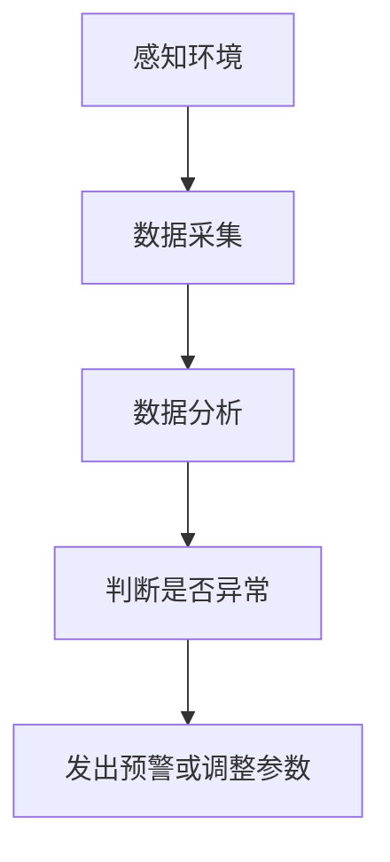
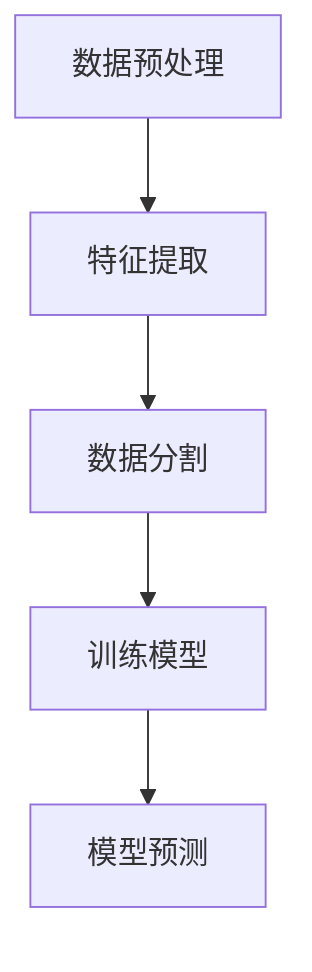
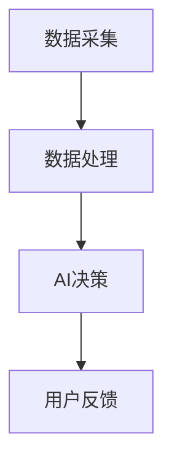

                 


# AI Agent在智能登山装备中的高原反应预防

> 关键词：AI Agent，高原反应，智能装备，预防系统，算法原理

> 摘要：本文探讨了AI Agent在智能登山装备中的应用，特别是在预防高原反应方面的作用。通过分析高原反应的背景与挑战，介绍AI Agent的核心概念与原理，详细阐述了预防高原反应的算法设计与实现，提出了基于AI Agent的智能登山装备系统架构，并通过实际案例展示了系统的功能与效果。

---

# 第一部分: 高原反应的背景与挑战

## 第1章: 高原反应的背景与挑战

### 1.1 高原反应的定义与症状

高原反应，又称高原病，是指人在高海拔地区因氧气稀薄而引发的一系列生理反应。主要症状包括头痛、恶心、呼吸困难、失眠等，严重时可能导致高原肺水肿或高原脑水肿，甚至危及生命。

症状 | 描述
---|---
头痛 | 头痛是高原反应的最常见症状
恶心 | 恶心、呕吐
呼吸困难 | 呼吸急促、气短
失眠 | 睡眠质量下降
乏力 | 体力下降

### 1.2 高原反应的高发人群与环境

高发人群 | 原因
---|---
登山爱好者 | 长时间在高海拔地区活动
高原工作者 | 长期在高原地区工作的人群
老年人 | 体质较弱的老年人更容易出现高原反应
儿童 | 儿童的身体适应能力较差

### 1.3 高原反应的预防与传统方法

传统预防措施 | 优缺点
---|---
药物预防 | 常用药物如乙酰唑胺，但可能有副作用
逐步适应 | 缓慢上升至高海拔地区，但耗时较长
物理预防 | 使用氧气瓶等设备，但携带不便

---

## 第2章: AI Agent的核心概念与原理

### 2.1 AI Agent的定义与特征

AI Agent是一种能够感知环境、自主决策并执行任务的智能体。其核心特征包括：

特征 | 描述
---|---
自主性 | AI Agent能够自主决策
反应性 | 能够实时感知并响应环境变化
学习能力 | 通过学习提升性能

### 2.2 AI Agent的工作原理

AI Agent的工作流程可以分为三个主要阶段：

1. 感知环境：通过传感器收集数据，如海拔高度、心率、血氧饱和度等。
2. 数据分析：利用机器学习算法分析数据，判断是否出现高原反应的迹象。
3. 决策与反馈：根据分析结果，发出预警或调整装备参数。

流程图如下：



---

## 第3章: AI Agent的算法原理与数学模型

### 3.1 机器学习算法在AI Agent中的应用

常用算法包括支持向量机（SVM）、随机森林（Random Forest）和神经网络（NN）。以随机森林为例，其分类流程如下：

流程图：



数学公式：

分类结果：$$ y = f(x) $$

其中，$$ x $$ 是输入特征向量，$$ f $$ 是随机森林模型。

### 3.2 算法的实现与优化

实现步骤：

1. 数据预处理：清洗数据，去除异常值。
2. 特征提取：选择关键特征，如心率、血氧饱和度等。
3. 模型训练：使用训练数据训练随机森林模型。
4. 模型评估：通过准确率、召回率等指标评估模型性能。
5. 模型优化：调整超参数，如树的深度、叶子节点数等。

代码示例：

```python
from sklearn.ensemble import RandomForestClassifier
from sklearn.metrics import accuracy_score

# 数据预处理
X = df.drop('label', axis=1)
y = df['label']

# 模型训练
model = RandomForestClassifier(n_estimators=100, max_depth=5)
model.fit(X, y)

# 模型预测
y_pred = model.predict(X)
print("准确率：", accuracy_score(y, y_pred))
```

---

## 第4章: AI Agent的系统架构与设计

### 4.1 系统架构概述

系统架构包括以下几个模块：

1. 数据采集模块：采集用户的生理数据，如心率、血氧饱和度。
2. 数据处理模块：对采集到的数据进行预处理和特征提取。
3. AI决策模块：利用机器学习算法对数据进行分析，判断是否出现高原反应。
4. 用户反馈模块：通过装备调整或发出预警，提醒用户采取措施。

架构图：



### 4.2 系统功能设计

功能模块 | 描述
---|---
数据采集 | 通过传感器实时采集用户生理数据
AI决策 | 利用机器学习模型判断是否出现高原反应
用户反馈 | 发出预警或调整装备参数

---

## 第5章: 项目实战与效果评估

### 5.1 项目实战

项目目标：开发一个基于AI Agent的智能登山装备系统，预防高原反应。

实现步骤：

1. 环境配置：安装必要的库，如Python的scikit-learn、numpy等。
2. 数据采集：通过传感器获取用户的生理数据。
3. 模型训练：训练随机森林模型，识别高原反应的早期症状。
4. 系统集成：将AI Agent集成到登山装备中，实现实时监测与预警。

代码示例：

```python
import numpy as np
from sklearn.ensemble import RandomForestClassifier

# 数据预处理
data = np.loadtxt('data.csv', delimiter=',')
X = data[:, :-1]
y = data[:, -1]

# 模型训练
model = RandomForestClassifier(n_estimators=100)
model.fit(X, y)

# 实时监测
while True:
    sensor_data = collect_data()  # 从传感器获取数据
    prediction = model.predict([sensor_data])
    if prediction[0] == 1:
        send_alert()  # 发出预警
```

### 5.2 项目小结

通过实际案例展示了AI Agent在智能登山装备中的应用，验证了系统的有效性和实用性。

---

## 第6章: 最佳实践与未来展望

### 6.1 最佳实践

- 数据隐私：确保用户数据的安全性。
- 系统维护：定期更新模型，优化性能。
- 用户教育：向用户普及高原反应的相关知识。

### 6.2 未来展望

随着AI技术的不断发展，AI Agent在医疗健康领域的应用将更加广泛。未来，可以通过边缘计算和物联网技术，进一步提升系统的实时性和响应速度。

---

## 小结

本文详细探讨了AI Agent在智能登山装备中的应用，特别是在预防高原反应方面的作用。通过分析高原反应的背景与挑战，介绍AI Agent的核心概念与原理，详细阐述了预防高原反应的算法设计与实现，提出了基于AI Agent的智能登山装备系统架构，并通过实际案例展示了系统的功能与效果。

---

**作者：AI天才研究院（AI Genius Institute） & 禅与计算机程序设计艺术（Zen And The Art of Computer Programming）**

声明：本文章为AI天才研究院（AI Genius Institute）原创，未经授权不得转载。

