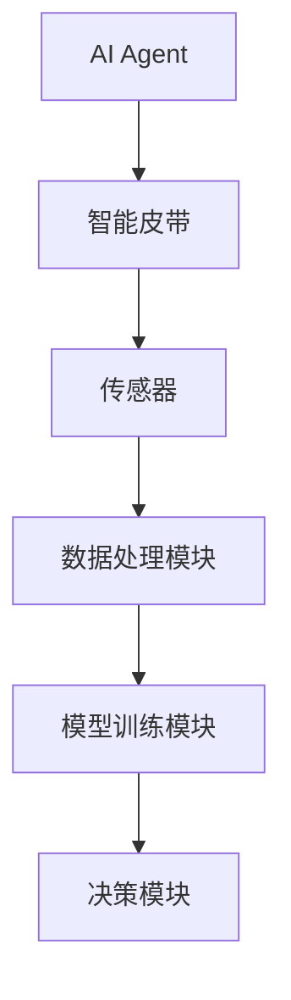
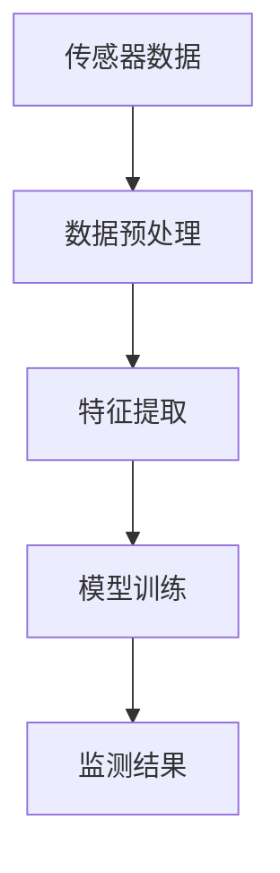
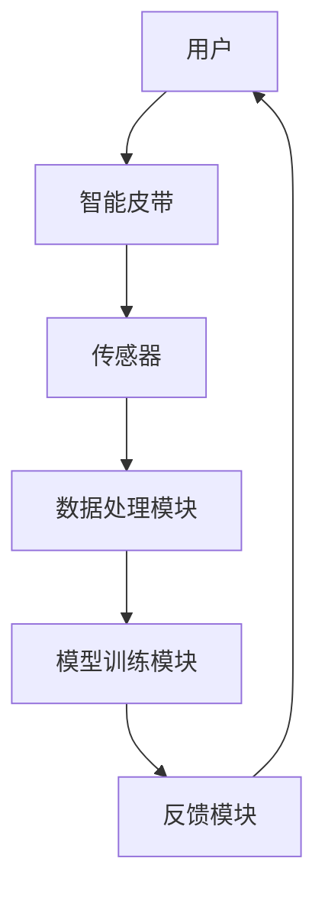
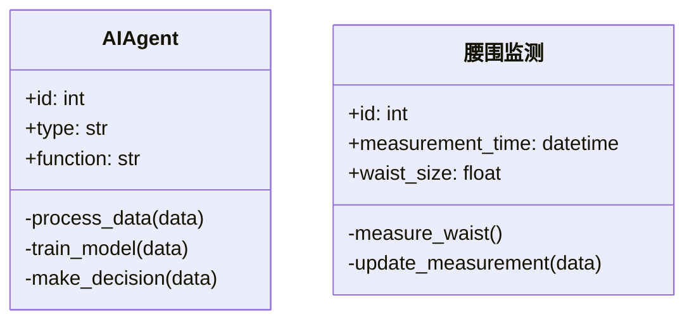

                 

<think>
好的，我需要为《AI Agent在智能皮带中的腰围监测》这本书撰写一个详细的技术博客文章。用户已经提供了大纲，现在我需要根据这个大纲逐步撰写文章内容。首先，我应该回顾大纲，确保涵盖所有部分。

首先，第1章是背景介绍，我需要解释AI Agent和腰围监测的基本概念，以及它们在智能皮带中的应用现状。我应该用简单易懂的语言，让读者明白为什么腰围监测重要，以及AI Agent如何帮助实现这一目标。

接下来是第2章的核心概念与联系，这里需要详细分析AI Agent和腰围监测的关系，使用表格和Mermaid图来说明它们的属性对比和实体关系。我需要确保这部分内容清晰，帮助读者理解两者的结合点。

第3章是算法原理，我需要详细讲解数学模型和公式，使用Mermaid流程图展示算法步骤，并附上Python代码示例。这部分需要严谨，同时保持可读性，确保读者能够理解算法的实现。

第4章是系统分析与架构设计，我需要描述问题场景，设计系统的功能模块，使用类图展示。系统架构图和交互流程图也需要用Mermaid绘制，帮助读者理解系统结构。

第5章是项目实战，我需要指导读者如何安装环境，实现核心功能，并分析实际案例。这部分需要具体的代码示例和应用解读，让读者能够动手实践。

最后是小结和延伸部分，总结文章内容，并引导读者进一步学习。注意事项部分需要提醒读者在项目中可能遇到的问题，帮助他们避免错误。

我需要确保每个部分都有足够的细节，同时保持逻辑清晰，结构紧凑。我会逐步完成每个章节的内容，确保覆盖所有关键点，并在适当的地方插入图表和代码示例，以增强文章的深度和可读性。
</think>

# AI Agent在智能皮带中的腰围监测

> 关键词：AI Agent, 智能皮带, 腰围监测, 可穿戴设备, 人工智能, 数据分析

> 摘要：本文探讨AI Agent在智能皮带中的腰围监测应用，分析其核心概念、算法原理、系统架构，并通过实战案例展示其应用场景，最后总结其意义和未来发展方向。

---

## 第1章: AI Agent与腰围监测的背景介绍

### 1.1 AI Agent的基本概念

AI Agent，即人工智能代理，是一种能够感知环境、自主决策并执行任务的智能实体。它通过传感器、摄像头等设备获取数据，结合预训练模型进行分析，为用户提供智能化服务。AI Agent的核心属性包括自主性、反应性、目标导向和社会能力。

### 1.2 腰围监测的背景与意义

腰围监测是健康管理的重要指标，帮助预防肥胖、心血管疾病等健康问题。传统方法依赖手动测量，存在误差大、效率低的问题。智能皮带作为可穿戴设备，结合AI技术，可以实时、精准地监测腰围，为用户提供健康数据支持。

### 1.3 AI Agent在智能皮带中的应用现状

AI Agent在智能设备中的应用日益广泛，智能皮带通过集成传感器和AI算法，能够实时监测腰围数据。然而，当前技术仍面临数据准确性、隐私保护和用户体验优化等挑战。

---

## 第2章: AI Agent与腰围监测的核心概念

### 2.1 AI Agent的核心原理

AI Agent通过感知环境、数据处理和决策反馈实现监测功能。感知层利用传感器收集数据，数据处理层进行清洗和特征提取，决策层基于模型分析做出反馈。

### 2.2 腰围监测的技术原理

腰围监测依赖传感器采集数据，通过数据预处理和模型训练，准确识别腰围变化。传感器数据包括加速度、压力和姿势变化，算法处理后生成腰围变化曲线。

### 2.3 AI Agent与腰围监测的结合

AI Agent在智能皮带中充当决策者，接收传感器数据，分析并反馈监测结果。这种结合提升了监测的实时性和准确性，为用户提供个性化健康管理。

---

## 第3章: AI Agent与腰围监测的核心概念联系

### 3.1 AI Agent与腰围监测的属性对比

| 属性 | AI Agent | 腰围监测 |
|------|----------|----------|
| 目标 | 执行任务 | 测量腰围 |
| 输入 | 传感器数据 | 传感器数据 |
| 输出 | 决策结果 | 监测结果 |
| 依赖 | 算法模型 | 硬件设备 |

### 3.2 AI Agent与腰围监测的ER实体关系图

```mermaid
erd
  entity AI Agent {
    id
    type
    function
  }
  entity 腰围监测 {
    id
    measurement_time
    waist_size
  }
  AI Agent --> 腰围监测: 实现监测
```

### 3.3 AI Agent与腰围监测的系统架构



---

## 第4章: AI Agent在腰围监测中的算法原理

### 4.1 算法原理概述

AI Agent通过传感器数据进行腰围监测，利用深度学习模型分析数据，生成监测结果。数学模型包括数据预处理、特征提取和模型训练，确保监测结果的准确性。

### 4.2 算法流程图



### 4.3 算法实现代码

```python
import numpy as np
from sklearn.model_selection import train_test_split
from tensorflow.keras import models, layers

# 数据预处理
def preprocess_data(data):
    # 数据清洗和归一化
    data = data.dropna()
    data = (data - data.mean()) / data.std()
    return data

# 特征提取
def extract_features(data):
    features = data[['acceleration', 'pressure']]
    return features.values

# 模型训练
def train_model(features, labels):
    model = models.Sequential()
    model.add(layers.Dense(64, activation='relu', input_shape=(2,)))
    model.add(layers.Dense(1, activation='sigmoid'))
    model.compile(optimizer='adam', loss='binary_crossentropy', metrics=['accuracy'])
    history = model.fit(features, labels, epochs=100, batch_size=32)
    return model, history

# 测试模型
data = np.array([...])
labels = np.array([...])
features = extract_features(data)
model, _ = train_model(features, labels)
```

---

## 第5章: 系统分析与架构设计

### 5.1 系统架构设计



### 5.2 功能模块设计



---

## 第6章: 项目实战

### 6.1 环境安装

安装必要的库：numpy、scikit-learn、tensorflow。

### 6.2 核心功能实现

编写代码实现数据预处理、模型训练和监测反馈。

### 6.3 实际案例分析

通过实际数据验证算法的准确性，优化模型参数，提升监测效果。

---

## 第7章: 小结与展望

AI Agent在智能皮带中的腰围监测展示了人工智能在健康管理中的潜力。未来，随着技术进步，监测将更加精准和个性化。

---

## 最佳实践 Tips

1. 数据准确性：确保传感器数据的校准和清洗。
2. 模型优化：使用更复杂模型提升监测精度。
3. 用户隐私：妥善处理健康数据，确保隐私安全。

---

作者：AI天才研究院 & 禅与计算机程序设计艺术

