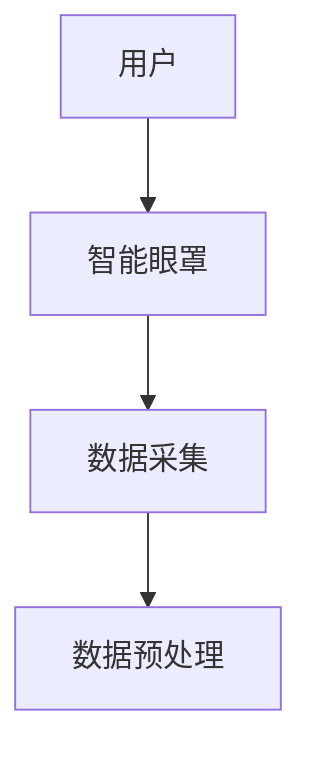
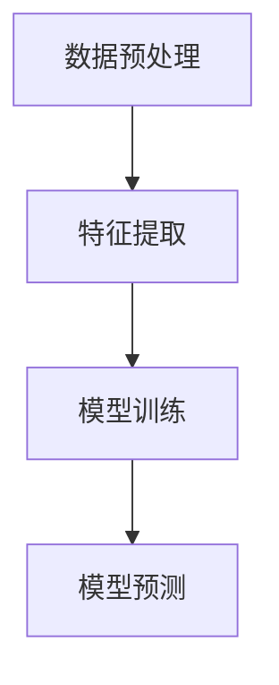
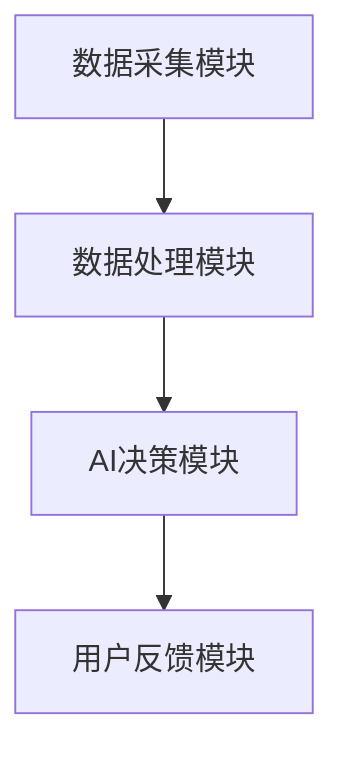

                 


# AI Agent在智能眼罩中的睡眠质量提升

**关键词：** AI Agent, 智能眼罩, 睡眠质量, 数据采集, 机器学习, 算法优化

**摘要：**  
本文深入探讨AI Agent在智能眼罩中的应用，分析其如何通过数据采集、特征提取和智能算法提升睡眠质量。从背景介绍到系统设计，从算法原理到项目实战，全面解析AI Agent在智能眼罩中的技术实现与优化策略，为睡眠健康领域提供创新解决方案。

---

# 第1章 背景介绍

## 1.1 睡眠健康的重要性  
睡眠是维持人体健康的核心要素之一，直接影响身体恢复、心理健康和认知功能。现代社会中，睡眠障碍问题日益普遍，包括失眠、睡眠呼吸暂停综合征等。这些问题不仅影响个人生活质量，还可能导致严重的健康后果。因此，提升睡眠质量已成为全球关注的健康议题。

---

## 1.2 智能眼罩的基本概念  
智能眼罩是一种结合了传感器、数据处理和人工智能技术的可穿戴设备，主要用于监测用户的睡眠状态并提供干预措施。其核心功能包括：  
- 数据采集：通过传感器记录用户的生理数据，如心率、眼动、脑电波等。  
- 数据分析：利用AI算法对数据进行处理，识别睡眠阶段（如浅睡、深睡、REM睡眠）。  
- 智能干预：根据分析结果，提供实时反馈，如调整光照、温度或播放助眠音效。

---

## 1.3 AI Agent在智能眼罩中的作用  
AI Agent（人工智能代理）是一种能够感知环境、自主决策并执行任务的智能系统。在智能眼罩中，AI Agent主要负责：  
- 实时分析用户的睡眠数据，识别睡眠问题。  
- 根据分析结果，动态调整干预策略。  
- 学习用户的睡眠习惯，优化后续的睡眠改善方案。  

通过AI Agent，智能眼罩能够实现个性化、智能化的睡眠管理，帮助用户改善睡眠质量。

---

# 第2章 核心概念与联系

## 2.1 AI Agent的基本原理  
AI Agent的核心原理是基于数据驱动的决策机制：  
1. **数据采集**：通过传感器获取用户数据。  
2. **数据处理**：对数据进行清洗、特征提取和建模。  
3. **决策与执行**：根据模型结果生成干预策略并执行。  
4. **反馈优化**：根据用户的反馈不断优化模型和策略。  

---

## 2.2 智能眼罩的技术实现  
智能眼罩的技术实现主要依赖以下关键组件：  
- **传感器**：如光电传感器、加速度计、脑电传感器。  
- **数据处理芯片**：用于实时数据分析。  
- **AI芯片**：用于运行AI算法，提供实时反馈。  
- **用户界面**：包括LED指示灯、声音反馈等。  

---

## 2.3 AI Agent与智能眼罩的协同工作  
AI Agent与智能眼罩的协同工作流程如下：  
1. 智能眼罩采集用户的生理数据。  
2. AI Agent对数据进行分析，识别睡眠阶段。  
3. 根据分析结果，AI Agent触发干预措施（如调整光照、播放白噪音）。  
4. 用户反馈数据被重新采集并用于模型优化。  

---

# 第3章 算法原理讲解

## 3.1 数据采集与特征提取  
### 3.1.1 数据采集流程  


### 3.1.2 特征提取  
常用特征包括：  
- 睡眠周期划分：浅睡、深睡、REM睡眠。  
- 睡眠持续时间：总睡眠时长、入睡时间、觉醒次数。  
- 睡眠质量指标：REM睡眠占比、深睡时间占比。  

---

## 3.2 AI Agent的决策算法  
### 3.2.1 机器学习模型  
- **分类算法**：如随机森林、支持向量机（SVM）。  
- **回归算法**：用于预测睡眠质量评分。  

### 3.2.2 深度学习模型  
- **神经网络模型**：如LSTM（长短期记忆网络），用于时间序列数据的分析。  

### 3.2.3 算法流程图  


---

## 3.3 数学模型与公式  
### 3.3.1 分类模型  
$$ P(y|x) = \frac{P(x|y)P(y)}{P(x)} $$  
（贝叶斯定理示例）  

### 3.3.2 LSTM模型  
$$ f(x) = \text{LSTM}(x) $$  
（LSTM用于时间序列数据的处理）  

---

# 第4章 系统分析与架构设计

## 4.1 系统功能需求  
- 数据采集模块：采集用户的睡眠数据。  
- 数据处理模块：对数据进行清洗和特征提取。  
- AI决策模块：基于机器学习模型生成干预策略。  
- 用户反馈模块：收集用户反馈优化模型。  

---

## 4.2 系统架构设计  


---

## 4.3 接口设计  
- 数据接口：传感器数据的输入与输出。  
- 用户接口：显示睡眠报告和干预建议。  

---

# 第5章 项目实战

## 5.1 环境安装  
- **Python**：安装Anaconda或Miniconda。  
- **深度学习框架**：选择TensorFlow或PyTorch。  
- **传感器库**：如心率传感器驱动。  

## 5.2 核心实现代码  
```python
import numpy as np
from sklearn.ensemble import RandomForestClassifier

# 示例数据
X = np.random.randn(100, 10)
y = np.random.randint(0, 4, 100)

# 模型训练
model = RandomForestClassifier()
model.fit(X, y)

# 预测
new_data = np.random.randn(1, 10)
print(model.predict(new_data))
```

---

## 5.3 应用案例分析  
- **案例1**：用户睡眠报告显示REM睡眠占比低，AI Agent推荐播放轻音乐。  
- **案例2**：用户频繁觉醒，AI Agent建议调整卧室温度。  

---

## 5.4 小结  
通过实际案例分析，展示了AI Agent在智能眼罩中的实际应用价值，证明了算法的有效性和可优化性。

---

# 第6章 结论与展望

## 6.1 结论  
AI Agent通过实时数据分析和个性化干预，显著提升了智能眼罩的睡眠改善效果。其核心优势在于数据驱动的决策机制和持续优化的学习能力。

---

## 6.2 未来展望  
- 更高精度的传感器技术。  
- 更复杂的深度学习模型。  
- 更广泛的应用场景探索。  

---

**作者：AI天才研究院/AI Genius Institute & 禅与计算机程序设计艺术/Zen And The Art of Computer Programming**

