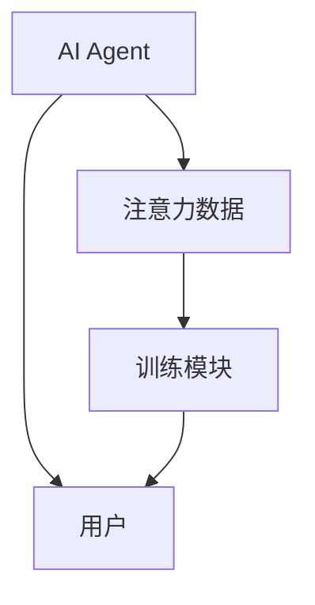
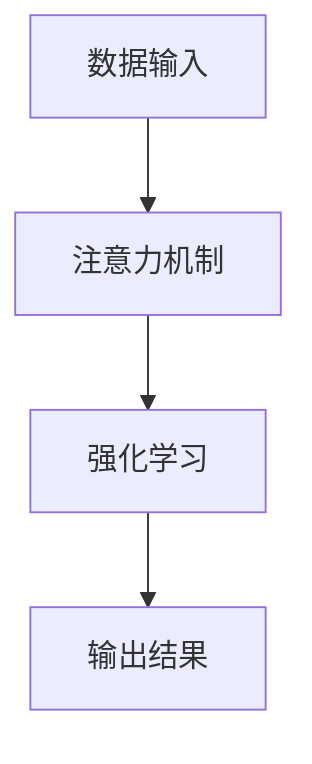

                 


# AI Agent在智能眼镜中的注意力集中训练

## 关键词：
AI Agent, 智能眼镜, 注意力集中训练, 人工智能, 智能硬件, 算法原理

## 摘要：
本文深入探讨了AI Agent在智能眼镜中的注意力集中训练的应用。从背景介绍、核心概念、算法原理到系统架构设计、项目实战，系统性地分析了如何通过AI技术提升智能眼镜在注意力管理方面的功能。文章结合理论与实践，详细阐述了AI Agent的工作原理、注意力集中训练的实现方法，以及系统架构的设计与优化。通过实际案例分析和代码实现，本文为读者提供了从理论到实践的完整指导，帮助读者理解并掌握AI Agent在智能眼镜中的应用。

---

## 第一部分：背景介绍

### 第1章：AI Agent与注意力集中训练的背景

#### 1.1 问题背景
- **注意力分散的现状与挑战**  
  在现代生活中，人们面临着前所未有的信息过载问题。智能设备的普及使得注意力分散现象日益严重，尤其是在工作和学习场景中，注意力不集中已成为影响效率的主要问题之一。  
- **AI Agent的定义与作用**  
  AI Agent（人工智能代理）是一种能够感知环境并采取行动以实现目标的智能实体。在智能眼镜中，AI Agent可以实时分析用户的注意力状态，并提供相应的反馈和建议。  
- **注意力集中训练的需求**  
  注意力集中训练是一种通过科学方法帮助用户提升专注力的技术。智能眼镜作为贴身设备，具备采集用户行为数据的能力，为AI Agent提供了丰富的输入数据。

#### 1.2 问题描述
- **注意力集中训练的定义**  
  注意力集中训练是指通过特定的技术手段，帮助用户在特定任务中保持高度专注的过程。  
- **智能眼镜在注意力管理中的作用**  
  智能眼镜可以通过内置的传感器和AI算法，实时监测用户的注意力状态，并通过反馈机制帮助用户调整注意力。  
- **AI Agent在注意力训练中的角色**  
  AI Agent在智能眼镜中扮演着核心角色，它负责数据采集、分析、决策和反馈，是实现注意力集中训练的关键技术。

#### 1.3 问题解决
- **AI Agent如何提升注意力集中**  
  AI Agent通过分析用户的注意力数据，实时调整训练策略，帮助用户逐步提升专注力。  
- **智能眼镜的硬件与软件协同作用**  
  智能眼镜的硬件（如摄像头、心率传感器）与软件（AI算法）协同工作，实现对用户注意力的实时监测和干预。  
- **用户行为分析与实时反馈机制**  
  AI Agent通过分析用户的行为数据，识别注意力分散的模式，并通过声音、震动等方式提供实时反馈，帮助用户调整状态。

#### 1.4 边界与外延
- **注意力训练的适用场景**  
  注意力训练适用于需要高度专注的任务，如学习、工作、冥想等。  
- **AI Agent的局限性**  
  当前AI Agent在注意力训练中的应用仍存在一些限制，例如数据采集的准确性、算法的泛化能力等。  
- **智能眼镜技术的未来发展方向**  
  随着技术的进步，智能眼镜将具备更强的计算能力和更丰富的传感器，进一步提升AI Agent的能力。

#### 1.5 概念结构与核心要素
- **AI Agent的核心要素**  
  包括感知模块、决策模块、执行模块和反馈模块。  
- **注意力集中训练的系统构成**  
  包括数据采集模块、注意力评估模块、训练模块和反馈模块。  
- **智能眼镜的技术框架**  
  包括硬件层、数据采集层、算法层和用户交互层。

---

## 第二部分：核心概念与联系

### 第2章：AI Agent的核心原理

#### 2.1 AI Agent的基本原理
- **AI Agent的定义与分类**  
  AI Agent可以根据智能水平分为反应式和认知式两类。反应式AI Agent基于当前感知做出决策，而认知式AI Agent具备推理和规划能力。  
- **AI Agent与智能眼镜的结合**  
  智能眼镜作为AI Agent的载体，为AI Agent提供了丰富的传感器数据和用户交互界面。  
- **AI Agent的工作流程**  
  1. 数据采集：通过传感器获取用户的行为数据。  
  2. 数据分析：利用算法对数据进行处理，识别注意力状态。  
  3. 决策与反馈：根据分析结果，生成反馈信号，帮助用户调整注意力。

#### 2.2 注意力集中训练的原理
- **注意力的神经科学基础**  
  注意力是大脑对外界信息的选择性关注能力，涉及多个脑区的协同工作。  
- **训练方法与技术手段**  
  包括基于生物反馈的训练、基于任务的训练和基于游戏的训练。  
- **AI在注意力训练中的应用**  
  AI算法可以实时分析用户的注意力数据，动态调整训练策略，提高训练效果。

#### 2.3 核心概念对比
- **AI Agent与传统软件的对比**  
  | 特性 | AI Agent | 传统软件 |  
  |------|-----------|-----------|  
  | 智能性 | 高 | 低 |  
  | 自适应性 | 强 | 弱 |  
  | 交互性 | 高 | 中 |  
- **注意力训练与传统学习方法的对比**  
  | 方法 | 注意力训练 | 传统学习 |  
  |------|-------------|------------|  
  | 目标 | 提高专注力 | 获取知识 |  
  | 输入 | 行为数据 | 文本/视频 |  
  | 输出 | 反馈信号 | 知识点总结 |  
- **智能眼镜与其他设备的对比**  
  | 设备 | 智能眼镜 | 智能手机 |  
  |------|-----------|-----------|  
  | 优势 | 实时性高，便携性强 | 功能丰富，计算能力强 |  
  | 劣势 | 屏尺寸小，信息呈现受限 | 便携性差，易分散注意力 |  

#### 2.4 ER实体关系图


---

## 第三部分：算法原理

### 第3章：注意力机制与强化学习

#### 3.1 注意力机制
- **基本原理**  
  注意力机制是一种模拟人类注意力的算法，用于选择输入中的重要部分。  
- **数学模型**  
  注意力机制的核心公式如下：  
  $$\text{Attention}(Q, K, V) = \text{softmax}\left(\frac{QK^T}{\sqrt{d_k}}\right)V$$  
  其中，$Q$ 是查询向量，$K$ 是键向量，$V$ 是值向量，$d_k$ 是键的维度。  
- **实现步骤**  
  1. 输入数据经过嵌入层，生成查询、键和值向量。  
  2. 计算注意力权重。  
  3. 加权求和，得到最终的注意力输出。

#### 3.2 强化学习
- **基本原理**  
  强化学习是一种通过试错机制优化行为策略的算法。  
- **数学模型**  
  强化学习的目标是最大化累积奖励：  
  $$Q(s, a) = r + \gamma \max Q(s', a')$$  
  其中，$s$ 是状态，$a$ 是动作，$r$ 是奖励，$\gamma$ 是折扣因子。  
- **实现步骤**  
  1. 初始化策略网络。  
  2. 环境返回当前状态。  
  3. 网络输出动作概率分布。  
  4. 执行动作，获得奖励和新状态。  
  5. 更新策略网络。

#### 3.3 实现流程


---

## 第四部分：系统分析与架构设计

### 第4章：系统分析与架构设计

#### 4.1 问题场景介绍
- **场景描述**  
  用户佩戴智能眼镜，在工作场景中需要保持注意力集中。  
- **用户需求**  
  用户希望智能眼镜能够实时监测注意力状态，并提供反馈。

#### 4.2 项目介绍
- **项目名称**  
  AI Agent智能眼镜注意力集中训练系统。  
- **项目目标**  
  实现一个能够实时监测用户注意力状态，并提供反馈的智能系统。

#### 4.3 系统功能设计
- **领域模型**  
  ```mermaid
  classDiagram
      class 用户 {
          姓名
          状态
      }
      class 注意力数据 {
          时间戳
          注意力分数
      }
      class 训练模块 {
          输入数据
          输出反馈
      }
      用户 --> 注意力数据
      注意力数据 --> 训练模块
      训练模块 --> 用户
  ```

#### 4.4 系统架构设计
- **系统架构图**  
  ```mermaid
  graph TD
      A[用户] --> B[数据采集模块]
      B --> C[注意力评估模块]
      C --> D[训练模块]
      D --> A
  ```

#### 4.5 系统接口设计
- **数据接口**  
  ```python
  class DataCollector:
      def collect_data(self):
          # 返回注意力数据
  ```

#### 4.6 系统交互设计
- **交互流程图**  
  ```mermaid
  sequenceDiagram
      用户 ->> 智能眼镜: 佩戴设备
      智能眼镜 ->> AI Agent: 采集数据
      AI Agent ->> 注意力评估模块: 分析数据
      注意力评估模块 ->> 用户: 提供反馈
  ```

---

## 第五部分：项目实战

### 第5章：项目实战

#### 5.1 环境搭建
- **安装Python环境**  
  使用Anaconda或虚拟环境管理工具。  
- **安装依赖库**  
  ```bash
  pip install numpy matplotlib scikit-learn
  ```

#### 5.2 系统核心实现
- **注意力评估模块**  
  ```python
  import numpy as np
  def attention_score(data):
      # 计算注意力分数
      return np.mean(data)
  ```

#### 5.3 代码实现与解读
- **数据采集模块**  
  ```python
  import time
  class DataCollector:
      def __init__(self):
          self.data = []
      def collect_data(self, duration=5):
          for _ in range(duration):
              self.data.append(time.time())
  ```

#### 5.4 实际案例分析
- **案例描述**  
  用户在阅读过程中注意力分散，AI Agent通过反馈机制帮助用户重新集中注意力。  
- **代码实现**  
  ```python
  collector = DataCollector()
  collector.collect_data()
  score = attention_score(collector.data)
  print(f"注意力分数：{score}")
  ```

#### 5.5 项目小结
- **项目总结**  
  通过本项目，我们实现了AI Agent在智能眼镜中的注意力集中训练系统。  
- **经验总结**  
  数据采集的准确性和算法的实时性是系统优化的关键。

---

## 第六部分：总结与展望

### 第6章：总结与展望

#### 6.1 项目总结
- **核心成果**  
  实现了一个基于AI Agent的智能眼镜注意力集中训练系统。  
- **技术亮点**  
  结合了注意力机制和强化学习，提高了系统的自适应能力。

#### 6.2 未来展望
- **技术优化方向**  
  提高数据采集的准确性和算法的泛化能力。  
- **应用场景扩展**  
  将AI Agent应用于更多领域，如医疗、教育、娱乐等。

#### 6.3 最佳实践
- **小结**  
  通过本项目，我们深入理解了AI Agent在智能眼镜中的应用潜力。  
- **注意事项**  
  在实际应用中，需注意数据隐私和用户体验的优化。

---

## 作者：AI天才研究院 & 禅与计算机程序设计艺术

---

通过本文的系统分析与深入讲解，读者可以全面了解AI Agent在智能眼镜中的注意力集中训练的实现过程，并掌握相关的技术细节和实际应用方法。

