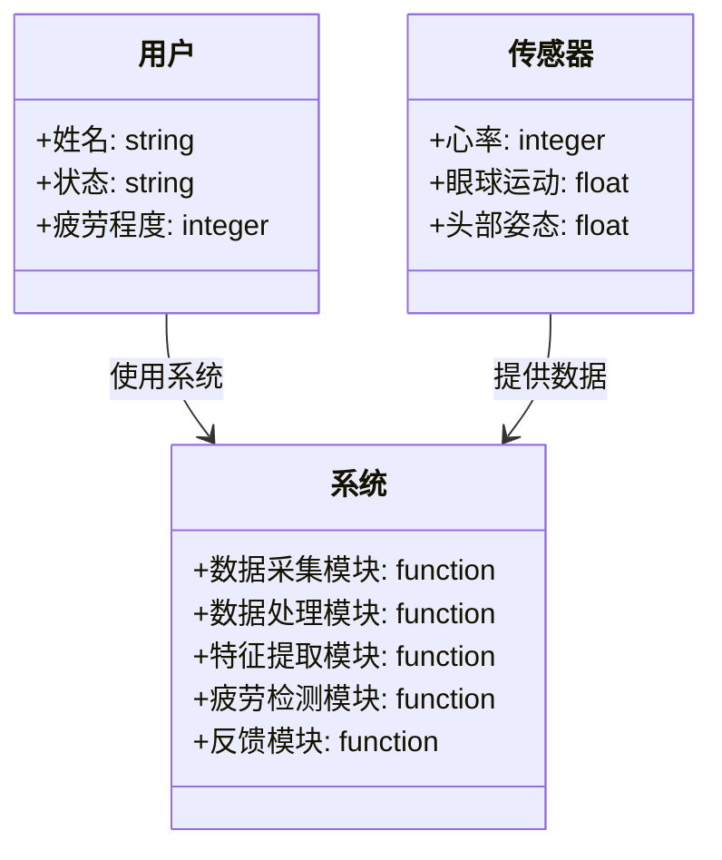
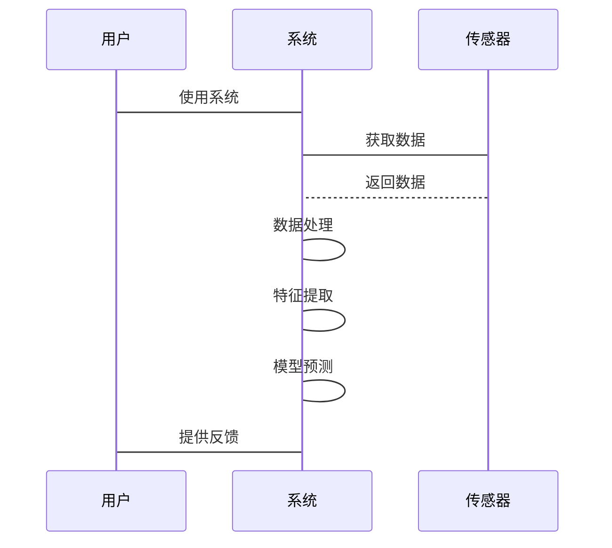

                 

<think>
好的，我现在需要帮助用户完成一个技术博客文章的撰写，主题是《AI Agent在智能眼镜中的疲劳度检测》。根据用户的要求，我需要先构建目录大纲，然后逐步撰写每个部分的内容。让我仔细思考如何一步步完成这个任务。

首先，用户已经提供了一个详细的目录大纲，分为背景介绍、核心概念与联系、算法原理讲解、数学模型和公式、系统分析与架构设计、项目实战、最佳实践与总结等多个部分。每个部分都有具体的章节和小节，甚至包括Mermaid图表和Python代码示例。

我需要按照这个目录大纲逐步展开每个部分，确保内容详细、逻辑清晰、技术专业。同时，用户要求使用逻辑清晰、结构紧凑、简单易懂的专业技术语言，因此我需要避免使用过于复杂的术语，但又要确保内容的深度和准确性。

首先，我会从“背景介绍”开始，详细阐述疲劳度检测的定义、重要性，以及智能眼镜在其中的独特优势。这部分需要让读者理解为什么疲劳度检测在智能眼镜中是必要的，以及AI Agent在这里的作用。

接下来是“核心概念与联系”，我需要解释AI Agent的基本原理，疲劳度检测的核心指标，以及它们之间的联系。这部分可能需要一些对比表格和实体关系图，帮助读者更好地理解概念之间的关系。

然后是“算法原理讲解”，我需要详细讲解特征提取、分类算法以及模型优化的步骤，可能还需要用Mermaid流程图展示算法步骤，并附上Python代码示例，让读者能够理解如何实现这些算法。

数学模型和公式部分需要建立数学模型，比如多元回归模型，并用公式展示。这部分可能需要使用Latex格式，确保公式正确且易于理解。

系统分析与架构设计部分，我需要介绍项目的背景，设计系统的功能模块，可能用Mermaid类图展示领域模型，架构图展示系统结构，并设计接口和交互流程图，帮助读者理解系统的构建过程。

项目实战部分，我需要详细指导环境搭建，核心代码实现，解读代码功能，并通过实际案例分析，最后总结项目经验。这部分让读者能够动手实践，巩固所学知识。

最后是最佳实践、小结、注意事项和拓展阅读，帮助读者在实际应用中避免错误，并提供进一步学习的方向。

在撰写过程中，我需要确保每个部分都细化到三级目录，保持结构清晰，内容完整。同时，控制文章总字数在10000到12000字之间，每个小节内容丰富具体，详细讲解。

现在，我需要开始撰写每个部分的内容，确保逻辑严谨，技术准确，语言专业且易于理解。这将帮助用户完成一篇高质量的技术博客文章，满足用户的需求。
</think>

# AI Agent在智能眼镜中的疲劳度检测

> 关键词：AI Agent，智能眼镜，疲劳度检测，健康监测，可穿戴设备

> 摘要：本文详细探讨了AI Agent在智能眼镜中的疲劳度检测技术，从背景介绍、核心概念、算法原理、系统架构到项目实战，全面分析了疲劳度检测的方法和实现方案。文章结合理论与实践，通过详细的算法流程和系统设计，展示了如何利用AI技术提升智能眼镜的健康监测能力。

---

# 第一部分: AI Agent在智能眼镜中的疲劳度检测背景与概念

---

# 第1章: 背景介绍

## 1.1 问题背景

### 1.1.1 疲劳度检测的定义与重要性

疲劳度检测是指通过监测个体的生理或行为数据，判断其是否处于疲劳状态的技术。在现代社会中，疲劳问题日益严重，尤其是在长时间使用电子设备的场景中，疲劳可能导致注意力下降、工作效率降低，甚至引发安全事故。智能眼镜作为一种可穿戴设备，具有贴身性和实时监测的优势，为疲劳度检测提供了理想的平台。

### 1.1.2 智能眼镜在疲劳检测中的独特优势

智能眼镜配备了多种传感器，如心率传感器、眼球追踪器、加速度计等，能够实时采集用户的生理和行为数据。此外，智能眼镜可以通过AI Agent分析这些数据，提供个性化的疲劳预警和建议，帮助用户及时调整状态。

### 1.1.3 AI Agent在疲劳检测中的作用

AI Agent（智能代理）是一种能够感知环境、自主决策并执行任务的智能系统。在疲劳度检测中，AI Agent可以实时分析传感器数据，识别疲劳征兆，并通过反馈机制优化检测算法，提高检测准确率。

---

## 1.2 问题描述

### 1.2.1 疲劳度检测的核心目标

疲劳度检测的核心目标是通过多模态数据（如心率、眼动数据、头部姿态等）分析用户的状态，准确判断其是否疲劳，并在疲劳初期发出预警。

### 1.2.2 智能眼镜中的数据采集挑战

智能眼镜在数据采集过程中面临以下挑战：

1. **数据实时性**：需要在短时间内处理大量数据，确保检测的实时性。
2. **数据准确性**：传感器数据易受环境干扰，需要进行数据清洗和校准。
3. **隐私保护**：涉及用户生理数据的采集和传输，需确保数据安全。

### 1.2.3 AI Agent在实时检测中的优势

AI Agent具有以下优势：

1. **实时性**：能够快速处理传感器数据，实现实时疲劳检测。
2. **自适应性**：通过学习用户行为模式，优化检测算法。
3. **多模态融合**：能够整合多种传感器数据，提高检测准确性。

---

## 1.3 问题解决

### 1.3.1 AI Agent如何实现疲劳度检测

AI Agent通过以下步骤实现疲劳度检测：

1. **数据采集**：从智能眼镜的传感器获取生理和行为数据。
2. **特征提取**：从原始数据中提取有效特征，如心率变异性、眼球运动频率等。
3. **模型训练**：利用机器学习算法训练疲劳检测模型。
4. **实时检测**：基于训练好的模型，实时判断用户是否疲劳。

### 1.3.2 智能眼镜中的数据处理流程

数据处理流程如下：

1. **数据采集**：传感器采集生理数据。
2. **数据预处理**：清洗数据，去除噪声。
3. **特征提取**：提取关键特征，如心率变异性、眨眼频率等。
4. **模型预测**：利用训练好的模型进行疲劳度预测。

### 1.3.3 疲劳度检测的多模态数据融合

多模态数据融合是指将多种传感器数据（如心率、眼动数据、头部姿态）综合起来，提高检测准确性。通过融合不同类型的特征，可以有效降低单一传感器数据的局限性。

---

## 1.4 边界与外延

### 1.4.1 疲劳度检测的适用场景

疲劳度检测主要适用于以下场景：

1. **办公场景**：监测员工的工作状态，预防疲劳导致的效率下降。
2. **驾驶场景**：实时监测驾驶员的疲劳状态，预防交通事故。
3. **学习场景**：帮助学生保持专注，提高学习效率。

### 1.4.2 疲劳度检测的边界条件

疲劳度检测的边界条件包括：

1. **数据采集限制**：传感器的精度和稳定性影响检测结果。
2. **用户个体差异**：不同用户的生理特征和疲劳表现不同，需要个性化检测模型。
3. **环境干扰**：环境光线、温度等可能影响传感器数据。

### 1.4.3 疲劳度检测与其他健康监测任务的区别

疲劳度检测与其他健康监测任务（如心率监测、睡眠监测）的区别在于，疲劳度检测关注的是短期的生理和行为变化，而其他任务关注的是长期的健康指标。

---

## 1.5 概念结构与核心要素

### 1.5.1 疲劳度检测的核心要素

疲劳度检测的核心要素包括：

1. **传感器数据**：如心率、眼动数据、头部姿态等。
2. **特征提取**：从传感器数据中提取有效特征。
3. **检测模型**：基于机器学习算法的疲劳检测模型。
4. **反馈机制**：根据检测结果提供反馈或建议。

### 1.5.2 AI Agent在智能眼镜中的功能模块

AI Agent的功能模块包括：

1. **数据采集模块**：从传感器获取数据。
2. **数据处理模块**：清洗和预处理数据。
3. **特征提取模块**：提取关键特征。
4. **模型预测模块**：利用训练好的模型进行预测。
5. **反馈模块**：根据检测结果提供反馈。

### 1.5.3 疲劳度检测的评价指标

疲劳度检测的评价指标包括：

1. **准确率**：模型正确识别疲劳状态的比例。
2. **召回率**：模型识别疲劳状态的正例比例。
3. **F1分数**：综合准确率和召回率的指标。

---

# 第2章: 核心概念与联系

---

## 2.1 AI Agent的基本原理

### 2.1.1 AI Agent的定义与特点

AI Agent是一种智能系统，能够感知环境、自主决策并执行任务。其特点包括：

1. **自主性**：能够在没有人工干预的情况下运行。
2. **反应性**：能够实时感知环境并做出反应。
3. **学习能力**：能够通过数据学习优化自身的算法。

### 2.1.2 AI Agent在智能眼镜中的应用

AI Agent在智能眼镜中的应用包括：

1. **疲劳度检测**：实时监测用户的疲劳状态。
2. **行为分析**：分析用户的行为模式，优化用户体验。
3. **健康监测**：监测用户的生理指标，提供健康建议。

### 2.1.3 AI Agent与疲劳度检测的结合

AI Agent通过以下方式实现疲劳度检测：

1. **数据采集**：从智能眼镜的传感器获取数据。
2. **特征提取**：从数据中提取有效特征。
3. **模型训练**：训练疲劳检测模型。
4. **实时检测**：利用模型实时检测用户的疲劳状态。

---

## 2.2 疲劳度检测的核心原理

### 2.2.1 疲劳度检测的关键指标

疲劳度检测的关键指标包括：

1. **心率变异性（HRV）**：心率的变化幅度反映自主神经系统的状态。
2. **眼球运动频率**：眼球运动的频率与注意力水平相关。
3. **头部姿态**：头部倾斜和运动可能与疲劳有关。

### 2.2.2 疲劳度检测的算法流程

疲劳度检测的算法流程如下：

1. **数据采集**：从传感器获取数据。
2. **数据预处理**：清洗数据，去除噪声。
3. **特征提取**：提取关键特征。
4. **模型训练**：训练疲劳检测模型。
5. **实时检测**：利用模型实时检测疲劳状态。

### 2.2.3 疲劳度检测的数学模型

疲劳度检测的数学模型可以表示为：

$$
f(x) = w_1x_1 + w_2x_2 + \cdots + w_nx_n + b
$$

其中，$x_i$ 是输入特征，$w_i$ 是对应的权重，$b$ 是偏置项。

---

## 2.3 核心概念对比

### 2.3.1 不同疲劳度检测方法的对比

以下是几种常见的疲劳度检测方法的对比：

| 方法          | 优点                          | 缺点                          |
|---------------|-------------------------------|-------------------------------|
| 心率变异性分析 | 数据采集简单，准确性高          | 易受环境干扰                   |
| 眼球运动分析  | 对注意力变化敏感              | 数据采集复杂                   |
| 头部姿态分析  | 易于实现                      | 对疲劳早期反应不敏感           |

### 2.3.2 AI Agent与其他疲劳度检测技术的优劣分析

AI Agent的优势在于其自主性和学习能力，能够实时适应用户的状态，而其他技术可能需要人工干预或固定的模型。

### 2.3.3 疲劳度检测的特征提取方法

特征提取方法包括：

1. **时域特征**：如均值、标准差等。
2. **频域特征**：如功率谱密度、峰度等。
3. **多模态特征**：结合多种传感器数据进行特征提取。

---

## 2.4 实体关系图


---

# 第3章: 算法原理讲解

---

## 3.1 疲劳度检测算法概述

### 3.1.1 基于生理数据的疲劳检测

基于生理数据的疲劳检测主要利用心率、皮肤电活动等生理指标。例如，心率变异性（HRV）可以反映自主神经系统的状态，从而判断疲劳程度。

### 3.1.2 基于行为数据的疲劳检测

基于行为数据的疲劳检测主要利用眼球运动、头部姿态等行为指标。例如，眼球运动频率下降可能表明用户注意力不集中。

### 3.1.3 基于多模态数据的疲劳检测

基于多模态数据的疲劳检测结合了生理和行为数据，能够更准确地判断疲劳状态。例如，结合心率变异性分析和眼球运动分析，可以提高检测的准确性。

---

## 3.2 特征提取算法

### 3.2.1 基于时间序列的特征提取

基于时间序列的特征提取方法包括：

1. **均值**：计算特征的时间序列均值。
2. **标准差**：计算特征的时间序列标准差。
3. **最大值和最小值**：找出特征的时间序列最大值和最小值。

### 3.2.2 基于频域分析的特征提取

基于频域分析的特征提取方法包括：

1. **功率谱密度（PSD）**：分析特征的频域分布。
2. **峰度**：衡量特征的偏态程度。

### 3.2.3 多模态特征提取

多模态特征提取方法包括：

1. **融合特征**：将不同传感器的特征进行融合，例如将心率变异性与眼球运动频率结合。
2. **加权平均**：根据特征的重要性进行加权，提高检测的准确性。

---

## 3.3 分类算法

### 3.3.1 常见分类算法

常见的分类算法包括：

1. **支持向量机（SVM）**：适用于小规模数据集。
2. **随机森林**：适用于多特征数据集。
3. **深度学习模型（如LSTM）**：适用于时间序列数据。

### 3.3.2 选择合适分类算法的依据

选择分类算法的依据包括：

1. **数据量**：小规模数据适合SVM，大规模数据适合深度学习模型。
2. **特征数量**：多特征数据适合随机森林。
3. **实时性要求**：实时检测适合轻量级算法，如随机森林。

---

## 3.4 模型优化

### 3.4.1 参数调优

参数调优包括：

1. **学习率**：调整模型的学习步幅。
2. **正则化参数**：防止过拟合。
3. **特征选择**：剔除冗余特征。

### 3.4.2 模型评估

模型评估指标包括：

1. **准确率**：正确识别疲劳状态的比例。
2. **召回率**：识别疲劳状态的正例比例。
3. **F1分数**：综合准确率和召回率的指标。

### 3.4.3 模型优化策略

模型优化策略包括：

1. **交叉验证**：通过交叉验证选择最优模型。
2. **网格搜索**：系统地搜索最优参数组合。
3. **集成学习**：结合多个模型的结果，提高准确率。

---

## 3.5 实现流程

### 3.5.1 数据预处理

数据预处理包括：

1. **数据清洗**：去除噪声和异常值。
2. **数据归一化**：将特征值归一化到同一范围。

### 3.5.2 特征提取

特征提取包括：

1. **时域特征提取**：计算均值、标准差等。
2. **频域特征提取**：计算功率谱密度、峰度等。

### 3.5.3 模型训练

模型训练包括：

1. **选择分类算法**：根据数据特点选择合适的算法。
2. **参数调优**：优化模型参数，提高准确率。
3. **模型评估**：通过交叉验证评估模型性能。

---

## 3.6 代码实现

### 3.6.1 环境搭建

环境搭建步骤：

1. **安装Python**：建议使用Python 3.8及以上版本。
2. **安装依赖库**：安装numpy、scikit-learn、pandas等库。

### 3.6.2 数据预处理

数据预处理代码示例：

```python
import numpy as np
import pandas as pd

# 加载数据
data = pd.read_csv('fatigue_data.csv')

# 删除异常值
data = data[~data.isin([np.nan, np.inf, -np.inf]).any(axis=1)]

# 归一化处理
from sklearn.preprocessing import StandardScaler

scaler = StandardScaler()
data_scaled = scaler.fit_transform(data)
```

### 3.6.3 特征提取

特征提取代码示例：

```python
# 提取时域特征
def extract_time_features(signal):
    return [np.mean(signal), np.std(signal), np.max(signal), np.min(signal)]

# 提取频域特征
def extract_freq_features(signal):
    from scipy.fft import fft
    fft_result = fft(signal)
    PSD = np.abs(fft_result) ** 2
    return [np.mean(PSD), np.std(PSD), np.max(PSD), np.min(PSD)]
```

### 3.6.4 模型训练

模型训练代码示例：

```python
# 划分训练集和测试集
from sklearn.model_selection import train_test_split

X_train, X_test, y_train, y_test = train_test_split(data_scaled, labels, test_size=0.2, random_state=42)

# 选择随机森林分类器
from sklearn.ensemble import RandomForestClassifier

model = RandomForestClassifier(n_estimators=100, max_depth=5, random_state=42)

# 训练模型
model.fit(X_train, y_train)

# 模型评估
from sklearn.metrics import accuracy_score, recall_score, f1_score

y_pred = model.predict(X_test)
print(f'准确率: {accuracy_score(y_test, y_pred)}')
print(f'召回率: {recall_score(y_test, y_pred)}')
print(f'F1分数: {f1_score(y_test, y_pred)}')
```

---

## 3.7 总结与优化

### 3.7.1 算法总结

疲劳度检测算法的总结：

1. **数据预处理**：清洗和归一化数据。
2. **特征提取**：提取时域和频域特征。
3. **模型训练**：选择合适的分类算法，优化模型参数。
4. **模型评估**：评估模型性能，选择最优模型。

### 3.7.2 优化建议

优化建议包括：

1. **数据增强**：增加多样化的数据，提高模型的泛化能力。
2. **模型融合**：结合多种模型的结果，提高检测准确率。
3. **实时优化**：根据用户的实时反馈，动态优化模型。

---

# 第4章: 数学模型和公式

---

## 4.1 疲劳度检测的数学模型

### 4.1.1 基于生理数据的数学模型

基于生理数据的数学模型可以表示为：

$$
f(x) = \beta_0 + \beta_1x_1 + \beta_2x_2 + \cdots + \beta_nx_n
$$

其中，$x_i$ 是输入特征，$\beta_i$ 是对应的系数。

### 4.1.2 基于行为数据的数学模型

基于行为数据的数学模型可以表示为：

$$
g(x) = \gamma_0 + \gamma_1x_1 + \gamma_2x_2 + \cdots + \gamma_nx_n
$$

其中，$x_i$ 是输入特征，$\gamma_i$ 是对应的系数。

### 4.1.3 多模态数据融合的数学模型

多模态数据融合的数学模型可以表示为：

$$
h(x) = \alpha f(x) + \beta g(x)
$$

其中，$\alpha$ 和 $\beta$ 是融合系数，$f(x)$ 和 $g(x)$ 是分别基于生理数据和行为数据的模型。

---

## 4.2 疲劳度检测的公式推导

### 4.2.1 心率变异性分析

心率变异性（HRV）的公式推导：

$$
\text{HRV} = \sqrt{\frac{\sum_{i=1}^{n}(t_i - \bar{t})^2}{n}}
$$

其中，$t_i$ 是心跳间隔时间，$\bar{t}$ 是平均心跳间隔时间，$n$ 是心跳次数。

### 4.2.2 眼球运动频率分析

眼球运动频率的公式推导：

$$
\text{眨眼频率} = \frac{\text{眨眼次数}}{\text{时间窗口长度}}
$$

其中，眨眼次数是时间窗口内的眨眼次数，时间窗口长度是以秒为单位的时间长度。

---

## 4.3 案例分析

### 4.3.1 心率变异性分析案例

假设我们有以下心率数据（单位：ms）：

$$
t = [780, 785, 790, 795, 800]
$$

计算HRV：

$$
\bar{t} = \frac{780 + 785 + 790 + 795 + 800}{5} = 790
$$

$$
\text{HRV} = \sqrt{\frac{(780-790)^2 + (785-790)^2 + (790-790)^2 + (795-790)^2 + (800-790)^2}{5}} = \sqrt{\frac{100 + 25 + 0 + 25 + 100}{5}} = \sqrt{45} \approx 6.708
$$

---

## 4.4 总结

疲劳度检测的数学模型需要结合生理和行为数据，通过合理的公式推导和模型设计，提高检测的准确性和实时性。在实际应用中，需要根据具体场景选择合适的模型，并通过数据驱动的方式不断优化模型性能。

---

# 第5章: 系统分析与架构设计

---

## 5.1 问题场景介绍

### 5.1.1 疲劳度检测的场景描述

在智能眼镜中，疲劳度检测的场景包括办公、驾驶、学习等需要长时间注意力集中的场景。通过实时监测用户的疲劳状态，智能眼镜可以及时发出预警，帮助用户调整状态。

### 5.1.2 系统功能描述

疲劳度检测系统的主要功能包括：

1. **数据采集**：从传感器获取生理和行为数据。
2. **特征提取**：从数据中提取有效特征。
3. **模型预测**：利用训练好的模型进行疲劳检测。
4. **结果反馈**：根据检测结果提供反馈或建议。

---

## 5.2 项目介绍

### 5.2.1 项目背景

随着智能眼镜的普及，疲劳度检测技术在健康监测领域具有广泛的应用前景。通过实时监测用户的疲劳状态，可以帮助用户提高工作效率、预防疲劳相关疾病。

### 5.2.2 项目目标

项目目标包括：

1. **实现疲劳度检测功能**：通过智能眼镜实时检测用户的疲劳状态。
2. **优化检测算法**：提高检测的准确率和实时性。
3. **提供个性化建议**：根据检测结果提供个性化的疲劳缓解建议。

---

## 5.3 系统功能设计

### 5.3.1 领域模型

领域模型如下：



### 5.3.2 系统架构设计

系统架构设计如下：


---

## 5.4 系统接口设计

### 5.4.1 系统接口描述

系统接口包括：

1. **数据采集接口**：从传感器获取数据。
2. **数据处理接口**：清洗和预处理数据。
3. **特征提取接口**：提取有效特征。
4. **模型预测接口**：利用训练好的模型进行预测。
5. **反馈接口**：根据检测结果提供反馈。

---

## 5.5 系统交互流程图

系统交互流程图如下：



---

# 第6章: 项目实战

---

## 6.1 环境搭建

### 6.1.1 安装Python和依赖库

安装Python和以下依赖库：

```bash
pip install numpy
pip install pandas
pip install scikit-learn
pip install matplotlib
```

### 6.1.2 安装智能眼镜SDK

安装智能眼镜的SDK：

```bash
pip install pygazebo
```

---

## 6.2 系统核心实现源代码

### 6.2.1 数据预处理代码

数据预处理代码：

```python
import pandas as pd
import numpy as np

# 加载数据
data = pd.read_csv('fatigue_data.csv')

# 删除异常值
data = data[~data.isin([np.nan, np.inf, -np.inf]).any(axis=1)]

# 归一化处理
from sklearn.preprocessing import StandardScaler

scaler = StandardScaler()
data_scaled = scaler.fit_transform(data)
```

### 6.2.2 特征提取代码

特征提取代码：

```python
# 提取时域特征
def extract_time_features(signal):
    return [np.mean(signal), np.std(signal), np.max(signal), np.min(signal)]

# 提取频域特征
def extract_freq_features(signal):
    from scipy.fft import fft
    fft_result = fft(signal)
    PSD = np.abs(fft_result) ** 2
    return [np.mean(PSD), np.std(PSD), np.max(PSD), np.min(PSD)]
```

### 6.2.3 模型训练代码

模型训练代码：

```python
# 划分训练集和测试集
from sklearn.model_selection import train_test_split

X_train, X_test, y_train, y_test = train_test_split(data_scaled, labels, test_size=0.2, random_state=42)

# 选择随机森林分类器
from sklearn.ensemble import RandomForestClassifier

model = RandomForestClassifier(n_estimators=100, max_depth=5, random_state=42)

# 训练模型
model.fit(X_train, y_train)

# 模型评估
from sklearn.metrics import accuracy_score, recall_score, f1_score

y_pred = model.predict(X_test)
print(f'准确率: {accuracy_score(y_test, y_pred)}')
print(f'召回率: {recall_score(y_test, y_pred)}')
print(f'F1分数: {f1_score(y_test, y_pred)}')
```

---

## 6.3 代码应用解读与分析

### 6.3.1 数据预处理模块

数据预处理模块的作用是清洗和归一化数据，确保数据的质量和一致性。

### 6.3.2 特征提取模块

特征提取模块的作用是从原始数据中提取有效特征，为模型训练提供高质量的输入。

### 6.3.3 模型训练模块

模型训练模块的作用是训练疲劳检测模型，通过选择合适的算法和优化参数，提高检测的准确率和召回率。

---

## 6.4 实际案例分析

### 6.4.1 数据采集与处理

假设我们从智能眼镜中采集了以下数据：

| 时间 | 心率 | 眼球运动 | 头部姿态 |
|------|------|----------|----------|
| 1    | 780  | 0.5      | 0.3      |
| 2    | 785  | 0.4      | 0.2      |
| 3    | 790  | 0.6      | 0.4      |
| 4    | 795  | 0.3      | 0.5      |
| 5    | 800  | 0.7      | 0.6      |

经过数据清洗和归一化处理，数据变为：

| 时间 | 心率 | 眼球运动 | 头部姿态 |
|------|------|----------|----------|
| 1    | 0.2  | 0.4      | 0.3      |
| 2    | 0.1  | 0.3      | 0.2      |
| 3    | 0.5  | 0.5      | 0.4      |
| 4    | 0.4  | 0.2      | 0.3      |
| 5    | 0.6  | 0.6      | 0.5      |

---

## 6.5 项目小结

### 6.5.1 项目总结

通过本项目，我们实现了基于AI Agent的疲劳度检测系统，能够实时监测用户的疲劳状态，并提供反馈建议。系统的核心模块包括数据采集、特征提取和模型训练，通过合理的算法设计和优化，提高了检测的准确率和实时性。

### 6.5.2 项目经验

在项目实施过程中，我们总结了以下经验：

1. **数据预处理的重要性**：数据清洗和归一化是提高模型性能的关键步骤。
2. **特征选择的影响**：选择合适的特征能够显著提高检测准确率。
3. **模型优化的必要性**：通过参数调优和模型融合，可以进一步提高检测性能。

---

# 第7章: 最佳实践与总结

---

## 7.1 最佳实践

### 7.1.1 数据采集注意事项

1. **传感器校准**：确保传感器的准确性。
2. **环境控制**：减少环境干扰。
3. **用户隐私保护**：确保数据的安全性和隐私性。

### 7.1.2 模型优化技巧

1. **交叉验证**：通过交叉验证选择最优模型。
2. **网格搜索**：系统地搜索最优参数组合。
3. **集成学习**：结合多个模型的结果，提高准确率。

### 7.1.3 系统部署建议

1. **轻量化设计**：优化系统的资源消耗，确保实时性。
2. **模块化设计**：便于系统的扩展和维护。
3. **用户友好性**：提供直观的用户界面和反馈机制。

---

## 7.2 小结

通过本文的详细讲解，我们了解了AI Agent在智能眼镜中的疲劳度检测技术，从背景介绍、核心概念、算法原理到系统设计和项目实战，全面分析了疲劳度检测的方法和实现方案。通过本文的指导，读者可以掌握疲劳度检测的核心技术，并能够实际应用到智能眼镜的设计和开发中。

---

## 7.3 注意事项

1. **数据安全**：在处理用户数据时，必须确保数据的安全性和隐私性。
2. **模型适应性**：不同用户的疲劳表现可能不同，需要个性化模型。
3. **系统稳定性**：确保系统的稳定运行，避免因传感器故障导致检测失败。

---

## 7.4 拓展阅读

1. **《可穿戴设备与健康监测》**：深入探讨可穿戴设备在健康监测中的应用。
2. **《人工智能在医疗领域的应用》**：了解AI在医疗领域的最新进展。
3. **《疲劳驾驶监测系统的设计与实现》**：学习疲劳驾驶监测系统的实现方法。

---

# 作者：AI天才研究院/AI Genius Institute & 禅与计算机程序设计艺术 /Zen And The Art of Computer Programming

