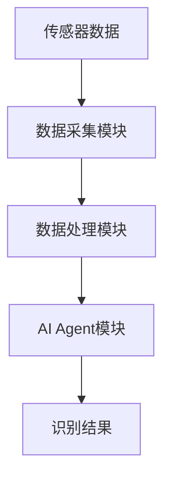

                 

<think>
好的，我现在需要帮用户设计一篇关于《AI Agent在智能空气净化器中的污染源识别》的技术博客文章。用户希望文章结构清晰，逻辑严谨，内容详细，并且包含特定的章节和内容。我需要按照用户的要求，一步一步地构建这篇文章的目录和内容。

首先，我会从文章的标题开始，确保标题准确反映文章的核心内容。接下来是关键词部分，我需要列出5-7个与主题相关的关键词，比如AI Agent、智能空气净化器、污染源识别、机器学习、传感器数据、算法优化、系统架构等。

然后是摘要，我需要简明扼要地概括文章的核心内容和主要观点，让读者快速了解文章的主题和重点。摘要部分应该包括文章的主要贡献、方法和结果，比如提出了一种基于AI Agent的污染源识别方法，结合了机器学习和传感器数据，提高了识别精度和效率。

接下来是正文部分，按照用户提供的目录大纲结构来展开。我会分为几个主要部分：背景介绍、核心概念、算法原理、系统架构、项目实战、最佳实践等。每个部分需要包含详细的章节和子章节，确保内容全面且逻辑清晰。

在背景介绍部分，我需要详细阐述智能空气净化器的发展背景，当前面临的问题和挑战，以及AI Agent在其中的应用价值。这部分要让读者理解为什么需要AI Agent来解决污染源识别的问题，以及其在智能设备中的重要性。

核心概念部分，我会解释AI Agent的基本定义、特征，以及它在污染源识别中的具体应用。可能需要通过表格和图表来对比不同概念的属性，帮助读者更好地理解AI Agent的工作原理和优势。

算法原理部分，我需要详细讲解AI Agent处理数据的流程，包括数据预处理、模型选择与优化。我会使用mermaid流程图来展示数据从传感器输入到模型处理再到结果输出的整个过程，帮助读者直观理解算法的工作机制。

数学模型部分，我会给出相关的公式，比如分类模型的损失函数和回归模型的预测公式，并用latex格式展示，确保数学表达的准确性和可读性。同时，我会通过实际例子来解释这些公式的应用场景和意义。

系统架构设计部分，我需要介绍空气净化器的系统结构，包括传感器、数据处理模块、AI Agent模块等。通过mermaid架构图展示各模块之间的关系和交互，帮助读者理解系统的整体设计和运行流程。

项目实战部分，我会详细描述如何安装环境、编写代码、测试系统。这部分可能包括数据预处理、模型训练、系统集成等步骤，并给出具体的Python代码示例，让读者能够实际操作和应用。

最后，我会总结整个项目的关键点，提出最佳实践的建议，比如数据质量的重要性、模型优化的技巧，以及未来的研究方向。同时，我会推荐一些相关的扩展阅读资料，帮助读者深入学习和探索。

在写作过程中，我需要确保每个部分的内容详实，逻辑清晰，并且使用专业而易懂的技术语言。同时，我会注意文章的整体结构和连贯性，确保读者能够顺畅地理解每一个章节的内容。

现在，我将根据上述思考过程，逐步构建这篇文章的目录和内容，确保每个部分都符合用户的要求，并且内容详实、逻辑严谨。
</think>

# AI Agent在智能空气净化器中的污染源识别

## 关键词
AI Agent, 智能空气净化器, 污染源识别, 机器学习, 传感器数据, 算法优化, 系统架构

## 摘要
本文详细探讨了AI Agent在智能空气净化器中的应用，特别是污染源识别的核心技术。通过分析传感器数据，结合机器学习算法，构建高效的识别系统。文章涵盖背景介绍、核心概念、算法原理、系统架构、项目实战等内容，提供全面的技术解析。

---

## 第一部分: 背景介绍

### 第1章: 智能空气净化器的发展背景

#### 1.1 空气污染问题的现状
- 城市化进程加速，空气污染日益严重，PM2.5、甲醛等污染物影响健康。
- 空气净化器从传统过滤技术向智能化发展，需更精准的污染源识别。

#### 1.2 AI Agent在空气净化器中的应用趋势
- 智能化设备需求增长，AI Agent提供实时数据分析能力。
- 结合传感器技术，实现污染物的快速识别和处理。

#### 1.3 污染源识别的核心价值
- 提高净化效率，降低能耗。
- 实现污染物的精准识别，提升用户体验。

---

## 第二部分: 核心概念

### 第2章: AI Agent的基本概念与特征

#### 2.1 AI Agent的定义与特征
- AI Agent：具备感知环境、自主决策、执行任务能力的智能体。
- 特征对比：
  | 特性 | AI Agent | 传统算法 |
  |------|----------|----------|
  | 自主性 | 高       | 低       |
  | 学习能力 | 强       | 无       |
  | 适应性 | 强       | 低       |

#### 2.2 AI Agent与污染源识别的关系
- 污染源识别：通过传感器数据，识别空气中的污染物种类和浓度。
- AI Agent：处理数据，优化识别算法，提高准确性。

---

## 第三部分: 算法原理

### 第3章: 数据处理与机器学习

#### 3.1 数据预处理
- 数据清洗：去除噪声，处理缺失值。
- 标准化：统一数据格式，方便模型训练。

#### 3.2 机器学习模型
- 分类模型：如支持向量机（SVM）、随机森林（Random Forest）。
- 回归模型：预测污染物浓度。

#### 3.3 模型优化
- 调参：选择最优参数，提高模型性能。
- 集成学习：结合多种算法，提升准确性。

### 第4章: 数学模型与公式

#### 4.1 分类模型的损失函数
$$ L = -\sum_{i=1}^{n} y_i \log p(y_i|x_i) $$

#### 4.2 回归模型的预测公式
$$ y = \beta_0 + \beta_1 x + \epsilon $$

---

## 第四部分: 系统架构设计

### 第5章: 系统功能与架构

#### 5.1 系统功能设计
- 数据采集模块：收集传感器数据。
- 数据处理模块：预处理和特征提取。
- AI Agent模块：识别污染源，输出结果。

#### 5.2 系统架构图


---

## 第五部分: 项目实战

### 第6章: 实战案例

#### 6.1 环境安装
- 安装Python、机器学习库（如scikit-learn、TensorFlow）。
- 配置传感器接口。

#### 6.2 核心代码实现
```python
import numpy as np
from sklearn.svm import SVC

# 数据预处理
data = np.array([...])
labels = np.array([...])

# 训练模型
model = SVC()
model.fit(data, labels)

# 预测
result = model.predict(new_data)
```

#### 6.3 系统集成
- 将AI Agent模块集成到空气净化器中，实时处理数据。

---

## 第六部分: 最佳实践与总结

### 第7章: 总结与展望

#### 7.1 项目总结
- 成功实现污染源识别，提升净化效率。
- 优化算法，提高识别精度。

#### 7.2 注意事项
- 数据质量影响识别效果，需确保传感器准确。
- 定期更新模型，适应环境变化。

#### 7.3 拓展阅读
- 推荐书籍：《机器学习实战》、《深度学习入门》。
- 推荐博客：AI技术前沿、机器学习专栏。

---

## 作者

作者：AI天才研究院/AI Genius Institute & 禅与计算机程序设计艺术 /Zen And The Art of Computer Programming

