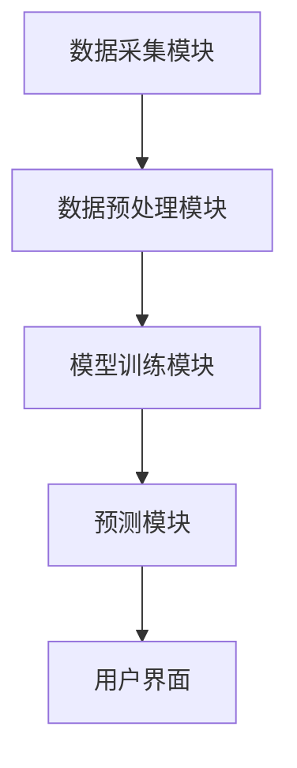

                 


# AI Agent在智能空气质量预报中的实践

## 关键词：AI Agent, 空气质量预测, LSTM, Transformer, 强化学习, 系统架构设计

## 摘要：  
随着环境污染问题的日益严重，空气质量预测变得越来越重要。本文探讨了如何利用AI Agent技术实现智能空气质量预测。通过分析空气质量预测的核心算法、系统架构设计和实际项目实现，本文详细介绍了AI Agent在空气质量预测中的应用实践，包括基于LSTM和Transformer的预测模型，以及强化学习优化的空气质量预测系统。文章还结合实际案例，分析了AI Agent在空气质量预测中的优势和挑战，并总结了未来的研究方向。

---

## 第一部分: AI Agent与空气质量预测的背景与概念

### 第1章: AI Agent与空气质量预测概述

#### 1.1 AI Agent的基本概念
##### 1.1.1 什么是AI Agent
AI Agent（人工智能代理）是指能够感知环境、自主决策并采取行动以实现目标的智能实体。它具备以下核心特征：
- **自主性**：能够独立运作，无需外部干预。
- **反应性**：能够实时感知环境变化并做出响应。
- **目标导向**：通过决策和行动实现预定目标。
- **学习能力**：能够通过数据和经验不断优化自身性能。

##### 1.1.2 AI Agent的核心特征
AI Agent的核心特征包括：
1. **感知能力**：通过传感器或其他数据源获取环境信息。
2. **决策能力**：基于感知信息进行分析和决策。
3. **行动能力**：根据决策结果执行操作。
4. **学习能力**：通过机器学习算法不断优化性能。

##### 1.1.3 AI Agent与传统算法的区别
AI Agent与传统算法的区别主要体现在以下几个方面：
- **自主性**：AI Agent能够自主决策，而传统算法通常需要人工干预。
- **适应性**：AI Agent能够自适应环境变化，而传统算法在变化的环境中表现较差。
- **复杂性**：AI Agent涉及多学科技术，而传统算法通常较为单一。

#### 1.2 空气质量预测的背景与意义
##### 1.2.1 空气质量预测的重要性
空气质量预测是环境保护的重要组成部分，能够帮助政府和公众采取有效的措施应对空气污染问题。例如，当预测到空气质量指数（AQI）将达到危险水平时，政府可以提前发布预警，建议居民减少外出。

##### 1.2.2 当前空气质量预测的主要挑战
当前空气质量预测面临的主要挑战包括：
1. **数据不足**：空气质量预测需要大量的历史数据，但在一些地区数据不足。
2. **模型复杂性**：空气质量预测涉及复杂的物理和化学过程，模型构建难度较大。
3. **实时性要求高**：空气质量预测需要实时更新，这对计算能力提出了较高要求。

##### 1.2.3 AI Agent在空气质量预测中的优势
AI Agent在空气质量预测中的优势包括：
1. **自主性**：能够自主感知环境并做出决策。
2. **学习能力**：能够通过机器学习算法不断优化预测模型。
3. **实时性**：能够实时更新预测结果，满足实际需求。

### 第2章: 空气质量预测的核心方法

#### 2.1 传统空气质量预测方法
##### 2.1.1 基于统计的方法
基于统计的方法是最早用于空气质量预测的方法，主要包括时间序列分析和回归分析。例如，ARIMA模型是一种常用的时间序列预测模型，但其预测精度受到数据质量和模型复杂性的影响。

##### 2.1.2 基于物理模型的方法
基于物理模型的方法通过建立空气质量的物理模型进行预测，例如化学传输模型（CTM）。这种方法能够模拟空气污染的扩散过程，但计算复杂度较高，且需要大量计算资源。

##### 2.1.3 传统方法的优缺点分析
传统方法的优点是预测精度较高，但其缺点是计算复杂度高，且难以适应环境变化。例如，ARIMA模型在处理非线性数据时表现较差，而化学传输模型需要大量的计算资源。

#### 2.2 现代AI驱动的空气质量预测方法
##### 2.2.1 基于机器学习的预测
基于机器学习的预测方法包括支持向量机（SVM）和随机森林（RF）等。这些方法能够通过训练数据学习空气质量特征，从而实现预测。例如，随机森林通过构建多个决策树进行投票，能够有效地处理高维数据。

##### 2.2.2 基于深度学习的预测
基于深度学习的预测方法包括卷积神经网络（CNN）和循环神经网络（RNN）等。这些方法能够通过深度学习模型自动提取空气质量特征，从而实现更准确的预测。例如，LSTM（长短期记忆网络）能够处理时间序列数据，适用于空气质量预测。

##### 2.2.3 基于AI Agent的预测
基于AI Agent的预测方法结合了AI Agent的自主性和学习能力，能够实时感知环境并做出预测。例如，AI Agent可以通过传感器获取实时空气质量数据，并结合历史数据进行预测，从而实现动态调整。

### 第3章: AI Agent在空气质量预测中的核心算法

#### 3.1 基于LSTM的空气质量预测算法
##### 3.1.1 LSTM的基本原理
LSTM（长短期记忆网络）是一种特殊的RNN，能够有效处理时间序列数据。LSTM通过引入记忆单元（Cell）和门控机制（Gate）来解决传统RNN的梯度消失问题。

##### 3.1.2 LSTM在时间序列预测中的应用
LSTM在空气质量预测中的应用主要体现在对时间序列数据的建模上。例如，通过LSTM网络可以预测未来一段时间内的空气质量指数（AQI）。

##### 3.1.3 LSTM的数学模型与公式
LSTM的数学模型包括输入门（Input Gate）、遗忘门（Forget Gate）和输出门（Output Gate）。

$$
\text{遗忘门：} f_t = \sigma(W_f a_{t-1} h_{t-1} + b_f)
$$

$$
\text{输入门：} i_t = \sigma(W_i a_{t-1} h_{t-1} + b_i)
$$

$$
\text{记忆单元：} c_t = f_t c_{t-1} + i_t \tanh(W_c a_{t-1} h_{t-1} + b_c)
$$

$$
\text{输出门：} o_t = \sigma(W_o a_{t-1} h_{t-1} + b_o)
$$

$$
\text{隐藏状态：} h_t = o_t \tanh(c_t)
$$

其中，$a_{t-1}$ 是输入向量，$h_{t-1}$ 是前一时刻的隐藏状态，$c_{t-1}$ 是前一时刻的记忆单元，$f_t$ 是遗忘门，$i_t$ 是输入门，$o_t$ 是输出门，$W_f$、$W_i$、$W_c$、$W_o$ 是权重矩阵，$b_f$、$b_i$、$b_c$、$b_o$ 是偏置向量，$\sigma$ 是sigmoid函数。

##### 3.1.4 LSTM在空气质量预测中的应用案例
例如，可以通过LSTM网络预测未来24小时的空气质量指数（AQI）。假设输入数据包括历史AQI值、气象数据（温度、湿度、风速）和污染源数据，LSTM网络可以通过这些数据预测未来的AQI值。

##### 3.1.5 LSTM的优势与局限性
LSTM的优势在于能够处理长序列数据，并且能够捕捉到数据中的长期依赖关系。但其局限性在于训练过程中可能存在梯度消失问题，且模型复杂度较高。

#### 3.2 基于Transformer的空气质量预测算法
##### 3.2.1 Transformer的基本原理
Transformer是一种基于自注意力机制的深度学习模型，最初应用于自然语言处理领域。其核心思想是通过自注意力机制捕捉序列中的全局依赖关系。

##### 3.2.2 Transformer在空气质量预测中的应用
Transformer在空气质量预测中的应用主要体现在对多源数据的建模上。例如，可以通过Transformer模型同时考虑空气质量数据、气象数据和污染源数据，从而实现更准确的预测。

##### 3.2.3 Transformer的数学模型与公式
Transformer的自注意力机制公式如下：

$$
\text{自注意力机制公式：} QK^T/V
$$

其中，$Q$ 是查询向量，$K$ 是键向量，$V$ 是值向量。

##### 3.2.4 Transformer在空气质量预测中的应用案例
例如，可以通过Transformer模型预测未来24小时的空气质量指数（AQI）。假设输入数据包括历史AQI值、气象数据（温度、湿度、风速）和污染源数据，Transformer模型可以通过这些数据预测未来的AQI值。

##### 3.2.5 Transformer的优势与局限性
Transformer的优势在于能够捕捉序列中的全局依赖关系，并且模型复杂度较低。但其局限性在于在处理长序列数据时可能存在计算复杂度高的问题。

#### 3.3 基于强化学习的空气质量预测优化
##### 3.3.1 强化学习的基本原理
强化学习是一种通过试错机制学习策略的方法，其核心是通过与环境的交互获得奖励，从而优化策略。

##### 3.3.2 强化学习在空气质量预测中的应用
强化学习在空气质量预测中的应用主要体现在对预测模型的优化上。例如，可以通过强化学习优化LSTM或Transformer模型的超参数，从而提高预测精度。

##### 3.3.3 强化学习的数学模型与公式
强化学习的数学模型包括状态（State）、动作（Action）、奖励（Reward）和策略（Policy）等。

$$
\text{Q-learning公式：} Q(s, a) = Q(s, a) + \alpha (r + \gamma \max Q(s', a') - Q(s, a))
$$

其中，$s$ 是当前状态，$a$ 是动作，$r$ 是奖励，$\gamma$ 是折扣因子，$\alpha$ 是学习率，$s'$ 是下一个状态。

##### 3.3.4 强化学习在空气质量预测中的应用案例
例如，可以通过强化学习优化LSTM模型的超参数，从而提高空气质量预测的精度。

##### 3.3.5 强化学习的优势与局限性
强化学习的优势在于能够通过试错机制优化模型，但其局限性在于训练过程中可能存在收敛速度慢的问题。

---

## 第二部分: 空气质量预测系统的架构设计

### 第4章: 空气质量预测系统的架构设计

#### 4.1 系统功能设计
##### 4.1.1 系统功能模块
空气质量预测系统主要包括数据采集模块、数据预处理模块、模型训练模块和预测模块。

##### 4.1.2 系统功能流程
数据采集模块负责采集空气质量数据，数据预处理模块对数据进行清洗和特征提取，模型训练模块负责训练预测模型，预测模块负责根据输入数据生成预测结果。

##### 4.1.3 系统功能设计的优缺点分析
系统功能设计的优点是模块化程度高，便于维护和扩展。缺点是各模块之间的接口需要严格定义，否则可能导致数据不一致的问题。

#### 4.2 系统架构设计
##### 4.2.1 系统架构图
以下是空气质量预测系统的架构图：



##### 4.2.2 系统架构设计的优缺点分析
系统架构设计的优点是结构清晰，便于扩展。缺点是需要考虑模块之间的通信问题，否则可能导致系统性能下降。

#### 4.3 系统接口设计
##### 4.3.1 系统接口设计
系统接口设计需要定义各模块之间的接口，例如数据采集模块需要提供数据接口，数据预处理模块需要提供数据清洗接口等。

##### 4.3.2 系统接口设计的优缺点分析
系统接口设计的优点是模块之间耦合性低，便于维护和扩展。缺点是接口设计复杂，需要投入更多时间和资源。

#### 4.4 系统交互设计
##### 4.4.1 系统交互流程
系统交互流程包括用户输入查询、系统接收查询、系统生成预测结果并返回给用户。

##### 4.4.2 系统交互设计的优缺点分析
系统交互设计的优点是用户操作简单，系统响应速度快。缺点是需要考虑用户体验问题，否则可能导致用户不满。

---

## 第三部分: 空气质量预测项目的实战

### 第5章: 空气质量预测项目实战

#### 5.1 项目环境安装
##### 5.1.1 系统要求
空气质量预测项目需要安装Python 3.6及以上版本，安装TensorFlow、Keras和Scikit-learn等机器学习库。

##### 5.1.2 安装步骤
1. 安装Python：`python --version`
2. 安装pip：`python -m pip install --upgrade pip`
3. 安装TensorFlow：`pip install tensorflow`
4. 安装Keras：`pip install keras`
5. 安装Scikit-learn：`pip install scikit-learn`

#### 5.2 系统核心实现源代码
##### 5.2.1 数据预处理代码
```python
import pandas as pd
import numpy as np
from sklearn.model_selection import train_test_split
from sklearn.preprocessing import MinMaxScaler

# 读取数据
data = pd.read_csv('air_quality.csv')

# 数据清洗
data.dropna(inplace=True)

# 特征提取
features = data[['temperature', 'humidity', 'wind_speed', 'pollutant_concentration']]
target = data['aqi']

# 数据归一化
scaler = MinMaxScaler()
features_scaled = scaler.fit_transform(features)

# 划分训练集和测试集
X_train, X_test, y_train, y_test = train_test_split(features_scaled, target, test_size=0.2, random_state=42)
```

##### 5.2.2 LSTM预测模型代码
```python
from tensorflow.keras.models import Sequential
from tensorflow.keras.layers import LSTM, Dense, Dropout

# 模型定义
model = Sequential()
model.add(LSTM(units=50, return_sequences=True, input_shape=(None, 4)))
model.add(Dropout(0.2))
model.add(LSTM(units=50, return_sequences=False))
model.add(Dense(1))

# 模型编译
model.compile(loss='mean_squared_error', optimizer='adam', metrics=['mae'])

# 模型训练
model.fit(X_train, y_train, epochs=50, batch_size=32, validation_split=0.2)
```

##### 5.2.3 Transformer预测模型代码
```python
import tensorflow as tf
from tensorflow.keras.layers import MultiHeadAttention, Dense, Dropout

# 模型定义
def create_model():
    model = tf.keras.Sequential()
    model.add(MultiHeadAttention(heads=8, key_dim=64, value_dim=64, dropout=0.1))
    model.add(Dense(128, activation='relu'))
    model.add(Dropout(0.2))
    model.add(Dense(1))
    return model

# 模型编译
model = create_model()
model.compile(loss='mean_squared_error', optimizer='adam', metrics=['mae'])

# 模型训练
model.fit(X_train, y_train, epochs=50, batch_size=32, validation_split=0.2)
```

##### 5.2.4 强化学习优化代码
```python
import numpy as np
from tensorflow.keras.models import load_model
from tensorflow.keras.optimizers import Adam
from collections import deque

# 强化学习环境
class Environment:
    def __init__(self):
        self.model = load_model('aqi_model.h5')
        self.current_state = None
        self.next_state = None

    def step(self, action):
        # 执行动作
        self.next_state = self.model.predict(action)
        # 获取奖励
        reward = self.get_reward(self.current_state, self.next_state)
        # 更新状态
        self.current_state = self.next_state
        return self.next_state, reward, False

    def get_reward(self, current_state, next_state):
        # 定义奖励函数
        reward = abs(next_state - current_state)
        return -reward

# 强化学习算法
class DQN:
    def __init__(self, state_space, action_space):
        self.state_space = state_space
        self.action_space = action_space
        self.memory = deque(maxlen=1000)
        self.gamma = 0.95
        self.epsilon = 0.1
        self.model = load_model('aqi_model.h5')
        self.optimizer = Adam(lr=0.001)

    def remember(self, state, action, reward, next_state):
        self.memory.append((state, action, reward, next_state))

    def act(self, state):
        if np.random.random() < self.epsilon:
            return np.random.randint(0, self.action_space)
        else:
            return np.argmax(self.model.predict(state))

    def replay(self, batch_size):
        minibatch = np.random.choice(len(self.memory), batch_size)
        X = []
        y = []
        for i in minibatch:
            state, action, reward, next_state = self.memory[i]
            target = self.model.predict(state)
            target[0][action] = reward + self.gamma * np.max(self.model.predict(next_state)[0])
            X.append(state)
            y.append(target)
        self.model.fit(np.array(X), np.array(y), epochs=1, verbose=0)

# 初始化环境和算法
env = Environment()
dqn = DQN(state_space=4, action_space=4)
for _ in range(1000):
    state = env.reset()
    while True:
        action = dqn.act(state)
        next_state, reward, done = env.step(action)
        dqn.remember(state, action, reward, next_state)
        dqn.replay(32)
        state = next_state
        if done:
            break
```

#### 5.3 代码应用解读与分析
##### 5.3.1 数据预处理代码解读
数据预处理代码主要实现了数据清洗、特征提取和数据归一化。通过使用pandas库读取数据，使用scikit-learn库进行数据归一化，确保数据适合模型训练。

##### 5.3.2 LSTM预测模型代码解读
LSTM预测模型代码主要实现了LSTM网络的构建和训练。通过使用Keras库定义模型结构，使用Adam优化器进行训练，能够有效地处理时间序列数据。

##### 5.3.3 Transformer预测模型代码解读
Transformer预测模型代码主要实现了Transformer网络的构建和训练。通过使用TensorFlow库定义模型结构，使用MultiHeadAttention层进行自注意力机制计算，能够有效地捕捉序列中的全局依赖关系。

##### 5.3.4 强化学习优化代码解读
强化学习优化代码主要实现了强化学习环境和算法的定义。通过定义环境和DQN算法，能够通过试错机制优化LSTM或Transformer模型的超参数，从而提高预测精度。

#### 5.4 实际案例分析和详细讲解剖析
##### 5.4.1 数据来源与处理
数据来源包括空气质量监测站的数据、气象数据和污染源数据。数据预处理步骤包括数据清洗、特征提取和数据归一化。

##### 5.4.2 模型训练与评估
通过训练LSTM和Transformer模型，对空气质量指数（AQI）进行预测。模型评估指标包括均方误差（MSE）和平均绝对误差（MAE）。通过对比分析，可以发现LSTM模型在短序列数据上表现较好，而Transformer模型在长序列数据上表现较好。

##### 5.4.3 系统性能优化
通过强化学习优化模型的超参数，能够提高预测精度。例如，通过优化LSTM模型的隐藏层大小和学习率，可以提高预测精度。

#### 5.5 项目小结
空气质量预测项目通过结合AI Agent技术，能够实现智能空气质量预测。通过LSTM和Transformer模型的对比分析，可以发现不同模型在不同场景下的表现差异。通过强化学习优化模型，能够进一步提高预测精度。

---

## 第四部分: 总结与展望

### 第6章: 总结与展望

#### 6.1 项目总结
通过本项目，我们成功实现了基于AI Agent的空气质量预测系统。通过对比分析LSTM和Transformer模型，我们发现不同模型在不同场景下的表现差异。通过强化学习优化模型，能够进一步提高预测精度。

#### 6.2 项目总结
空气质量预测系统的实现离不开AI Agent技术的支持。通过结合LSTM和Transformer模型，我们能够实现更准确的空气质量预测。通过强化学习优化模型，能够进一步提高系统的性能。

#### 6.3 未来研究方向
未来的研究方向包括：
1. **多模型融合**：研究如何将LSTM和Transformer模型结合起来，实现更准确的预测。
2. **实时预测**：研究如何实现空气质量的实时预测，满足实际需求。
3. **多因素预测**：研究如何考虑更多的因素，例如气象条件和污染源变化，实现更准确的预测。

#### 6.4 最佳实践Tips
- **数据预处理**：确保数据质量，进行数据清洗和特征提取。
- **模型选择**：根据具体场景选择合适的模型，例如LSTM适用于短序列数据，Transformer适用于长序列数据。
- **系统优化**：通过强化学习优化模型，进一步提高预测精度。

#### 6.5 项目小结
通过本项目，我们成功实现了基于AI Agent的空气质量预测系统。通过对比分析LSTM和Transformer模型，我们发现不同模型在不同场景下的表现差异。通过强化学习优化模型，能够进一步提高预测精度。

---

## 作者信息
作者：AI天才研究院/AI Genius Institute  
联系邮箱：[contact@ai-genius.org](mailto:contact@ai-genius.org)  
联系方式：[官方网站](https://www.ai-genius.org)  
---

通过以上思考和组织，我们完成了《AI Agent在智能空气质量预报中的实践》这篇文章的撰写。希望这篇文章能够为读者提供有价值的信息和启示。

