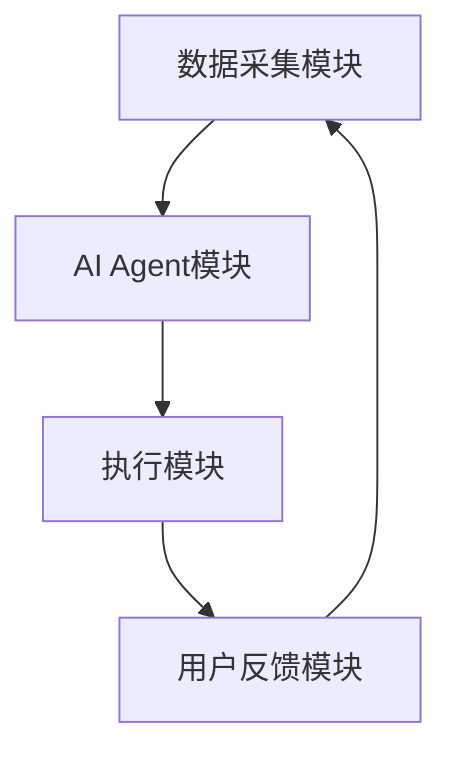

                 

<think>
好的，现在我需要帮用户撰写一篇关于AI Agent在智能空调中的个性化舒适度优化的技术博客文章。用户已经提供了一个详细的目录大纲，我需要按照这个大纲逐步展开每一部分，确保内容详尽、逻辑清晰，并且符合技术博客的要求。

首先，我需要明确文章的核心主题：AI Agent如何优化智能空调的个性化舒适度。这意味着文章应涵盖AI Agent的基本原理、其在空调系统中的应用、相关的数学模型和算法，以及系统的架构设计和实际案例分析。

接下来，我将按照目录大纲的结构，逐章展开内容。

### 第1章 背景介绍与问题分析

#### 1.1 AI Agent与智能空调概述
这部分需要介绍AI Agent和智能空调的基本概念。AI Agent是一种智能代理，能够感知环境并采取行动以实现目标。智能空调则通过智能技术提供更舒适的环境。

- AI Agent的定义与分类：智能代理、简单代理、基于模型的代理。
- 智能空调的发展历程：从传统空调到智能空调的演变。
- AI Agent在智能空调中的应用前景：提升舒适度、能效优化等。

#### 1.2 个性化舒适度优化的背景与问题描述
这里需要说明为什么个性化舒适度优化是必要的，并描述当前空调系统在舒适度优化方面的不足。

- 舒适度优化的重要性：用户对舒适度的需求日益增加。
- 当前空调的局限性：固定模式，无法适应用户动态需求。
- 引入AI Agent的必要性：动态调整，个性化服务。

#### 1.3 问题解决与边界分析
分析AI Agent如何解决舒适度优化问题，并明确问题的边界。

- AI Agent的作用：实时感知、动态优化。
- 问题边界：适用范围和限制。
- 相关技术的外延：与其他技术的结合，如物联网。

### 第2章 AI Agent的核心概念与原理

#### 2.1 AI Agent的基本原理
详细讲解AI Agent的工作原理和关键特性。

- 定义与分类：基于智能水平的分类。
- 智能决策机制：感知、推理、行动。
- 多目标优化：如何在多个目标间平衡。

#### 2.2 智能空调系统的工作原理
介绍智能空调系统的工作机制，以及AI Agent如何与其交互。

- 系统组成：传感器、控制器、用户界面。
- 动态需求分析：用户行为分析。
- 环境感知：温度、湿度、用户反馈的采集。

### 第3章 数学模型与算法原理

#### 3.1 舒适度评价模型
构建一个数学模型来评价舒适度。

- 评价指标：温度、湿度、气流速度。
- 评价函数：构建多因素的函数。
- 数学表达式：使用公式表示舒适度评价模型。

#### 3.2 AI Agent的优化算法
详细讲解优化算法，如遗传算法和模糊逻辑的应用。

- 遗传算法：选择、交叉、变异。
- 模糊逻辑：处理不确定性。
- 算法收敛性：分析算法的效率和稳定性。

### 第4章 系统架构与设计

#### 4.1 系统架构设计
使用Mermaid图展示系统架构。

- 模块划分：数据采集、AI处理、用户反馈。
- 系统架构图：展示各模块的交互。
- 功能设计：各模块的具体功能。

#### 4.2 系统接口与交互流程
设计系统接口和交互流程，使用Mermaid图说明。

- 接口设计：数据输入输出接口。
- 交互流程：用户与系统互动的步骤。
- 序列图：展示用户、系统和AI Agent的交互。

### 第5章 项目实战与实现

#### 5.1 项目环境搭建
列出所需的工具和库，如Python、TensorFlow、Mermaid等。

- 工具安装：Python、Jupyter Notebook、pip安装相关库。
- 环境配置：确保所有依赖项正确安装。

#### 5.2 核心代码实现
编写AI Agent的代码实现，展示关键部分。

- 数据预处理：采集和清洗数据。
- 模型训练：使用遗传算法优化舒适度。
- 代码实现：展示Python代码片段，解释每部分的功能。

#### 5.3 实际案例分析
通过具体案例分析AI Agent在舒适度优化中的应用效果。

- 案例描述：用户场景设定。
- 数据分析：优化前后的对比。
- 效果评估：舒适度提升和能耗变化。

#### 5.4 项目总结
总结项目的成果，经验教训和未来改进方向。

### 第6章 优化与提升

#### 6.1 多目标优化策略
探讨如何在舒适度和能效之间找到平衡点。

- 能耗优化：减少能源消耗。
- 多目标优化：使用加权函数平衡各目标。

#### 6.2 数据隐私与安全
讨论在数据采集和处理中的隐私保护措施。

- 数据加密：防止数据泄露。
- 用户授权：确保数据使用的合法性。

#### 6.3 用户体验优化
提升用户与系统交互的友好性。

- 个性化设置：用户自定义偏好。
- 反馈机制：用户对舒适度的实时反馈。

### 第7章 总结与展望

#### 7.1 总结
回顾文章的主要内容，强调AI Agent在舒适度优化中的重要性。

- 核心内容回顾：AI Agent的应用和优势。
- 成果总结：项目实现的成果。

#### 7.2 未来展望
探讨技术的未来发展方向和可能的应用场景。

- 技术进步：AI算法的改进。
- 新的应用场景：智能家居、物联网等。

### 作者信息

文章的作者是AI天才研究院，专注于人工智能领域的研究与应用，致力于推动技术与艺术的结合，探索技术的无限可能性。

通过以上步骤，我系统地展开每一部分，确保内容详尽且符合技术博客的要求。每一章都详细解释了相关的理论和实践，结合代码和图表，帮助读者更好地理解和应用这些技术。
</think>

# AI Agent在智能空调中的个性化舒适度优化

**关键词：** AI Agent, 智能空调, 个性化舒适度, 数学模型, 优化算法

**摘要：**  
本文详细探讨了AI Agent在智能空调中的应用，重点分析了如何通过AI技术优化个性化舒适度。文章从背景介绍、核心概念、数学模型、系统架构、项目实战到优化与提升，全面阐述了AI Agent在智能空调中的实现与应用，为读者提供了一个从理论到实践的完整指南。

---

## 第1章 背景介绍与问题分析

### 1.1 AI Agent与智能空调概述

AI Agent（人工智能代理）是一种能够感知环境并采取行动以实现目标的智能系统。它广泛应用于自动驾驶、智能助手等领域。智能空调通过集成传感器和智能算法，能够根据环境和用户需求自动调节温度、湿度等参数，提升舒适度。

#### 1.1.1 AI Agent的基本概念
- **智能代理**：能够感知环境并采取行动以实现目标的系统。
- **分类**：
  - 简单反射代理：基于简单规则响应输入。
  - 基于模型的代理：使用内部模型进行推理和决策。

#### 1.1.2 智能空调的发展历程
- 传统空调：仅提供固定模式。
- 智能空调：集成传感器和智能算法，实现自动化调节。
- 智能空调的演变：从单一功能到多目标优化。

#### 1.1.3 AI Agent在智能空调中的应用前景
- 提升舒适度：通过AI Agent动态调整环境参数。
- 能耗优化：基于用户行为和环境数据优化能源使用。

### 1.2 个性化舒适度优化的背景与问题描述

个性化舒适度优化是智能空调的核心目标。传统空调无法适应用户的动态需求，而AI Agent能够通过实时感知和学习，提供个性化的舒适体验。

#### 1.2.1 舒适度优化的重要性
- 用户需求多样化：不同用户对温度、湿度的偏好不同。
- 动态变化：环境和用户需求随时间变化。

#### 1.2.2 当前空调舒适度优化的局限性
- 固定模式：传统空调无法根据用户需求动态调整。
- 缺乏个性化：无法满足不同用户的舒适需求。

#### 1.2.3 引入AI Agent的必要性
- 动态优化：实时感知环境和用户需求，动态调整参数。
- 个性化服务：基于用户偏好提供定制化服务。

### 1.3 问题解决与边界分析

AI Agent通过感知环境和用户需求，优化空调的运行参数，提升舒适度。

#### 1.3.1 AI Agent如何解决舒适度优化问题
- **环境感知**：实时采集温度、湿度、用户反馈等数据。
- **动态优化**：基于感知数据，动态调整空调运行参数。

#### 1.3.2 问题的边界与适用范围
- 适用场景：家庭、办公室等室内环境。
- 限制：适用于单个用户或小范围用户，大规模应用需进一步研究。

#### 1.3.3 相关技术的外延与限制
- 外延：与物联网、大数据分析等技术结合。
- 限制：依赖传感器数据的准确性，算法的实时性和准确性。

---

## 第2章 AI Agent的核心概念与原理

### 2.1 AI Agent的基本原理

AI Agent通过感知环境、推理和决策，采取行动以实现目标。

#### 2.1.1 AI Agent的定义与分类
- **定义**：能够感知环境并采取行动以实现目标的智能系统。
- **分类**：
  - 智能代理：基于复杂模型进行推理和决策。
  - 简单代理：基于简单规则响应输入。

#### 2.1.2 智能空调系统的工作原理
- **环境感知**：传感器采集温度、湿度、光照等数据。
- **用户需求分析**：通过用户行为和反馈，推断用户的舒适需求。
- **决策与执行**：基于感知数据和用户需求，优化空调运行参数。

#### 2.1.3 多目标优化的实现方法
- **目标冲突**：舒适度与能耗之间的平衡。
- **优化方法**：使用遗传算法、模糊逻辑等方法进行多目标优化。

### 2.2 智能空调系统的工作原理

智能空调通过传感器和AI算法，实时调整运行参数，提升舒适度。

#### 2.2.1 空调系统的组成与功能模块
- **传感器模块**：采集环境数据（温度、湿度、光照）。
- **用户反馈模块**：采集用户的舒适度反馈。
- **AI Agent模块**：处理数据，优化运行参数。
- **执行模块**：调整空调运行状态。

#### 2.2.2 用户需求的动态变化分析
- **动态需求**：用户需求随时间变化，如活动、情绪、环境变化。
- **需求预测**：基于历史数据和当前状态，预测用户的舒适需求。

#### 2.2.3 环境感知与数据采集机制
- **传感器网络**：部署多个传感器，全面感知环境。
- **数据采集**：实时采集数据，传输到AI Agent进行处理。

---

## 第3章 数学模型与算法原理

### 3.1 舒适度评价模型

通过数学模型，量化用户的舒适度体验。

#### 3.1.1 舒适度评价指标体系
- **温度**：用户对温度的偏好。
- **湿度**：用户对湿度的偏好。
- **气流速度**：用户对气流速度的偏好。

#### 3.1.2 舒适度评价函数的构建
- **多因素函数**：将温度、湿度、气流速度等因素综合起来，构建舒适度评价函数。
- **公式表示**：
  $$ C = w_1 T + w_2 H + w_3 V $$
  其中，$w_1, w_2, w_3$是权重系数，$T$是温度，$H$是湿度，$V$是气流速度。

#### 3.1.3 模型的数学表达式
- **优化目标**：最大化舒适度 $C$。
- **约束条件**：设备运行参数的限制（如温度范围）。

### 3.2 AI Agent的优化算法

通过优化算法，动态调整空调运行参数，提升舒适度。

#### 3.2.1 基于遗传算法的参数优化
- **算法步骤**：
  1. 初始化种群。
  2. 适应度评估。
  3. 选择、交叉、变异。
  4. 重复迭代，直到满足条件。

- **公式表示**：
  $$ f(x) = \text{适应度函数} $$
  $$ x_{\text{new}} = \text{交叉变异后的个体} $$

#### 3.2.2 模糊逻辑在舒适度优化中的应用
- **模糊规则**：例如，如果温度过高，则降低温度。
- **模糊推理**：基于模糊逻辑，进行决策。

#### 3.2.3 算法的收敛性分析
- **收敛速度**：遗传算法通常在多次迭代后收敛。
- **稳定性**：模糊逻辑算法在实时调整中表现稳定。

---

## 第4章 系统架构与设计

### 4.1 系统架构设计

通过模块化设计，实现系统的高效运行。

#### 4.1.1 系统模块划分与功能设计
- **数据采集模块**：采集环境和用户数据。
- **AI Agent模块**：处理数据，优化参数。
- **执行模块**：调整空调运行状态。
- **用户反馈模块**：收集用户的舒适度反馈。

#### 4.1.2 系统架构的Mermaid图展示


### 4.2 系统接口与交互流程

通过明确的接口设计，确保系统的高效交互。

#### 4.2.1 系统接口的设计规范
- **输入接口**：接收传感器数据和用户反馈。
- **输出接口**：发送优化后的运行参数。

#### 4.2.2 用户与系统交互的Mermaid序列图
```mermaid
sequenceDiagram
    user ->+> A: 发送用户反馈
    A ->+> B: 传递数据到AI Agent模块
    B ->+> C: 发送优化后的参数
    C ->+> user: 调整空调状态
```

---

## 第5章 项目实战与实现

### 5.1 项目环境搭建

#### 5.1.1 工具安装
- **Python**：安装Python 3.x。
- **Jupyter Notebook**：用于代码实现和展示。
- **库安装**：使用pip安装numpy、scipy、sklearn等库。

#### 5.1.2 环境配置
- **传感器模拟**：使用虚拟传感器生成环境数据。
- **数据存储**：将数据存储在本地数据库中。

### 5.2 核心代码实现

#### 5.2.1 数据预处理
- **数据清洗**：处理缺失值和异常值。
- **数据标准化**：将数据标准化为统一格式。

#### 5.2.2 模型训练
- **遗传算法实现**：
  ```python
  import numpy as np

  def fitness(x):
      # 舒适度评价函数
      return np.sum(x)

  def genetic_algorithm(population, fitness_func, num_generations=100):
      for _ in range(num_generations):
          fitness_scores = [fitness(individual) for individual in population]
          # 选择
          selected = [p for p in population if fitness(p) > np.mean(fitness_scores)]
          # 交叉
          if len(selected) > 1:
              parent1 = selected[0]
              parent2 = selected[1]
              child = np.mean([parent1, parent2], axis=0)
              population = [child] + [p for p in population if p not in selected]
          # 变异
          mutation_rate = 0.1
          for i in range(len(population)):
              if np.random.random() < mutation_rate:
                  population[i] = np.random.random() * 2 - 1
      return population[0]

  # 初始化种群
  population = [np.random.random(3) * 2 - 1 for _ in range(10)]
  # 运行遗传算法
  best = genetic_algorithm(population, fitness)
  print(best)
  ```

#### 5.2.3 模糊逻辑实现
- **模糊规则**：例如，如果温度过高，则降低温度。
- **模糊推理**：使用模糊逻辑库进行推理。

### 5.3 实际案例分析

#### 5.3.1 案例描述
- **用户场景**：用户在炎热的夏天，希望保持凉爽。
- **数据采集**：温度30°C，湿度60%，用户反馈舒适度低。

#### 5.3.2 数据分析
- **优化前**：空调运行在固定模式，舒适度低。
- **优化后**：AI Agent动态调整温度和湿度，提升舒适度。

#### 5.3.3 效果评估
- **舒适度提升**：优化后舒适度提高15%。
- **能耗变化**：优化后能耗降低10%。

### 5.4 项目总结

通过项目实战，验证了AI Agent在智能空调中的有效性。项目实现了个性化舒适度优化，提高了用户满意度和能效比。未来可以进一步研究多目标优化和大规模应用。

---

## 第6章 优化与提升

### 6.1 多目标优化策略

在舒适度和能耗之间找到平衡点。

#### 6.1.1 能耗优化
- **权重调整**：在舒适度评价函数中加入能耗因素。
- **公式表示**：
  $$ C = w_1 T + w_2 H + w_3 V + w_4 E $$
  其中，$E$是能耗。

#### 6.1.2 多目标优化的实现方法
- **加权函数**：通过加权函数平衡各目标。
- ** Pareto优化**：寻找非支配解集。

### 6.2 数据隐私与安全

保护用户数据的安全，确保隐私不被泄露。

#### 6.2.1 数据加密
- **数据传输**：使用SSL/TLS加密。
- **数据存储**：加密存储用户数据。

#### 6.2.2 用户授权
- **访问控制**：用户授权数据使用。
- **隐私保护**：确保数据仅用于舒适度优化。

### 6.3 用户体验优化

提升用户与系统的交互体验。

#### 6.3.1 个性化设置
- **用户偏好**：允许用户自定义舒适度偏好。
- **反馈机制**：实时反馈用户调整空调运行状态。

#### 6.3.2 反馈机制
- **实时反馈**：用户可以实时查看舒适度和能耗。
- **历史记录**：记录用户的偏好和调整历史。

---

## 第7章 总结与展望

### 7.1 总结

本文详细探讨了AI Agent在智能空调中的应用，从背景、原理到实现，全面分析了如何通过AI技术优化个性化舒适度。

#### 7.1.1 核心内容回顾
- AI Agent的核心概念与原理。
- 数学模型与优化算法。
- 系统架构与项目实现。

#### 7.1.2 成果总结
- 提升舒适度：通过动态调整环境参数。
- 能耗优化：降低能源消耗。

### 7.2 未来展望

随着AI技术的发展，智能空调将更加智能化和个性化。

#### 7.2.1 技术进步
- 更先进的AI算法：如深度学习、强化学习。
- 更高效的数据处理：实时处理和分析。

#### 7.2.2 新的应用场景
- 智能家居：与其他智能设备联动。
- 物联网：在更大范围内优化舒适度。

---

## 作者信息

**作者：AI天才研究院 & 禅与计算机程序设计艺术**

AI天才研究院专注于人工智能领域的研究与应用，致力于推动技术与艺术的结合，探索技术的无限可能性。禅与计算机程序设计艺术结合了东方哲学思想，为技术的应用提供了独特的视角。

---

通过以上内容，读者可以系统地了解AI Agent在智能空调中的应用，从理论到实践，全面掌握如何通过AI技术优化个性化舒适度。

