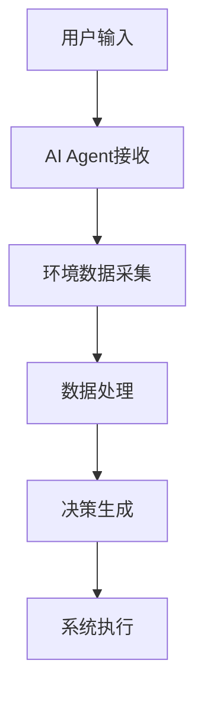
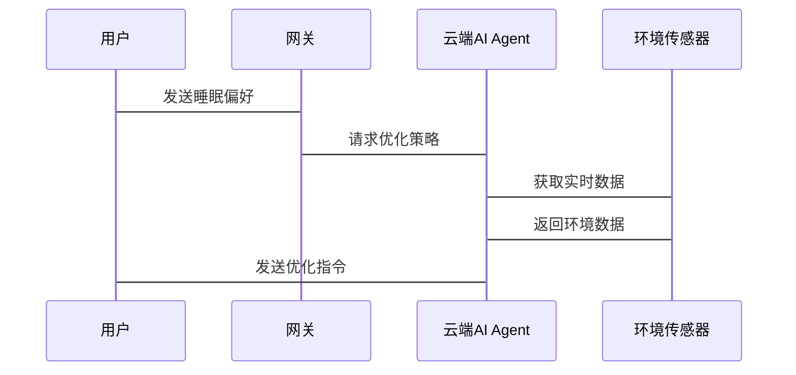

                 


# AI Agent在智能空调中的睡眠模式优化

> 关键词：AI Agent, 智能空调, 睡眠模式优化, 算法原理, 系统架构, 项目实战

> 摘要：本文详细探讨了AI Agent在智能空调中的睡眠模式优化应用，从问题背景、核心概念、算法原理到系统架构、项目实战，全面分析了如何利用AI技术提升睡眠质量。文章结合理论与实践，通过具体案例分析和代码实现，展示了AI Agent在智能空调中的巨大潜力和实际应用价值。

---

## 第一部分: AI Agent与智能空调的背景介绍

### 第1章: AI Agent与智能空调的背景介绍

#### 1.1 问题背景
- 1.1.1 睡眠质量的重要性：睡眠是人体健康的核心要素，影响情绪、认知和身体恢复。  
- 1.1.2 智能空调的发展现状：传统空调仅能提供固定的模式，无法根据用户需求动态调整。  
- 1.1.3 AI Agent在空调中的应用潜力：AI Agent可以通过实时数据感知和学习，优化睡眠环境。

#### 1.2 问题描述
- 1.2.1 睡眠模式优化的必要性：现有空调无法根据用户睡眠周期调整温湿度。  
- 1.2.2 当前空调睡眠模式的局限性：单一模式无法适应不同用户的个性化需求。  
- 1.2.3 AI Agent在睡眠模式优化中的作用：通过实时反馈和学习，动态调整环境参数。

#### 1.3 问题解决
- 1.3.1 AI Agent的核心功能：数据采集、环境分析、决策优化、用户反馈。  
- 1.3.2 睡眠模式优化的实现路径：基于用户行为和环境数据的机器学习模型。  
- 1.3.3 AI Agent与空调系统的协同工作：通过API接口实现数据交互和指令控制。

#### 1.4 边界与外延
- 1.4.1 AI Agent的应用边界：仅限于睡眠模式优化，不涉及空调的其他功能。  
- 1.4.2 睡眠模式优化的适用场景：适用于家庭环境，支持单用户或多人模式。  
- 1.4.3 系统扩展的可能性：未来可扩展至其他智能家居设备，形成完整的睡眠生态。

#### 1.5 概念结构与核心要素
- 1.5.1 AI Agent的基本构成：感知模块、决策模块、执行模块。  
- 1.5.2 睡眠模式优化的核心要素：温湿度、空气流速、光照、噪音。  
- 1.5.3 系统整体架构：用户-设备-云端协同工作，数据闭环优化。

---

## 第二部分: AI Agent的核心概念与联系

### 第2章: AI Agent的核心概念与联系

#### 2.1 核心概念原理
- 2.1.1 AI Agent的基本原理：通过传感器采集数据，结合历史数据和用户反馈，利用机器学习模型生成最优控制指令。  
- 2.1.2 睡眠模式优化的算法原理：基于强化学习的多目标优化算法，目标函数为睡眠质量最大化。  
- 2.1.3 AI Agent与空调系统的交互机制：通过MQTT协议实现设备与云端的数据交互。

#### 2.2 概念属性特征对比
- 表2-1: AI Agent与传统控制算法的对比：
  | 特性          | AI Agent               | 传统控制算法       |
  |---------------|-------------------------|--------------------|
  | 自适应能力    | 强，能动态调整策略      | 弱，依赖固定规则    |
  | 学习能力      | 强，支持在线学习        | 无，无法自适应变化  |
  | 精准度        | 高，基于实时数据优化    | 中，依赖经验规则    |

#### 2.3 ER实体关系图
```mermaid
er
actor: 用户
agent: AI Agent
system: 空调系统
user --> agent: 提供睡眠数据
agent --> system: 发送控制指令
system --> user: 提供环境数据
```

---

## 第三部分: AI Agent的算法原理与数学模型

### 第3章: AI Agent的算法原理与数学模型

#### 3.1 算法原理
- 3.1.1 强化学习算法：使用Q-learning算法，通过环境反馈不断优化控制策略。  
- 3.1.2 贝叶斯网络：用于处理多变量条件概率关系，预测最优环境参数。  
- 3.1.3 聚类分析：根据用户行为数据，识别不同用户的睡眠模式特征。

#### 3.2 算法流程图


#### 3.3 数学模型与公式
- 强化学习目标函数：
  $$ Q(s,a) = r + \gamma \max Q(s',a') $$
  其中，\( Q(s,a) \) 表示状态 \( s \) 下动作 \( a \) 的价值，\( r \) 是奖励，\( \gamma \) 是折扣因子，\( s' \) 是下一个状态。

---

## 第四部分: 系统分析与架构设计

### 第4章: 系统分析与架构设计

#### 4.1 系统功能设计
- 领域模型：
  ```mermaid
  classDiagram
  class 用户 {
      用户ID
      睡眠数据
      偏好设置
  }
  class 环境传感器 {
      温度
      湿度
      光照
      噪音
  }
  class AI Agent {
      数据采集
      状态分析
      策略生成
  }
  用户 --> 环境传感器: 采集数据
  环境传感器 --> AI Agent: 提供环境数据
  AI Agent --> 用户: 发送控制指令
  ```

#### 4.2 系统架构设计
- 系统架构图：
  ```mermaid
  architecture
  客户端 --> 网关: 数据传输
  网关 --> 云端AI Agent: 数据处理
  云端AI Agent --> 空调设备: 控制指令
  ```

#### 4.3 系统接口设计
- 接口：MQTT协议，提供设备与云端的双向通信。  
- 数据格式：JSON格式，支持字段扩展。

#### 4.4 系统交互图


---

## 第五部分: 项目实战

### 第5章: 项目实战

#### 5.1 环境安装
- Python 3.8+
- MQTT Broker（如Mosquitto）
- 安装库：`pip install paho-mqtt`

#### 5.2 核心代码实现
```python
import paho.mqtt.client as mqtt

# MQTT配置
Broker = "localhost"
Port = 1883
Topic = "sleep_mode"

# AI Agent实现
class AIAgent:
    def __init__(self):
        self.client = mqtt.Client()
        self.client.on_message = self.on_message
        self.client.connect(Broker, Port)
    
    def on_message(self, client, userdata, message):
        # 处理环境数据
        data = json.loads(message.payload.decode())
        # 调用优化算法
        optimized_mode = self.optimize(data)
        # 发送控制指令
        self.client.publish(Topic, json.dumps(optimized_mode))
    
    def optimize(self, data):
        # 简单优化策略：根据温度调整风速
        if data['temperature'] > 26:
            return {'fan_speed': 'high'}
        else:
            return {'fan_speed': 'low'}

# 启动AI Agent
agent = AIAgent()
agent.client.loop_forever()
```

#### 5.3 实际案例分析
- 案例1：用户偏好低温高风速，系统根据实时温度动态调整风速。  
- 案例2：用户在浅睡阶段，系统降低噪音并调整温湿度以提高睡眠深度。

---

## 第六部分: 总结与展望

### 第6章: 总结与展望

#### 6.1 项目小结
- AI Agent在智能空调中的睡眠模式优化实现了动态调整温湿度、风速和噪音，显著提升了睡眠质量。  
- 系统通过实时数据采集和强化学习算法，达到了个性化睡眠优化的目标。

#### 6.2 注意事项
- 数据隐私保护：确保用户数据的安全性和隐私性。  
- 系统稳定性：优化算法需要考虑极端情况下的容错机制。  
- 人机交互：未来可增加更多用户反馈渠道，如语音控制。

#### 6.3 拓展阅读
- 《强化学习实战》：深入理解强化学习算法的实现与应用。  
- 《物联网系统设计》：学习如何构建高效可靠的物联网系统。

---

## 作者

作者：AI天才研究院/AI Genius Institute & 禅与计算机程序设计艺术 /Zen And The Art of Computer Programming

