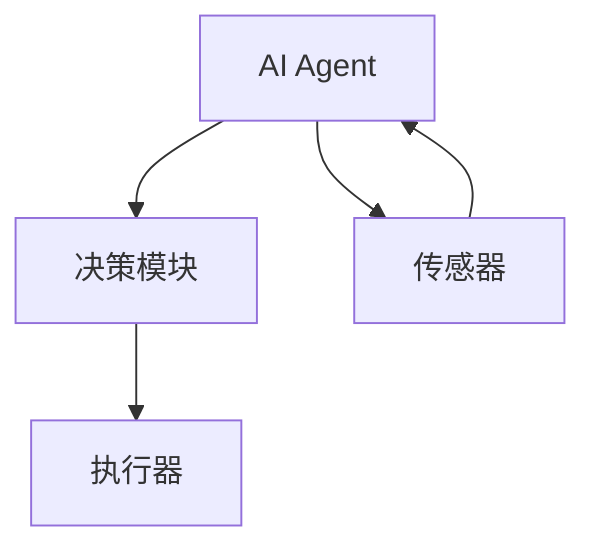

                 


# AI Agent在智能窗台中的室内植物照料

> 关键词：AI Agent，智能窗台，室内植物，物联网，植物照料

> 摘要：本文详细探讨了AI Agent在智能窗台中的应用，特别是在室内植物照料中的技术原理和实现方案。通过分析AI Agent与物联网技术的结合，展示了如何利用机器学习算法和系统架构设计来实现智能植物监测与管理。文章还提供了具体的项目实战案例，帮助读者从理论到实践全面掌握相关技术。

---

## 第一部分: AI Agent与智能窗台的背景介绍

### 第1章: AI Agent与智能窗台概述

#### 1.1 问题背景与描述
室内植物的照料是一个常见但容易被忽视的问题。随着城市化进程的加快，越来越多的人生活在公寓或小空间中，种植室内植物成为一种重要的生活美化和空气净化方式。然而，很多人缺乏时间和专业知识来有效照料植物，导致植物枯萎或生长不良。AI Agent的引入可以解决这一问题，通过自动化监测和管理，确保植物获得最佳的生长环境。

#### 1.2 智能窗台的概念与目标
智能窗台是一种集成物联网（IoT）和人工智能（AI）技术的系统，旨在为室内植物提供智能化的监测和管理服务。通过传感器和AI算法，智能窗台能够实时监测植物的生长环境，并根据数据调整光照、温度、湿度等条件，确保植物健康生长。

---

### 第2章: AI Agent与物联网技术的核心联系

#### 2.1 AI Agent的基本原理
AI Agent是一种能够感知环境、执行任务并做出决策的智能体。在室内植物照料中，AI Agent负责接收传感器数据，分析植物的生长状态，并根据预设的规则或机器学习模型做出调整建议。

#### 2.2 物联网技术在智能窗台中的应用
物联网技术通过传感器和通信模块，实时采集植物的环境数据（如光照、温度、湿度等），并将数据传输到AI Agent进行分析。AI Agent根据分析结果，通过执行器（如智能灯、加湿器等）调整环境条件，优化植物生长。

---

### 第3章: AI Agent在室内植物照料中的算法原理

#### 3.1 基于机器学习的植物监测算法
机器学习算法是AI Agent的核心，用于分析传感器数据并预测植物的生长状态。常用的算法包括决策树、随机森林和神经网络等。通过训练模型，AI Agent能够识别植物的健康状况，并预测未来的变化趋势。

#### 3.2 算法实现与代码示例
以下是基于机器学习的植物监测算法的代码示例：

```python
import numpy as np
from sklearn.tree import DecisionTreeClassifier

# 示例数据集（特征：光照、温度、湿度；标签：植物健康状态）
X = np.array([[80, 22, 60],  # 光照80，温度22，湿度60
              [70, 20, 55],  # 光照70，温度20，湿度55
              [60, 25, 65],  # 光照60，温度25，湿度65
              [90, 18, 70]]) # 光照90，温度18，湿度70

y = np.array([1, 0, 1, 1])  # 标签：1表示健康，0表示不健康

# 训练决策树模型
model = DecisionTreeClassifier()
model.fit(X, y)

# 预测新数据点的健康状态
new_data = np.array([[75, 22, 60]])
print("预测结果：", model.predict(new_data))
```

---

### 第4章: 系统分析与架构设计

#### 4.1 系统功能需求分析
智能窗台系统需要实现以下功能：
1. **数据采集**：通过传感器采集植物的光照、温度、湿度等数据。
2. **数据处理**：对采集的数据进行清洗和预处理。
3. **AI决策**：利用机器学习模型分析数据，生成决策建议。
4. **执行控制**：根据决策结果，通过执行器调整环境条件。

#### 4.2 系统架构设计
以下是智能窗台系统的架构图：



---

### 第5章: 项目实战与实现

#### 5.1 环境搭建与工具安装
- **开发环境**：推荐使用Python 3.8及以上版本。
- **工具安装**：需要安装以下库：
  ```bash
  pip install numpy scikit-learn matplotlib
  ```

#### 5.2 系统核心功能实现
以下是数据采集和处理的代码示例：

```python
import numpy as np
import pandas as pd
import time

# 模拟传感器数据采集
def collect_data():
    light = np.random.uniform(10, 100)  # 光照强度
    temperature = np.random.uniform(15, 30)  # 温度
    humidity = np.random.uniform(30, 90)    # 湿度
    return [light, temperature, humidity]

# 数据采集与存储
data = []
for _ in range(10):
    measurements = collect_data()
    data.append(measurements)
    time.sleep(1)  # 每隔1秒采集一次数据

# 数据预处理
df = pd.DataFrame(data, columns=['光照', '温度', '湿度'])
print("数据预处理结果：")
print(df)
```

---

## 第六步：总结与建议

通过本文的详细分析，我们可以看到AI Agent在智能窗台中的应用潜力巨大。结合物联网技术和机器学习算法，可以实现室内植物的智能化监测与管理。未来，随着技术的不断发展，智能窗台系统将更加智能化和个性化，为人们提供更优质的植物照料体验。

### 最佳实践 Tips
1. 在实际项目中，建议使用高效的机器学习模型，并定期更新模型以适应不同的植物种类和环境条件。
2. 确保传感器和执行器的可靠性，避免因硬件故障导致系统运行不稳定。
3. 定期检查系统数据，确保数据的准确性和完整性。

---

作者：AI天才研究院/AI Genius Institute & 禅与计算机程序设计艺术 /Zen And The Art of Computer Programming

