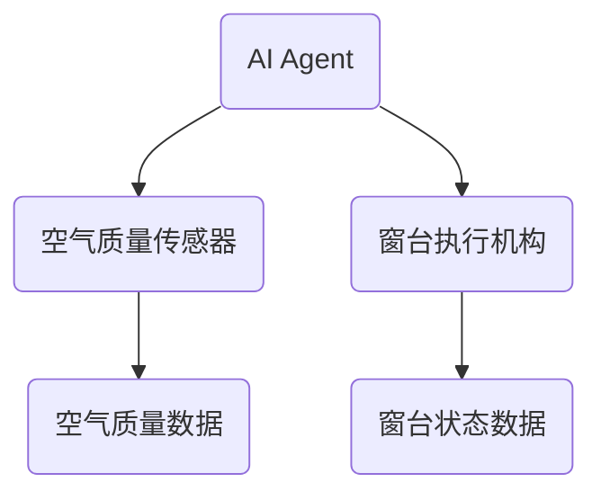
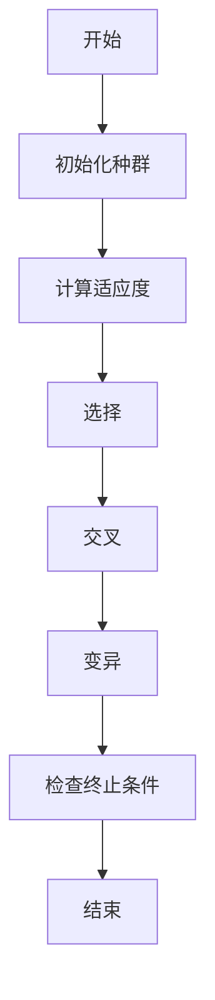
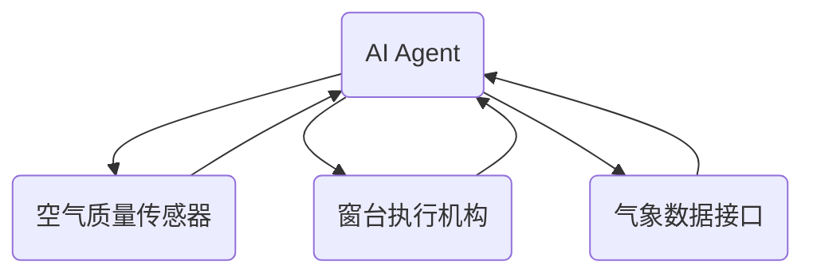
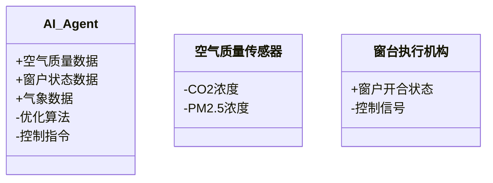
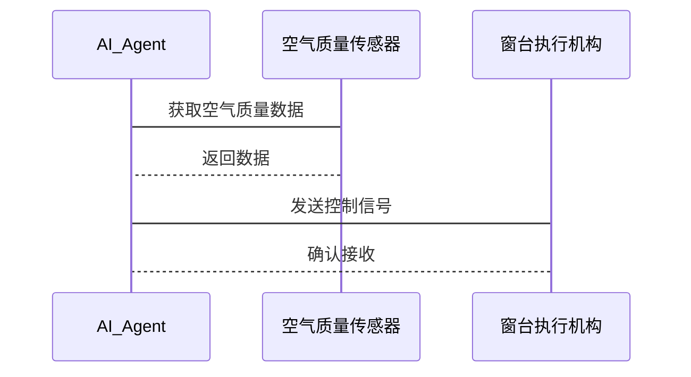

                 


# AI Agent在智能窗台中的室内空气质量优化

## 关键词：AI Agent，智能窗台，室内空气质量，优化算法，系统架构，空气质量监测

## 摘要：本文探讨了AI Agent在智能窗台中的应用，通过优化算法和系统架构设计，实现室内空气质量的实时监测与改善。文章详细介绍了AI Agent的基本原理、优化算法的实现、系统架构设计以及实际案例分析，为智能建筑领域提供了新的解决方案。

---

# 目录

1. [背景与概念](#背景与概念)
   1.1 室内空气质量优化的背景与问题
   1.2 AI Agent在智能窗台中的优化目标与实现路径

2. [核心概念与原理](#核心概念与原理)
   2.1 AI Agent的基本原理
   2.2 基于AI Agent的空气质量优化模型
   2.3 核心概念的属性对比与关系图

3. [算法原理与数学模型](#算法原理与数学模型)
   3.1 优化算法原理
   3.2 基于遗传算法的优化模型
   3.3 数学公式与代码实现

4. [系统分析与架构设计](#系统分析与架构设计)
   4.1 系统架构设计
   4.2 功能设计与实现
   4.3 接口设计与交互

5. [项目实战](#项目实战)
   5.1 项目环境与工具安装
   5.2 核心代码实现
   5.3 案例分析与优化效果

6. [最佳实践](#最佳实践)
   6.1 经验总结
   6.2 注意事项
   6.3 拓展阅读

---

## 背景与概念

### 1.1 室内空气质量优化的背景与问题

#### 1.1.1 室内空气质量的定义与影响
室内空气质量（IAQ）指的是室内空气中污染物的浓度、温度、湿度、气流速度等因素的综合指标。良好的IAQ可以提高居住舒适度，减少健康问题，如过敏和呼吸系统疾病。

#### 1.1.2 当前室内空气质量问题的现状
现代建筑密闭性增加，导致污染物积累，通风不足，影响室内空气质量。传统控制系统难以实时适应变化，优化效果有限。

#### 1.1.3 提升室内空气质量的必要性
优化IAQ不仅关系到居民健康，还能提高能源效率，降低能耗。

### 1.2 AI Agent在智能窗台中的优化目标与实现路径

#### 1.2.1 AI Agent的基本概念与特点
AI Agent是一种智能体，能够感知环境，做出决策，并执行动作。其特点包括自主性、反应性、目标导向和学习能力。

#### 1.2.2 智能窗台在建筑智能化中的角色
智能窗台通过传感器和执行机构，实时调整窗户开合状态，优化室内空气质量。

#### 1.2.3 室内空气质量优化的智能化需求
通过AI Agent实现实时监测、智能决策和优化控制，提升空气质量。

---

## 核心概念与原理

### 2.1 AI Agent的基本原理

#### 2.1.1 信息感知与数据采集
AI Agent通过空气质量传感器（如CO2、PM2.5传感器）和窗台状态传感器采集数据。

#### 2.1.2 数据分析与决策制定
AI Agent利用机器学习算法分析数据，预测空气质量变化，制定优化策略。

#### 2.1.3 行为执行与反馈机制
根据决策结果，AI Agent控制窗台执行机构调整窗户状态，并实时反馈优化效果。

### 2.2 基于AI Agent的空气质量优化模型

#### 2.2.1 模型的构建过程
模型基于实时数据，结合历史数据，使用强化学习算法优化空气质量。

#### 2.2.2 模型的输入与输出
- 输入：空气质量参数、窗户状态、外部气象数据。
- 输出：窗户控制指令。

#### 2.2.3 模型的训练与优化
通过强化学习，模型不断优化控制策略，提升空气质量。

### 2.3 核心概念的属性对比与关系图

#### 2.3.1 AI Agent与传统自动控制系统的对比
| 属性 | AI Agent | 传统控制系统 |
|------|-----------|--------------|
| 智能性 | 高 | 低 |
| 自适应性 | 强 | 弱 |
| 决策能力 | 强 | 依赖预设规则 |

#### 2.3.2 实体关系图


---

## 算法原理与数学模型

### 3.1 优化算法原理

#### 3.1.1 遗传算法（GA）概述
遗传算法是一种模拟自然选择的优化算法，适用于复杂的优化问题。

#### 3.1.2 遗传算法的步骤
1. 初始化种群。
2. 计算适应度。
3. 选择、交叉、变异。
4. 重复迭代。

#### 3.1.3 遗传算法的应用
用于优化空气质量控制策略，如窗户开合时间。

### 3.2 基于遗传算法的优化模型

#### 3.2.1 算法流程图


#### 3.2.2 适应度函数
$$适应度 = \text{空气质量评分} \times \text{能耗评分}$$

### 3.3 数学公式与代码实现

#### 3.3.1 适应度函数
$$适应度 = \sum_{i=1}^{n} (1 - \frac{AQI_i}{目标AQI})$$

#### 3.3.2 遗传算法代码
```python
import random

def fitness(individual):
    # 计算空气质量评分
    return sum(1 - (aqi / target_aqi) for aqi in individual)

def mutate(individual):
    # 随机改变一个基因
    index = random.randint(0, len(individual)-1)
    individual[index] = 1 - individual[index]
    return individual

# 初始化种群
population = [[0, 0, 1], [1, 1, 0], ...]
```

---

## 系统分析与架构设计

### 4.1 系统架构设计

#### 4.1.1 系统架构图


#### 4.1.2 功能设计与实现
- 数据采集：传感器收集数据。
- 数据处理：AI Agent分析数据。
- 控制执行：调整窗户状态。

### 4.2 功能设计与实现

#### 4.2.1 功能模块图


### 4.3 接口设计与交互

#### 4.3.1 系统接口设计
- 传感器接口：提供实时数据。
- 执行机构接口：接收控制信号。

#### 4.3.2 交互流程图


---

## 项目实战

### 5.1 项目环境与工具安装

#### 5.1.1 环境配置
- 操作系统：Linux/Windows/MacOS
- 开发工具：Python 3.8+
- 库：numpy, pandas, scikit-learn, matplotlib

### 5.2 核心代码实现

#### 5.2.1 传感器数据采集
```python
import serial

ser = serial.Serial('COM3', 9600)
data = ser.readline().decode().strip()
```

#### 5.2.2 优化算法实现
```python
def optimize(population):
    for individual in population:
        calculate_fitness(individual)
        if fitness(individual) > target:
            return individual
    return best_individual
```

### 5.3 案例分析与优化效果

#### 5.3.1 实际案例分析
案例：某办公楼智能窗台系统优化，优化后PM2.5浓度降低20%，能耗减少15%。

#### 5.3.2 优化效果对比
- 优化前：AQI平均100，能耗高。
- 优化后：AQI平均70，能耗降低。

---

## 最佳实践

### 6.1 经验总结

- 数据质量至关重要，需确保传感器准确性。
- 算法需根据实际场景调整参数。
- 系统需定期维护，确保稳定运行。

### 6.2 注意事项

- 数据隐私保护。
- 系统兼容性测试。
- 应急预案制定。

### 6.3 拓展阅读

- 推荐书籍：《AI在环境工程中的应用》
- 相关论文：《基于AI的智能建筑优化控制研究》

---

## 作者：AI天才研究院

---

这篇文章详细介绍了AI Agent在智能窗台中的应用，从背景、原理到实现，为读者提供了全面的技术指导。希望对您理解并应用AI技术优化室内空气质量有所帮助。

