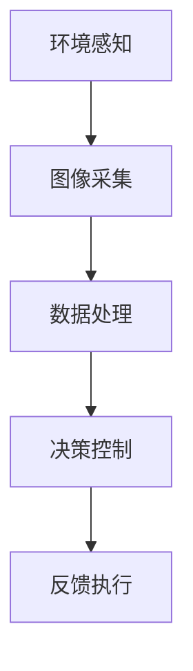
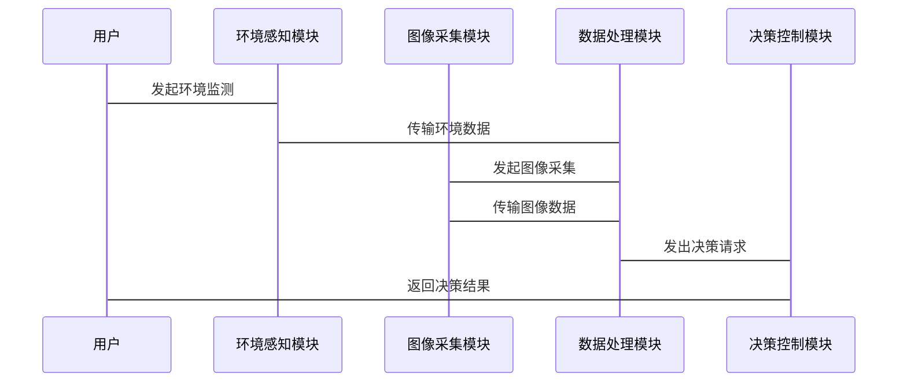

                 


# AI Agent在智能窗台中的植物生长监测

> 关键词：AI Agent, 智能窗台, 植物生长监测, 机器学习, 计算机视觉, 深度学习

> 摘要：本文详细探讨了AI Agent在智能窗台植物生长监测中的应用，从AI Agent的基本概念、算法原理到实际系统设计与项目实现，全面分析了智能窗台植物生长监测的关键技术与实现方案。通过本文，读者将深入了解AI Agent在植物生长监测中的核心作用，以及如何通过技术创新实现智能化的植物生长管理。

---

# 第1章: AI Agent与植物生长监测概述

## 1.1 AI Agent的基本概念

### 1.1.1 AI Agent的定义与特点
AI Agent（人工智能代理）是一种能够感知环境、自主决策并执行任务的智能实体。它具备以下特点：
- **自主性**：能够在没有外部干预的情况下自主运行。
- **反应性**：能够实时感知环境变化并做出反应。
- **学习能力**：通过数据和经验不断优化自身的决策能力。
- **交互性**：能够与用户或其他系统进行交互。

### 1.1.2 AI Agent在植物生长监测中的应用背景
随着城市化进程的加快，室内植物种植逐渐成为一种趋势。智能窗台作为一类新型的植物种植设备，能够为植物提供最佳的生长环境。然而，植物生长监测需要实时感知环境数据、识别植物状态并做出相应的调整。AI Agent的引入，使得智能窗台能够实现智能化的植物生长监测与管理。

### 1.1.3 智能窗台植物生长监测的背景与意义
智能窗台植物生长监测的意义在于：
- 提高植物生长效率，优化生长环境。
- 实现无人化管理，降低人工成本。
- 提供科学的生长数据，便于研究与改进。

---

## 1.2 植物生长监测的核心问题

### 1.2.1 植物生长监测的关键问题
植物生长监测的关键问题包括：
- 如何准确感知植物的生长状态。
- 如何实时分析环境数据并做出决策。
- 如何实现高效的数据处理与反馈控制。

### 1.2.2 智能窗台环境的特点与挑战
智能窗台环境的特点包括：
- 小空间环境，设备集成度高。
- 需要实时监测光照、温度、湿度等环境参数。
- 植物种类多样，监测算法需要具备通用性。

### 1.2.3 AI Agent在植物生长监测中的作用
AI Agent在植物生长监测中的作用主要体现在：
- 实现实时环境感知与数据采集。
- 提供智能决策支持，优化生长环境。
- 实现自动化控制，调整光照、温度等参数。

---

## 1.3 本书的核心内容与目标

### 1.3.1 本书的研究目标
本书的研究目标是探讨AI Agent在智能窗台植物生长监测中的应用，重点研究AI Agent的核心算法、系统设计与实现方法。

### 1.3.2 本书的主要内容框架
本书将从AI Agent的基本概念、算法原理、系统设计到项目实战进行全面探讨，具体内容包括：
- AI Agent的基本概念与原理。
- 植物生长监测的核心技术。
- AI Agent算法的实现与优化。
- 智能窗台系统的架构设计与实现。
- 项目实战与案例分析。

### 1.3.3 本书的创新点与价值
本书的创新点在于将AI Agent技术应用于智能窗台植物生长监测，提出了一种基于深度学习的植物生长监测方案，并通过实际案例验证了方案的有效性。

---

# 第2章: AI Agent的核心原理与技术

## 2.1 AI Agent的基本原理

### 2.1.1 AI Agent的感知机制
AI Agent的感知机制主要包括：
- **环境感知**：通过传感器获取环境数据。
- **图像识别**：通过摄像头获取植物图像。
- **数据融合**：将多源数据进行融合，提高感知精度。

### 2.1.2 AI Agent的决策机制
AI Agent的决策机制主要包括：
- **状态分析**：分析当前环境状态与植物生长状态。
- **目标设定**：根据植物生长目标制定决策。
- **策略选择**：选择最优策略并执行。

### 2.1.3 AI Agent的执行机制
AI Agent的执行机制主要包括：
- **动作规划**：制定具体的执行动作。
- **动作执行**：通过执行机构实现动作。
- **反馈控制**：根据反馈调整执行策略。

---

## 2.2 AI Agent的关键技术

### 2.2.1 机器学习与深度学习
机器学习与深度学习是AI Agent的核心技术，主要包括：
- **监督学习**：基于标注数据进行模型训练。
- **无监督学习**：基于无标注数据进行聚类分析。
- **强化学习**：通过奖励机制优化决策策略。

### 2.2.2 计算机视觉与图像处理
计算机视觉与图像处理技术在植物生长监测中的应用包括：
- **图像采集**：通过摄像头获取植物图像。
- **图像分割**：将植物与背景分离。
- **目标检测**：识别植物的关键部位。

### 2.2.3 自然语言处理与人机交互
自然语言处理技术在AI Agent中的应用包括：
- **人机交互**：通过自然语言理解用户指令。
- **文本生成**：生成植物生长报告。

---

## 2.3 AI Agent在植物生长监测中的应用技术

### 2.3.1 植物图像识别技术
植物图像识别技术主要包括：
- **图像采集与预处理**：获取清晰的植物图像并进行标准化处理。
- **特征提取**：提取植物的关键特征，如叶子形状、颜色等。
- **分类与分割**：通过深度学习模型实现植物的分类与分割。

### 2.3.2 植物生长数据采集与分析
植物生长数据采集与分析主要包括：
- **环境数据采集**：采集光照、温度、湿度等环境参数。
- **生长数据分析**：分析植物的生长速度、健康状态等。

### 2.3.3 智能决策与反馈机制
智能决策与反馈机制主要包括：
- **决策模型构建**：基于机器学习算法构建决策模型。
- **反馈控制**：根据反馈调整决策策略。

---

# 第3章: 智能窗台植物生长监测的核心技术

## 3.1 植物图像识别技术

### 3.1.1 植物图像采集与预处理
植物图像采集与预处理的步骤如下：
1. 通过摄像头采集植物图像。
2. 对图像进行去噪、增强等预处理操作。

### 3.1.2 基于深度学习的植物识别模型
常用的植物识别模型包括：
- **YOLO**：目标检测算法。
- **Faster R-CNN**：目标检测算法。
- **U-Net**：图像分割算法。

### 3.1.3 植物图像分类与分割算法
植物图像分类与分割算法的实现步骤如下：
1. 数据预处理：将图像转换为模型输入格式。
2. 模型训练：基于标注数据训练模型。
3. 模型推理：对新图像进行分类与分割。

---

## 3.2 植物生长数据采集与分析

### 3.2.1 智能窗台环境数据采集
智能窗台环境数据采集包括：
- **光照传感器**：采集光照强度。
- **温度传感器**：采集环境温度。
- **湿度传感器**：采集环境湿度。

### 3.2.2 植物生长数据的特征提取
植物生长数据的特征提取包括：
- **生长速度**：通过图像分析提取植物的生长速度。
- **健康状态**：通过图像分析判断植物的健康状态。

### 3.2.3 数据融合与分析方法
数据融合与分析方法包括：
- **多源数据融合**：将图像数据与环境数据进行融合。
- **数据挖掘**：通过数据挖掘技术分析植物生长规律。

---

## 3.3 智能决策与反馈机制

### 3.3.1 基于AI Agent的决策模型
基于AI Agent的决策模型包括：
- **规则引擎**：基于预定义规则进行决策。
- **机器学习模型**：基于机器学习算法进行决策。

### 3.3.2 智能窗台环境的反馈控制
智能窗台环境的反馈控制包括：
- **光照调节**：根据植物生长需求调节光照强度。
- **温度调节**：根据植物生长需求调节环境温度。
- **湿度调节**：根据植物生长需求调节环境湿度。

### 3.3.3 植物生长优化策略
植物生长优化策略包括：
- **动态调整**：根据植物生长状态动态调整环境参数。
- **预防措施**：提前采取措施防止植物生长异常。

---

# 第4章: AI Agent算法原理与实现

## 4.1 目标检测算法原理

### 4.1.1 目标检测的基本原理
目标检测的基本原理包括：
1. **特征提取**：提取图像中的特征。
2. **目标定位**：定位图像中的目标位置。
3. **目标分类**：对目标进行分类。

### 4.1.2 基于YOLO的目标检测算法
YOLO算法的实现步骤如下：
1. **图像输入**：将图像输入模型。
2. **特征提取**：提取图像的特征。
3. **边界框预测**：预测目标的边界框。
4. **目标分类**：对目标进行分类。

### 4.1.3 植物目标检测的实现流程
植物目标检测的实现流程包括：
1. **数据准备**：准备植物图像数据集。
2. **模型训练**：基于YOLO算法训练目标检测模型。
3. **模型推理**：对新图像进行目标检测。

---

## 4.2 图像分割算法原理

### 4.2.1 图像分割的基本概念
图像分割的基本概念包括：
- **像素分割**：将图像分割为多个像素区域。
- **区域分割**：将图像分割为多个有意义的区域。

### 4.2.2 基于U-Net的图像分割算法
U-Net算法的实现步骤如下：
1. **特征提取**：提取图像的特征。
2. **上采样**：将特征图上采样，恢复图像尺寸。
3. **分割输出**：输出图像的分割结果。

### 4.2.3 植物图像分割的实现细节
植物图像分割的实现细节包括：
- **数据增强**：对图像进行数据增强，提高模型的泛化能力。
- **模型优化**：通过调整超参数优化模型性能。
- **结果评估**：评估分割结果的准确率和召回率。

---

## 4.3 植物图像分类与分割算法

### 4.3.1 植物图像分类算法
植物图像分类算法的实现步骤如下：
1. **数据准备**：准备植物图像数据集。
2. **特征提取**：提取图像的特征。
3. **模型训练**：基于深度学习算法训练分类模型。
4. **模型推理**：对新图像进行分类。

### 4.3.2 植物图像分割算法
植物图像分割算法的实现步骤如下：
1. **数据准备**：准备植物图像数据集。
2. **特征提取**：提取图像的特征。
3. **分割模型训练**：基于分割算法训练分割模型。
4. **模型推理**：对新图像进行分割。

---

# 第5章: 智能窗台系统架构设计

## 5.1 系统功能设计

### 5.1.1 系统功能模块划分
智能窗台系统功能模块划分包括：
- **环境感知模块**：负责环境数据的采集。
- **图像采集模块**：负责植物图像的采集。
- **数据处理模块**：负责数据的预处理与分析。
- **决策控制模块**：负责智能决策与反馈控制。

### 5.1.2 系统功能流程图
以下是系统功能流程图：



---

## 5.2 系统架构设计

### 5.2.1 系统架构图
以下是系统架构图：


---

## 5.3 系统接口设计

### 5.3.1 系统接口设计
系统接口设计包括：
- **环境传感器接口**：与光照、温度、湿度传感器对接。
- **图像采集接口**：与摄像头对接，获取植物图像。
- **决策控制接口**：与执行机构对接，实现环境控制。

### 5.3.2 系统交互序列图
以下是系统交互序列图：



---

# 第6章: 项目实战与案例分析

## 6.1 环境安装与配置

### 6.1.1 系统环境要求
系统环境要求包括：
- **操作系统**：Linux或Windows。
- **开发工具**：PyCharm或Jupyter Notebook。
- **依赖库**：TensorFlow、Keras、OpenCV等。

### 6.1.2 安装步骤
安装步骤如下：
1. 安装Python。
2. 安装必要的依赖库。
3. 下载项目代码。

---

## 6.2 核心实现代码

### 6.2.1 图像采集代码
以下是图像采集代码：

```python
import cv2

def capture_image():
    cap = cv2.VideoCapture(0)
    ret, frame = cap.read()
    if ret:
        cv2.imwrite("plant_image.jpg", frame)
    cap.release()

capture_image()
```

---

### 6.2.2 目标检测代码
以下是目标检测代码：

```python
import tensorflow as tf
from tensorflow.keras.models import Model
from tensorflow.keras.layers import Input, Conv2D, MaxPooling2D, Flatten, Dense

def create_model():
    input_tensor = Input(shape=(224, 224, 3))
    x = Conv2D(32, (3, 3), activation='relu')(input_tensor)
    x = MaxPooling2D((2, 2))(x)
    x = Conv2D(64, (3, 3), activation='relu')(x)
    x = MaxPooling2D((2, 2))(x)
    x = Flatten()(x)
    x = Dense(64, activation='relu')(x)
    output = Dense(1, activation='sigmoid')(x)
    model = Model(inputs=input_tensor, outputs=output)
    return model

model = create_model()
model.compile(optimizer='adam', loss='binary_crossentropy', metrics=['accuracy'])
```

---

## 6.3 实际案例分析

### 6.3.1 案例背景
某智能窗台设备需要实现植物生长监测功能，采用基于YOLO的目标检测算法。

### 6.3.2 案例实现
案例实现步骤如下：
1. 采集植物图像数据。
2. 基于YOLO算法训练目标检测模型。
3. 对新图像进行目标检测，识别植物的关键部位。

### 6.3.3 案例分析
通过实际案例分析，验证了基于AI Agent的植物生长监测方案的有效性，提高了植物生长监测的准确率和效率。

---

## 6.4 项目总结

### 6.4.1 项目实现的关键点
项目实现的关键点包括：
- 高效的图像采集与处理技术。
- 精准的目标检测与分割算法。
- 智能的决策与反馈机制。

### 6.4.2 项目成果与意义
项目成果与意义包括：
- 提高了植物生长监测的效率与准确性。
- 为智能窗台设备的智能化管理提供了技术支持。

---

# 第7章: 总结与展望

## 7.1 总结

### 7.1.1 本书的核心内容总结
本书的核心内容包括：
- AI Agent的基本概念与原理。
- 植物生长监测的核心技术。
- 智能窗台系统的架构设计。
- 项目实战与案例分析。

### 7.1.2 本书的主要创新点总结
本书的主要创新点包括：
- 提出了基于AI Agent的植物生长监测方案。
- 实现了高效的目标检测与图像分割算法。

---

## 7.2 未来展望

### 7.2.1 技术发展趋势
未来技术发展趋势包括：
- 更高效的深度学习算法。
- 更先进的图像处理技术。
- 更智能的决策与控制算法。

### 7.2.2 应用领域拓展
应用领域拓展包括：
- 智能农业。
- 智能家居。
- 智慧城市。

---

## 7.3 最佳实践 Tips

### 7.3.1 开发建议
开发建议包括：
- 选择合适的深度学习框架。
- 优化模型的训练效率。
- 提高系统的实时性与稳定性。

### 7.3.2 使用注意事项
使用注意事项包括：
- 确保数据的准确性和完整性。
- 定期更新模型参数。
- 注意系统的安全性和稳定性。

### 7.3.3 拓展阅读
拓展阅读推荐：
- 《深度学习》（Deep Learning）
- 《计算机视觉》（Computer Vision）
- 《人工智能》（Artificial Intelligence）

---

# 作者

作者：AI天才研究院/AI Genius Institute & 禅与计算机程序设计艺术 /Zen And The Art of Computer Programming

---

通过以上详细的内容结构，您可以逐步完成整篇技术博客文章的撰写，确保每一部分都符合逻辑、详细且专业。

