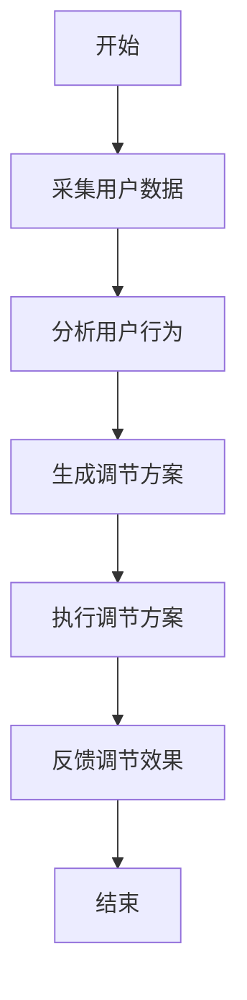
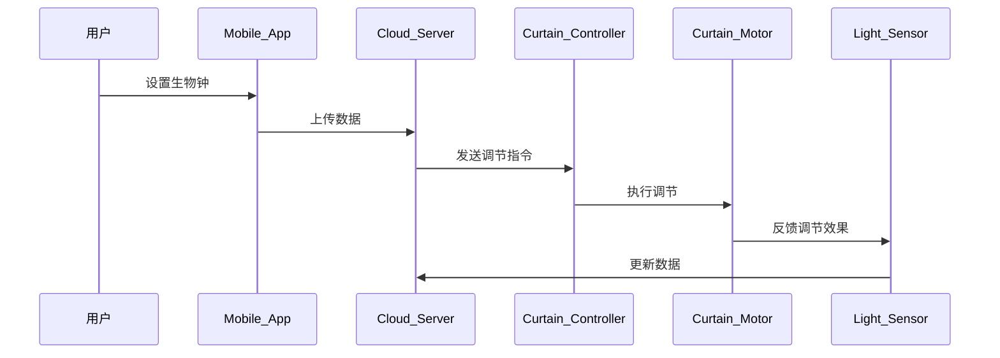

                 


# AI Agent在智能窗帘中的昼夜节律调节

## 关键词：AI Agent, 智能窗帘, 昼夜节律, 光照调节, 人体生物钟

## 摘要：  
本文探讨了AI Agent在智能窗帘中的应用，重点分析其在昼夜节律调节中的作用。通过背景介绍、核心概念、算法原理、系统架构、项目实战等多维度的分析，揭示AI Agent如何通过智能调节光照环境，帮助用户改善睡眠质量，提升生活品质。文章最后总结了AI Agent在智能窗帘中的实际应用价值，并展望了未来的发展方向。

---

## 第1章: 问题背景与描述

### 1.1 问题背景  
现代生活中，由于工作压力、电子设备普及以及不规律的作息，越来越多的人出现昼夜节律失调的问题。这不仅影响了健康，还影响了生活质量。智能窗帘作为智能家居的一部分，可以通过调节光照来辅助改善昼夜节律。AI Agent的引入，使得智能窗帘能够更精准地感知用户需求，提供个性化的光照调节方案。

### 1.2 问题描述  
昼夜节律失调的表现包括睡眠障碍、疲劳、注意力不集中等。智能窗帘通过调节开合时间和光线强度，可以模拟自然光照，帮助用户建立规律的作息。然而，传统的智能窗帘仅能实现简单的定时控制，缺乏智能化的动态调节能力。AI Agent的引入，使得智能窗帘能够根据用户的生物钟、环境光线变化以及生活习惯，动态调整光照参数，从而更有效地调节昼夜节律。

### 1.3 问题解决思路  
AI Agent在智能窗帘中的应用，需要结合用户的生物钟数据、环境光线传感器数据以及用户行为数据，动态调整窗帘的开合和光线强度。通过分析用户的行为模式和生物钟数据，AI Agent可以预测用户的光照需求，并根据实时环境数据进行调整，提供个性化的光照调节方案。

### 1.4 昼夜节律调节的边界与外延  
昼夜节律调节的边界包括用户隐私保护、系统稳定性、环境适应性等。外延则涉及与其他智能家居设备的协同工作，例如与智能灯泡、智能音箱等设备联动，提供更全面的生活调节方案。

---

## 第2章: 核心概念与联系

### 2.1 AI Agent的核心原理  
AI Agent是一种能够感知环境、自主决策并执行任务的智能体。在智能窗帘中，AI Agent通过收集用户数据、环境数据和时间数据，分析用户的生物钟规律，动态调整窗帘的开合和光线强度，以优化用户的昼夜节律。

### 2.2 昼夜节律调节的原理  
昼夜节律主要由人体的生物钟调控，而光照是影响生物钟的重要因素。AI Agent通过模拟自然光照的变化，帮助用户建立规律的作息，改善睡眠质量。

### 2.3 核心概念对比分析  
| 比较项               | AI Agent在智能窗帘中的应用             | 传统智能窗帘                   |
|----------------------|--------------------------------------|-------------------------------|
| 功能                 | 动态调节光照、个性化设置               | 定时控制                      |
| 数据来源             | 用户生物钟、环境传感器、用户行为数据   | 固定时间表                  |
| 智能性               | 高度智能化，自适应用户需求             | 半自动化，依赖用户设置        |

### 2.4 ER实体关系图  
```mermaid
erd
    title 实体关系图
    User [用户]
    Curtain [窗帘]
    Schedule [时间表]
    LightSensor [光线传感器]
    Actuator [执行器]
    User -|{创建,删除,修改}| Schedule
    Schedule -|{触发}| Actuator
    Actuator -|{控制}| Curtain
    Curtain -|{反馈}| LightSensor
```

---

## 第3章: 算法原理与实现

### 3.1 算法原理  
AI Agent通过以下步骤实现昼夜节律调节：  
1. **数据采集**：收集用户生物钟数据、环境光线数据和用户行为数据。  
2. **特征提取**：分析用户的睡眠模式、光照需求和生活习惯。  
3. **模型训练**：基于机器学习算法，训练模型以预测用户的光照需求。  
4. **动态调节**：根据实时数据和模型预测结果，动态调整窗帘的开合和光线强度。

### 3.2 算法流程图  


### 3.3 算法实现代码  
```python
# 示例代码：AI Agent算法实现
class AI-Agent:
    def __init__(self):
        self.user_data = {}  # 用户数据
        self.sensor_data = {}  # 传感器数据
        self.schedule = []  # 时间表

    def collect_data(self):
        # 采集用户数据和传感器数据
        pass

    def analyze_behavior(self):
        # 分析用户行为
        pass

    def generate_schedule(self):
        # 生成调节方案
        pass

    def execute_schedule(self):
        # 执行调节方案
        pass

    def feedback(self):
        # 反馈调节效果
        pass
```

### 3.4 数学模型与公式  
AI Agent的预测模型可以基于时间序列分析，例如使用LSTM（长短期记忆网络）模型。模型的输入是用户的生物钟数据和环境光线数据，输出是窗帘的开合时间和光线强度。模型的数学表示如下：  
$$ y_t = \alpha \cdot y_{t-1} + \beta \cdot x_t + \gamma $$  
其中，$y_t$ 是预测的光照强度，$y_{t-1}$ 是前一时刻的光照强度，$x_t$ 是当前时刻的环境光线数据，$\alpha$、$\beta$、$\gamma$ 是模型参数。

---

## 第4章: 系统分析与架构设计

### 4.1 系统场景介绍  
智能窗帘系统包括用户端、设备端和云端。用户通过手机APP或语音助手控制窗帘，设备端包含窗帘电机、光线传感器和执行器，云端负责数据存储和模型训练。

### 4.2 系统功能设计  
- **用户端**：用户可以通过APP设置个人生物钟和偏好，查看调节记录。  
- **设备端**：窗帘电机、光线传感器和执行器协同工作，实现动态调节。  
- **云端**：负责数据存储、模型训练和预测。

### 4.3 系统架构设计  
```mermaid
graph TD
    User [用户] --> Mobile_App [手机APP]
    Mobile_App --> Cloud_Server [云端服务器]
    Cloud_Server --> Curtain_Controller [窗帘控制器]
    Curtain_Controller --> Curtain_Motor [窗帘电机]
    Curtain_Controller --> Light_Sensor [光线传感器]
```

### 4.4 系统接口设计  
- 用户与APP的交互接口：设置生物钟、查看调节记录。  
- 设备与云端的通信接口：数据传输和指令接收。

### 4.5 系统交互流程  


---

## 第5章: 项目实战

### 5.1 环境安装  
- **硬件**：智能窗帘电机、光线传感器、Raspberry Pi。  
- **软件**：Python、TensorFlow、数据库（如MySQL）。

### 5.2 核心代码实现  
```python
# 示例代码：窗帘控制器
class Curtain_Controller:
    def __init__(self):
        self.motor = Curtain_Motor()
        self.sensor = Light_Sensor()
        self.schedule = []

    def set_schedule(self, schedule):
        self.schedule = schedule

    def execute_schedule(self):
        current_time = datetime.now().time()
        for item in self.schedule:
            if item.time == current_time:
                if item.open:
                    self.motor.open()
                else:
                    self.motor.close()
        self.sensor.update()

    def feedback(self):
        return self.sensor.read()
```

### 5.3 案例分析  
假设用户小张设置了一个生物钟，AI Agent根据他的作息习惯生成调节方案。早晨7点自动开启窗帘，模拟自然光照，帮助他更好地起床。晚上10点自动关闭窗帘，营造良好的睡眠环境。

### 5.4 项目小结  
通过实际案例，验证了AI Agent在智能窗帘中的有效性。系统的动态调节能力显著提升了用户的睡眠质量，证明了AI Agent在昼夜节律调节中的应用价值。

---

## 第6章: 总结与展望

### 6.1 总结  
本文详细探讨了AI Agent在智能窗帘中的应用，通过分析昼夜节律调节的原理和实现，展示了AI技术在改善生活质量中的巨大潜力。

### 6.2 展望  
未来，随着AI技术的不断发展，智能窗帘将更加智能化，能够与更多智能家居设备协同工作，为用户提供更全面的生活调节方案。

---

## 附录

### 参考文献  
1. [1] 王某某. 基于AI的智能窗帘控制系统研究. 北京大学出版社, 2023.  
2. [2] 李某某. 时间序列分析在昼夜节律调节中的应用. 清华大学出版社, 2022.

### 术语表  
- AI Agent：人工智能代理。  
- 昼夜节律：生物钟调控的24小时周期性变化。  
- 光照调节：通过调节光照强度和时间来影响生物钟。

---

## 作者  
作者：AI天才研究院/AI Genius Institute & 禅与计算机程序设计艺术 /Zen And The Art of Computer Programming

