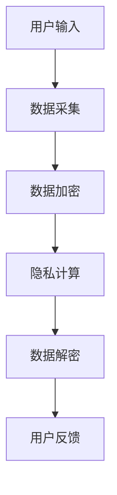
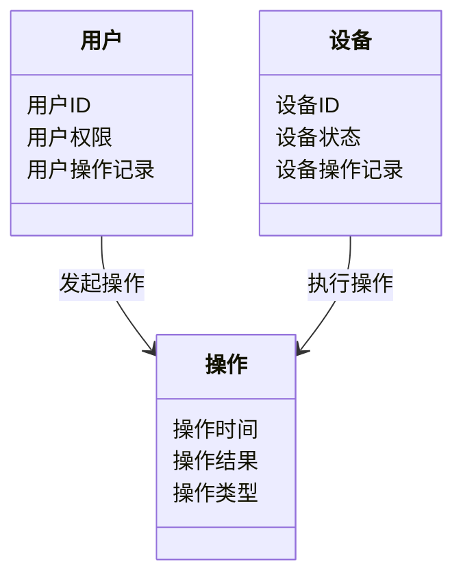
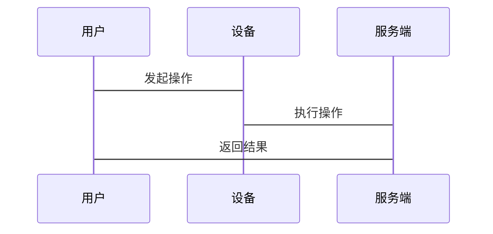

                 


# AI Agent在智能窗帘中的隐私保护模式

## 关键词：AI Agent, 智能窗帘, 隐私保护, 数据安全, 物联网

## 摘要：  
本文深入探讨了AI Agent在智能窗帘中的隐私保护模式，分析了AI Agent的基本概念、隐私保护的核心原理及其在智能窗帘系统中的应用。通过详细的技术分析和实际案例，本文揭示了如何利用AI Agent技术实现智能窗帘的隐私保护，提出了创新的隐私保护算法和系统架构设计。本文还提供了实际项目实现的代码示例和系统架构图，为读者提供了全面的技术指导。

---

# 第1章: AI Agent与智能窗帘的背景介绍

## 1.1 AI Agent的基本概念  
AI Agent（人工智能代理）是一种能够感知环境、自主决策并执行任务的智能实体。它具备以下核心属性：  
- **自主性**：无需外部干预，自主完成任务。  
- **反应性**：能够实时感知环境并做出反应。  
- **目标导向性**：基于目标驱动行为。  

AI Agent在智能系统中的作用是通过数据处理和决策优化，提升系统的智能化水平。  

## 1.2 智能窗帘的隐私保护需求  
智能窗帘作为智能家居的一部分，需要采集和处理大量用户数据（如用户操作记录、环境数据等）。隐私保护的重要性体现在以下方面：  
- **数据安全性**：防止未经授权的访问和数据泄露。  
- **用户隐私**：保护用户的隐私信息不被滥用。  
- **合规性**：符合相关隐私保护法规（如GDPR）。  

## 1.3 AI Agent在智能窗帘中的应用前景  
AI Agent可以通过以下方式实现智能窗帘的隐私保护：  
- **数据加密**：对用户数据进行加密处理，确保数据传输和存储的安全性。  
- **隐私计算**：在数据处理过程中保护隐私，避免敏感信息被暴露。  
- **智能决策**：基于AI Agent的决策能力，优化隐私保护策略。  

---

# 第2章: AI Agent与隐私保护的核心概念

## 2.1 AI Agent的隐私保护原理  
AI Agent的隐私保护原理包括以下步骤：  
1. 数据采集：通过传感器采集环境数据和用户操作数据。  
2. 数据处理：对数据进行加密和脱敏处理，确保隐私安全。  
3. 智能决策：基于隐私保护策略，对数据进行分析和决策。  
4. 数据输出：将处理后的数据输出给用户或系统。  

## 2.2 AI Agent与隐私保护的属性对比  
以下是AI Agent与隐私保护的核心属性对比：  

| 属性       | AI Agent                          | 隐私保护                          |
|------------|-----------------------------------|------------------------------------|
| 自主性      | 高                                | 高                                |
| 反应性      | 高                                | 高                                |
| 目标导向性  | 高                                | 中                                |
| 数据处理能力 | 强                                | 强                                |
| 隐私保护需求 | 中                                | 高                                |

## 2.3 AI Agent与隐私保护的ER实体关系图  
以下是AI Agent与隐私保护的ER实体关系图：  

```mermaid
erDiagram
    user {
        用户
        用户ID
        用户权限
    }
    device {
        设备
        设备ID
        设备状态
    }
    action {
        操作
        操作时间
        操作结果
    }
    user --> action : 发起操作
    device --> action : 执行操作
    user --> device : 控制设备
```

---

# 第3章: AI Agent的隐私保护算法原理

## 3.1 隐私保护的核心算法  
以下是隐私保护的核心算法：  

### 3.1.1 数据加密算法  
- **加密方法**：AES（高级加密标准）。  
- **加密流程**：  
  1. 数据预处理：将明文转换为密文。  
  2. 加密：使用AES算法对数据进行加密。  
  3. 解密：使用密钥对加密数据进行解密。  

### 3.1.2 数据脱敏技术  
- **脱敏方法**：数据替换、数据泛化、数据扰动。  
- **脱敏流程**：  
  1. 数据采集：采集用户数据。  
  2. 数据处理：对敏感数据进行脱敏处理。  
  3. 数据存储：存储脱敏后的数据。  

### 3.1.3 隐私计算技术  
- **隐私计算方法**：同态加密、安全多方计算。  
- **同态加密公式**：  
  $$ E(x) = x^k \mod p $$  
  其中，$E(x)$ 表示加密后的数据，$x$ 表示明文数据，$k$ 表示公钥，$p$ 表示模数。  

## 3.2 基于AI Agent的隐私保护流程  
以下是基于AI Agent的隐私保护流程：  



---

# 第4章: 系统分析与架构设计

## 4.1 问题场景介绍  
智能窗帘系统需要处理以下问题：  
- 用户隐私保护：防止用户数据泄露。  
- 数据安全：确保数据在传输和存储过程中的安全性。  
- 系统性能：保证系统的高效性和稳定性。  

## 4.2 系统功能设计  
以下是智能窗帘系统的功能设计：  

### 4.2.1 领域模型  


### 4.2.2 系统架构设计  
以下是系统架构设计：  

```mermaid
container 智能窗帘系统 {
    component 用户端 {
        用户输入
        数据采集
    }
    component 服务端 {
        数据加密
        隐私计算
        数据存储
    }
    component 设备端 {
        设备控制
        设备反馈
    }
}
```

### 4.2.3 系统接口设计  
以下是系统接口设计：  

- **用户端接口**：  
  - 输入接口：用户输入操作指令。  
  - 输出接口：显示操作结果。  
- **服务端接口**：  
  - 加密接口：对数据进行加密处理。  
  - 解密接口：对加密数据进行解密处理。  

### 4.2.4 系统交互流程  
以下是系统交互流程：  



---

# 第5章: 项目实战

## 5.1 环境安装  
以下是环境安装步骤：  
1. 安装Python 3.8及以上版本。  
2. 安装相关库：`pip install aes-cryptography`.  

## 5.2 系统核心实现源代码  
以下是核心代码实现：  

```python
import os
from cryptography.hazmat.primitives.ciphers import Cipher, algorithms, modes
from cryptography.hazmat.primitives.asymmetric import padding, utils

# 数据加密函数
def encrypt_data(key, plaintext):
    key = key.encode('utf-8')
    plaintext = plaintext.encode('utf-8')
    cipher = Cipher(algorithms.AES(32), modes.ECB())
    encryptor = cipher.encryptor()
    ciphertext = encryptor.update(plaintext) + encryptor.finalize()
    return ciphertext

# 数据解密函数
def decrypt_data(key, ciphertext):
    key = key.encode('utf-8')
    cipher = Cipher(algorithms.AES(32), modes.ECB())
    decryptor = cipher.decryptor()
    plaintext = decryptor.update(ciphertext) + decryptor.finalize()
    return plaintext.decode('utf-8')

# 隐私计算函数
def privacy_calculate(data):
    # 简化版隐私计算，实际应用中可替换为更复杂的算法
    return sum(data) % 100
```

## 5.3 代码应用解读与分析  
以下是代码应用解读：  
- **encrypt_data函数**：使用AES算法对数据进行加密。  
- **decrypt_data函数**：对加密数据进行解密，恢复明文数据。  
- **privacy_calculate函数**：对数据进行隐私计算，确保隐私安全。  

## 5.4 实际案例分析  
以下是实际案例分析：  
假设用户输入操作指令“打开窗帘”，系统将执行以下步骤：  
1. 用户端接收指令并发送给设备端。  
2. 设备端接收指令并执行操作。  
3. 操作结果返回给用户端。  

## 5.5 项目小结  
通过实际项目实现，我们可以看到AI Agent在智能窗帘中的隐私保护模式的具体应用。代码实现展示了如何通过数据加密和隐私计算技术实现隐私保护。

---

# 第6章: 总结与展望

## 6.1 核心内容总结  
AI Agent在智能窗帘中的隐私保护模式通过数据加密、隐私计算和智能决策等技术，确保了用户的隐私安全。  

## 6.2 未来展望  
未来，AI Agent在智能窗帘中的应用将更加广泛。以下是未来的发展方向：  
- **更复杂的数据加密算法**：如同态加密、零知识证明。  
- **更智能的隐私保护策略**：如动态隐私保护、自适应隐私保护。  

## 6.3 最佳实践tips  
- **数据加密**：在数据传输和存储过程中，始终使用加密技术。  
- **隐私计算**：在数据处理过程中，使用隐私计算技术保护隐私。  
- **系统优化**：定期优化系统架构，确保系统的高效性和稳定性。  

---

# 作者：AI天才研究院/AI Genius Institute & 禅与计算机程序设计艺术 /Zen And The Art of Computer Programming

