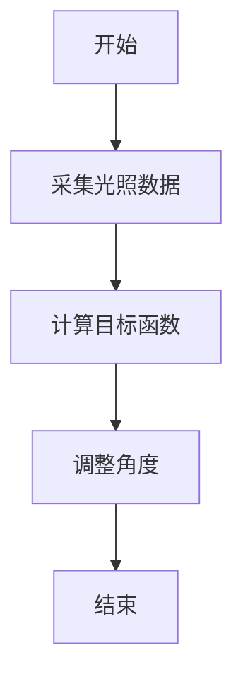
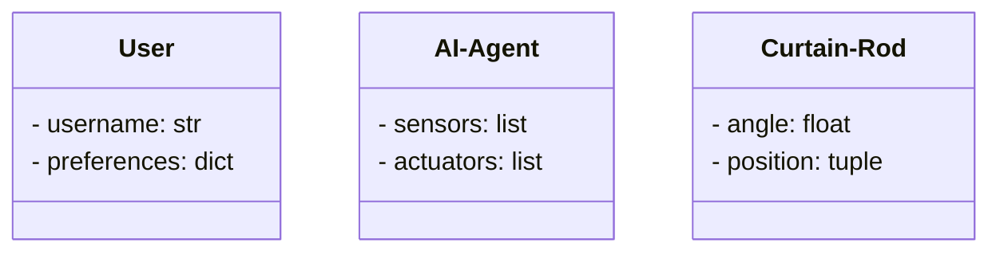
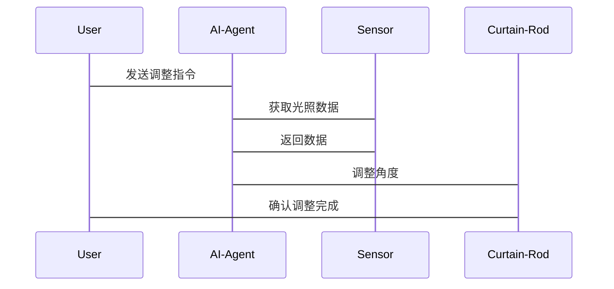

                 


# AI Agent在智能窗帘杆中的日光治疗功能

**关键词**：AI Agent、智能窗帘杆、日光治疗、算法原理、系统架构、项目实战

**摘要**：  
本文探讨了AI Agent在智能窗帘杆中的日光治疗功能，详细分析了日光治疗的重要性、AI Agent的工作原理、算法实现、系统架构设计及实际项目应用。通过结合数学模型、系统架构图和Python代码示例，本文为读者提供了从理论到实践的全面指南。

---

## 第1章: 背景介绍

### 1.1 问题背景
#### 1.1.1 日光治疗的健康意义  
日光治疗是指通过合理调节自然光的照射量来改善人体健康状态。研究表明，适度的日光照射有助于促进维生素D的合成，调节生物钟，改善情绪，增强免疫力。

#### 1.1.2 智能家居的发展趋势  
随着物联网技术的快速发展，智能家居设备逐渐普及。智能窗帘杆作为智能家居的重要组成部分，能够通过自动化控制优化室内光照环境。

#### 1.1.3 AI Agent在智能家居中的应用潜力  
AI Agent（智能代理）是一种能够感知环境、自主决策并执行任务的智能系统。其在智能家居中的应用可以显著提升设备的智能化水平和用户体验。

### 1.2 问题描述
#### 1.2.1 现有窗帘杆的不足  
传统窗帘杆通常只能手动调节角度，无法根据光照强度和用户需求自动调整，难以实现精准的日光治疗功能。

#### 1.2.2 日光治疗功能的需求  
用户希望窗帘杆能够根据光照强度、时间、天气等因素，自动调节角度，以优化日光照射量。

#### 1.2.3 AI Agent在日光治疗中的作用  
AI Agent可以通过整合光照传感器、天气预报等数据，智能调整窗帘杆的角度，实现个性化日光治疗。

### 1.3 问题解决思路
#### 1.3.1 利用AI Agent优化日光照射  
AI Agent通过分析光照数据和用户需求，制定最优的窗帘调整策略。

#### 1.3.2 通过智能窗帘杆实现日光治疗功能  
智能窗帘杆作为执行机构，能够根据AI Agent的指令实时调整角度。

#### 1.3.3 结合光照传感器和AI算法提升用户体验  
通过光照传感器获取实时数据，并结合AI算法优化日光照射量。

### 1.4 边界与外延
#### 1.4.1 系统边界定义  
系统仅关注窗帘杆的日光治疗功能，不涉及其他智能家居设备。

#### 1.4.2 功能的外延与限制  
目前仅考虑光照强度和时间因素，未来可扩展至更多环境因素。

#### 1.4.3 与其他智能家居设备的协同  
未来可与其他设备（如智能灯泡、智能空调）协同工作，进一步优化室内环境。

### 1.5 概念结构与核心要素
#### 1.5.1 AI Agent的核心要素  
- **感知能力**：通过传感器获取光照数据。
- **决策能力**：基于数据制定调整策略。
- **执行能力**：通过窗帘杆执行调整动作。

#### 1.5.2 智能窗帘杆的构成  
- **机械结构**：可调节角度的窗帘杆。
- **驱动装置**：电机或舵机驱动窗帘杆运动。
- **传感器**：光照强度传感器。

#### 1.5.3 日光治疗功能的实现机制  
- **数据采集**：传感器获取光照数据。
- **数据处理**：AI Agent分析数据并制定调整策略。
- **执行调整**：驱动装置根据策略调整窗帘杆角度。

---

## 第2章: 核心概念与联系

### 2.1 AI Agent的原理与特点
#### 2.1.1 AI Agent的基本原理  
AI Agent通过感知环境、分析数据、制定决策并执行动作来实现目标。

#### 2.1.2 AI Agent的核心特点  
- **自主性**：无需人工干预，自动完成任务。
- **反应性**：能够实时感知环境变化并调整策略。
- **学习能力**：通过机器学习不断优化算法。

#### 2.1.3 AI Agent与传统自动控制系统的区别  
| 特性 | AI Agent | 传统控制系统 |
|------|-----------|---------------|
| 感知 | 高度感知环境 | 仅感知特定信号 |
| 决策 | 自主决策 | 预设规则 |
| 学习 | 具备学习能力 | 无学习能力 |

### 2.2 智能窗帘杆的日光治疗功能
#### 2.2.1 日光治疗功能的定义  
通过智能窗帘杆调节光照强度，满足用户的日光治疗需求。

#### 2.2.2 日光治疗功能的实现方式  
- **自动模式**：AI Agent根据光照数据自动调整窗帘角度。
- **手动模式**：用户通过手机APP或语音指令控制窗帘杆。

#### 2.2.3 日光治疗功能与用户需求的匹配  
- **个性化需求**：不同用户对光照的需求不同，系统需要提供个性化服务。
- **实时调整**：根据光照强度和时间变化实时调整窗帘角度。

### 2.3 核心概念的ER实体关系图
```mermaid
er
actor: 用户
agent: AI Agent
device: 智能窗帘杆
sensor: 光照传感器
action: 窗帘调整动作
goal: 日光治疗目标
```

---

## 第3章: 算法原理讲解

### 3.1 算法原理概述
#### 3.1.1 基于AI Agent的日光治疗算法  
算法通过分析光照强度、时间、天气等因素，优化窗帘杆的调整策略。

#### 3.1.2 算法的核心思想  
根据光照强度和用户需求，动态调整窗帘杆的角度，实现最优的日光照射量。

#### 3.1.3 算法的实现步骤  
1. 采集光照强度数据。
2. 分析数据，确定当前光照情况。
3. 根据预设目标，计算最优窗帘角度。
4. 发送指令，调整窗帘杆角度。

### 3.2 算法的数学模型与公式
#### 3.2.1 算法的数学模型  
光照强度 \( I \) 与窗帘角度 \( \theta \) 的关系可以表示为：
$$ I = I_0 \times \cos\theta $$

其中，\( I_0 \) 是初始光照强度，\( \theta \) 是窗帘杆的倾斜角度。

#### 3.2.2 算法优化  
为了优化日光治疗效果，可以引入光照强度的目标函数：
$$ f(\theta) = (I - I_{target})^2 $$

其中，\( I_{target} \) 是目标光照强度。通过优化 \( f(\theta) \)，找到最优的 \( \theta \) 值。

#### 3.2.3 优化过程  
1. 初始化 \( \theta \)。
2. 计算当前光照强度 \( I \)。
3. 计算目标函数 \( f(\theta) \)。
4. 根据梯度下降法调整 \( \theta \)。
5. 重复步骤2-4，直到收敛。

### 3.3 算法实现流程图


### 3.4 算法实现代码
```python
import numpy as np

def optimize_angle(initial_angle, target_intensity):
    theta = initial_angle
    for _ in range(100):
        I = np.cos(theta)
        error = (I - target_intensity)**2
        gradient = 2*(I - target_intensity)*np.sin(theta)
        theta -= 0.01 * gradient
    return theta

# 示例
initial_angle = np.pi/4
target_intensity = 0.8
optimal_angle = optimize_angle(initial_angle, target_intensity)
print(optimal_angle)
```

---

## 第4章: 系统分析与架构设计

### 4.1 项目介绍
本项目旨在开发一款基于AI Agent的智能窗帘杆，实现日光治疗功能。

### 4.2 系统功能设计
#### 4.2.1 领域模型


#### 4.2.2 系统架构设计
```mermaid
graph TD
User --> AI-Agent: 用户指令
AI-Agent --> Curtain-Rod: 发送调整指令
Curtain-Rod --> Sensor: 采集光照数据
Sensor --> AI-Agent: 传输数据
```

#### 4.2.3 接口设计
- **用户接口**：手机APP或语音助手。
- **传感器接口**：光照传感器。
- **驱动接口**：电机驱动。

#### 4.2.4 交互序列图


---

## 第5章: 项目实战

### 5.1 环境安装
需要安装以下工具和库：
- Python 3.8+
- numpy
- matplotlib
- OpenCV

### 5.2 系统核心实现
```python
import numpy as np
import matplotlib.pyplot as plt

class CurtainRod:
    def __init__(self, initial_angle):
        self.angle = initial_angle

    def set_angle(self, theta):
        self.angle = theta

class AI-Agent:
    def __init__(self, sensor, curtain_rod):
        self.sensor = sensor
        self.curtain_rod = curtain_rod

    def adjust_angle(self, target_intensity):
        initial_angle = self.curtain_rod.angle
        for _ in range(100):
            I = np.cos(initial_angle)
            error = (I - target_intensity)**2
            gradient = 2*(I - target_intensity)*np.sin(initial_angle)
            initial_angle -= 0.01 * gradient
        self.curtain_rod.set_angle(initial_angle)
```

### 5.3 案例分析
假设目标光照强度为0.8，初始角度为45度（即π/4）。
```python
curtain_rod = CurtainRod(np.pi/4)
ai_agent = AI-Agent(sensor, curtain_rod)
ai_agent.adjust_angle(0.8)
print(curtain_rod.angle)
```

---

## 第6章: 最佳实践与总结

### 6.1 最佳实践 tips
- **数据采集**：确保光照传感器的精度和稳定性。
- **算法优化**：根据实际需求调整优化参数。
- **用户体验**：提供便捷的用户接口和反馈机制。

### 6.2 小结
本文详细介绍了AI Agent在智能窗帘杆中的日光治疗功能，从理论到实践，为读者提供了全面的指导。

### 6.3 注意事项
- 确保系统安全性和稳定性。
- 定期维护和更新系统。

### 6.4 拓展阅读
- 推荐阅读《机器学习实战》和《深度学习入门》。

---

**作者：AI天才研究院/AI Genius Institute & 禅与计算机程序设计艺术 /Zen And The Art of Computer Programming**

