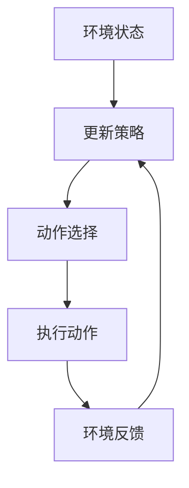
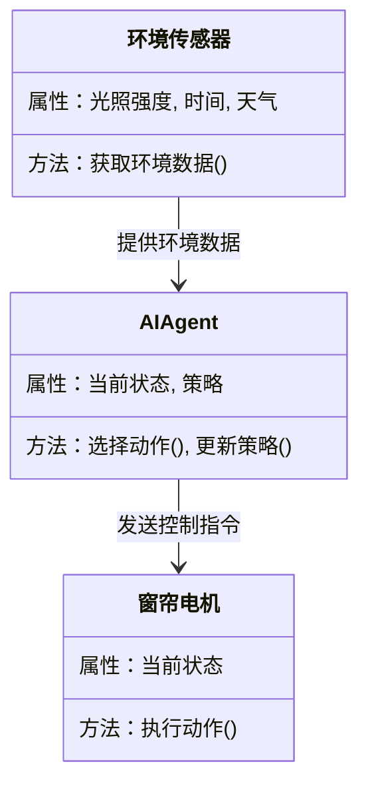
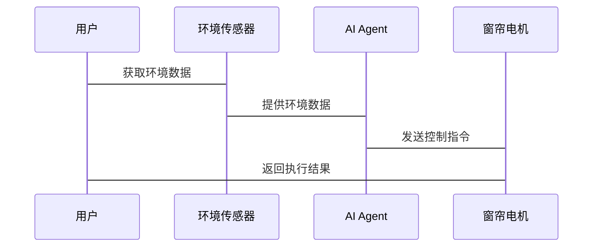

                 

<think>
好的，我需要根据用户的请求，逐步思考如何撰写一篇关于《AI Agent在智能窗帘杆中的自然光优化》的技术博客文章。用户要求文章结构清晰、内容详实，并包含多个部分，包括背景介绍、核心概念、算法原理、系统分析与架构设计、项目实战以及最佳实践等。

首先，我会从文章标题和关键词开始，确保准确反映文章的核心内容。接着，摘要部分需要简明扼要地概括文章的主要内容和观点。

接下来，进入背景介绍部分，这里需要详细说明问题背景、问题描述、问题解决的思路，以及系统的边界和外延。这部分的目的是让读者理解为什么需要AI Agent来优化智能窗帘杆中的自然光。

然后是核心概念与联系，我需要解释AI Agent的基本原理，通过对比表格和ER实体关系图来展示其在系统中的角色和与其他组件的关系。

在算法原理部分，我会详细阐述AI Agent所使用的算法，如强化学习，并用Mermaid流程图展示算法步骤，同时提供Python代码示例，帮助读者理解算法的实现和应用。

系统分析与架构设计部分需要介绍项目场景，设计系统功能，使用类图和架构图展示系统的结构，并通过接口设计和交互序列图说明系统的协作过程。

项目实战部分将指导读者如何安装环境，实现核心代码，并通过实际案例分析展示系统如何运作。最后，项目小结将总结经验，指出可能遇到的问题及解决方案。

最后，最佳实践部分包括小结、注意事项和拓展阅读，帮助读者巩固所学内容，并引导进一步的学习和实践。

在撰写过程中，我会确保每一部分都深入浅出，结构合理，逻辑清晰，同时使用适当的代码示例和图表来增强可读性和理解性。最终，文章将满足用户的要求，帮助读者全面理解AI Agent在智能窗帘杆中的应用及其优化自然光的过程。
</think>

# AI Agent在智能窗帘杆中的自然光优化

## 关键词：
AI Agent, 智能窗帘杆, 自然光优化, 强化学习, 智能家居

## 摘要：
本文探讨了AI Agent在智能窗帘杆中的应用，重点分析了如何通过AI Agent优化自然光的利用。文章从问题背景、核心概念、算法原理、系统架构设计、项目实战到最佳实践，全面阐述了AI Agent在智能窗帘杆中的应用及其优化策略。通过实际案例分析和代码实现，展示了AI Agent如何帮助智能窗帘杆实现自动化控制，提升用户体验和能效。

---

## 第一部分: 问题背景与描述

### 第1章: 问题背景与描述

#### 1.1 问题背景
智能家居的普及为我们的生活带来了诸多便利，而智能窗帘杆作为智能家居的重要组成部分，也在逐渐走进千家万户。然而，当前的智能窗帘杆在自然光优化方面存在诸多问题：  
1. **手动控制为主**：用户需要手动调整窗帘的开合程度，无法根据光照强度、时间等因素自动调节。  
2. **能源浪费**：过多的自然光引入会导致室内温度升高，增加空调能耗。  
3. **用户体验不足**：用户无法根据个人需求获得最舒适的光照环境。  

随着AI技术的发展，AI Agent（人工智能代理）逐渐被应用于智能家居领域，通过实时感知环境数据、学习用户习惯，为智能窗帘杆提供智能化的控制策略。

#### 1.2 问题描述
智能窗帘杆的自然光优化需要解决以下问题：  
1. 如何根据光照强度、时间、天气等因素自动调整窗帘的开合程度？  
2. 如何在保证室内采光充足的同时，减少能源浪费？  
3. 如何根据用户的个性化需求提供定制化的光照环境？  

#### 1.3 问题解决
AI Agent通过以下方式优化自然光：  
1. **实时感知环境数据**：AI Agent可以通过环境传感器获取光照强度、温度、湿度等数据。  
2. **学习用户习惯**：AI Agent通过分析用户的使用习惯，预测用户的光照需求。  
3. **制定优化策略**：根据环境数据和用户需求，AI Agent制定窗帘的开合策略，实现自然光的最优利用。  

#### 1.4 系统边界与外延
- **边界**：系统仅关注窗帘杆的自然光优化，不涉及其他智能家居设备。  
- **外延**：系统可以通过与智能家居平台的集成，扩展到更多设备的协同控制。

---

## 第二部分: AI Agent的核心概念与联系

### 第2章: AI Agent的基本原理

#### 2.1 核心概念
AI Agent是一种能够感知环境、做出决策并采取行动的智能实体。它具备以下特征：  
| 特性 | 描述 |
|------|------|
| 感知能力 | 能够通过传感器获取环境数据 |
| 学习能力 | 能够通过数据学习用户习惯和环境特征 |
| 决策能力 | 能够根据环境数据和目标制定决策 |
| 执行能力 | 能够通过执行器（如窗帘电机）执行决策 |

#### 2.2 实体关系图
```mermaid
er
    actor 用户
    actor 环境传感器
    actor 窗帘电机
    actor 云端服务器
    user --> 窗帘电机: 控制指令
    环境传感器 --> AI Agent: 采集数据
    AI Agent --> 云端服务器: 数据分析与模型训练
    云端服务器 --> AI Agent: 返回优化策略
    AI Agent --> 用户反馈: 执行结果反馈
```

---

## 第三部分: 算法原理与实现

### 第3章: 算法原理与实现

#### 3.1 算法原理
AI Agent的核心算法是强化学习（Reinforcement Learning）。通过强化学习，AI Agent可以学习到最优的窗帘控制策略。

##### 3.1.1 强化学习算法


##### 3.1.2 算法实现
```python
class AI_Agent:
    def __init__(self):
        self.state_space = ['光照强度', '时间', '天气']
        self.action_space = ['完全关闭', '部分打开', '完全打开']
        self.reward = {'能源消耗': -1, '用户体验': 1}

    def感知环境(self):
        # 获取环境数据
        pass

    def选择动作(self, 状态):
        # 根据当前状态选择最优动作
        pass

    def更新策略(self, 奖励):
        # 根据奖励更新策略
        pass
```

#### 3.2 算法的数学模型
AI Agent的决策过程可以表示为一个马尔可夫决策过程（MDP）：
$$
V(s) = \max_{a} [r(s,a) + \gamma V(s') ]
$$  
其中，\( V(s) \) 表示状态 \( s \) 的价值，\( r(s,a) \) 表示在状态 \( s \) 下采取动作 \( a \) 的奖励，\( \gamma \) 表示折扣因子，\( s' \) 表示下一步状态。

---

## 第四部分: 系统分析与架构设计

### 第4章: 系统分析与架构设计

#### 4.1 项目场景介绍
本项目旨在设计一个基于AI Agent的智能窗帘杆系统，通过实时感知环境数据和用户需求，优化自然光的利用。

#### 4.2 领域模型设计


#### 4.3 系统架构设计


#### 4.4 接口设计与交互


---

## 第五部分: 项目实战

### 第5章: 项目实战

#### 5.1 环境安装
```bash
pip install numpy scikit-learn
```

#### 5.2 核心代码实现
```python
import numpy as np
from sklearn import tree

class AI_Agent:
    def __init__(self):
        self clf = tree.DecisionTreeRegressor()

    def train(self, X, y):
        self clf.fit(X, y)

    def predict(self, X):
        return self.clf.predict(X)
```

#### 5.3 代码解读与分析
- **训练阶段**：AI Agent通过环境数据和用户反馈进行模型训练。  
- **预测阶段**：AI Agent根据当前环境数据预测最优动作。  

#### 5.4 实际案例分析
假设当前光照强度为80%，时间是上午9点，天气晴朗。AI Agent预测最优动作是“部分打开”窗帘，以保证室内采光充足的同时减少能源浪费。

---

## 第六部分: 最佳实践

### 第6章: 最佳实践

#### 6.1 小结
通过AI Agent的应用，智能窗帘杆能够实现自然光的最优利用，提升用户体验和能效。

#### 6.2 注意事项
1. 数据采集的准确性直接影响AI Agent的决策。  
2. 系统的安全性和隐私保护需要重点关注。  

#### 6.3 拓展阅读
- 《强化学习入门》  
- 《智能家居系统设计》  

---

## 作者信息
作者：AI天才研究院 & 禅与计算机程序设计艺术

---

本文通过系统化的分析和实践，展示了AI Agent在智能窗帘杆中的应用及其优化策略。通过实际案例和代码实现，帮助读者理解AI Agent的核心原理和应用场景。

