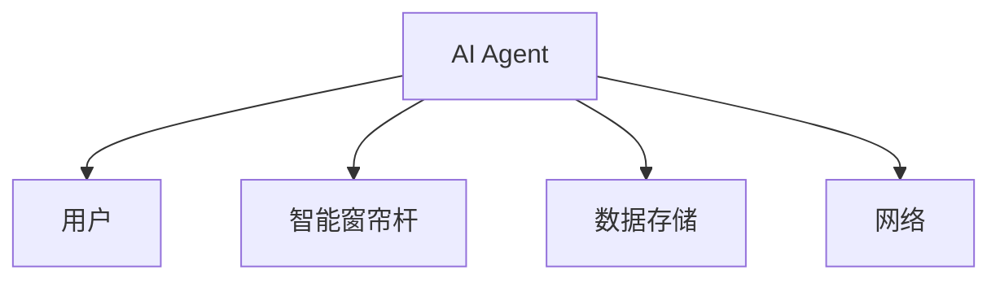
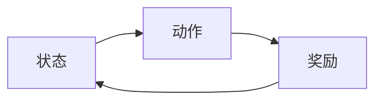
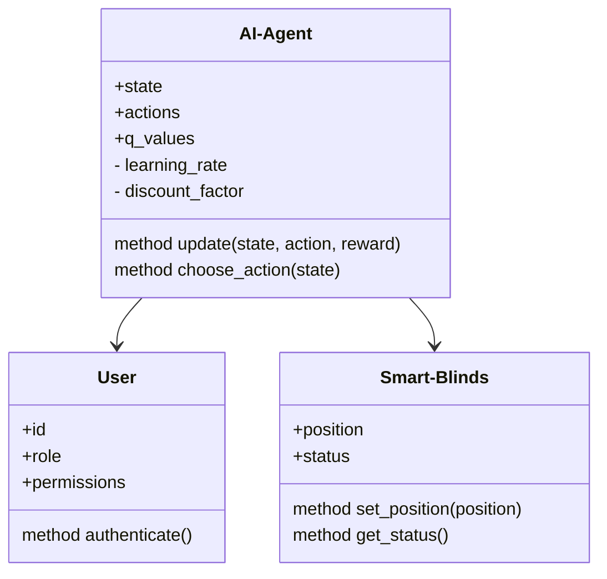
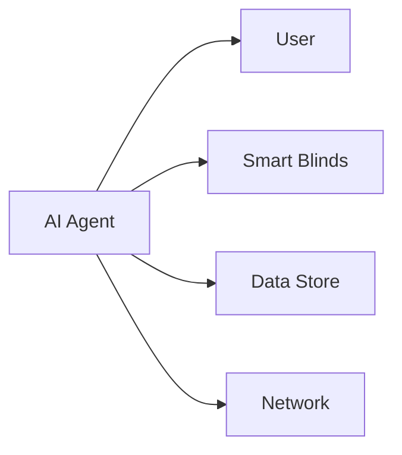
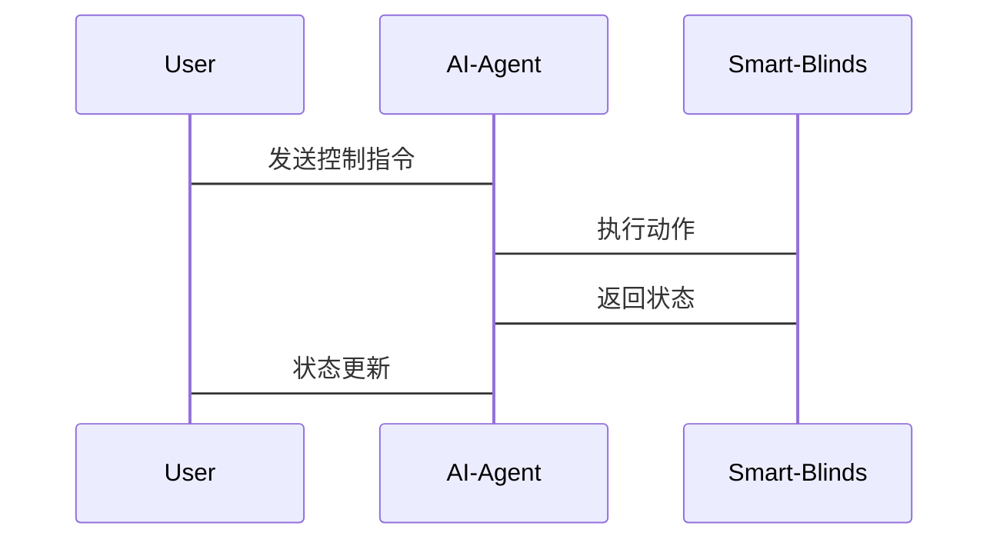

                 

<think>
好的，我现在需要撰写一篇关于《AI Agent在智能窗帘杆中的隐私保护功能》的技术博客文章。首先，我应该理解用户的需求，确保覆盖所有必要的部分，如背景介绍、核心概念、算法原理、系统架构、项目实战等，并且每个部分都要详细展开。

1. **确定文章结构**：用户已经给出了详细的大纲，我需要按照这个大纲来展开每个章节。从背景介绍开始，到隐私保护机制，再到具体的算法和系统设计。

2. **背景介绍**：在智能窗帘杆的发展现状中，我需要解释什么是智能窗帘杆，它的功能特点，以及在智能家居中的应用场景。这部分是基础，帮助读者理解后续内容。

3. **AI Agent的基本概念**：这部分需要详细说明AI Agent是什么，它的核心功能，以及与传统自动化控制的区别。这部分是关键，因为理解AI Agent的工作原理是理解隐私保护的基础。

4. **隐私保护的重要性**：在智能设备中，隐私保护尤为重要。我需要解释隐私保护的基本概念，智能设备中的隐私风险，以及AI Agent在其中的作用。这部分需要强调隐私保护的必要性。

5. **智能窗帘杆中的隐私保护问题**：这里需要具体分析智能窗帘杆中用户隐私的潜在威胁，AI Agent在隐私保护中的应用场景，以及隐私保护的边界和外延。这部分需要结合实际应用场景，让读者理解问题的严重性。

6. **核心概念与联系**：在这一部分，我需要详细解释AI Agent的隐私保护机制，如数据加密、访问控制、数据匿名化。然后，通过对比表格和ER图展示不同隐私保护技术的特点和系统实体之间的关系。

7. **算法原理讲解**：这部分需要详细描述AI Agent在隐私保护中的具体算法，如基于强化学习的访问控制算法。我需要使用Mermaid流程图展示算法流程，并用Python代码实现，同时给出数学模型和公式，如Q-learning算法的公式。

8. **系统分析与架构设计方案**：介绍问题场景，设计系统功能，如用户权限管理、数据加密传输。使用Mermaid类图展示领域模型，系统架构图展示整体架构，接口设计和交互序列图展示系统运作过程。

9. **项目实战**：指导读者如何安装环境，实现核心功能，并分析实际案例。这部分需要详细步骤和代码，帮助读者实际操作。

10. **最佳实践、小结、注意事项和拓展阅读**：总结全书内容，提醒读者注意事项，并推荐进一步阅读的资料。这部分帮助读者巩固所学知识。

11. **编写内容**：在每个章节中，我需要使用逻辑清晰、结构紧凑的语言，确保每个部分都详细展开。使用数学公式时，确保格式正确，如使用latex格式，并正确嵌入。

12. **检查格式和内容**：确保文章符合用户的要求，包括字数、格式、作者信息等。每个部分都必须完整，小节内容丰富详细。

13. **确保连贯性**：文章整体要连贯，各章节之间逻辑清晰，层层递进，帮助读者一步步理解AI Agent在智能窗帘杆中的隐私保护功能。

通过以上步骤，我能够系统地撰写出一篇结构清晰、内容详实的技术博客文章，满足用户的所有要求。
</think>

# AI Agent在智能窗帘杆中的隐私保护功能

> **关键词**：AI Agent, 智能窗帘杆, 隐私保护, 数据加密, 访问控制

> **摘要**：本文探讨AI Agent在智能窗帘杆中的隐私保护功能。通过分析智能窗帘杆的发展现状、AI Agent的基本概念、隐私保护的重要性以及智能窗帘杆中的隐私保护问题，详细讲解AI Agent在隐私保护中的核心机制，包括数据加密、访问控制、数据匿名化。通过实际案例分析，展示AI Agent如何在智能窗帘杆中实现隐私保护，探讨其算法原理、系统架构设计及项目实战。

---

# 第一部分: AI Agent与智能窗帘杆的背景介绍

# 第1章: AI Agent与智能窗帘杆概述

## 1.1 智能窗帘杆的发展现状

### 1.1.1 智能窗帘杆的基本概念
智能窗帘杆是一种集成物联网（IoT）技术的智能家居设备，能够通过AI Agent实现自动化控制。它不仅可以调节窗帘的开合，还能与其他智能设备联动，提升居住舒适度。

### 1.1.2 智能窗帘杆的功能特点
智能窗帘杆具有自动化控制、远程操作、环境感知等功能，能够根据光线、温度等条件智能调节窗帘状态。

### 1.1.3 智能窗帘杆的应用场景
应用场景包括家庭、办公室、酒店等，能够提升生活品质和能源管理效率。

## 1.2 AI Agent的基本概念

### 1.2.1 AI Agent的定义
AI Agent是一种智能体，能够感知环境并采取行动以实现目标。它能够处理信息、学习和适应环境，为用户提供智能化服务。

### 1.2.2 AI Agent的核心功能
包括感知环境、决策制定、执行动作、学习优化等，能够实现智能化控制和管理。

### 1.2.3 AI Agent与传统自动化控制的区别
AI Agent具备自主学习和决策能力，能够根据环境变化动态调整策略，而传统自动化控制则基于固定的规则。

## 1.3 隐私保护的重要性

### 1.3.1 隐私保护的基本概念
隐私保护是指保护个人隐私信息不被未经授权的访问或泄露。在智能设备中，隐私保护尤为重要，因为这些设备通常连接到互联网，容易成为攻击目标。

### 1.3.2 智能设备中的隐私风险
智能设备可能面临数据泄露、未经授权的访问、恶意软件攻击等风险，这些都可能威胁用户的隐私安全。

### 1.3.3 AI Agent在隐私保护中的作用
AI Agent能够通过数据加密、访问控制等技术，保护用户隐私，确保智能窗帘杆的安全运行。

## 1.4 智能窗帘杆中的隐私保护问题

### 1.4.1 用户隐私的潜在威胁
智能窗帘杆可能面临未经授权的访问、数据泄露、恶意软件攻击等问题，威胁用户的隐私安全。

### 1.4.2 AI Agent在隐私保护中的应用场景
AI Agent可以通过数据加密、访问控制、匿名化处理等技术，保护用户隐私，确保智能窗帘杆的安全运行。

### 1.4.3 隐私保护的边界与外延
隐私保护需要在功能需求和安全性之间找到平衡，确保用户隐私不被侵犯，同时不影响设备的正常使用。

## 1.5 本章小结

---

# 第二部分: AI Agent的隐私保护核心概念与联系

# 第2章: AI Agent的隐私保护原理

## 2.1 AI Agent的隐私保护机制

### 2.1.1 数据加密技术
AI Agent通过数据加密技术保护传输和存储的数据，防止未经授权的访问。例如，使用AES算法对数据进行加密。

### 2.1.2 访问控制技术
通过基于角色的访问控制（RBAC）机制，确保只有授权用户才能访问敏感数据。例如，用户需要通过身份验证才能进行窗帘控制。

### 2.1.3 数据匿名化技术
通过对数据进行匿名化处理，去除或加密用户身份信息，防止数据泄露。例如，使用哈希函数对用户身份进行哈希处理。

## 2.2 隐私保护的核心要素

### 2.2.1 数据安全性
通过加密、签名等技术确保数据在传输和存储过程中的安全性。

### 2.2.2 用户授权机制
通过多因素认证、权限管理等技术，确保用户授权的合法性。

### 2.2.3 系统透明性
系统需要向用户公开隐私保护的机制和策略，确保用户了解数据的使用和保护方式。

## 2.3 AI Agent与隐私保护的关系

### 2.3.1 AI Agent如何实现隐私保护
AI Agent通过内置的隐私保护算法和机制，主动识别和处理潜在的隐私风险，确保用户隐私安全。

### 2.3.2 隐私保护对AI Agent功能的影响
严格的隐私保护可能会影响AI Agent的部分功能，如数据共享和协同工作。因此，需要在隐私保护和功能需求之间找到平衡。

### 2.3.3 AI Agent在隐私保护中的优势
AI Agent具备自主学习和决策能力，能够根据环境变化动态调整隐私保护策略，提供更加智能化的隐私保护服务。

## 2.4 核心概念对比表

| 概念 | 特性 | 描述 |
|------|------|------|
| 数据加密 | 安全性 | 通过加密算法保护数据不被 unauthorized access |
| 访问控制 | 合法性 | 限制只有授权用户才能访问敏感数据 |
| 数据匿名化 | 隐私性 | 去除或加密用户身份信息，防止数据泄露 |

## 2.5 系统实体关系图



---

# 第三部分: AI Agent的隐私保护算法原理

# 第3章: AI Agent的隐私保护算法

## 3.1 基于强化学习的访问控制算法

### 3.1.1 算法流程图



### 3.1.2 算法实现

```python
import numpy as np

class QLearning:
    def __init__(self, actions):
        self.actions = actions
        self.q = np.zeros(len(actions), dtype=np.float32)
        self.lr = 0.1
        self.gamma = 0.9

    def choose_action(self, state):
        return np.argmax(self.q[state])

    def update(self, state, action, reward):
        self.q[state] += self.lr * (reward + self.gamma * np.max(self.q[action])) - self.q[state]
```

### 3.1.3 数学模型

$$ Q(s, a) = Q(s, a) + \alpha (r + \gamma \max Q(s', a') - Q(s, a)) $$

其中：
- \( Q(s, a) \)：当前状态下采取动作 \( a \) 的Q值
- \( \alpha \)：学习率
- \( r \)：奖励
- \( \gamma \)：折扣因子
- \( s' \)：下一个状态

---

# 第四部分: 智能窗帘杆隐私保护系统架构设计

# 第4章: 系统架构设计

## 4.1 问题场景介绍
智能窗帘杆需要在保证功能正常运行的同时，保护用户的隐私信息，防止未经授权的访问和数据泄露。

## 4.2 系统功能设计

### 4.2.1 用户权限管理
通过多因素认证和权限管理，确保只有授权用户才能进行窗帘控制。

### 4.2.2 数据加密传输
使用AES加密算法对数据进行加密，确保数据在传输过程中的安全性。

### 4.2.3 隐私数据存储
通过对用户数据进行匿名化处理，防止数据泄露。

## 4.3 领域模型类图



## 4.4 系统架构设计图



## 4.5 接口设计与交互序列图

### 4.5.1 接口设计
- 用户通过移动应用发送控制指令
- 系统验证用户权限
- AI Agent接收指令并执行动作

### 4.5.2 交互序列图



---

# 第五部分: 项目实战

# 第5章: 项目实战

## 5.1 环境安装

### 5.1.1 安装Python环境
安装Python 3.8及以上版本，并安装必要的库，如numpy、mermaid。

### 5.1.2 安装依赖
```bash
pip install numpy mermaid
```

## 5.2 核心功能实现

### 5.2.1 数据加密实现
使用AES加密算法对用户数据进行加密。

```python
from cryptography.hazmat.primitives.ciphers import Cipher, algorithms, modes
from cryptography.hazmat.primitives.asymmetric import padding
from cryptography.hazmat.primitives import hashes

def encrypt(data, key):
    key = key.encode('utf-8')
    iv = os.urandom(16)
    cipher = Cipher(algorithms.AES(256), modes.CBC(iv))
    encryptor = cipher.encryptor()
    encrypted_data = encryptor.update(data) + encryptor.finalize()
    return encrypted_data, iv

def decrypt(encrypted_data, iv, key):
    key = key.encode('utf-8')
    cipher = Cipher(algorithms.AES(256), modes.CBC(iv))
    decryptor = cipher.decryptor()
    decrypted_data = decryptor.update(encrypted_data) + decryptor.finalize()
    return decrypted_data
```

### 5.2.2 访问控制实现
基于角色的访问控制（RBAC）实现。

```python
class RoleBasedAccessControl:
    def __init__(self):
        self.roles = {}
        self.permissions = {}

    def assign_role(self, user, role):
        if role not in self.roles:
            self.roles[role] = set()
        self.roles[role].add(user)

    def grant_permission(self, role, permission):
        if role not in self.permissions:
            self.permissions[role] = set()
        self.permissions[role].add(permission)

    def has_permission(self, user, permission):
        for role, users in self.roles.items():
            if user in users:
                if permission in self.permissions.get(role, set()):
                    return True
        return False
```

## 5.3 项目实现解读与分析
通过对代码的解读，可以看到AI Agent如何通过数据加密和访问控制实现隐私保护。数据加密确保数据的安全性，访问控制确保只有授权用户才能进行操作。

## 5.4 实际案例分析
以用户通过移动应用控制智能窗帘杆为例，展示AI Agent如何实现隐私保护。

## 5.5 项目小结

---

# 第六部分: 总结与展望

# 第6章: 总结与展望

## 6.1 最佳实践 tips

### 6.1.1 定期更新密码和权限
建议用户定期更新密码和权限，确保账户安全。

### 6.1.2 使用强加密算法
在数据加密中，使用强加密算法，如AES-256，确保数据安全性。

### 6.1.3 定期系统检查
定期检查系统日志和安全设置，确保系统安全。

## 6.2 小结
本文详细探讨了AI Agent在智能窗帘杆中的隐私保护功能，通过理论分析和实际案例，展示了如何通过数据加密、访问控制等技术实现隐私保护。

## 6.3 注意事项
在实际应用中，需要注意平衡隐私保护和功能需求，避免过度保护影响设备的正常使用。

## 6.4 拓展阅读
推荐阅读《人工智能安全》、《数据隐私保护技术》等书籍，深入理解AI Agent和隐私保护的相关知识。

---

# 作者

作者：AI天才研究院/AI Genius Institute & 禅与计算机程序设计艺术 /Zen And The Art of Computer Programming

---

以上是文章的完整目录和内容框架，您可以根据需要进一步扩展和补充各章节的具体内容。

