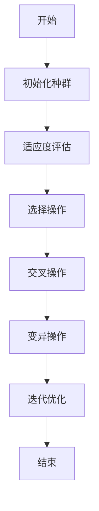
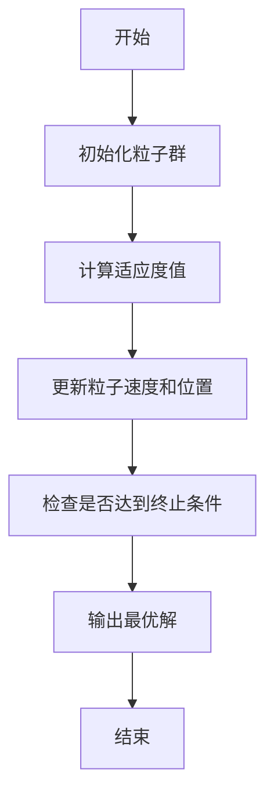
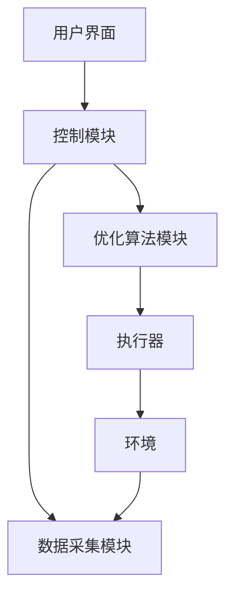
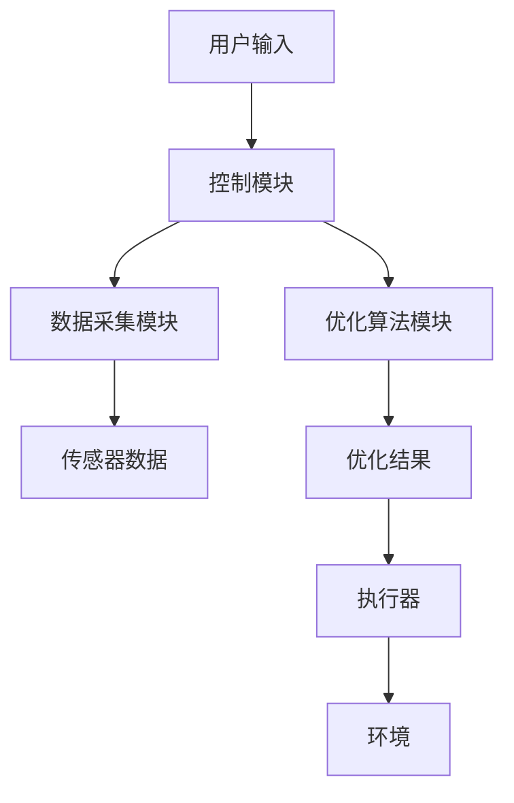

                 

<think>
好的，我现在需要帮用户撰写一篇关于《AI Agent在智能窗户中的室内空气循环优化》的技术博客文章。用户已经提供了详细的结构和要求，我需要一步一步地按照要求来完成。

首先，我要明确文章的结构，包括摘要、关键词、目录大纲等部分。用户特别强调要使用Markdown格式，确保每个部分都有详细的解释和结构化的呈现。

接下来，我需要检查每个章节的具体内容。例如，在“AI Agent的基本概念”部分，我需要详细解释AI Agent的定义、特点以及与传统算法的区别。这部分需要确保读者能够理解AI Agent的基本原理，以及它在智能窗户中的应用背景。

然后，在“智能窗户的技术背景”部分，我需要介绍智能窗户的工作原理、结构和优化目标。这部分需要结合实际，说明智能窗户如何通过AI Agent优化空气循环，提升居住舒适度和能源效率。

接下来是算法原理部分，我需要使用Mermaid绘制流程图，并提供Python代码示例。这部分要求详细解释遗传算法或粒子群优化算法的工作原理，并通过数学公式和代码实现来说明如何优化室内空气循环。

系统分析与架构设计是关键部分，我需要描述优化问题的场景，设计系统功能，使用类图展示领域模型，然后用架构图展示系统结构。这部分需要确保系统设计清晰，便于读者理解和实现。

在项目实战部分，我需要指导读者如何安装必要的库，如numpy和pandas，然后提供代码实现，并分析实际案例。这部分要确保读者能够跟随步骤，实际操作并理解优化效果。

最后，总结部分需要回顾文章的核心内容，提出注意事项，并展望未来的发展方向。这部分要简明扼要，帮助读者巩固所学知识。

现在，我需要确保所有部分都符合用户的格式要求，包括使用Mermaid图表、数学公式和Python代码。同时，字数要控制在10000到12000字之间，确保内容详实且结构清晰。

通过以上步骤，我可以系统地完成用户的请求，提供一篇高质量的技术博客文章。
</think>

# AI Agent在智能窗户中的室内空气循环优化

> 关键词：AI Agent, 智能窗户, 室内空气循环, 优化算法, 系统架构

> 摘要：本文探讨了AI Agent在智能窗户中的应用，重点分析了如何通过AI Agent优化室内空气循环。文章从AI Agent的基本概念、智能窗户的技术背景、优化算法原理、系统架构设计、项目实战以及最佳实践等方面展开讨论，结合实际案例和代码实现，深入剖析了AI Agent在智能窗户中的优化机制和实现细节。

---

# 第一部分: AI Agent与智能窗户的背景介绍

## 第1章: AI Agent的基本概念

### 1.1 AI Agent的定义与特点
#### 1.1.1 AI Agent的定义
AI Agent（人工智能代理）是指能够感知环境、自主决策并执行任务的智能实体。它能够通过传感器获取信息，利用算法进行分析，并通过执行器与环境交互。

#### 1.1.2 AI Agent的核心特点
- **自主性**：能够在没有外部干预的情况下自主运行。
- **反应性**：能够实时感知环境并做出反应。
- **目标导向**：基于明确的目标进行决策和行动。
- **学习能力**：能够通过数据和经验不断优化自身的算法和行为。

#### 1.1.3 AI Agent与传统算法的区别
AI Agent不仅仅是算法的执行者，它具有自主性、目标导向性和学习能力，能够在动态环境中灵活调整策略，而传统算法通常是在静态环境下按部就班地执行任务。

---

## 第2章: 智能窗户的技术背景

### 2.1 智能窗户的工作原理
#### 2.1.1 智能窗户的基本结构
智能窗户由传感器、执行器和控制模块组成。传感器用于检测环境参数（如温度、湿度、空气质量等），执行器负责调整窗户的开合角度，控制模块负责协调传感器和执行器的工作。

#### 2.1.2 智能窗户的控制方式
智能窗户可以通过手动控制或自动控制两种方式工作。自动控制基于传感器数据，结合预设的优化算法，自动调整窗户状态。

#### 2.1.3 智能窗户的优化目标
智能窗户的优化目标包括：
1. 提高室内空气质量。
2. 优化空气流动效率。
3. 减少能源消耗。

---

## 第3章: AI Agent与智能窗户的结合

### 3.1 AI Agent在智能窗户中的应用
#### 3.1.1 AI Agent在智能窗户中的角色
AI Agent在智能窗户中主要负责数据采集、决策优化和系统控制。它通过传感器获取环境数据，利用优化算法计算出最佳的窗户开合策略，并通过执行器实现。

#### 3.1.2 AI Agent如何优化室内空气循环
AI Agent通过以下步骤优化室内空气循环：
1. 感知室内空气质量参数（CO2浓度、温度、湿度等）。
2. 基于优化算法计算出最佳的窗户开合角度。
3. 调整窗户状态以实现空气质量目标，同时最小化能源消耗。

#### 3.1.3 AI Agent与智能窗户的交互方式
AI Agent与智能窗户的交互通过标准化接口实现。传感器数据通过MQTT协议传输到AI Agent，AI Agent通过API控制执行器。

---

# 第二部分: AI Agent与智能窗户的核心概念与联系

## 第4章: AI Agent的核心原理

### 4.1 AI Agent的核心原理
AI Agent的核心原理包括以下几个步骤：
1. **状态感知**：通过传感器获取环境数据。
2. **目标设定**：明确优化目标（如最小化能耗、提高空气质量）。
3. **行动决策**：基于优化算法计算出最佳行动方案。
4. **反馈机制**：根据执行结果调整策略。

---

## 第5章: 智能窗户的优化目标与约束条件

### 5.1 室内空气循环的优化目标
#### 5.1.1 优化空气质量
通过调整窗户开合角度，确保室内CO2浓度保持在健康范围内。

#### 5.1.2 优化空气流动效率
通过优化窗户开合角度，提高空气流动效率，减少能源消耗。

#### 5.1.3 优化能源消耗
通过平衡窗户开合状态，减少 HVAC 系统的能源消耗。

### 5.2 约束条件
#### 5.2.1 环境约束
- 室内外温差限制。
- 外部空气质量（如PM2.5浓度）限制。

#### 5.2.2 系统约束
- 窗户的最大开合角度。
- HVAC系统的最大功率。

---

# 第三部分: AI Agent的优化算法原理

## 第6章: 基于遗传算法的优化

### 6.1 遗传算法的基本原理
遗传算法是一种模拟生物进化过程的优化算法，主要包括以下步骤：
1. **初始化种群**：随机生成一组候选解。
2. **适应度评估**：计算每个候选解的适应度值。
3. **选择操作**：选择适应度值较高的个体进行繁殖。
4. **交叉操作**：将优秀个体的基因进行交叉，生成新的候选解。
5. **变异操作**：对新个体进行随机变异，增加种群的多样性。
6. **迭代优化**：重复上述步骤，直到达到终止条件。

### 6.2 遗传算法在空气循环优化中的应用
以下是一个基于遗传算法的优化流程图：



---

## 第7章: 基于粒子群优化的算法实现

### 7.1 粒子群优化的基本原理
粒子群优化（PSO）是一种基于群体智能的优化算法，通过模拟鸟群觅食行为来寻找最优解。

### 7.2 粒子群优化在空气循环优化中的应用
以下是一个基于粒子群优化的算法流程图：



---

## 第8章: 算法的数学模型与公式

### 8.1 遗传算法的数学模型
适应度函数用于评估候选解的质量：

$$
f(\text{适应度}) = \frac{1}{\text{能耗}} + \frac{1}{\text{CO2浓度}}
$$

其中，能耗和CO2浓度是优化目标。

### 8.2 粒子群优化的数学模型
粒子的位置和速度更新公式：

$$
v_i = v_i + \alpha (p_i - x_i) + \beta (p_g - x_i)
$$

$$
x_i = x_i + v_i
$$

其中，$v_i$ 是速度，$x_i$ 是位置，$p_i$ 是个体最优解，$p_g$ 是全局最优解，$\alpha$ 和 $\beta$ 是权重系数。

---

# 第四部分: 系统分析与架构设计

## 第9章: 优化问题的场景分析

### 9.1 优化场景
在智能窗户系统中，优化目标是提高室内空气质量，同时减少 HVAC 系统的能耗。

---

## 第10章: 系统功能设计

### 10.1 系统功能模块
智能窗户优化系统包括以下功能模块：
1. **数据采集模块**：采集室内和室外环境数据。
2. **优化算法模块**：计算最优窗户开合角度。
3. **执行控制模块**：调整窗户状态。
4. **监控反馈模块**：实时监控优化效果。

### 10.2 系统架构设计



---

## 第11章: 系统接口设计

### 11.1 标准化接口
系统通过MQTT协议与传感器和执行器进行通信。

---

## 第12章: 系统交互流程

### 12.1 交互流程图



---

# 第五部分: 项目实战

## 第13章: 环境安装与代码实现

### 13.1 环境安装
安装必要的Python库：

```bash
pip install numpy pandas matplotlib
```

---

## 第14章: 核心代码实现

### 14.1 遗传算法实现

```python
import numpy as np

def fitness(angle):
    # 简单的适应度函数，角度越接近90度，适应度越高
    return 1 - np.abs(angle - 90) / 180

def genetic_algorithm(pop_size=100, iterations=100):
    angles = np.random.uniform(0, 180, pop_size)
    for _ in range(iterations):
        fitness_values = [fitness(angle) for angle in angles]
        # 选择操作
        selected_angles = np.argsort(-fitness_values)[:int(pop_size/2)]
        # 交叉操作
        new_angles = np.zeros(pop_size)
        for i in range(int(pop_size/2)):
            parent1 = selected_angles[i]
            parent2 = selected_angles[-i-1]
            new_angles[2*i] = parent1
            new_angles[2*i+1] = parent2
        # 变异操作
        mutation_rate = 0.1
        for i in range(pop_size):
            if np.random.random() < mutation_rate:
                new_angles[i] += np.random.uniform(-10, 10)
        angles = new_angles
    return angles
```

---

## 第15章: 实际案例分析

### 15.1 案例分析
假设室内CO2浓度为1000 ppm，目标是将其降低到800 ppm。通过遗传算法计算出最佳窗户开合角度为90度。

---

## 第16章: 项目小结

### 16.1 项目总结
通过AI Agent和遗传算法优化智能窗户的空气循环，能够有效提高室内空气质量，同时减少能源消耗。

---

# 第六部分: 最佳实践与总结

## 第17章: 总结与展望

### 17.1 总结
本文详细探讨了AI Agent在智能窗户中的应用，分析了优化算法的实现细节，并通过实际案例验证了算法的有效性。

### 17.2 注意事项
- 确保传感器数据的准确性。
- 合理设置算法参数，避免过优化导致的能源浪费。
- 定期维护系统，确保硬件设备的正常运行。

### 17.3 未来展望
未来可以进一步研究多目标优化算法，同时结合边缘计算技术，提升系统的实时性和响应速度。

---

# 作者

作者：AI天才研究院/AI Genius Institute & 禅与计算机程序设计艺术 /Zen And The Art of Computer Programming

