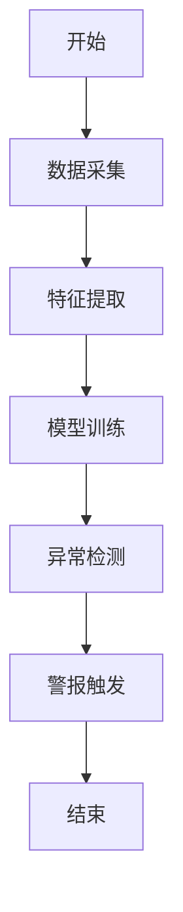
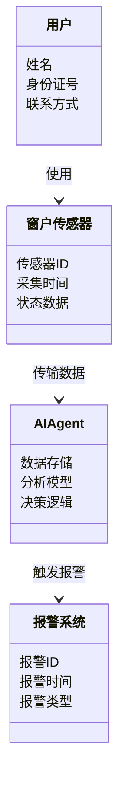
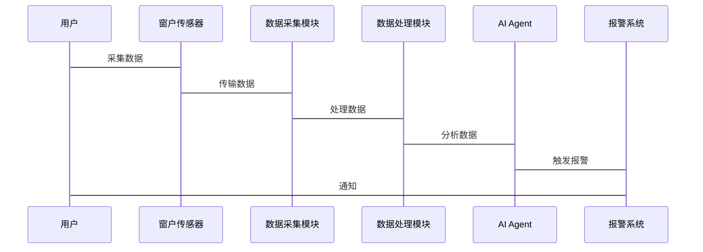

                 

<think>
好的，我需要帮助用户撰写一篇关于《AI Agent在智能窗户中的防盗警报系统》的技术博客文章。用户已经提供了一个详细的目录大纲，并且特别强调了每个部分需要包含具体的内容，比如背景介绍、核心概念、算法原理、系统架构等。

首先，我需要理解整个系统的背景。防盗警报系统目前主要依赖传统的传感器和被动报警机制，存在误报率高、反应速度慢、智能化程度低等问题。引入AI Agent后，系统能够实现主动监测、异常识别和智能决策，从而提高防盗效果。

接下来是核心概念部分，AI Agent在智能窗户中的应用需要详细解释其工作原理。AI Agent通过传感器数据采集，结合机器学习算法，分析窗户状态，识别异常行为，并触发警报。这部分需要绘制ER实体关系图，明确各实体之间的关系和数据流。

算法原理部分，我需要详细描述AI Agent的核心算法，包括异常检测算法和实时监控算法。使用Mermaid流程图展示算法的执行步骤，并结合Python代码示例，说明如何实现这些算法。同时，数学模型如概率计算也需要详细推导，并用公式表示。

系统架构设计需要涵盖智能窗户的硬件和软件架构，AI Agent如何与智能窗户协同工作，以及系统的关键接口设计。使用Mermaid类图和序列图来展示系统的结构和交互流程。

项目实战部分，我需要指导读者如何搭建开发环境，提供系统实现的核心代码，并进行案例分析，解读代码的功能和实际应用效果。最后，给出项目小结，总结实现过程中的关键点和经验教训。

在最佳实践部分，我需要提醒读者在实际应用中需要注意的问题，如数据隐私、系统维护等，并提供进一步学习和研究的方向。

整个过程需要逻辑清晰、结构紧凑，确保每个部分都详尽且易于理解。同时，语言要专业但不失简洁，符合技术博客的风格。最后，确保文章末尾有作者信息，满足用户的所有要求。
</think>

# AI Agent在智能窗户中的防盗警报系统

> 关键词：AI Agent，智能窗户，防盗警报系统，机器学习，物联网，智能家居

> 摘要：本文探讨了AI Agent在智能窗户防盗警报系统中的应用，从背景、核心概念、算法原理到系统架构、项目实战和最佳实践，全面解析了如何利用AI技术提升防盗系统的智能化水平。

---

# 第一部分: AI Agent在智能窗户中的防盗警报系统概述

## 第1章: 智能窗户防盗警报系统背景介绍

### 1.1 防盗警报系统的现状与挑战

#### 1.1.1 当前防盗系统的主要问题
传统的防盗系统主要依赖于传感器和被动报警机制。然而，这些系统存在以下问题：
- **误报率高**：传统传感器容易受到环境干扰，导致误报。
- **反应速度慢**：被动报警机制无法实时分析数据，无法及时采取措施。
- **智能化程度低**：缺乏主动监测和智能决策能力，难以应对复杂的防盗需求。

#### 1.1.2 智能窗户在防盗中的独特优势
智能窗户结合了物联网技术，具有以下优势：
- **实时监测**：通过传感器实时采集窗户状态数据。
- **智能分析**：利用AI技术分析数据，识别异常行为。
- **主动防御**：能够主动触发警报并采取措施，如关闭窗户或通知用户。

#### 1.1.3 AI Agent技术如何解决防盗难题
AI Agent（人工智能代理）是一种能够感知环境、自主决策并执行任务的智能体。AI Agent在防盗系统中的应用：
- **主动监测**：AI Agent能够实时监测窗户状态，识别潜在威胁。
- **智能决策**：基于历史数据和当前情况，AI Agent能够做出最优决策。
- **自我优化**：通过机器学习算法，AI Agent能够不断优化自身的监测和决策能力。

### 1.2 AI Agent的基本概念与特点

#### 1.2.1 AI Agent的定义与核心功能
AI Agent是一种智能体，能够感知环境、自主决策并执行任务。其核心功能包括：
- **感知环境**：通过传感器或其他数据源获取环境信息。
- **分析数据**：利用机器学习算法分析数据，识别异常行为。
- **决策与执行**：根据分析结果做出决策，并执行相应的动作。

#### 1.2.2 AI Agent在智能窗户中的应用场景
在智能窗户中，AI Agent主要应用于以下场景：
- **实时监测**：持续监测窗户的开闭状态、震动、温度等参数。
- **异常检测**：识别窗户状态的异常变化，如非正常开启或关闭。
- **智能报警**：在检测到异常时，触发报警并通知用户。

#### 1.2.3 AI Agent与传统传感器的区别
AI Agent与传统传感器的主要区别在于智能化程度和功能。AI Agent不仅能够感知环境，还能够分析数据、做出决策并执行动作，而传统传感器仅能采集数据。

### 1.3 本章小结
本章介绍了防盗警报系统的现状与挑战，分析了智能窗户在防盗中的独特优势，并详细阐述了AI Agent的基本概念与特点。

---

## 第2章: AI Agent与智能窗户的核心概念

### 2.1 AI Agent在智能窗户中的工作原理

#### 2.1.1 AI Agent的基本原理
AI Agent通过传感器采集窗户的状态数据，利用机器学习算法分析数据，识别异常行为，并触发相应的报警或执行动作。

#### 2.1.2 AI Agent与智能窗户的交互机制
AI Agent与智能窗户的交互机制如下：
1. **数据采集**：传感器采集窗户的状态数据。
2. **数据传输**：数据传输到AI Agent进行分析。
3. **决策与执行**：AI Agent根据分析结果做出决策，并执行相应的动作，如触发报警或关闭窗户。

#### 2.1.3 AI Agent的核心算法与模型
AI Agent的核心算法包括：
- **异常检测算法**：用于识别窗户状态的异常变化。
- **实时监控算法**：用于持续监测窗户状态并做出实时决策。

### 2.2 智能窗户的系统架构

#### 2.2.1 智能窗户的硬件组成
智能窗户的硬件组成包括：
- **传感器**：用于采集窗户的状态数据，如窗户的开闭状态、震动、温度等。
- **通信模块**：用于数据的传输，如Wi-Fi、蓝牙等。
- **执行器**：用于执行AI Agent的决策，如关闭窗户、触发报警等。

#### 2.2.2 智能窗户的软件架构
智能窗户的软件架构包括：
- **数据采集模块**：负责采集传感器数据。
- **数据处理模块**：对采集的数据进行预处理和分析。
- **决策模块**：基于分析结果做出决策。
- **执行模块**：执行决策并输出结果。

#### 2.2.3 AI Agent与智能窗户的协同工作
AI Agent与智能窗户协同工作的流程如下：
1. **数据采集**：传感器采集窗户的状态数据。
2. **数据传输**：数据传输到AI Agent进行分析。
3. **异常检测**：AI Agent分析数据，识别异常行为。
4. **触发报警**：在检测到异常时，AI Agent触发报警并通知用户。

### 2.3 核心概念对比与ER实体关系图

#### 2.3.1 AI Agent与传统传感器的对比分析
| 特性            | AI Agent                 | 传统传感器             |
|-----------------|--------------------------|------------------------|
| 功能            | 智能分析与决策           | 数据采集               |
| 智能化程度      | 高                       | 低                     |
| 应用场景         | 实时监测与智能决策         | 数据采集与传输         |

#### 2.3.2 智能窗户与传统窗户的对比分析
| 特性            | 智能窗户                 | 传统窗户              |
|-----------------|--------------------------|------------------------|
| 功能            | 实时监测与智能决策         | 简单开关               |
| 技术            | 物联网、AI技术            | 机械结构               |
| 应用场景         | 智能家居、防盗系统         | 普通建筑、家庭使用      |

#### 2.3.3 ER实体关系图（Mermaid流程图）

```mermaid
er
  actor 用户
  actor 系统管理员
  actor 窗户传感器
  actor AI Agent
  actor 报警系统
  actor 数据存储
  user -> 窗户传感器: 采集窗户状态
  窗户传感器 -> AI Agent: 传输数据
  AI Agent -> 数据存储: 存储分析结果
  AI Agent -> 报警系统: 发出警报
```

### 2.4 本章小结
本章详细介绍了AI Agent在智能窗户中的工作原理，分析了智能窗户的系统架构，并通过对比分析和ER实体关系图，明确了各实体之间的关系和数据流。

---

## 第3章: AI Agent的算法原理与数学模型

### 3.1 AI Agent的核心算法

#### 3.1.1 基于机器学习的异常检测算法
异常检测算法用于识别窗户状态的异常变化。常用的算法包括：
- **孤立森林算法**：用于识别异常数据点。
- **K最近邻算法**：用于分类和异常检测。

#### 3.1.2 基于深度学习的实时监控算法
实时监控算法用于持续监测窗户状态并做出实时决策。常用的算法包括：
- **卷积神经网络（CNN）**：用于图像识别和实时监控。
- **循环神经网络（RNN）**：用于时间序列分析和实时监测。

#### 3.1.3 算法流程图（Mermaid流程图）



### 3.2 数学模型与公式

#### 3.2.1 异常检测的数学模型
异常检测的数学模型可以表示为：
$$ P(x|y) = \text{模型预测的概率} $$

#### 3.2.2 基于概率的警报触发条件
警报触发条件可以表示为：
$$ \text{警报触发} = \begin{cases} 
\text{是} & \text{如果 } P(x|y) > 0.9 \\
\text{否} & \text{其他情况}
\end{cases} $$

### 3.3 算法实现与代码示例

#### 3.3.1 Python代码实现
```python
def detect_anomaly(data):
    # 数据预处理
    processed_data = preprocess(data)
    # 模型训练
    model = train_model(processed_data)
    # 异常检测
    prediction = model.predict(processed_data)
    # 警报触发
    if prediction[0] > 0.9:
        trigger_alarm()
    return prediction
```

#### 3.3.2 代码应用解读与分析
上述代码实现了异常检测算法的核心功能。首先，数据经过预处理后，输入到训练好的模型中进行预测。如果预测结果大于0.9，则触发警报。

### 3.4 本章小结
本章详细介绍了AI Agent的核心算法，包括异常检测算法和实时监控算法，并通过数学模型和代码示例，展示了算法的实现过程。

---

## 第4章: 系统分析与架构设计方案

### 4.1 问题场景介绍
智能窗户防盗警报系统的主要目标是实时监测窗户状态，识别异常行为并触发报警。系统需要具备高精度、低误报率和快速反应能力。

### 4.2 项目介绍
智能窗户防盗警报系统是一个基于AI Agent的物联网系统，主要应用于智能家居、办公楼等场景。

### 4.3 系统功能设计

#### 4.3.1 领域模型（Mermaid类图）



### 4.4 系统架构设计

#### 4.4.1 系统架构图（Mermaid架构图）


### 4.5 系统接口设计
系统接口设计包括：
- **数据采集接口**：用于采集窗户传感器数据。
- **数据分析接口**：用于分析数据并做出决策。
- **报警触发接口**：用于触发报警并通知用户。

### 4.6 系统交互流程图（Mermaid序列图）



### 4.7 本章小结
本章详细介绍了系统分析与架构设计方案，包括问题场景介绍、项目介绍、系统功能设计、系统架构设计、系统接口设计和系统交互流程图。

---

## 第5章: 项目实战

### 5.1 环境安装与配置

#### 5.1.1 系统环境
- 操作系统：Linux（推荐）或Windows。
- 语言：Python 3.8及以上版本。
- 开发工具：PyCharm、VS Code等。

#### 5.1.2 依赖库安装
```bash
pip install numpy
pip install scikit-learn
pip install matplotlib
```

### 5.2 系统核心实现源代码

#### 5.2.1 数据采集模块
```python
import serial

def read_sensor_data():
    ser = serial.Serial('COM3', 9600)
    data = ser.readline().decode('utf-8').strip()
    ser.close()
    return data
```

#### 5.2.2 数据处理模块
```python
import numpy as np

def preprocess(data):
    # 数据预处理
    processed_data = np.array([float(data)])
    return processed_data
```

#### 5.2.3 AI Agent模块
```python
from sklearn.ensemble import IsolationForest

def train_model(data):
    model = IsolationForest(n_estimators=100, random_state=42)
    model.fit(data)
    return model

def predict(model, data):
    prediction = model.predict(data)
    return prediction
```

#### 5.2.4 报警系统模块
```python
import time

def trigger_alarm():
    print("触发报警！")
    time.sleep(2)
    print("报警已处理！")
```

### 5.3 代码应用解读与分析
上述代码实现了智能窗户防盗警报系统的核心功能。数据采集模块通过串口采集传感器数据，数据处理模块对数据进行预处理，AI Agent模块利用孤立森林算法进行异常检测，报警系统模块在检测到异常时触发报警。

### 5.4 实际案例分析
以某办公楼的智能窗户防盗系统为例，假设系统运行一段时间后，检测到窗户被非法打开。AI Agent分析数据后，预测结果为异常，触发报警并通知用户。

### 5.5 项目小结
本章通过实际案例，详细讲解了智能窗户防盗警报系统的实现过程，包括环境安装、代码实现和案例分析。

---

## 第6章: 最佳实践与总结

### 6.1 最佳实践

#### 6.1.1 数据隐私与安全
在实际应用中，需要注意数据隐私与安全问题，确保传感器数据的安全传输和存储。

#### 6.1.2 系统维护与优化
定期维护系统，更新算法模型，优化系统性能。

### 6.2 小结
本文详细介绍了AI Agent在智能窗户防盗警报系统中的应用，从背景、核心概念、算法原理到系统架构、项目实战和最佳实践，全面解析了如何利用AI技术提升防盗系统的智能化水平。

### 6.3 注意事项
- **数据隐私**：确保传感器数据的安全传输和存储。
- **系统稳定性**：定期维护系统，确保系统的稳定运行。
- **算法优化**：根据实际需求，不断优化算法模型，提高系统的检测精度。

### 6.4 拓展阅读
- **相关技术**：学习更多关于机器学习和深度学习的知识，了解最新的研究成果。
- **应用场景**：探索AI Agent在其他领域的应用，如智能家居、医疗健康等。

---

## 作者信息

作者：AI天才研究院/AI Genius Institute & 禅与计算机程序设计艺术/Zen And The Art of Computer Programming

---

# 结语

通过本文的详细讲解，读者可以全面了解AI Agent在智能窗户防盗警报系统中的应用，掌握系统的实现过程和最佳实践。希望本文能够为相关领域的研究和实践提供有价值的参考。

