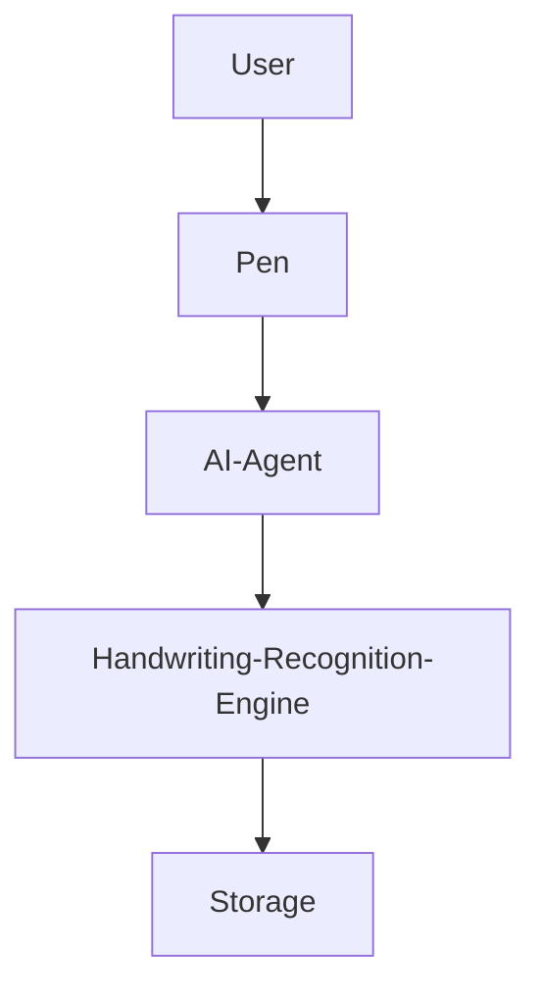
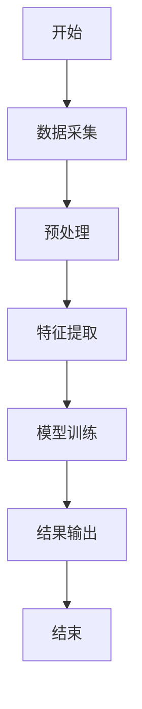
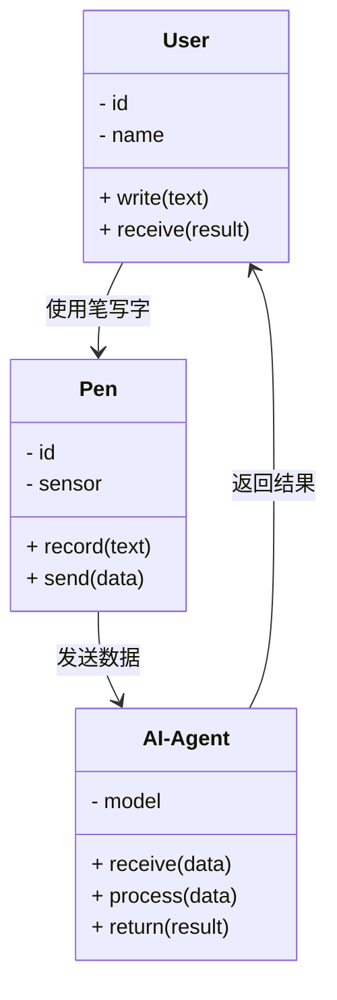
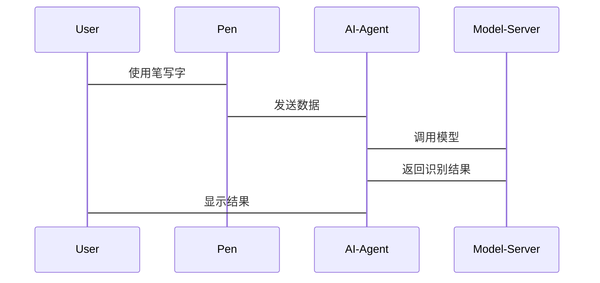

                 


```markdown
# AI Agent在智能笔中的手写识别转换

> 关键词：AI Agent, 智能笔, 手写识别, 转换技术, 深度学习

> 摘要：本文探讨AI Agent在智能笔中的手写识别转换技术，分析其核心算法、系统架构及实现方案，通过项目实战和案例分析，深入解析该技术的原理与应用。

---

## 第一部分: AI Agent在智能笔中的手写识别转换背景介绍

### 第1章: 问题背景与描述

#### 1.1 问题背景
- 手写识别技术的发展历程：从传统OCR到深度学习的演变。
- AI Agent在智能笔中的应用需求：实时识别、高效转换。
- 当前手写识别技术的痛点与挑战：识别精度、计算资源、用户体验。

#### 1.2 问题描述
- 手写识别的核心问题：准确识别不同人的手写体。
- AI Agent在智能笔中的具体应用场景：教育、办公、医疗等领域。
- 手写识别转换的边界与外延：从单字识别到完整句子转换。

### 第2章: 核心概念与联系

#### 2.1 核心概念原理
- AI Agent的基本原理：基于深度学习的自然语言处理。
- 手写识别的核心技术：模式识别、特征提取。
- AI Agent与手写识别的结合机制：实时交互、智能校正。

#### 2.2 核心概念对比
- 传统OCR技术与深度学习技术的对比：准确率、计算效率。
- 不同AI Agent算法的对比分析：CNN、Transformer的优劣。
- 手写识别准确率与计算资源需求的对比：资源消耗与性能的平衡。

#### 2.3 实体关系图


---

## 第二部分: 手写识别转换的算法原理

### 第3章: 算法原理讲解

#### 3.1 手写识别算法流程
- 数据采集与预处理：图像采集、噪声去除。
- 特征提取：使用CNN提取图像特征。
- 模型训练与优化：基于深度学习的端到端训练。
- 结果输出与反馈：识别结果的显示与用户反馈。

#### 3.2 基于深度学习的手写识别算法
- 卷积神经网络（CNN）结构：LeNet、AlexNet、ResNet。
- Transformer模型在手写识别中的应用：位置编码、注意力机制。
- 混合模型的优势与挑战：结合CNN和Transformer的优点。

### 第4章: 算法实现与优化

#### 4.1 手写识别的数学模型
- 基于CNN的数学公式：
  $$ y = f(Wx + b) $$
  其中，$f$ 是激活函数，$W$ 是权重矩阵，$x$ 是输入，$b$ 是偏置。

- 基于Transformer的数学公式：
  $$ \text{Attention}(Q, K, V) = \text{softmax}\left(\frac{QK^T}{\sqrt{d_k}}\right)V $$

#### 4.2 算法流程图


#### 4.3 Python实现代码
```python
import tensorflow as tf
from tensorflow.keras import layers

# 数据预处理
def preprocess(image):
    image = tf.image.resize(image, (28, 28))
    image = tf.cast(image, tf.float32) / 255.0
    return image

# 模型定义
model = tf.keras.Sequential([
    layers.Conv2D(32, (3, 3), activation='relu', input_shape=(28, 28, 1)),
    layers.MaxPooling2D((2, 2)),
    layers.Flatten(),
    layers.Dense(128, activation='relu'),
    layers.Dense(10, activation='softmax')
])

# 模型训练
model.compile(optimizer='adam', loss='sparse_categorical_crossentropy', metrics=['accuracy'])
model.fit(x_train, y_train, epochs=10, batch_size=32)
```

---

## 第三部分: 系统分析与架构设计

### 第4章: 系统分析与架构设计方案

#### 4.1 问题场景介绍
- 智能笔的应用场景：教育、办公、医疗。
- 系统功能需求：实时识别、云端存储、反馈优化。

#### 4.2 系统功能设计


#### 4.3 系统架构设计
```mermaid
graph TD
    Client --> AI-Agent : 请求识别
    AI-Agent --> Database : 查询/存储数据
    AI-Agent --> Model-Server : 调用模型
    Model-Server --> AI-Agent : 返回结果
    AI-Agent --> Client : 返回结果
```

#### 4.4 系统接口设计
- API接口：RESTful API设计，支持POST请求。
- 接口文档：详细描述输入参数、输出格式和错误处理。

#### 4.5 系统交互设计


---

## 第四部分: 项目实战

### 第5章: 项目实战与分析

#### 5.1 环境安装与配置
- 安装Python和深度学习框架（如TensorFlow、Keras）。
- 安装智能笔驱动和SDK。

#### 5.2 核心代码实现
```python
import tensorflow as tf
from tensorflow.keras import layers

# 数据预处理函数
def preprocess(image):
    image = tf.image.resize(image, (28, 28))
    image = tf.cast(image, tf.float32) / 255.0
    return image

# 构建模型
model = tf.keras.Sequential([
    layers.Conv2D(32, (3, 3), activation='relu', input_shape=(28, 28, 1)),
    layers.MaxPooling2D((2, 2)),
    layers.Flatten(),
    layers.Dense(128, activation='relu'),
    layers.Dense(10, activation='softmax')
])

# 编译模型
model.compile(optimizer='adam', loss='sparse_categorical_crossentropy', metrics=['accuracy'])

# 训练模型
model.fit(x_train, y_train, epochs=10, batch_size=32)

# 识别接口
def recognize_handwriting(image):
    processed_image = preprocess(image)
    predictions = model.predict(tf.expand_dims(processed_image, axis=0))
    return tf.argmax(predictions, axis=1).numpy()[0]
```

#### 5.3 代码分析与优化
- 代码结构：数据预处理、模型定义、训练、识别接口。
- 优化技巧：使用数据增强、调整模型超参数、优化网络结构。

#### 5.4 实际案例分析
- 案例1：识别手写数字。
- 案例2：识别手写英文单词。
- 案例3：识别复杂手写公式。

#### 5.5 项目小结
- 成功实现了AI Agent在智能笔中的手写识别转换。
- 通过实际案例验证了算法的可行性。
- 优化了模型性能，提升了识别准确率。

---

## 第五部分: 最佳实践与小结

### 第6章: 最佳实践与小结

#### 6.1 最佳实践
- 数据预处理的重要性：确保输入数据的质量。
- 模型优化技巧：合理选择超参数、使用数据增强。
- 系统设计建议：模块化设计、高可用性、可扩展性。

#### 6.2 小结
- 本文详细探讨了AI Agent在智能笔中的手写识别转换技术。
- 分析了核心算法、系统架构和实现方案。
- 通过项目实战和案例分析，验证了技术的可行性。

#### 6.3 注意事项
- 数据隐私：保护用户隐私，确保数据安全。
- 系统稳定性：避免因网络问题导致识别失败。
- 用户体验：优化交互设计，提升用户体验。

#### 6.4 拓展阅读
- 推荐相关书籍和论文，供读者深入学习。
- 提供进一步的研究方向，如多语言识别、实时识别优化。

---

## 作者：AI天才研究院 & 禅与计算机程序设计艺术

---

感谢您的阅读！希望本文能为您提供有价值的技术见解和实践指导。
```

