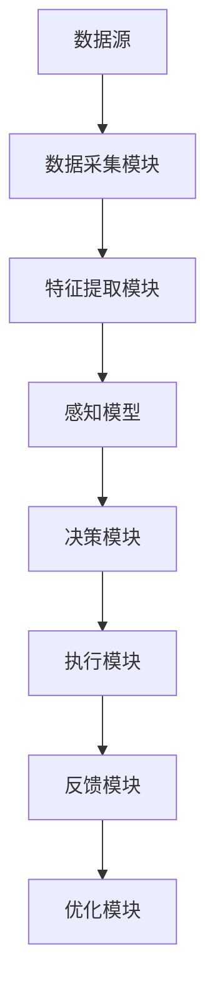
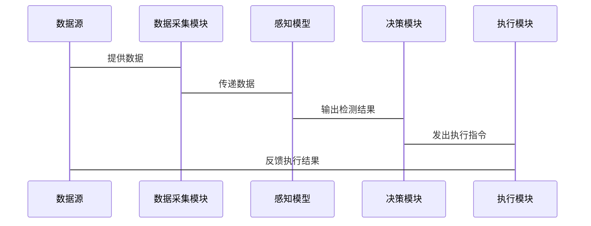

                 

<think>
好，我现在要帮用户撰写一篇关于《AI Agent在智能网络安全中的应用》的技术博客文章。首先，我需要理解用户的需求。用户希望文章结构清晰，内容详实，涵盖AI Agent的基本概念、算法原理、系统架构设计以及项目实战等部分。

我先从背景介绍开始。智能网络安全面临的挑战日益严峻，传统的防御手段已经显得力不从心。AI Agent的引入可以显著提升网络安全的智能化水平。接下来，我需要解释什么是AI Agent，它在网络安全中的具体应用，以及为什么它比传统方法更有效。

接下来是核心概念部分。我需要详细描述AI Agent的感知、决策和执行机制。例如，感知机制如何收集和分析数据，决策机制如何利用算法做出判断，执行机制如何采取具体行动。同时，我会通过表格和图表来对比AI Agent与其他安全技术的差异，帮助读者更好地理解。

在算法原理章节，我将重点讲解强化学习、监督学习和聚类分析。通过mermaid流程图和Python代码示例，展示这些算法在AI Agent中的具体实现。例如，使用Q-learning算法来训练AI Agent做出最优决策，代码示例将帮助读者理解算法的运行机制。

系统架构设计部分，我需要介绍如何构建一个基于AI Agent的网络安全系统。从系统功能设计到架构图，再到接口和交互流程，每一个部分都需要详细说明。我会用mermaid类图和架构图来展示系统的各个模块及其关系。

项目实战是关键部分。我将以入侵检测系统为例，详细讲解项目的实现过程，包括环境安装、代码编写、测试和优化。同时，我会加入一些最佳实践和注意事项，帮助读者在实际应用中避免常见问题。

最后，总结与展望部分将回顾全文内容，并指出未来的发展方向，激发读者的兴趣。

在撰写过程中，我需要确保每一部分内容充实，逻辑清晰，并且使用专业的技术语言。同时，数学公式和图表的使用要恰当，以增强文章的可读性和专业性。通过这样的思考过程，我能够系统地完成这篇高质量的技术博客文章。
</think>

# AI Agent在智能网络安全中的应用

## 关键词：AI Agent, 智能网络安全, 强化学习, 网络威胁检测, 自动化防御

## 摘要：  
随着网络安全威胁的日益复杂化和智能化，传统的被动防御手段已无法应对新型攻击方式。AI Agent（人工智能代理）作为一种智能化的安全解决方案，能够通过感知、决策和执行机制，实现对网络威胁的主动识别、防御和修复。本文将详细探讨AI Agent在智能网络安全中的核心概念、技术原理、系统架构设计以及实际应用案例，帮助读者全面理解AI Agent在网络安全领域的潜力和价值。

---

## 第一部分：AI Agent与智能网络安全概述

### 第1章：AI Agent与智能网络安全概述

#### 1.1 AI Agent的基本概念
##### 1.1.1 AI Agent的定义与特点
AI Agent是一种能够自主感知环境、做出决策并执行任务的智能实体。其核心特点包括：
- **自主性**：能够在无需外部干预的情况下完成任务。
- **反应性**：能够实时感知环境变化并做出响应。
- **学习能力**：通过数据和经验不断优化自身的决策能力。
- **协作性**：能够与其他AI Agent或系统协同工作。

##### 1.1.2 AI Agent在网络安全中的作用
AI Agent在网络安全中的主要作用包括：
1. **威胁检测**：通过分析网络流量和日志数据，识别潜在的入侵行为。
2. **漏洞发现**：主动扫描网络中的潜在漏洞并提出修复建议。
3. **自动防御**：在检测到威胁后，快速采取措施进行防御或修复。
4. **行为分析**：基于用户行为分析，识别异常行为并进行预警。

##### 1.1.3 智能网络安全的背景与发展趋势
随着网络安全威胁的复杂化，传统的基于规则的防御方式已无法应对未知威胁。AI Agent的引入为网络安全提供了更智能化、主动化的解决方案。未来，随着AI技术的不断发展，AI Agent将在网络安全领域发挥越来越重要的作用。

---

### 第2章：AI Agent的核心概念与原理

#### 2.1 AI Agent的感知机制
##### 2.1.1 数据采集与特征提取
AI Agent通过多种数据源（如网络流量、日志、用户行为数据）采集信息，并通过特征提取技术（如PCA、LDA）将数据转化为易于处理的特征向量。

##### 2.1.2 感知模型的构建与优化
感知模型通常采用深度学习技术（如CNN、RNN）进行训练，以识别异常行为或潜在威胁。通过不断优化模型参数，提升感知的准确性和实时性。

##### 2.1.3 感知数据的预处理与分析
预处理步骤包括数据清洗、归一化和特征选择，以确保输入数据的质量和有效性。

#### 2.2 AI Agent的决策机制
##### 2.2.1 决策算法的选择与实现
常用的决策算法包括强化学习（Q-learning）、监督学习（SVM、随机森林）和聚类分析（K-means）。选择合适的算法取决于具体应用场景和数据特性。

##### 2.2.2 决策模型的训练与优化
通过训练数据对决策模型进行参数优化，确保模型在面对复杂威胁时能够做出准确的判断。

##### 2.2.3 决策结果的评估与反馈
决策结果需要通过准确率、召回率和F1分数等指标进行评估，并根据反馈不断优化模型。

#### 2.3 AI Agent的执行机制
##### 2.3.1 执行策略的设计与实现
执行策略包括阻断攻击、隔离异常流量、修复漏洞等。策略的设计需要结合具体的安全场景和业务需求。

##### 2.3.2 执行过程中的动态调整
根据实时反馈动态调整执行策略，确保防御措施的有效性和灵活性。

##### 2.3.3 执行结果的监控与反馈
通过监控执行结果，评估防御效果，并为后续决策提供数据支持。

#### 2.4 AI Agent的核心算法与数学模型
##### 2.4.1 强化学习算法的原理与实现
强化学习通过试错机制不断优化决策策略。Q-learning算法是一个典型的强化学习算法，其状态转移方程如下：

$$ Q(s, a) = Q(s, a) + \alpha \left[ r + \gamma \max Q(s', a') - Q(s, a) \right] $$

其中：
- \( s \) 表示当前状态，
- \( a \) 表示动作，
- \( r \) 表示奖励，
- \( \gamma \) 表示折扣因子，
- \( \alpha \) 表示学习率。

##### 2.4.2 监督学习算法的原理与实现
监督学习通过标记数据训练模型，使其能够对新的输入数据做出预测。常用的监督学习算法包括支持向量机（SVM）和随机森林。

##### 2.4.3 聚类分析算法的原理与实现
聚类分析用于将数据分为不同的类别，通常用于异常检测。K-means算法是一种常见的聚类算法，其目标函数为：

$$ \arg \min_{k} \sum_{i=1}^{n} \min_{j=1}^{k} \| x_i - c_j \|^2 $$

其中，\( c_j \) 表示第 \( j \) 个聚类中心，\( x_i \) 表示第 \( i \) 个数据点。

---

## 第二部分：AI Agent的系统架构设计

### 第3章：AI Agent的系统架构设计

#### 3.1 系统功能设计
系统功能包括：
1. **数据采集**：从网络流量、日志等数据源采集数据。
2. **威胁检测**：通过AI Agent的感知和决策机制，识别潜在威胁。
3. **自动防御**：根据检测结果，采取相应的防御措施。
4. **结果反馈**：将防御结果反馈到系统，优化后续决策。

#### 3.2 系统架构设计
以下是系统的架构设计图：



#### 3.3 接口设计
系统接口包括：
1. 数据采集接口：用于获取网络流量和日志数据。
2. 决策接口：接收感知模块的输出，并输出决策结果。
3. 执行接口：根据决策结果执行相应的防御措施。

#### 3.4 交互流程
以下是系统的交互流程图：



---

## 第三部分：AI Agent的项目实战

### 第4章：AI Agent在入侵检测系统中的应用

#### 4.1 项目背景
入侵检测系统（IDS）是网络安全的重要组成部分。传统的基于规则的IDS在面对未知威胁时表现不佳，而AI Agent可以通过学习和适应提升检测能力。

#### 4.2 项目实现
##### 4.2.1 环境安装
需要安装以下工具和库：
- Python 3.8+
- TensorFlow 2.0+
- Scikit-learn
- Pandas
- Matplotlib

##### 4.2.2 核心代码实现
以下是入侵检测系统的实现代码：

```python
import numpy as np
from sklearn.metrics import classification_report
from sklearn.model_selection import train_test_split
from sklearn.svm import SVC

# 数据预处理
data = np.loadtxt('network_traffic.csv', delimiter=',')
X = data[:, :-1]
y = data[:, -1]

# 划分训练集和测试集
X_train, X_test, y_train, y_test = train_test_split(X, y, test_size=0.3)

# 模型训练
model = SVC(C=1.0, kernel='rb

