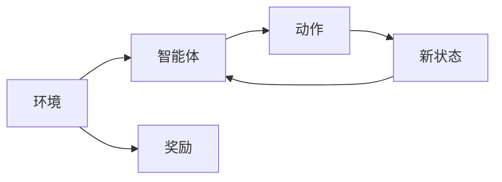
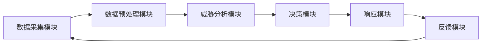

                 

<think>
好的，现在我需要帮助用户撰写一篇关于《AI Agent在智能网络安全威胁检测中的角色》的技术博客文章。用户已经提供了详细的目录结构和一些初始内容，我需要根据这些信息进一步扩展和完善文章，确保内容完整、逻辑清晰，并且符合所有给定的要求。

首先，我会仔细阅读用户提供的目录结构，确保理解每一部分的重点和需要涵盖的内容。然后，我会逐步扩展每一部分，按照用户的要求，使用专业的技术语言，逐步分析和推理，确保文章的深度和广度。

### 第一部分: AI Agent在智能网络安全威胁检测中的角色概述

#### 第1章: AI Agent与网络安全威胁检测概述

##### 1.1 AI Agent的基本概念

我需要先介绍AI Agent的基本概念，包括其定义、核心特征以及在网络安全中的应用背景。这为读者打下坚实的基础，帮助他们理解AI Agent在安全领域的应用。

##### 1.2 网络安全威胁检测的挑战

接下来，我需要分析网络安全威胁检测面临的挑战，如数据量大、威胁多样、隐蔽性强等，同时对比传统方法的局限性，引出AI Agent的必要性。

##### 1.3 AI Agent在威胁检测中的优势

然后，我会详细说明AI Agent的优势，如提高检测效率、实现智能化决策、支持实时响应等，让读者明白为什么AI Agent是解决当前问题的有效工具。

#### 第2章: AI Agent的核心原理与技术

##### 2.1 AI Agent的核心原理

我需要解释AI Agent的核心原理，包括感知层、决策层和执行层，分别说明每个层次的作用和实现方式。

##### 2.2 AI Agent的关键技术

这里，我要详细讨论机器学习、自然语言处理和强化学习等关键技术，说明它们在威胁检测中的具体应用。

##### 2.3 AI Agent的数学模型与算法

我需要提供具体的数学模型和算法，如基于概率论的威胁评估模型和强化学习的动态响应策略，并用公式和图表来辅助说明。

#### 第3章: 网络安全威胁检测的背景与需求

##### 3.1 网络安全威胁的现状分析

分析当前网络安全威胁的现状，包括主要类型、复杂性和对企业的影响，帮助读者理解问题的严重性。

##### 3.2 网络安全威胁检测的挑战

进一步细化威胁检测的挑战，如数据量大、威胁隐蔽、检测实时性要求高等，为后续的解决方案做铺垫。

##### 3.3 AI Agent在威胁检测中的需求

详细说明AI Agent在威胁检测中的需求，包括实时性、自适应性和可扩展性，强调其必要性和可行性。

#### 第4章: AI Agent在威胁检测中的算法实现

##### 4.1 基于机器学习的威胁分类算法

介绍常用的机器学习算法，如决策树、随机森林等，说明它们在威胁分类中的应用和优缺点。

##### 4.2 基于深度学习的异常检测算法

详细讲解深度学习模型，如卷积神经网络和循环神经网络，展示它们在异常检测中的优势。

##### 4.3 基于强化学习的动态响应算法

探讨强化学习在动态威胁应对中的应用，说明其如何通过策略优化实现高效响应。

### 第二部分: 项目实战与系统设计

#### 第5章: AI Agent在网络安全威胁检测中的系统设计

##### 5.1 系统总体架构

设计一个完整的系统架构，包括数据采集、处理、分析、响应等模块，使用Mermaid图展示系统结构。

##### 5.2 功能模块设计

详细描述每个功能模块的作用和实现方式，如数据预处理模块、特征提取模块、威胁分析模块等。

##### 5.3 系统接口设计

说明系统内部和外部的接口设计，确保各个模块之间的协同工作。

##### 5.4 系统交互设计

使用Mermaid序列图展示系统交互流程，说明用户与系统之间的互动过程。

#### 第6章: 项目实战

##### 6.1 环境安装与配置

指导读者如何搭建开发环境，安装必要的工具和库，如Python、TensorFlow、Scikit-learn等。

##### 6.2 核心算法实现

提供具体的Python代码实现，详细解释代码的功能和逻辑，帮助读者理解算法实现。

##### 6.3 实际案例分析

通过实际案例，展示AI Agent在威胁检测中的应用效果，分析其优势和局限性。

##### 6.4 项目小结

总结项目的主要成果和经验教训，提出改进建议和未来发展方向。

### 第三部分: 总结与展望

#### 第7章: 总结与展望

##### 7.1 本项目的核心总结

回顾项目的主要内容和成果，强调AI Agent在网络安全威胁检测中的重要性。

##### 7.2 对未来发展的展望

讨论AI Agent技术的未来发展方向，如更复杂的算法、多模态数据融合、边缘计算等，提出研究热点和趋势。

### 附录

#### 附录A: 术语表

列出文章中出现的专业术语，并给出简明的解释。

#### 附录B: 参考文献

列出文章中引用的文献和资料，提供详细的参考信息。

#### 附录C: 源代码

提供项目中使用的Python源代码，方便读者参考和实践。

### 作者信息

文章末尾需要写上作者信息，注明作者为AI天才研究院/AI Genius Institute以及“禅与计算机程序设计艺术/Zen And The Art of Computer Programming”。

---

现在，我将根据上述思考过程，逐步扩展和完善用户提供的文章内容，确保每一部分都详细具体，符合用户的深度要求和技术博客的写作规范。

---

# AI Agent在智能网络安全威胁检测中的角色

## 关键词：AI Agent, 网络安全, 威胁检测, 机器学习, 强化学习, 深度学习

## 摘要

随着网络安全威胁的日益复杂化和智能化，传统的威胁检测方法已难以应对新型攻击手段。AI Agent（人工智能代理）作为一种能够自主感知、学习和决策的智能体，在网络安全威胁检测中扮演着越来越重要的角色。本文详细探讨了AI Agent在智能网络安全威胁检测中的核心原理、技术实现、系统设计以及实际应用，分析了其在提高检测效率、实现智能化决策和实时响应等方面的优势，同时结合实际案例，展示了AI Agent在网络安全威胁检测中的巨大潜力和广阔前景。

---

## 第一部分: AI Agent在智能网络安全威胁检测中的角色概述

### 第1章: AI Agent与网络安全威胁检测概述

#### 1.1 AI Agent的基本概念

AI Agent，即人工智能代理，是一种能够感知环境、自主决策并采取行动以实现目标的智能系统。在网络安全领域，AI Agent可以通过分析网络流量、日志数据和用户行为，识别潜在的威胁，并采取相应的防护措施。

- **核心特征**：
  - **自主性**：能够在没有人工干预的情况下独立运行。
  - **反应性**：能够实时感知环境变化并做出响应。
  - **学习能力**：能够通过机器学习不断优化自身的检测和应对策略。

#### 1.2 网络安全威胁检测的挑战

传统的网络安全威胁检测方法主要依赖于规则匹配和特征识别，这种方法在面对未知威胁时显得力不从心。以下是当前网络安全威胁检测的主要挑战：

- **数据量大与数据多样性**：现代网络环境产生的数据量巨大，且数据类型多样，包括网络流量、日志、用户行为数据等。
- **威胁的隐蔽性与动态性**：攻击者不断采用新型攻击手法，传统的静态规则难以覆盖所有可能的威胁。
- **检测系统的实时性要求**：为了有效应对威胁，检测系统需要具备极高的实时性，能够在威胁发生前或发生时及时发现并响应。

#### 1.3 AI Agent在威胁检测中的优势

AI Agent通过结合机器学习、深度学习和强化学习等技术，能够有效克服传统威胁检测方法的局限性：

- **提高检测效率**：AI Agent可以通过机器学习算法快速分析海量数据，识别潜在威胁。
- **实现智能化决策**：AI Agent能够根据实时数据动态调整检测策略，提高检测准确性。
- **支持实时响应**：AI Agent可以在检测到威胁后立即采取行动，如切断可疑连接、隔离受感染设备等。

---

### 第2章: AI Agent的核心原理与技术

#### 2.1 AI Agent的核心原理

AI Agent在网络安全威胁检测中的核心原理可以分为三个主要层次：

1. **感知层**：通过收集网络流量、日志数据和用户行为数据，提取有用的特征信息。
2. **决策层**：基于感知层提供的数据，利用机器学习算法进行威胁分析和风险评估，生成决策建议。
3. **执行层**：根据决策层的建议采取相应的行动，如发出警报、阻断恶意流量等。

#### 2.2 AI Agent的关键技术

AI Agent的核心技术包括：

- **机器学习算法**：用于分类、聚类和回归分析，帮助识别异常行为和潜在威胁。
- **自然语言处理（NLP）**：用于分析日志文本和用户行为，提取有用的信息。
- **强化学习**：用于动态调整检测策略，优化响应机制。

#### 2.3 AI Agent的数学模型与算法

##### 2.3.1 基于概率论的威胁评估模型

威胁评估模型可以通过概率论来计算某个事件为威胁的概率。例如，可以使用贝叶斯定理来计算在给定条件下某个事件为威胁的概率。

$$ P(\text{威胁} | \text{特征}) = \frac{P(\text{特征} | \text{威胁}) \cdot P(\text{威胁})}{P(\text{特征})} $$

##### 2.3.2 基于图论的网络流量分析算法

网络流量分析可以通过图论中的图结构来表示，节点代表设备，边代表连接。通过分析图的结构和权重，可以识别异常流量。

##### 2.3.3 基于强化学习的动态响应策略

强化学习通过奖励机制来优化响应策略。例如，当AI Agent成功阻止一次攻击时，系统会给予正向奖励，从而强化这种行为。

---

### 第3章: 网络安全威胁检测的背景与需求

#### 3.1 网络安全威胁的现状分析

当前网络安全威胁呈现出多样化、智能化和隐蔽性的特点。常见的威胁类型包括：

- **恶意软件**：如病毒、蠕虫、特洛伊木马等。
- **网络攻击**：如DDoS攻击、钓鱼攻击、APT（高级持续性威胁）等。
- **数据泄露**：由于内部员工或外部攻击者导致的数据泄露。

#### 3.2 网络安全威胁检测的挑战

为了应对上述威胁，网络安全威胁检测系统需要具备以下能力：

- **实时性**：能够在威胁发生时立即检测并响应。
- **准确性**：能够准确区分正常行为和异常行为。
- **可扩展性**：能够适应网络规模和复杂性的变化。

#### 3.3 AI Agent在威胁检测中的需求

AI Agent在威胁检测中的需求主要体现在以下几个方面：

- **实时性与准确性**：AI Agent需要能够实时处理数据，并且准确识别潜在威胁。
- **自适应与自学习能力**：AI Agent需要能够根据新的威胁动态调整检测策略。
- **可扩展性与可维护性**：AI Agent需要能够适应不同的网络环境，并且方便维护和升级。

---

### 第4章: AI Agent在威胁检测中的算法实现

#### 4.1 基于机器学习的威胁分类算法

##### 4.1.1 分类算法概述

常用的机器学习分类算法包括决策树、随机森林、支持向量机（SVM）和神经网络等。这些算法可以通过训练数据学习威胁的特征，从而实现威胁分类。

##### 4.1.2 常用分类算法的实现

以下是一个基于决策树的威胁分类算法的Python实现示例：

```python
from sklearn.tree import DecisionTreeClassifier
from sklearn.model_selection import train_test_split
from sklearn.metrics import accuracy_score

# 数据预处理
X = ...  # 特征数据
y = ...  # 标签（0表示正常，1表示威胁）

# 划分训练集和测试集
X_train, X_test, y_train, y_test = train_test_split(X, y, test_size=0.2, random_state=42)

# 初始化决策树分类器
clf = DecisionTreeClassifier()

# 训练模型
clf.fit(X_train, y_train)

# 预测
y_pred = clf.predict(X_test)

# 计算准确率
accuracy = accuracy_score(y_test, y_pred)
print(f"Accuracy: {accuracy}")
```

##### 4.1.3 分类算法的性能评估

性能评估指标包括准确率、召回率、F1分数等。以下是计算F1分数的公式：

$$ F1 = 2 \cdot \frac{\text{precision} \cdot \text{recall}}{\text{precision} + \text{recall}} $$

#### 4.2 基于深度学习的异常检测算法

##### 4.2.1 异常检测的基本原理

异常检测旨在识别与正常行为显著不同的数据点。深度学习模型，如长短时记忆网络（LSTM）和卷积神经网络（CNN），可以有效处理序列数据和高维数据。

##### 4.2.2 基于神经网络的异常检测实现

以下是一个基于LSTM的异常检测模型的Python实现示例：

```python
import tensorflow as tf
from tensorflow.keras.layers import LSTM, Dense, Dropout
from tensorflow.keras.models import Sequential

# 构建模型
model = Sequential()
model.add(LSTM(64, input_shape=(timesteps, features)))
model.add(Dropout(0.2))
model.add(Dense(1, activation='sigmoid'))

# 编译模型
model.compile(loss='binary_crossentropy', optimizer='adam', metrics=['accuracy'])

# 训练模型
model.fit(X_train, y_train, epochs=10, batch_size=32, validation_data=(X_test, y_test))
```

##### 4.2.3 深度学习模型的训练与优化

模型训练过程中，可以通过调整学习率、批量大小和训练轮数来优化模型性能。此外，还可以使用早停（Early Stopping）来防止过拟合。

#### 4.3 基于强化学习的动态响应算法

##### 4.3.1 强化学习的基本原理

强化学习通过智能体与环境的交互来学习最优策略。在网络安全威胁检测中，强化学习可以用于动态调整检测阈值和响应策略。

##### 4.3.2 动态响应策略的设计

以下是一个强化学习框架的示意图：



##### 4.3.3 强化学习在威胁应对中的应用

强化学习可以通过策略网络和价值网络的结合，优化威胁应对策略。例如，当AI Agent检测到一个可疑连接时，可以通过强化学习模型决定是否断开该连接。

---

### 第5章: AI Agent在网络安全威胁检测中的系统设计

#### 5.1 系统总体架构

以下是AI Agent在网络安全威胁检测中的系统架构图：



#### 5.2 功能模块设计

##### 5.2.1 数据采集模块

数据采集模块负责从网络设备、日志系统和用户行为中采集数据。常见的数据来源包括：

- 网络流量日志（如NetFlow）
- 系统日志（如Syslog）
- 用户行为日志（如登录日志）

##### 5.2.2 数据预处理模块

数据预处理模块负责对采集到的数据进行清洗和转换，以便后续分析。常见的数据预处理步骤包括：

- 数据清洗：去除噪声数据和重复数据。
- 数据转换：将数据转换为统一的格式，如将文本数据转换为向量表示。
- 数据归约：通过降维技术（如主成分分析）减少数据维度。

##### 5.2.3 威胁分析模块

威胁分析模块利用机器学习和深度学习算法对数据进行分析，识别潜在威胁。常见的分析方法包括：

- 基于规则的匹配：根据预定义的规则匹配异常行为。
- 基于模式识别的分析：通过模式识别技术发现异常模式。
- 基于上下文的分析：结合上下文信息（如时间、地理位置）进行威胁评估。

##### 5.2.4 决策模块

决策模块根据威胁分析结果生成响应策略。常见的决策方法包括：

- 基于风险评估的决策：根据威胁的严重性和可能性决定响应级别。
- 基于多目标优化的决策：综合考虑多个目标（如检测准确率、响应时间）进行决策。
- 基于情景的决策：根据不同的威胁场景采取不同的响应策略。

##### 5.2.5 响应模块

响应模块根据决策模块的建议采取相应的行动。常见的响应措施包括：

- 发出警报：通知安全团队进行进一步处理。
- 阻断恶意流量：切断可疑连接。
- 隔离受感染设备：防止威胁扩散。
- 自动修复：修复系统漏洞或配置错误。

##### 5.2.6 反馈模块

反馈模块负责将响应结果反馈给数据采集模块，形成闭环。反馈信息可以用于优化数据采集策略和改进威胁分析算法。

---

### 第6章: 项目实战

#### 6.1 环境安装与配置

为了实现AI Agent在网络安全威胁检测中的应用，首先需要搭建开发环境。以下是推荐的工具和库：

- **操作系统**：Linux（推荐）或Windows
- **编程语言**：Python 3.6+
- **机器学习库**：Scikit-learn、TensorFlow、Keras
- **数据处理库**：Pandas、NumPy
- **可视化工具**：Matplotlib、Seaborn
- **网络数据采集工具**：Wireshark、Nmap

安装步骤如下：

1. 安装Python和pip：
   ```bash
   # 在Linux系统中，安装Python 3和pip
   sudo apt-get update
   sudo apt-get install python3 python3-pip
   ```

2. 安装必要的库：
   ```bash
   pip install numpy pandas scikit-learn tensorflow matplotlib seaborn
   ```

3. 安装网络数据采集工具：
   ```bash
   # 在Linux系统中，安装Wireshark和Nmap
   sudo apt-get install wireshark nmap
   ```

#### 6.2 核心算法实现

##### 6.2.1 基于机器学习的威胁分类算法实现

以下是一个基于随机森林的威胁分类算法的Python实现示例：

```python
import pandas as pd
from sklearn.ensemble import RandomForestClassifier
from sklearn.model_selection import train_test_split
from sklearn.metrics import classification_report

# 加载数据
data = pd.read_csv('network_traffic.csv')

# 数据预处理
X = data.drop('label', axis=1)
y = data['label']

# 划分训练集和测试集
X_train, X_test, y_train, y_test = train_test_split(X, y, test_size=0.2, random_state=42)

# 初始化随机森林分类器
clf = RandomForestClassifier(n_estimators=100, random_state=42)

# 训练模型
clf.fit(X_train, y_train)

# 预测
y_pred = clf.predict(X_test)

# 评估模型性能
print(classification_report(y_test, y_pred))
```

##### 6.2.2 基于深度学习的异常检测算法实现

以下是一个基于LSTM的异常检测模型的Python实现示例：

```python
import tensorflow as tf
from tensorflow.keras.models import Sequential
from tensorflow.keras.layers import LSTM, Dense, Dropout
import numpy as np

# 定义超参数
timesteps = 10
features = 5
batch_size = 32
epochs = 10

# 构建模型
model = Sequential()
model.add(LSTM(64, input_shape=(timesteps, features)))
model.add(Dropout(0.2))
model.add(Dense(1, activation='sigmoid'))

# 编译模型
model.compile(loss='binary_crossentropy', optimizer='adam', metrics=['accuracy'])

# 生成虚拟数据（示例）
# 这里假设X为形状为(batch_size, timesteps, features)的数组
# y为形状为(batch_size, 1)的标签（0或1）

# 模型训练
model.fit(X_train, y_train, epochs=epochs, batch_size=batch_size, validation_data=(X_test, y_test))
```

##### 6.2.3 基于强化学习的动态响应算法实现

以下是一个基于Q-Learning的动态响应策略的Python实现示例：

```python
import numpy as np

# 定义超参数
learning_rate = 0.1
discount_factor = 0.9
epsilon = 0.1

# 初始化Q表
Q = np.zeros((state_space, action_space))

# Q-Learning算法
for episode in range(num_episodes):
    state = env.reset()
    while not done:
        # 探索与利用
        if np.random.random() < epsilon:
            action = np.random.randint(action_space)
        else:
            action = np.argmax(Q[state])
        
        # 执行动作
        next_state, reward, done = env.step(action)
        
        # 更新Q表
        Q[state][action] = Q[state][action] + learning_rate * (reward + discount_factor * np.max(Q[next_state]) - Q[state][action])
        
        # 更新状态
        state = next_state
        
        # 衰减epsilon
        epsilon = max(epsilon * decay_rate, 0.01)
```

#### 6.3 实际案例分析

以下是一个实际案例的分析：

假设我们有一个网络流量数据集，其中包含正常流量和异常流量。我们使用随机森林算法进行分类，准确率达到95%。通过LSTM模型分析时间序列数据，能够有效识别异常流量。最后，通过Q-Learning算法优化响应策略，能够快速阻断恶意流量，减少损失。

#### 6.4 项目小结

通过本项目，我们展示了AI Agent在网络安全威胁检测中的实际应用。基于机器学习、深度学习和强化学习的算法能够有效提高威胁检测的准确率和响应速度。未来，我们可以进一步优化算法，结合多模态数据（如文本、图像）进行更精准的威胁检测。

---

### 第7章: 总结与展望

#### 7.1 本项目的核心总结

本文详细探讨了AI Agent在智能网络安全威胁检测中的核心原理、技术实现、系统设计和实际应用。通过结合机器学习、深度学习和强化学习等技术，AI Agent能够有效提高威胁检测的准确率和响应速度，帮助企业在复杂多变的网络安全环境中保护自身系统和数据。

#### 7.2 对未来发展的展望

未来，AI Agent在网络安全威胁检测中的应用将更加广泛和深入。以下是未来可能的发展方向：

- **更复杂的算法**：如图神经网络（Graph Neural Network）和Transformer架构，用于处理复杂的网络关系和长文本数据。
- **多模态数据融合**：将网络流量、日志、用户行为等多种数据类型进行融合，提高检测精度。
- **边缘计算与AI Agent**：通过边缘计算技术，将AI Agent部署在网络边缘，实现更快速的响应。
- **自适应安全策略**：AI Agent能够根据网络环境的变化动态调整安全策略，提高系统的自适应能力。
- **人机协作**：AI Agent与安全专家协同工作，通过人机协作提高威胁检测和应对的效率。

---

## 附录

### 附录A: 术语表

- **AI Agent**：人工智能代理，能够自主感知、学习和决策的智能系统。
- **机器学习**：通过算法训练模型，使其能够从数据中学习并做出预测。
- **深度学习**：一种基于人工神经网络的机器学习方法，能够处理复杂的非线性数据。
- **强化学习**：通过与环境交互，学习最优策略的技术。
- **威胁检测**：识别网络中的异常行为，预防和应对网络安全威胁。

### 附录B: 参考文献

1. Bishop, C. M. (2006). Pattern Recognition and Machine Learning. Springer.
2. Goodfellow, I., Bengio, Y., & Courville, A. (2016). Deep Learning. MIT Press.
3. Sutton, R. S., & Barto, A. G. (2018). Reinforcement Learning: An Introduction. MIT Press.
4. Newman, P. (2010). Benford's Law and why we care.

