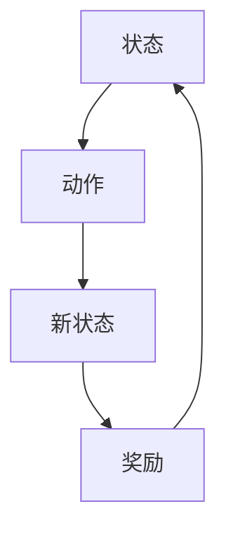
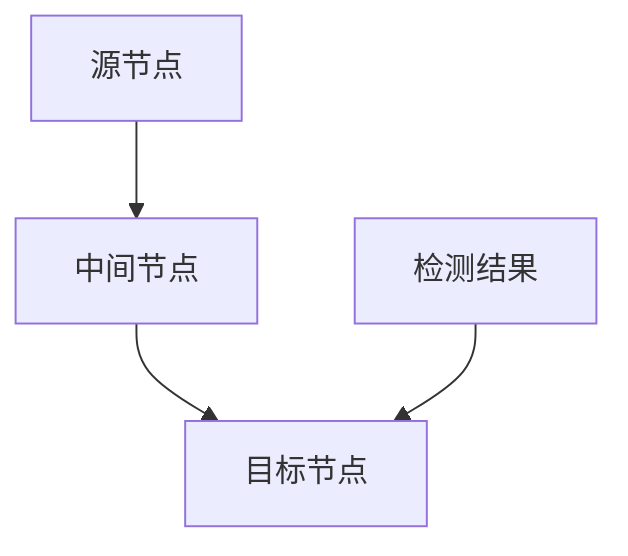
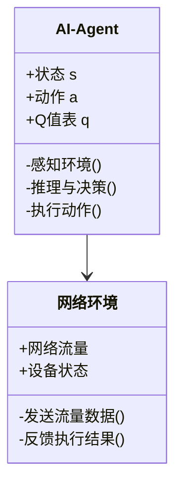
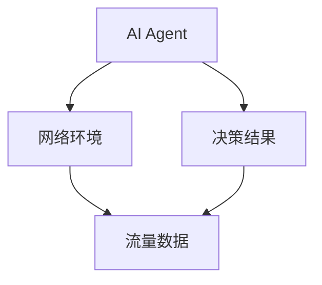

                 

<think>
好，我需要根据用户的要求，逐步完成《AI Agent在智能网络安全防御中的角色》这篇文章的撰写。首先，我会按照目录大纲的结构来组织内容，确保每一部分都详细且符合逻辑。我会先写文章标题和关键词，然后是摘要，接着是每一章的具体内容。在撰写过程中，我会使用markdown格式，确保格式的规范性。对于核心概念部分，我将使用mermaid流程图和表格来辅助说明；在算法部分，我会详细解释原理并提供代码示例和数学公式；系统架构部分会设计领域模型和架构图；项目实战部分则会提供安装步骤、代码实现和案例分析。最后，我会总结最佳实践，并添加注意事项和拓展阅读内容。确保整篇文章逻辑清晰，内容详实，语言专业且易懂。
</think>

# AI Agent在智能网络安全防御中的角色

> 关键词：AI Agent，智能网络安全，强化学习，图神经网络，网络安全防御

> 摘要：本文探讨AI Agent在智能网络安全防御中的角色，分析其核心概念、算法原理、系统架构，并通过实战案例和最佳实践提供深入见解。

---

# 第1章: AI Agent的基本概念与背景

## 1.1 AI Agent的定义与特点

### 1.1.1 AI Agent的定义

AI Agent（智能体）是指能够感知环境、自主决策并采取行动以实现目标的智能系统。它具备感知、推理、学习和决策的能力。

### 1.1.2 AI Agent的核心特点

| 特点 | 描述 |
|------|------|
| 智能性 | 能够自主学习和适应环境 |
| 主动性 | 能够主动采取行动，而不仅仅是被动响应 |
| 社会性 | 可与其他系统或人类协同工作 |
| 可解释性 | 决策过程可被理解和解释 |

### 1.1.3 AI Agent与传统安全防御的区别

- **被动防御**：传统安全防御依赖于规则和签名，只能检测已知威胁。
- **主动防御**：AI Agent能够主动学习和适应，发现未知威胁。

## 1.2 智能网络安全防御的背景

### 1.2.1 当前网络安全面临的挑战

- 威胁多样化：病毒、木马、DDoS攻击等日益复杂。
- 攻击智能化：攻击者利用AI技术进行自动化攻击。
- 安全防护的滞后性：传统防御手段难以应对快速变化的威胁。

### 1.2.2 AI技术在网络安全中的应用现状

- **威胁检测**：利用AI算法分析网络流量，发现异常行为。
- **威胁情报**：通过机器学习提取威胁情报，预测未来攻击。
- **自动响应**：AI Agent能够自动采取措施，如隔离受感染设备。

### 1.2.3 AI Agent在智能网络安全中的重要性

- 提高检测效率：通过实时学习和推理，快速识别潜在威胁。
- 减少误报漏报：AI Agent能够分析上下文，减少误报和漏报。
- 实现主动防御：从被动响应转向主动防御，提升整体安全性。

---

# 第2章: AI Agent的核心概念与原理

## 2.1 AI Agent的核心概念

### 2.1.1 知识表示与推理

- **知识表示**：将网络安全相关的知识表示为图结构，便于推理。
- **推理过程**：基于知识图谱进行逻辑推理，判断异常行为。

### 2.1.2 行为决策与规划

- **决策过程**：基于当前状态和目标，选择最优动作。
- **规划**：制定行动计划，确保达到预期目标。

### 2.1.3 状态感知与学习

- **感知环境**：通过传感器或API获取网络环境信息。
- **学习机制**：利用强化学习不断优化决策策略。

## 2.2 AI Agent与网络安全防御的联系

### 2.2.1 网络安全防御中的问题建模

- **问题建模**：将网络安全问题转化为AI Agent可处理的形式。
- **模型训练**：利用历史数据训练AI Agent，使其能够识别威胁。

### 2.2.2 AI Agent在异常检测中的应用

- **异常检测**：通过学习正常行为模式，识别异常流量。
- **实时监控**：AI Agent持续监控网络流量，及时发现异常。

### 2.2.3 AI Agent在威胁情报分析中的作用

- **情报分析**：利用自然语言处理技术分析威胁情报，提取有用信息。
- **预测攻击**：基于历史数据和当前趋势，预测未来可能的攻击。

---

# 第3章: AI Agent的算法原理与实现

## 3.1 强化学习在AI Agent中的应用

### 3.1.1 强化学习的基本原理

- **强化学习**：通过试错机制，学习最优策略。
- **奖励机制**：AI Agent通过获得奖励或惩罚来调整行为。

### 3.1.2 Q-learning算法在AI Agent中的实现

- **Q-learning算法**：通过Q表记录状态-动作对的价值，逐步更新Q值。
- **算法流程图**（mermaid）：



### 3.1.3 通俗易懂的例子

假设AI Agent是一个在网络中巡逻的机器人。当它发现一个可疑的文件下载行为时，它会采取隔离该设备的动作，获得奖励。如果它没有采取任何行动，可能会因为没有阻止攻击而受到惩罚。

---

## 3.2 图神经网络在网络安全中的应用

### 3.2.1 图神经网络的基本原理

- **图的表示方法**：将网络中的设备、用户和流量表示为图的节点和边。
- **图卷积层**：通过聚合相邻节点的信息，更新当前节点的特征。

### 3.2.2 图神经网络在威胁检测中的应用

- **威胁检测**：通过图神经网络分析网络流量，发现异常连接。
- **恶意软件检测**：分析文件间的关联性，识别恶意软件传播。

### 3.2.3 算法流程图（mermaid）



---

## 3.3 数学公式

### 3.3.1 强化学习的数学模型

- **Q-learning公式**：

$$ Q(s,a) = Q(s,a) + \alpha \left[r + \gamma \max Q(s',a') - Q(s,a)\right] $$

其中：
- \( Q(s,a) \)：当前状态s和动作a的Q值。
- \( \alpha \)：学习率。
- \( r \)：奖励。
- \( \gamma \)：折扣因子。
- \( Q(s',a') \)：新状态s'下的最大Q值。

### 3.3.2 图神经网络的数学模型

- **图卷积层公式**：

$$ GConv(x) = \sum_{j=1}^{n} W_{i,j} x_j $$

其中：
- \( x_j \)：输入特征。
- \( W_{i,j} \)：权重矩阵。

---

# 第4章: AI Agent的系统架构与设计

## 4.1 系统功能设计

### 4.1.1 网络流量监控

- **功能描述**：实时监控网络流量，识别异常行为。
- **实现方式**：利用强化学习算法分析流量特征。

### 4.1.2 �威脅情报分析

- **功能描述**：分析外部威胁情报，预测潜在攻击。
- **实现方式**：使用自然语言处理技术提取情报信息。

## 4.2 系统架构设计

### 4.2.1 领域模型类图（mermaid）



### 4.2.2 系统架构图（mermaid）



## 4.3 接口设计

### 4.3.1 接收网络流量数据的接口

- **输入**：网络流量数据（如IP地址、时间戳、数据包大小）。
- **输出**：异常检测结果（如告警信息）。

### 4.3.2 执行动作的接口

- **输入**：决策动作（如隔离设备）。
- **输出**：执行结果（如成功或失败）。

---

# 第5章: 项目实战

## 5.1 安装环境

```bash
pip install gym numpy matplotlib
```

## 5.2 核心实现代码

### 5.2.1 强化学习算法实现

```python
import gym
import numpy as np

class AIAgent:
    def __init__(self, env):
        self.env = env
        self.alpha = 0.1
        self.gamma = 0.9
        self.Q = {}

    def get_Q(self, state):
        return self.Q.get(state, np.zeros(self.env.action_space.n))

    def take_action(self, state):
        Q = self.get_Q(state)
        if np.random.random() < 0.9:
            action = np.argmax(Q)
        else:
            action = self.env.action_space.sample()
        return action

    def update_Q(self, state, action, reward, next_state):
        Q = self.get_Q(state)
        next_Q = self.get_Q(next_state)
        Q[action] = Q[action] + self.alpha * (reward + self.gamma * np.max(next_Q))
        self.Q[state] = Q
```

### 5.2.2 图神经网络实现

```python
import tensorflow as tf
from tensorflow.keras import layers

def graph_conv_layer(input, input_dim, output_dim):
    x = layers.Dense(input_dim, activation='relu')(input)
    x = layers.Dense(output_dim, activation='relu')(x)
    return x
```

## 5.3 代码应用解读与分析

- **强化学习实现**：AI Agent通过与环境交互，不断更新Q值，学习最优策略。
- **图神经网络实现**：用于分析网络流量的关联性，发现异常连接。

## 5.4 实际案例分析

### 5.4.1 网络异常检测

- **案例描述**：检测一个被感染设备的异常流量。
- **实现步骤**：
  1. 收集网络流量数据。
  2. 使用强化学习算法分析流量特征。
  3. 识别异常行为并发出告警。

### 5.4.2 威胁情报分析

- **案例描述**：分析外部威胁情报，预测可能的攻击。
- **实现步骤**：
  1. 下载威胁情报报告。
  2. 使用自然语言处理技术提取情报信息。
  3. 结合图神经网络分析情报间的关联性。

---

# 第6章: 总结与展望

## 6.1 最佳实践 tips

- **持续学习**：定期更新AI Agent的模型，适应新的威胁。
- **多模态数据融合**：结合网络流量、日志和威胁情报，提升检测准确性。
- **可解释性设计**：确保AI Agent的决策过程可被理解和审计。

## 6.2 小结

AI Agent在智能网络安全防御中扮演着越来越重要的角色。通过强化学习和图神经网络等技术，AI Agent能够有效应对复杂多变的网络安全威胁。

## 6.3 注意事项

- **数据隐私**：在处理网络数据时，需遵守相关隐私保护法规。
- **模型鲁棒性**：确保AI Agent在面对对抗攻击时仍能正常工作。
- **可扩展性**：设计时考虑系统的可扩展性，便于未来的功能扩展。

## 6.4 拓展阅读

- **推荐书籍**：《机器学习实战》、《深度学习》。
- **推荐论文**：相关领域的最新研究成果。
- **在线资源**：网络安全和AI相关的技术博客和论坛。

---

# 作者：AI天才研究院/AI Genius Institute & 禅与计算机程序设计艺术 /Zen And The Art of Computer Programming

---

**注**：由于篇幅限制，上述目录大纲并未完全展开所有章节内容，具体实现可根据实际需求进一步补充和细化。

