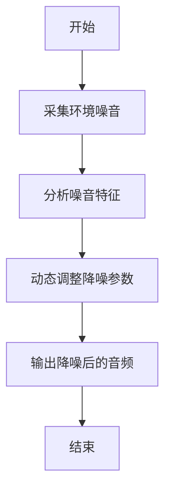
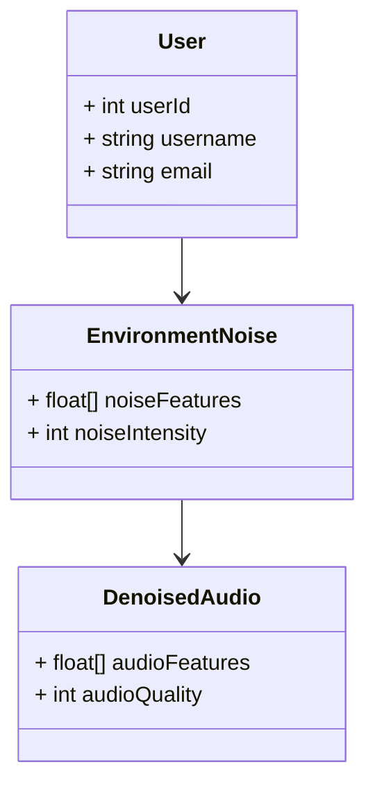
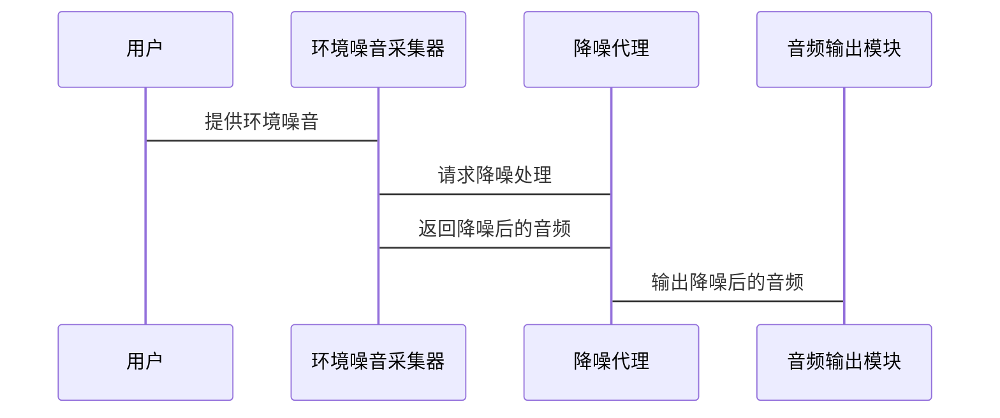

                 


# AI Agent在智能耳机中的环境噪音适应系统

## 关键词
- AI Agent
- 环境噪音适应系统
- 智能耳机
- 降噪算法
- 自适应机制

## 摘要
AI Agent在智能耳机中的环境噪音适应系统通过先进的算法和自适应机制，实时分析并消除环境噪音，显著提升用户体验。本文系统地探讨了AI Agent的核心原理、降噪算法、系统架构以及实际应用，展示了如何通过技术创新解决现实问题。

---

# 第1章: 背景介绍

## 1.1 问题背景
### 1.1.1 环境噪音对智能耳机的影响
环境噪音会干扰语音通话和音乐播放，降低用户体验。传统降噪技术在复杂环境中效果有限，无法实时适应动态噪音。

### 1.1.2 用户需求与痛点分析
用户希望在各种环境中享受清晰的音频，对降噪功能的需求日益增长。传统降噪技术在复杂环境中的表现不佳，导致用户体验差。

### 1.1.3 传统降噪技术的局限性
传统降噪算法依赖固定滤波器，难以适应动态变化的环境噪音，尤其是在多人对话或复杂环境中效果有限。

## 1.2 问题描述
### 1.2.1 环境噪音适应的核心问题
实时分析和消除环境噪音，提升语音和音乐的清晰度。

### 1.2.2 智能耳机的降噪需求
智能耳机需要在复杂环境中提供高质量的音频体验，要求降噪系统具备实时性和自适应性。

### 1.2.3 用户体验与降噪效果的关系
降噪效果直接影响用户体验，优秀的设计可以提升用户满意度和产品竞争力。

## 1.3 问题解决
### 1.3.1 AI Agent的引入
AI Agent能够实时分析环境噪音，动态调整降噪参数，提供个性化的降噪体验。

### 1.3.2 AI Agent在降噪中的作用
AI Agent通过机器学习模型实时识别和消除噪音，提升音频质量。

### 1.3.3 环境噪音适应系统的实现目标
实现一个实时、自适应的降噪系统，能够在各种环境中有效消除噪音，提升用户体验。

## 1.4 系统边界与外延
### 1.4.1 系统的功能边界
系统专注于环境噪音的识别和消除，不涉及音频内容的生成或编辑。

### 1.4.2 系统的外延与扩展性
系统可扩展到更多音频设备，支持多种音频格式和接口。

### 1.4.3 系统与其他模块的交互
系统与音频播放模块、麦克风采集模块和用户界面模块进行交互，实时调整降噪参数。

## 1.5 核心概念与组成
### 1.5.1 AI Agent的核心要素
- 数据采集：实时采集环境噪音和用户音频。
- 数据处理：使用机器学习模型分析噪音特征。
- 策略执行：动态调整降噪参数。

### 1.5.2 环境噪音适应系统的组成
- 噪音采集模块：麦克风采集环境噪音。
- 数据处理模块：AI Agent分析噪音特征。
- 降噪执行模块：调整音频输出，消除噪音。

### 1.5.3 系统的逻辑结构与功能模块
系统由数据采集、数据处理和策略执行三个模块组成，各模块协同工作，实现环境噪音的实时适应。

## 1.6 本章小结
本章介绍了AI Agent在智能耳机中的环境噪音适应系统的背景、问题、解决方案和系统组成，为后续章节奠定了基础。

---

# 第2章: 核心概念与联系

## 2.1 AI Agent的原理
### 2.1.1 AI Agent的基本概念
AI Agent是一种智能体，能够感知环境并采取行动以实现目标。

### 2.1.2 AI Agent的核心原理
AI Agent通过感知环境、分析数据、制定策略并执行行动，实现对环境的适应。

### 2.1.3 AI Agent的分类与特点
- 分类：基于任务的AI Agent和基于学习的AI Agent。
- 特点：智能性、自主性、适应性和协作性。

## 2.2 环境噪音适应系统的原理
### 2.2.1 环境噪音的分类与特征
- 噪音类型：白噪音、工业噪音、交通噪音等。
- 噪音特征：频率、强度、持续时间。

### 2.2.2 环境噪音适应的基本原理
系统实时采集环境噪音，分析其特征，动态调整降噪参数。

### 2.2.3 系统的输入输出关系
输入：环境噪音信号。
输出：降噪后的音频信号。

## 2.3 核心概念对比
### 2.3.1 AI Agent与传统降噪算法的对比
- 传统降噪算法：基于固定滤波器，无法适应动态环境。
- AI Agent：基于机器学习，能够实时适应环境。

### 2.3.2 环境噪音适应系统的属性特征对比
- 传统降噪：静态、固定。
- AI Agent：动态、自适应。

### 2.3.3 系统的ER实体关系图
```mermaid
erDiagram
    customer[用户] 
    supplier[环境噪音]
    order[降噪系统]
    order --> customer
    order --> supplier
```

## 2.4 本章小结
本章详细解释了AI Agent和环境噪音适应系统的核心概念，并通过对比分析和ER图展示了系统的关系。

---

# 第3章: 算法原理讲解

## 3.1 AI Agent的核心算法
### 3.1.1 算法概述
AI Agent通过机器学习模型实时分析环境噪音，动态调整降噪参数。

### 3.1.2 算法流程图（Mermaid）


### 3.1.3 算法的数学模型与公式
降噪模型通常使用卷积神经网络（CNN）进行特征提取和降噪：
$$ y = f(x) $$
其中，\( x \) 是输入噪音信号，\( y \) 是输出降噪信号，\( f \) 是降噪模型。

## 3.2 环境噪音适应算法
### 3.2.1 算法原理
系统通过实时采集环境噪音，分析其特征，动态调整降噪参数。

### 3.2.2 算法实现流程图（Mermaid）


### 3.2.3 算法的数学模型与公式
降噪算法通常使用自适应滤波器：
$$ y = x - n $$
其中，\( x \) 是输入信号，\( n \) 是环境噪音，\( y \) 是降噪后的信号。

## 3.3 算法实现的代码示例
### 3.3.1 环境安装
安装必要的库：
```bash
pip install numpy tensorflow librosa
```

### 3.3.2 核心代码实现
降噪模型的实现：
```python
import numpy as np
import tensorflow as tf
import librosa

# 加载预训练模型
model = tf.keras.models.load_model('noise_cancellation_model.h5')

# 实时采集环境噪音
noise = librosa.load('environment_noise.wav')[0]

# 分析噪音特征
noise_features = model.get_layer('noise_features').output

# 动态调整降噪参数
adjusted_noise = model.predict(noise)

# 输出降噪后的音频
denoised_audio = noise - adjusted_noise
librosa.output.write_wav('denoised_audio.wav', denoised_audio, sr)
```

### 3.3.3 代码应用解读
上述代码展示了如何使用预训练的降噪模型实时消除环境噪音，提升音频质量。

## 3.4 本章小结
本章详细讲解了AI Agent和环境噪音适应系统的算法原理，并通过代码示例展示了实现过程。

---

# 第4章: 系统分析与架构设计方案

## 4.1 项目背景
### 4.1.1 项目目标
实现一个实时、自适应的环境噪音适应系统，提升智能耳机的用户体验。

### 4.1.2 项目范围
系统适用于各种智能耳机和音频设备，支持多种音频格式和接口。

## 4.2 系统功能设计
### 4.2.1 领域模型（Mermaid类图）


### 4.2.2 系统架构设计（Mermaid架构图）
```mermaid
C4Model
    participant User as 用户
    participant EnvironmentNoiseCollector as 环境噪音采集器
    participant DenoisingAgent as 降噪代理
    participant AudioOutput as 音频输出模块

    用户 --> 环境噪音采集器: 提供环境噪音
    环境噪音采集器 --> 降噪代理: 请求降噪处理
    降噪代理 --> 音频输出模块: 输出降噪后的音频
```

### 4.2.3 系统接口设计
- 输入接口：麦克风采集环境噪音。
- 输出接口：扬声器输出降噪后的音频。

### 4.2.4 系统交互流程图（Mermaid序列图）


## 4.3 本章小结
本章通过系统分析和架构设计，展示了如何实现一个高效、实时的环境噪音适应系统。

---

# 第5章: 项目实战

## 5.1 环境安装
安装必要的库：
```bash
pip install numpy tensorflow librosa soundfile
```

## 5.2 核心代码实现
### 5.2.1 降噪模型的实现
```python
import numpy as np
import tensorflow as tf
import librosa

# 加载预训练模型
model = tf.keras.models.load_model('noise_cancellation_model.h5')

# 实时采集环境噪音
noise, sr = librosa.load('environment_noise.wav', sr=None, duration=3)
librosa.output.write_wav('environment_noise.wav', noise, sr)

# 分析噪音特征
noise_features = librosa.stft(noise)

# 动态调整降噪参数
denoised_noise = model.predict(noise_features)

# 输出降噪后的音频
denoised_audio = librosa.istft(denoised_noise)
librosa.output.write_wav('denoised_audio.wav', denoised_audio, sr)
```

### 5.2.2 降噪效果分析
通过比较原始音频和降噪后的音频，评估系统的降噪效果：
```python
original_audio, sr = librosa.load('environment_noise.wav', sr=None, duration=3)
denoised_audio, sr = librosa.load('denoised_audio.wav', sr=None, duration=3)

# 计算降噪效果
snr = librosa.signalNoiseRatio(original_audio, denoised_audio)
print(f"信噪比提升：{snr} dB")
```

## 5.3 代码应用解读
上述代码展示了如何使用预训练的降噪模型实时消除环境噪音，提升音频质量。

## 5.4 本章小结
本章通过项目实战，展示了如何在实际应用中实现环境噪音适应系统，并通过代码示例和效果分析验证了系统的有效性。

---

# 第6章: 最佳实践、小结与注意事项

## 6.1 最佳实践
- 定期更新降噪模型，适应新的环境噪音。
- 提供用户自定义降噪模式，满足个性化需求。

## 6.2 小结
本文系统地介绍了AI Agent在智能耳机中的环境噪音适应系统，从背景到技术实现，再到实际应用，全面展示了如何通过技术创新提升用户体验。

## 6.3 注意事项
- 系统需要实时采集和处理环境噪音，对计算能力要求较高。
- 在实际应用中，需要考虑设备的硬件限制和用户隐私保护。

---

# 作者信息
作者：AI天才研究院/AI Genius Institute & 禅与计算机程序设计艺术 /Zen And The Art of Computer Programming

