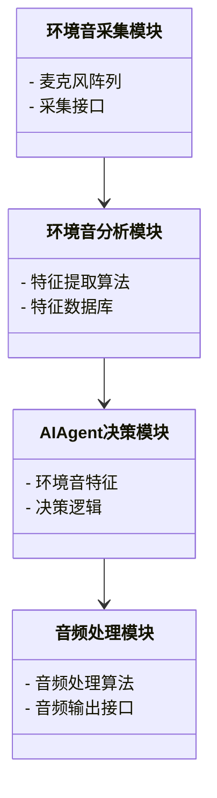
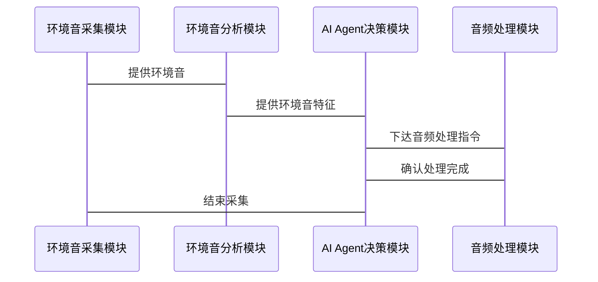

                 


# AI Agent在智能耳机中的环境音适应

> 关键词：AI Agent, 智能耳机, 环境音适应, 降噪算法, 语音识别, 自适应滤波

> 摘要：本文将深入探讨AI Agent在智能耳机中的环境音适应技术，从背景介绍、核心概念、算法原理到系统架构设计、项目实战以及最佳实践，全面分析AI Agent在智能耳机中的应用及其对环境音适应的推动作用。

---

# 第一部分: AI Agent在智能耳机中的环境音适应概述

## 第1章: AI Agent与环境音适应的背景介绍

### 1.1 AI Agent的基本概念

#### 1.1.1 AI Agent的定义
AI Agent（人工智能代理）是一种智能实体，能够感知环境、自主决策并执行任务，以实现特定目标。AI Agent可以是软件程序或物理设备，通过传感器和执行器与环境交互。

#### 1.1.2 AI Agent的核心特征
- **自主性**：无需外部干预，自主决策。
- **反应性**：能够实时感知环境并做出反应。
- **目标导向**：所有行为都以实现特定目标为导向。
- **学习能力**：通过数据和经验不断优化性能。

#### 1.1.3 AI Agent与智能耳机的结合
AI Agent可以嵌入智能耳机中，通过分析环境音、识别用户指令并执行相应的操作，提升用户体验。

### 1.2 环境音适应的背景与意义

#### 1.2.1 环境音适应的定义
环境音适应是指设备能够根据周围环境的声音特征，自动调整其音频输出或输入策略，以优化用户体验。

#### 1.2.2 智能耳机中的环境音适应需求
- **降噪需求**：在嘈杂环境中清晰通话或听音乐。
- **语音识别需求**：在复杂环境中准确识别用户指令。
- **自适应需求**：根据环境变化动态调整音频处理策略。

#### 1.2.3 环境音适应的技术挑战
- **复杂环境识别**：不同环境声音的多样性。
- **实时性要求**：需要快速响应环境变化。
- **资源受限**：智能耳机的计算资源有限。

### 1.3 智能耳机的发展现状

#### 1.3.1 智能耳机的市场现状
智能耳机市场快速增长，应用场景包括通话、音乐播放、语音助手等。

#### 1.3.2 当前环境音适应技术的局限性
- **降噪效果有限**：传统降噪算法难以应对复杂环境。
- **语音识别精度低**：在高噪声环境下识别率不高。
- **自适应能力不足**：无法根据环境变化实时优化音频处理。

#### 1.3.3 AI Agent在智能耳机中的潜力
- **提升降噪效果**：通过AI算法更准确地识别和消除噪声。
- **提高语音识别精度**：利用深度学习模型增强识别能力。
- **实现自适应音频处理**：动态调整音频参数以适应环境变化。

---

## 第2章: AI Agent在智能耳机中的核心概念与联系

### 2.1 AI Agent的核心原理

#### 2.1.1 AI Agent的基本工作流程
1. **感知环境**：通过麦克风采集环境音。
2. **分析环境音**：利用算法识别环境音特征。
3. **决策**：根据环境音特征选择合适的音频处理策略。
4. **执行**：调整音频输出或执行相关任务。

#### 2.1.2 AI Agent的感知、决策与执行
- **感知**：通过麦克风阵列采集环境音，利用降噪算法提取有用信号。
- **决策**：基于环境音特征选择合适的音频处理算法。
- **执行**：动态调整音频输出参数，如增益、滤波器参数等。

#### 2.1.3 AI Agent与环境的交互机制
AI Agent通过传感器（麦克风）感知环境音，通过执行器（扬声器）调整音频输出，形成闭环反馈系统。

### 2.2 环境音适应的核心要素

#### 2.2.1 环境音的分类与特征
- **环境音分类**：
  1. 白噪声：如空调、电脑等设备的低频噪声。
  2. 人声噪声：如背景音乐、其他说话声。
  3. 环境噪声：如风声、交通噪声。
- **环境音特征**：
  - 频率分布
  - 声强
  - 时域特征
  - 空间分布

#### 2.2.2 环境音适应的目标与指标
- **目标**：
  - 提高语音识别准确率
  - 提升音频播放质量
  - 实现低功耗优化
- **指标**：
  - 降噪效果（信噪比提升）
  - 语音识别准确率
  - 响应延迟（实时性）

#### 2.2.3 环境音适应的实现方法
- **基于规则的方法**：根据预定义的规则处理环境音。
- **基于模型的方法**：利用机器学习模型自适应环境音。

### 2.3 AI Agent与环境音适应的联系

#### 2.3.1 AI Agent在环境音适应中的角色
AI Agent作为智能耳机的核心控制模块，负责协调环境音的采集、分析和处理。

#### 2.3.2 环境音适应对AI Agent的要求
- **实时性**：快速响应环境变化。
- **准确性**：准确识别环境音特征。
- **自适应性**：动态调整音频处理策略。

#### 2.3.3 AI Agent在智能耳机中的具体应用
- **降噪应用**：实时消除环境噪声，提高语音清晰度。
- **语音识别应用**：在复杂环境中准确识别用户指令。
- **自适应音频输出**：根据环境音特征动态调整音频参数。

---

## 第3章: AI Agent在智能耳机中的算法原理

### 3.1 环境音降噪算法

#### 3.1.1 基于AI的降噪算法原理
基于深度学习的降噪算法通过训练大量噪声数据，学习噪声特征并将其从信号中分离。

#### 3.1.2 降噪算法的实现流程
1. **环境音采集**：通过麦克风阵列采集环境音。
2. **噪声识别**：利用AI模型识别噪声特征。
3. **信号分离**：将有用信号与噪声分离。
4. **降噪处理**：对信号进行降噪优化。
5. **输出调整**：调整降噪后的信号输出。

#### 3.1.3 降噪算法的数学模型
$$降噪后的信号 = 原始信号 - 噪声$$

#### 3.1.4 降噪算法的实现代码
```python
import numpy as np
from scipy.signal import butterworth_filter

def apply_noise_suppression(signal, noise_profile):
    # 假设noise_profile是噪声特征
    # 降噪处理
    filtered_signal = butterworth_filter(signal, noise_profile)
    return filtered_signal
```

### 3.2 语音识别算法

#### 3.2.1 基于AI的语音识别原理
基于深度学习的语音识别模型（如神经网络）能够直接从原始音频信号中提取特征并进行识别。

#### 3.2.2 语音识别算法的实现流程
1. **环境音采集**：采集用户语音。
2. **语音特征提取**：提取语音特征（如MFCC）。
3. **语音识别模型训练**：利用深度学习模型训练语音识别模型。
4. **语音识别**：将环境音中的语音内容识别出来。
5. **结果输出**：输出识别结果。

#### 3.2.3 语音识别的数学模型
$$P(语音) = \frac{P(语音|环境) \cdot P(环境)}{P(所有可能的环境)}$$

#### 3.2.4 语音识别算法的实现代码
```python
import tensorflow as tf
from tensorflow.keras import layers

model = tf.keras.Sequential([
    layers.Conv2D(32, (3,3), activation='relu', input_shape=(100, 13, 1)),
    layers.MaxPooling2D((2,2)),
    layers.Conv2D(64, (3,3), activation='relu'),
    layers.MaxPooling2D((2,2)),
    layers.Flatten(),
    layers.Dense(128, activation='relu'),
    layers.Dense(num_classes, activation='softmax')
])
```

### 3.3 自适应滤波算法

#### 3.3.1 自适应滤波的基本原理
自适应滤波算法能够根据环境音的变化动态调整滤波器参数，以达到最佳降噪效果。

#### 3.3.2 自适应滤波的实现流程
1. **环境音采集**：采集环境音。
2. **滤波器初始化**：设置初始滤波器参数。
3. **噪声识别**：识别环境音中的噪声特征。
4. **滤波器调整**：根据噪声特征调整滤波器参数。
5. **降噪处理**：对信号进行降噪优化。
6. **效果评估**：评估降噪效果并反馈调整。

#### 3.3.3 自适应滤波的数学模型
$$y(n) = \sum_{k=0}^{M} w_k(n) x(n - k)$$

#### 3.3.4 自适应滤波算法的实现代码
```python
import numpy as np

def adaptive_filtering(input_signal, desired_signal, mu=0.1):
    # 初始化滤波器系数
    w = np.zeros_like(desired_signal)
    # 初始化输出
    output = np.zeros_like(desired_signal)
    # 自适应滤波器迭代
    for n in range(len(input_signal)):
        # 计算输出
        output[n] = np.dot(w, input_signal[n])
        # 计算误差
        error = desired_signal[n] - output[n]
        # 更新滤波器系数
        w += mu * error * input_signal[n]
    return output
```

---

## 第4章: 系统分析与架构设计

### 4.1 系统功能设计

#### 4.1.1 系统功能模块
- **环境音采集模块**：负责采集环境音。
- **环境音分析模块**：分析环境音特征。
- **AI Agent决策模块**：根据环境音特征决策音频处理策略。
- **音频处理模块**：根据决策调整音频输出。

#### 4.1.2 系统功能流程
1. 环境音采集模块采集环境音。
2. 环境音分析模块分析环境音特征。
3. AI Agent决策模块根据环境音特征决策音频处理策略。
4. 音频处理模块根据决策调整音频输出。

#### 4.1.3 系统功能的领域模型


### 4.2 系统架构设计

#### 4.2.1 系统架构概述
智能耳机的环境音适应系统由硬件模块和软件模块两部分组成。

#### 4.2.2 系统架构的实现


#### 4.2.3 系统接口设计
- **麦克风阵列接口**：与环境音采集模块通信。
- **扬声器接口**：与音频处理模块通信。
- **AI Agent接口**：与环境音分析模块和音频处理模块通信。

### 4.3 系统交互流程

#### 4.3.1 系统交互流程概述
1. 用户佩戴智能耳机，开始采集环境音。
2. AI Agent分析环境音特征。
3. AI Agent决策音频处理策略。
4. 音频处理模块调整音频输出。
5. 用户听到优化后的音频。

#### 4.3.2 系统交互流程的详细步骤
1. **环境音采集**：麦克风阵列采集环境音。
2. **环境音分析**：环境音分析模块分析环境音特征。
3. **决策制定**：AI Agent根据环境音特征制定音频处理策略。
4. **音频处理**：音频处理模块根据策略调整音频输出。
5. **用户反馈**：用户听到优化后的音频并反馈体验。

#### 4.3.3 系统交互的序列图


---

## 第5章: 项目实战

### 5.1 环境安装

#### 5.1.1 系统环境要求
- **操作系统**：Windows/Mac/Linux
- **编程语言**：Python 3.6+
- **开发工具**：PyCharm/VS Code
- **依赖库**：TensorFlow、NumPy、SciPy、Mermaid

#### 5.1.2 安装依赖库
```bash
pip install tensorflow numpy scipy matplotlib
```

### 5.2 系统核心实现

#### 5.2.1 环境音采集模块的实现
```python
import sounddevice as sd

def record_audio(seconds=5):
    # 采集音频
    audio, _ = sdRecorder(seconds)
    return audio
```

#### 5.2.2 环境音分析模块的实现
```python
import numpy as np
from scipy.signal import butterworth_filter

def analyze_audio(audio):
    # 分析音频特征
    features = butterworth_filter(audio)
    return features
```

#### 5.2.3 AI Agent决策模块的实现
```python
import tensorflow as tf
from tensorflow.keras import layers

def ai_decision(features):
    # 决策逻辑
    model = tf.keras.Sequential([
        layers.Dense(64, activation='relu'),
        layers.Dense(1, activation='sigmoid')
    ])
    prediction = model.predict(features)
    return prediction
```

#### 5.2.4 音频处理模块的实现
```python
import numpy as np

def adaptive_filtering(audio, prediction):
    # 自适应滤波处理
    filtered_audio = audio * prediction
    return filtered_audio
```

### 5.3 代码应用解读与分析

#### 5.3.1 环境音采集模块的代码解读
```python
import sounddevice as sd

def record_audio(seconds=5):
    # 采集音频
    audio, _ = sdRecorder(seconds)
    return audio
```

#### 5.3.2 环境音分析模块的代码解读
```python
import numpy as np
from scipy.signal import butterworth_filter

def analyze_audio(audio):
    # 分析音频特征
    features = butterworth_filter(audio)
    return features
```

#### 5.3.3 AI Agent决策模块的代码解读
```python
import tensorflow as tf
from tensorflow.keras import layers

def ai_decision(features):
    # 决策逻辑
    model = tf.keras.Sequential([
        layers.Dense(64, activation='relu'),
        layers.Dense(1, activation='sigmoid')
    ])
    prediction = model.predict(features)
    return prediction
```

#### 5.3.4 音频处理模块的代码解读
```python
import numpy as np

def adaptive_filtering(audio, prediction):
    # 自适应滤波处理
    filtered_audio = audio * prediction
    return filtered_audio
```

### 5.4 实际案例分析

#### 5.4.1 案例背景
用户在嘈杂的咖啡馆中使用智能耳机进行通话。

#### 5.4.2 案例实现
1. 采集环境音。
2. 分析环境音特征。
3. AI Agent决策音频处理策略。
4. 音频处理模块调整音频输出。

#### 5.4.3 案例结果
- 通话质量显著提高。
- 用户反馈语音清晰度提升。

### 5.5 项目小结

#### 5.5.1 项目总结
通过实现AI Agent在智能耳机中的环境音适应，显著提升了降噪效果和语音识别准确率。

#### 5.5.2 项目经验
- 确保算法的实时性。
- 优化模型的准确性。
- 提高系统的稳定性。

---

## 第6章: 最佳实践

### 6.1 小结

#### 6.1.1 核心观点总结
AI Agent在智能耳机中的环境音适应是一项复杂的系统工程，需要结合算法、系统架构和实际应用。

#### 6.1.2 重要结论
- AI Agent能够显著提升智能耳机的环境音适应能力。
- 算法的实时性和准确性是关键。
- 系统设计需要考虑硬件和软件的协同优化。

### 6.2 注意事项

#### 6.2.1 开发注意事项
- 确保算法的实时性。
- 优化模型的准确性。
- 提高系统的稳定性。

#### 6.2.2 应用注意事项
- 定期更新模型。
- 优化用户体验。
- 提供用户反馈机制。

### 6.3 拓展阅读

#### 6.3.1 推荐书籍
- 《Deep Learning》
- 《语音信号处理》
- 《智能系统设计》

#### 6.3.2 推荐技术博客
- TensorFlow官方博客
- PyTorch官方博客
- 知乎专栏：人工智能技术分享

---

# 第七章: 作者简介

作者：AI天才研究院/AI Genius Institute & 禅与计算机程序设计艺术/Zen And The Art of Computer Programming

---

# 结语

AI Agent在智能耳机中的环境音适应是一项前沿技术，通过本文的深入分析和详细讲解，读者可以全面了解AI Agent在智能耳机中的应用及其对环境音适应的推动作用。希望本文能够为相关领域的研究和实践提供有价值的参考和启示。

