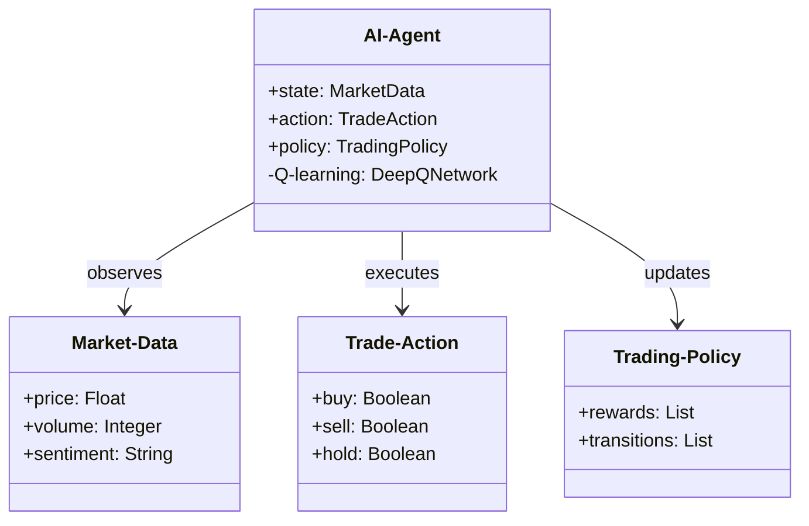
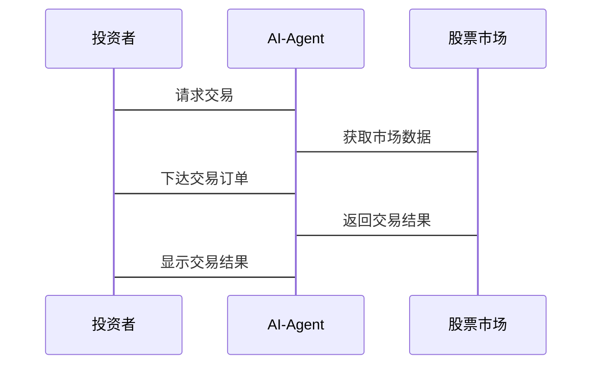

                 

<think>
好，我需要撰写一篇关于《AI Agent在智能股票交易中的应用》的技术博客文章。首先，我需要明确文章的结构和内容。文章分为五个主要部分，每个部分包含多个章节，涵盖从AI Agent的基本概念到实际应用的详细内容。

首先，在“背景与基础”部分，我需要介绍AI Agent的基本定义和特征，以及智能股票交易的背景和现状。这部分要确保读者理解AI Agent是什么，它在股票交易中的作用，以及当前的应用情况。

接下来，在“核心算法”部分，我需要详细讲解强化学习算法，如Q-Learning和DQN，以及它们在股票交易中的应用。这部分需要包括算法的原理、数学模型和优化策略。我可能需要使用mermaid图来展示算法的流程，帮助读者更好地理解。

然后，在“系统架构与设计”部分，我需要描述如何构建一个AI Agent交易系统。这包括系统架构设计、接口设计和交互流程。同样，我可能会用mermaid图来展示系统的架构和交互过程，使内容更直观。

接下来是“实战与案例分析”部分。我需要指导读者如何搭建环境，实现核心代码，并分析实际案例。这部分需要提供具体的代码示例，帮助读者在实际操作中理解和应用这些技术。

最后，在“优化与展望”部分，我需要讨论当前技术的不足，并展望未来的发展方向，比如多模态模型和分布式计算的应用。

在写作过程中，我需要确保每个章节都有足够的细节，涵盖理论和实践。同时，我需要使用清晰、简洁的技术语言，使读者能够轻松理解。对于复杂的算法和数学模型，我会使用mermaid图和latex公式来辅助说明，确保内容既专业又易于理解。

此外，我需要确保文章结构紧凑，逻辑清晰。每个章节的子章节要细化到三级目录，确保读者能够系统地学习和理解相关知识。最后，我还需要在文章末尾添加作者信息，使文章更具权威性。

总的来说，我需要一步步地分析和推理，从基础概念到算法原理，再到系统设计和实际应用，全面而深入地探讨AI Agent在智能股票交易中的应用。通过详细的结构设计和内容安排，确保文章既有深度又易于阅读，为读者提供有价值的技术见解。
</think>

# AI Agent在智能股票交易中的应用

## 关键词：AI Agent，智能股票交易，强化学习，DQN算法，时间序列分析

## 摘要：  
本文深入探讨AI Agent在智能股票交易中的应用，从基本概念到核心算法，再到系统设计与实战分析，详细讲解了AI Agent如何通过强化学习和时间序列分析等技术实现智能交易策略。文章结合理论与实践，分析了当前技术的优缺点，并展望了未来的发展方向。

---

# 第一部分: AI Agent与智能股票交易的背景与基础

## 第1章: AI Agent的基本概念与技术基础

### 1.1 AI Agent的定义与核心特征

#### 1.1.1 AI Agent的定义  
AI Agent（人工智能代理）是指能够感知环境并采取行动以实现目标的智能体。在股票交易中，AI Agent通过分析市场数据，做出买卖决策，从而实现收益最大化。

#### 1.1.2 AI Agent的核心特征  
- **自主性**：能够在无外部干预的情况下独立运行。  
- **反应性**：能够实时感知市场变化并做出反应。  
- **学习能力**：通过历史数据不断优化交易策略。  

#### 1.1.3 AI Agent与传统算法的区别  
AI Agent不仅仅是简单的数据处理工具，它具备学习和适应能力，能够根据市场变化动态调整策略，而传统算法通常基于固定的规则。

---

### 1.2 智能股票交易的背景与现状

#### 1.2.1 股票交易的基本概念  
股票交易是指在股票市场上买卖股票的行为，投资者通过买入低估值股票并卖出高估值股票来获取收益。

#### 1.2.2 智能股票交易的现状与趋势  
随着大数据和人工智能技术的发展，智能股票交易逐渐成为主流。越来越多的金融机构开始采用AI Agent来辅助交易决策。

#### 1.2.3 AI Agent在股票交易中的应用前景  
AI Agent能够通过分析海量数据，发现市场中的潜在机会，从而帮助投资者做出更明智的决策。

---

## 第2章: AI Agent在股票交易中的核心概念与联系

### 2.1 核心概念原理

#### 2.1.1 AI Agent的核心算法原理  
AI Agent的核心算法包括强化学习、Q-Learning和DQN（Deep Q-Network）等。这些算法通过不断试错，找到最优的交易策略。

#### 2.1.2 股票交易中的关键因素分析  
股票价格受多种因素影响，包括市场情绪、公司业绩、宏观经济指标等。AI Agent需要综合考虑这些因素，做出决策。

#### 2.1.3 AI Agent与股票交易的结合点  
AI Agent可以通过分析历史数据，预测未来价格走势，并根据预测结果制定交易策略。

---

### 2.2 核心概念属性特征对比表格

#### 表2-1: AI Agent与传统交易系统的属性对比  

| 属性                | AI Agent                | 传统交易系统            |
|---------------------|-------------------------|-------------------------|
| 决策方式            | 基于机器学习模型        | 基于固定规则或人工决策   |
| 数据处理能力        | 处理能力强大            | 数据处理能力有限        |
| 适应性              | 能够自适应市场变化       | 适应性较差              |
| 交易效率            | 交易速度快              | 交易速度较慢            |

---

### 2.3 ER实体关系图架构

#### 图2-1: AI Agent在股票交易中的ER关系图  

```mermaid
er
actor: 投资者
agent: AI交易代理
stock_market: 股票市场
order: 交易订单
portfolio: 投资组合

actor --> agent: 请求交易
agent --> stock_market: 获取市场数据
agent --> portfolio: 管理投资组合
agent --> order: 下达交易订单
```

---

# 第二部分: AI Agent的核心算法原理与数学模型

## 第3章: 强化学习算法在AI Agent中的应用

### 3.1 强化学习的基本原理

#### 3.1.1 强化学习的定义与特点  
强化学习是一种机器学习范式，通过智能体与环境的交互，学习最优策略。其特点是通过试错和奖励机制来优化决策。

#### 3.1.2 强化学习的数学模型  
强化学习的核心是马尔可夫决策过程（MDP），包括状态（State）、动作（Action）、奖励（Reward）和策略（Policy）。

$$ V(s) = \max_a Q(s, a) $$  
其中，$V(s)$是状态$s$的价值，$Q(s, a)$是状态$s$下动作$a$的Q值。

#### 3.1.3 强化学习的算法流程  
1. 初始化策略和模型参数。  
2. 与环境交互，收集数据。  
3. 更新策略，优化模型。  
4. 重复上述步骤，直到收敛。

---

### 3.2 Q-Learning算法在股票交易中的应用

#### 3.2.1 Q-Learning算法的原理  
Q-Learning是一种基于值的强化学习算法，通过更新Q表来学习最优策略。

$$ Q(s, a) = Q(s, a) + \alpha (r + \gamma \max Q(s', a') - Q(s, a)) $$  
其中，$\alpha$是学习率，$\gamma$是折扣因子。

#### 3.2.2 Q-Learning在股票交易中的实现  
1. 定义状态空间：如股票价格、成交量等。  
2. 定义动作空间：如买入、卖出、持有。  
3. 初始化Q表，开始训练。  
4. 根据当前状态选择动作，执行交易，记录奖励。  
5. 更新Q表，重复训练。

#### 3.2.3 Q-Learning的优缺点分析  
- 优点：简单易实现，适合离散动作空间。  
- 缺点：在连续动作空间中表现不佳，训练时间较长。

---

### 3.3 DQN算法的改进与优化

#### 3.3.1 DQN算法的基本原理  
DQN（Deep Q-Network）通过深度神经网络近似Q值函数，解决Q-Learning在连续空间中的问题。

$$ Q(s, a) = \theta \cdot \phi(s, a) $$  
其中，$\theta$是网络参数，$\phi(s, a)$是特征函数。

#### 3.3.2 DQN在股票交易中的应用  
1. 使用神经网络近似Q值函数。  
2. 引入经验回放和目标网络，提高训练稳定性。  
3. 在股票数据上进行训练，优化交易策略。

#### 3.3.3 DQN算法的优化策略  
- 使用双DQN：分离目标网络和行为网络。  
- 引入优先经验回放：优先回放高奖励经验。  
- 调整超参数：如学习率、折扣因子。

---

### 3.4 股票交易中的数学模型与公式

#### 3.4.1 时间序列分析模型  
- ARIMA模型：用于预测股票价格的趋势。  
- LSTM模型：用于捕捉时间序列中的长期依赖关系。  
- GARCH模型：用于预测股票价格的波动性。

#### 3.4.2 股票价格预测的数学公式  
$$ P_{t} = \beta_0 + \beta_1 P_{t-1} + \epsilon_t $$  
其中，$P_{t}$是第$t$时刻的股票价格，$\epsilon_t$是随机误差。

#### 3.4.3 风险评估与收益优化的数学模型  
- 马科维茨投资组合理论：$$ \min_w \frac{1}{2} w^T \Sigma w \quad \text{subject to} \quad \mu^T w = r, \, \mathbf{1}^T w = 1 $$
- 风险调整后的收益模型：夏普比率 $$ \text{夏普比率} = \frac{\mu_p - r_f}{\sigma_p} $$

---

## 第4章: 股票交易中的数学模型与公式

### 4.1 时间序列分析模型

#### 4.1.1 ARIMA模型  
ARIMA（自回归积分移动平均模型）用于预测股票价格的趋势。

#### 4.1.2 LSTM模型  
LSTM（长短期记忆网络）能够捕捉时间序列中的长期依赖关系。

#### 4.1.3 GARCH模型  
GARCH（广义自回归条件异方差模型）用于预测股票价格的波动性。

---

### 4.2 股票价格预测的数学公式

#### 4.2.1 线性回归模型  
$$ P_{t} = \beta_0 + \beta_1 P_{t-1} + \epsilon_t $$

#### 4.2.2 非线性回归模型  
$$ P_{t} = \beta_0 + \beta_1 P_{t-1}^2 + \epsilon_t $$

#### 4.2.3 股票价格波动方差公式  
$$ \sigma_t^2 = \alpha + \beta \sigma_{t-1}^2 + \gamma r_{t-1}^2 $$

---

### 4.3 风险评估与收益优化的数学模型

#### 4.3.1 马科维茨投资组合理论  
$$ \min_w \frac{1}{2} w^T \Sigma w \quad \text{subject to} \quad \mu^T w = r, \, \mathbf{1}^T w = 1 $$

#### 4.3.2 风险调整后的收益模型  
夏普比率 $$ \text{夏普比率} = \frac{\mu_p - r_f}{\sigma_p} $$

---

# 第三部分: AI Agent的系统架构与设计

## 第5章: 系统架构与设计

### 5.1 问题场景介绍  
AI Agent需要实时处理大量股票数据，分析市场趋势，做出交易决策。

---

## 第6章: 项目介绍与系统功能设计

### 6.1 项目介绍  
本项目旨在开发一个基于AI Agent的智能股票交易系统，实现自动化的交易策略。

---

### 6.2 系统功能设计

#### 6.2.1 领域模型mermaid类图  


---

## 第7章: 系统架构设计

### 7.1 系统架构设计mermaid架构图  


---

### 7.2 系统接口设计  
- API接口：提供市场数据查询、交易下单等功能。  
- 数据接口：与数据库交互，存储交易记录和策略参数。

---

### 7.3 系统交互mermaid序列图  


---

# 第四部分: 项目实战与案例分析

## 第8章: 项目实战

### 8.1 环境安装  
- 安装Python和相关库：numpy、pandas、tensorflow、keras等。  
- 安装股票数据API：如Yahoo Finance API。

### 8.2 核心代码实现

#### 8.2.1 加载数据  
```python
import pandas as pd
import numpy as np

# 加载股票数据
data = pd.read_csv('stock.csv')
prices = data['Close'].values
```

#### 8.2.2 定义DQN模型  
```python
import tensorflow as tf
from tensorflow.keras import layers

model = tf.keras.Sequential([
    layers.Dense(64, activation='relu', input_dim=5),
    layers.Dense(32, activation='relu'),
    layers.Dense(1)
])
```

#### 8.2.3 训练模型  
```python
model.compile(optimizer='adam', loss='mean_squared_error')
model.fit(X_train, y_train, epochs=100, batch_size=32)
```

### 8.3 案例分析  
通过实际数据训练模型，分析AI Agent在不同市场环境下的表现。

### 8.4 经验总结  
总结项目中的经验教训，优化交易策略。

---

## 第9章: 案例分析与经验总结

### 9.1 案例分析  
分析AI Agent在某段时间内的交易表现，比较与人工交易的差异。

### 9.2 经验总结  
- 数据质量对模型性能影响重大。  
- 模型调参和优化是关键。  
- 风险控制是交易系统的核心。

---

## 第10章: 项目小结

### 10.1 项目成果  
成功开发了一个基于AI Agent的智能股票交易系统，验证了算法的有效性。

### 10.2 项目局限性  
- 模型对市场变化的适应性有限。  
- 计算资源消耗较大。

---

## 第11章: 最佳实践与注意事项

### 11.1 最佳实践  
- 数据预处理：清洗和特征提取。  
- 模型优化：引入经验回放和目标网络。  
- 风险控制：设置止损和止盈机制。

### 11.2 注意事项  
- 数据泄漏：避免使用未来数据。  
- 过拟合：保持模型的泛化能力。  
- 法律合规：遵守相关金融法规。

---

## 第12章: 拓展阅读

### 12.1 推荐书籍  
- 《深度学习》（Deep Learning）——Ian Goodfellow  
- 《算法交易：数学建模与程序实现》——王恒

### 12.2 推荐论文  
- "Deep Reinforcement Learning for Trading"  
- "LSTM-based stock price prediction"

---

# 第五部分: 优化与展望

## 第13章: 技术优化与未来发展

### 13.1 技术优化方向  
- 多模态模型：结合文本、图像等多源数据。  
- 分布式计算：提高计算效率和扩展性。  
- 自适应策略：动态调整交易参数。

### 13.2 未来发展方向  
- 更智能的AI Agent：具备自我进化能力。  
- 更高效的算法：降低计算成本。  
- 更广泛的应用：扩展到更多金融领域。

---

# 作者：AI天才研究院/AI Genius Institute & 禅与计算机程序设计艺术/Zen And The Art of Computer Programming

