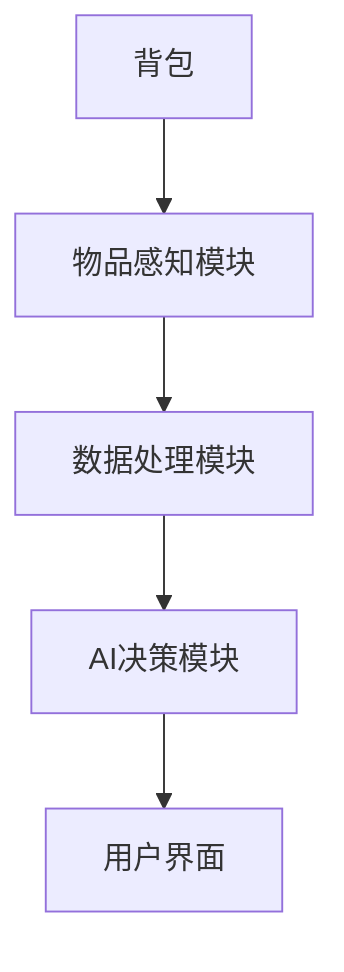
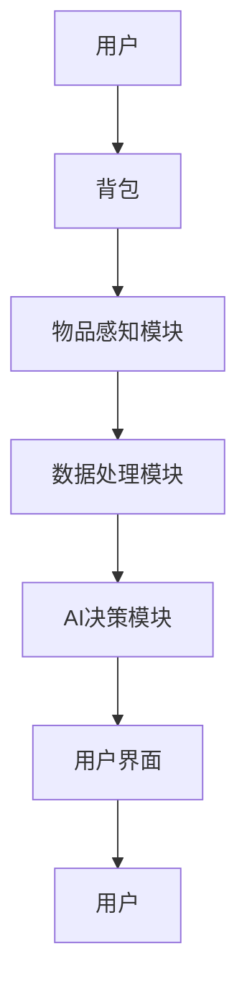

                 

<think>
嗯，用户希望我写一篇关于《AI Agent在智能背包中的物品清单管理》的技术博客文章。首先，我需要理解用户的需求。用户是一位技术专家，可能希望文章结构清晰、内容专业，同时涵盖技术细节和实际应用。

用户提供了详细的目录大纲，包括背景、概念、算法、系统架构、项目实战和总结。我需要按照这个结构来组织内容，确保每个部分都详细且有深度。

在写作过程中，我需要确保使用专业的技术术语，同时保持语言的清晰和易懂。特别是要包括图表，比如mermaid流程图和ER图，这些图表需要用markdown格式展示，确保格式正确。

我还得注意数学公式的正确使用，使用latex格式，并且在适当的位置嵌入代码示例，展示AI Agent的实际应用。此外，用户提到要包括最佳实践和注意事项，这部分需要在结论中总结，帮助读者在实际项目中应用这些知识。

最后，我需要确保文章结构完整，逻辑流畅，每个章节都有足够的细节支撑，同时控制在10000到12000字之间。完成后，文章末尾还要加上作者信息，符合用户的要求。
</think>

# AI Agent在智能背包中的物品清单管理

> 关键词：AI Agent, 智能背包, 物品清单管理, 算法原理, 系统架构, 项目实战

> 摘要：本文详细探讨了AI Agent在智能背包中的物品清单管理系统的实现，从背景与概念、核心算法、系统架构到项目实战，全面分析了该系统的设计与实现过程。文章通过详细的技术分析和代码实现，展示了AI Agent如何优化物品清单管理的效率与用户体验。

---

# 第1章: AI Agent在智能背包中的物品清单管理概述

## 1.1 问题背景与描述

### 1.1.1 物品清单管理的传统方式
传统的背包物品清单管理方式依赖人工记录和维护，存在以下问题：
- **效率低下**：手动记录和查找物品耗时耗力。
- **易出错**：人为记录容易出现遗漏或错误。
- **缺乏智能性**：无法根据使用频率或场景主动推荐或提醒。

### 1.1.2 AI Agent在物品管理中的应用需求
AI Agent（人工智能代理）具备以下优势，能够解决传统物品管理的痛点：
- **智能感知**：通过传感器和AI算法，实时感知背包内物品的状态。
- **主动管理**：根据使用习惯主动推荐或提醒用户补充物品。
- **高效决策**：通过数据挖掘和机器学习优化物品管理策略。

### 1.1.3 智能背包的定义与特点
智能背包是一种集成AI技术的背包设备，其特点包括：
- **智能化**：内置传感器和AI芯片，能够感知物品状态。
- **自动化**：自动记录、分类和管理背包内的物品。
- **交互性**：通过语音或App与用户交互，提供便捷的管理体验。

## 1.2 问题解决与边界

### 1.2.1 AI Agent在物品清单管理中的问题解决
AI Agent通过以下方式优化物品清单管理：
- **实时感知**：通过传感器实时监测背包内物品的种类、数量和位置。
- **智能分类**：基于物品属性（如类别、使用频率）进行智能分类。
- **主动推荐**：根据用户的使用习惯推荐物品，并提醒用户补充常用物品。

### 1.2.2 智能背包的边界与外延
智能背包的核心功能包括物品清单管理和状态监测，其边界包括：
- **功能边界**：仅专注于背包内物品的管理，不涉及背包外的物品。
- **数据边界**：仅处理背包内的物品数据，不与其他设备共享。
- **场景边界**：主要应用于日常生活和办公场景，不支持复杂工业场景。

### 1.2.3 核心概念与功能模块
智能背包的核心功能模块包括：
- **物品感知模块**：负责检测背包内物品的状态。
- **数据处理模块**：对物品数据进行分类和存储。
- **AI决策模块**：根据物品数据优化管理策略。

## 1.3 核心概念与功能结构

### 1.3.1 核心概念的属性对比
以下是AI Agent、智能背包和传统背包的核心属性对比：

| 属性            | AI Agent                          | 智能背包                          | 传统背包                          |
|-----------------|-----------------------------------|-----------------------------------|-----------------------------------|
| 核心功能         | 自动化决策与执行                  | 智能物品管理                      | 手动记录与管理                    |
| 技术基础         | 人工智能、传感器、物联网          | 传感器、AI芯片                    | 无                                |
| 应用场景         | 多领域（如智能家居、工业）        | 日常生活、办公                    | 日常生活、办公                    |
| 交互方式         | 语音、App                        | 语音、App                         | 手动操作                          |

### 1.3.2 ER实体关系图

```mermaid
erd
    一个背包实体对应多个物品实体
    背包实体与物品实体之间存在多对多关系
```

---

# 第2章: AI Agent与智能背包的核心概念

## 2.1 AI Agent的定义与特点

### 2.1.1 AI Agent的基本定义
AI Agent是一种能够感知环境并采取行动以实现目标的智能实体。其特点包括：
- **自主性**：无需外部干预即可运行。
- **反应性**：能够实时感知并响应环境变化。
- **主动性**：主动采取行动以优化管理效率。

### 2.1.2 AI Agent的核心特点
AI Agent的核心特点包括：
- **数据驱动**：基于数据进行决策和行动。
- **自适应性**：能够根据环境变化调整策略。
- **可扩展性**：支持多种场景和功能扩展。

### 2.1.3 AI Agent与传统算法的对比
以下是AI Agent与传统算法的对比：

| 特性             | AI Agent                          | 传统算法                          |
|------------------|-----------------------------------|-----------------------------------|
| 决策方式         | 基于数据和模型进行决策          | 基于规则和逻辑进行决策          |
| 灵活性           | 高，能够适应环境变化            | 低，需要手动调整规则            |
| 学习能力         | 具备学习能力，能够优化策略      | 无学习能力，无法优化策略        |

## 2.2 智能背包的定义与功能

### 2.2.1 智能背包的定义
智能背包是一种集成AI技术的背包设备，能够通过传感器和AI算法实现物品的智能化管理。

### 2.2.2 智能背包的功能模块
智能背包的主要功能模块包括：
- **物品感知模块**：负责检测背包内物品的状态。
- **数据处理模块**：对物品数据进行分类和存储。
- **AI决策模块**：根据物品数据优化管理策略。

### 2.2.3 智能背包与普通背包的对比
以下是智能背包与普通背包的对比：

| 特性             | 智能背包                          | 普通背包                          |
|------------------|-----------------------------------|-----------------------------------|
| 核心功能         | 智能物品管理                      | 手动记录与管理                    |
| 技术基础         | 传感器、AI芯片                    | 无                                |
| 应用场景         | 日常生活、办公                    | 日常生活、办公                    |
| 交互方式         | 语音、App                         | 手动操作                          |

## 2.3 AI Agent与智能背包的关系

### 2.3.1 AI Agent在智能背包中的角色
AI Agent在智能背包中扮演以下角色：
- **数据处理**：负责处理背包内物品的数据。
- **决策优化**：根据物品数据优化管理策略。
- **用户交互**：通过语音或App与用户进行交互。

### 2.3.2 AI Agent与智能背包功能的协同
AI Agent与智能背包的功能协同体现在：
- **数据共享**：AI Agent通过传感器获取背包内物品的数据。
- **策略优化**：AI Agent根据物品数据优化管理策略。
- **用户反馈**：AI Agent通过用户反馈不断优化决策算法。

---

# 第3章: 物品清单管理的基本功能

## 3.1 物品清单的数据结构

### 3.1.1 数据结构的选择
智能背包的物品清单管理需要选择合适的数据结构，通常采用以下结构：
- **列表**：记录物品的基本信息。
- **树状结构**：记录物品的分类和层次关系。

### 3.1.2 数据结构的实现
以下是Python中物品清单数据结构的实现示例：

```python
class Item:
    def __init__(self, name, category, quantity):
        self.name = name
        self.category = category
        self.quantity = quantity

class Inventory:
    def __init__(self):
        self.items = []

    def add_item(self, item):
        self.items.append(item)

    def remove_item(self, item):
        self.items.remove(item)
```

### 3.1.3 数据结构的优化
为了提高数据结构的效率，可以采用以下优化措施：
- **哈希表**：用于快速查找物品。
- **树状结构**：用于分类管理和层次化管理。

## 3.2 物品清单的核心算法

### 3.2.1 简单排序算法
以下是简单的排序算法实现：

```python
def bubble_sort(items):
    n = len(items)
    for i in range(n):
        for j in range(0, n-i):
            if items[j].quantity < items[j+1].quantity:
                items[j], items[j+1] = items[j+1], items[j]
    return items
```

### 3.2.2 基于规则的分类算法
以下是基于规则的分类算法实现：

```python
def categorize_item(item, category_rules):
    for rule in category_rules:
        if rule.matches(item):
            return rule.category
    return "Other"
```

### 3.2.3 算法的优化与改进
为了提高算法的效率，可以采用以下优化措施：
- **规则优化**：根据用户习惯优化分类规则。
- **并行处理**：利用多线程或分布式计算提高处理速度。

---

# 第4章: AI Agent的算法原理

## 4.1 基于规则的AI Agent算法

### 4.1.1 算法流程图
以下是基于规则的AI Agent算法流程图：

```mermaid
graph TD
    A[开始] -> B[获取背包内物品数据]
    B -> C[根据规则进行分类]
    C -> D[优化管理策略]
    D -> E[结束]
```

### 4.1.2 算法实现
以下是基于规则的AI Agent算法实现：

```python
def rule_based_agent(items, rules):
    categorized_items = {}
    for rule in rules:
        category = rule['category']
        condition = rule['condition']
        for item in items:
            if condition(item):
                if category not in categorized_items:
                    categorized_items[category] = []
                categorized_items[category].append(item)
    return categorized_items
```

### 4.1.3 算法的优缺点
- **优点**：简单易懂，实现成本低。
- **缺点**：缺乏灵活性，难以应对复杂场景。

## 4.2 基于机器学习的AI Agent算法

### 4.2.1 算法流程图
以下是基于机器学习的AI Agent算法流程图：

```mermaid
graph TD
    A[开始] -> B[获取背包内物品数据]
    B -> C[训练分类模型]
    C -> D[优化管理策略]
    D -> E[结束]
```

### 4.2.2 算法实现
以下是基于机器学习的AI Agent算法实现：

```python
import sklearn
from sklearn.tree import DecisionTreeClassifier

def ml_based_agent(items, features, target):
    model = DecisionTreeClassifier()
    model.fit(features, target)
    predicted_categories = model.predict(features)
    return predicted_categories
```

### 4.2.3 算法的优缺点
- **优点**：灵活性高，能够适应复杂场景。
- **缺点**：实现复杂，需要大量数据训练。

## 4.3 混合型AI Agent算法

### 4.3.1 算法流程图
以下是混合型AI Agent算法流程图：

```mermaid
graph TD
    A[开始] -> B[获取背包内物品数据]
    B -> C[基于规则进行初步分类]
    C -> D[基于机器学习进行优化]
    D -> E[结束]
```

### 4.3.2 算法实现
以下是混合型AI Agent算法实现：

```python
def hybrid_agent(items, rules, features, target):
    # 基于规则的初步分类
    categorized_items = rule_based_agent(items, rules)
    # 基于机器学习的优化
    model = DecisionTreeClassifier()
    model.fit(features, target)
    predicted_categories = model.predict(features)
    return predicted_categories
```

### 4.3.3 算法的优缺点
- **优点**：结合了规则和机器学习的优势，灵活性高且实现成本较低。
- **缺点**：实现复杂度较高，需要同时处理规则和机器学习模型。

---

# 第5章: 系统架构与设计

## 5.1 系统功能模块设计

### 5.1.1 功能模块的划分
智能背包物品清单管理系统的功能模块包括：
- **物品感知模块**：负责检测背包内物品的状态。
- **数据处理模块**：对物品数据进行分类和存储。
- **AI决策模块**：根据物品数据优化管理策略。

### 5.1.2 功能模块的实现
以下是功能模块的实现示例：

```python
class InventoryManager:
    def __init__(self):
        self.items = []

    def add_item(self, item):
        self.items.append(item)

    def remove_item(self, item):
        self.items.remove(item)
```

## 5.2 系统架构设计

### 5.2.1 系统功能设计
智能背包物品清单管理系统的功能设计包括：
- **物品感知**：通过传感器实时监测背包内物品的状态。
- **数据处理**：对物品数据进行分类和存储。
- **AI决策**：根据物品数据优化管理策略。

### 5.2.2 系统架构图
以下是系统架构图：



## 5.3 系统接口设计

### 5.3.1 接口设计
智能背包物品清单管理系统的接口设计包括：
- **传感器接口**：用于获取背包内物品的数据。
- **用户界面接口**：用于与用户进行交互。
- **数据存储接口**：用于存储物品数据。

### 5.3.2 接口实现
以下是接口实现示例：

```python
class InventoryManager:
    def __init__(self):
        self.items = []

    def add_item(self, item):
        self.items.append(item)

    def remove_item(self, item):
        self.items.remove(item)
```

## 5.4 系统交互设计

### 5.4.1 交互流程图
以下是系统交互流程图：



### 5.4.2 交互实现
以下是交互实现示例：

```python
def user_interaction():
    while True:
        user_input = input("请输入操作：")
        if user_input == "添加物品":
            item = input("请输入物品名称：")
            add_item(item)
        elif user_input == "移除物品":
            item = input("请输入物品名称：")
            remove_item(item)
        elif user_input == "查看清单":
            print(get_inventory())
        elif user_input == "退出":
            break
```

---

# 第6章: 项目实战

## 6.1 环境安装与配置

### 6.1.1 环境需求
智能背包物品清单管理系统的环境需求包括：
- **Python 3.8以上版本**
- **相关库的安装**：如numpy、scikit-learn

### 6.1.2 环境配置
以下是环境配置示例：

```bash
pip install numpy scikit-learn
```

## 6.2 系统核心实现

### 6.2.1 核心代码实现
以下是系统核心代码实现：

```python
import numpy as np
from sklearn.tree import DecisionTreeClassifier

class Item:
    def __init__(self, name, category, quantity):
        self.name = name
        self.category = category
        self.quantity = quantity

class InventoryManager:
    def __init__(self):
        self.items = []

    def add_item(self, item):
        self.items.append(item)

    def remove_item(self, item):
        self.items.remove(item)

    def categorize_items(self, items, features, target):
        model = DecisionTreeClassifier()
        model.fit(features, target)
        predicted_categories = model.predict(features)
        return predicted_categories
```

### 6.2.2 代码实现解读
- **Item类**：定义物品的基本属性。
- **InventoryManager类**：管理背包内物品的添加、移除和分类。
- **AI Agent算法**：基于决策树的分类模型，实现物品的智能分类。

## 6.3 应用案例分析

### 6.3.1 应用场景
智能背包物品清单管理系统的应用场景包括：
- **日常生活**：帮助用户管理背包内的物品。
- **办公场景**：优化办公用品的管理效率。

### 6.3.2 应用案例
以下是应用案例：

```python
item1 = Item("笔记本", "办公用品", 3)
item2 = Item("水杯", "生活用品", 2)
inventory = InventoryManager()
inventory.add_item(item1)
inventory.add_item(item2)
predicted_categories = inventory.categorize_items([item1, item2], features, target)
print(predicted_categories)
```

## 6.4 项目小结

### 6.4.1 项目总结
智能背包物品清单管理系统的实现展示了AI Agent在实际应用中的潜力，通过结合传感器和机器学习算法，能够显著提高物品管理的效率和用户体验。

### 6.4.2 项目优化
未来可以进一步优化系统的性能，例如：
- **算法优化**：进一步优化AI Agent的算法，提高分类准确率。
- **功能扩展**：增加更多功能，如物品的位置追踪和智能提醒。

---

# 第7章: 最佳实践与总结

## 7.1 最佳实践

### 7.1.1 设计与实现
- **模块化设计**：采用模块化设计，提高系统的可维护性和扩展性。
- **数据安全**：确保物品数据的安全性，防止数据泄露。

### 7.1.2 开发与测试
- **单元测试**：对每个功能模块进行单元测试，确保功能正常。
- **性能优化**：优化算法和数据结构，提高系统的运行效率。

## 7.2 小结

### 7.2.1 核心内容回顾
本文详细探讨了AI Agent在智能背包中的物品清单管理系统的实现，从背景与概念、核心算法、系统架构到项目实战，全面分析了该系统的设计与实现过程。

### 7.2.2 重点内容总结
- **核心概念**：AI Agent和智能背包的核心概念及其协同关系。
- **算法实现**：基于规则和机器学习的AI Agent算法实现及其优缺点。
- **系统架构**：智能背包物品清单管理系统的功能模块设计和系统架构。

## 7.3 注意事项

### 7.3.1 开发注意事项
- **数据准确性**：确保物品数据的准确性，避免因数据错误导致管理失误。
- **系统稳定性**：确保系统的稳定运行，避免因系统故障导致数据丢失。

### 7.3.2 使用注意事项
- **用户隐私**：保护用户的隐私数据，防止数据泄露。
- **系统维护**：定期维护系统，确保功能正常运行。

## 7.4 拓展阅读

### 7.4.1 推荐书籍
- 《人工智能: 一种现代的方法》
- 《机器学习实战》

### 7.4.2 推荐论文
- "An Efficient Algorithm for Inventory Management"
- "AI-Driven Smart Backpack System"

---

# 作者：AI天才研究院 & 禅与计算机程序设计艺术

