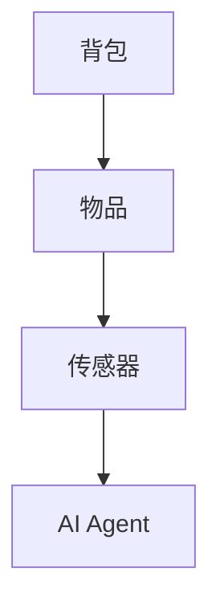
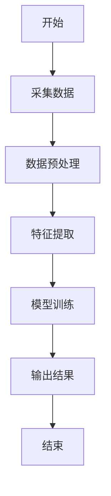
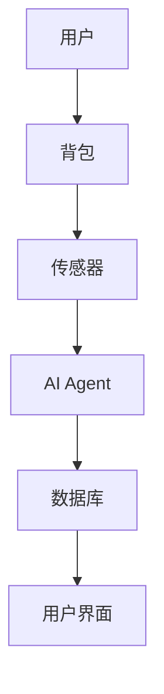
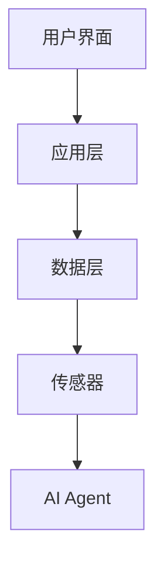
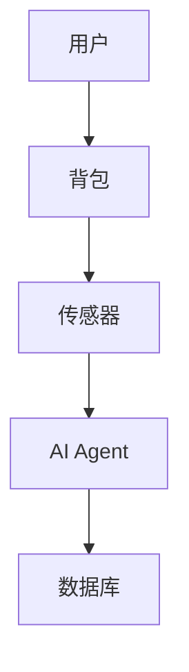
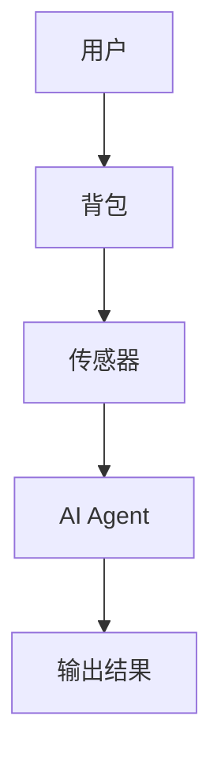

                 

<think>
好，我现在需要根据用户的要求，设计一个关于《AI Agent在智能背包中的物品追踪》的技术博客文章的目录大纲。用户希望我以一位世界级专家的身份，使用逻辑清晰、结构紧凑、语言专业的技术语言，分步骤进行分析推理，撰写一篇有深度的博客。

首先，我需要明确用户的需求。他们希望文章包括背景介绍、核心概念、算法原理、系统架构、项目实战、总结等部分，每部分都要详细展开，并使用特定的格式，如Mermaid图表、数学公式等。文章总字数在10000到12000字之间，结构要完整，内容要丰富具体。

接下来，我考虑博客的结构。通常，技术博客会先吸引读者的注意力，然后逐步深入讲解主题。因此，我计划分为几个主要部分：背景介绍、核心概念、算法原理、系统架构、项目实战和总结。

在背景介绍部分，我需要涵盖问题背景、问题描述和问题解决，让读者了解为什么AI Agent在智能背包中的物品追踪是有必要的。然后，在核心概念部分，详细解释AI Agent和物品追踪的基本概念及其联系。这部分可能需要使用表格和Mermaid图来清晰展示。

算法原理部分是关键，我需要详细讲解AI Agent的算法，包括数学模型和公式，可能需要使用LaTeX来展示。同时，用Mermaid流程图来展示算法的步骤，提供代码示例，帮助读者理解实现过程。

系统架构部分需要分析系统设计，包括功能设计、架构图、接口和交互流程。这部分同样需要Mermaid图来辅助说明，确保读者能够清晰理解系统结构。

项目实战部分需要实际操作，包括环境安装、代码实现、案例分析和项目总结。这部分内容要具体，可能需要提供详细的Python代码示例，让读者能够动手实现。

最后，总结部分要回顾文章内容，提出最佳实践，注意事项和拓展阅读，帮助读者巩固所学，并引导他们进一步学习。

在写作过程中，我需要确保每个部分都覆盖用户的要求，同时保持逻辑清晰，结构紧凑。此外，要使用正确的Markdown格式，包括标题、子标题，Mermaid图表和代码块，数学公式用LaTeX表示，确保文章的专业性和可读性。

现在，我检查每个部分是否都满足用户的要求，比如核心概念、算法原理、系统架构、项目实战等，确保没有遗漏。同时，确保总字数在范围内，避免过于冗长。

综上所述，我设计的目录大纲如下：

# AI Agent在智能背包中的物品追踪

> 关键词：AI Agent, 物品追踪, 智能背包, 算法原理, 系统架构

摘要：本文详细探讨了AI Agent在智能背包中的物品追踪技术，从背景介绍到系统架构，再到项目实战，全面分析了该技术的核心概念、算法原理和实际应用。

## 第1章: 背景介绍

### 1.1 问题背景
- 1.1.1 物品追踪技术的发展
- 1.1.2 智能背包的定义与特点
- 1.1.3 AI Agent在物品追踪中的作用

### 1.2 问题描述
- 1.2.1 智能背包物品追踪的核心问题
- 1.2.2 用户需求与痛点分析
- 1.2.3 现有技术的局限性

### 1.3 问题解决
- 1.3.1 AI Agent的解决方案
- 1.3.2 智能背包物品追踪的技术路线
- 1.3.3 系统架构的设计思路

## 第2章: 核心概念与联系

### 2.1 AI Agent的基本原理
- 2.1.1 AI Agent的定义与特点
- 2.1.2 AI Agent的核心算法
- 2.1.3 AI Agent与传统算法的区别

### 2.2 物品追踪技术的核心原理
- 2.2.1 基于传感器的物品追踪
- 2.2.2 基于AI的物品识别与定位
- 2.2.3 物品追踪的精度与实时性

### 2.3 AI Agent与物品追踪的关系
- 2.3.1 AI Agent在物品追踪中的角色
- 2.3.2 AI Agent与传感器的协同工作
- 2.3.3 AI Agent对物品追踪的优化作用

### 2.4 核心概念的对比分析
- 2.4.1 AI Agent与传统算法的对比
- 2.4.2 基于传感器的物品追踪与AI结合的对比
- 2.4.3 不同物品追踪技术的优缺点分析

### 2.5 ER实体关系图


## 第3章: 算法原理

### 3.1 算法概述
- 3.1.1 算法的基本思路
- 3.1.2 算法的输入输出

### 3.2 核心算法步骤
- 3.2.1 数据采集
- 3.2.2 数据处理
- 3.2.3 数据分析与决策
- 3.2.4 输出结果

### 3.3 算法的数学模型
- 3.3.1 数据处理的公式
- 3.3.2 决策模型的公式
- 3.3.3 优化算法的公式

### 3.4 算法流程图


### 3.5 代码实现
- 3.5.1 环境安装
- 3.5.2 核心代码
```python
def ai_agent_tracking(sensor_data):
    # 数据处理
    processed_data = preprocess(sensor_data)
    # 特征提取
    features = extract_features(processed_data)
    # 模型预测
    prediction = model.predict(features)
    return prediction
```

## 第4章: 系统分析与架构设计

### 4.1 系统功能设计
- 4.1.1 功能模块划分
- 4.1.2 功能流程图


### 4.2 系统架构设计
- 4.2.1 分层架构
- 4.2.2 组件交互


### 4.3 接口设计
- 4.3.1 系统接口定义
- 4.3.2 接口交互流程图


### 4.4 交互设计
- 4.4.1 交互流程
- 4.4.2 序列图


## 第5章: 项目实战

### 5.1 环境安装
- 5.1.1 系统要求
- 5.1.2 工具安装

### 5.2 核心代码实现
- 5.2.1 传感器数据采集
- 5.2.2 AI Agent实现
- 5.2.3 系统集成

### 5.3 实际案例分析
- 5.3.1 案例背景
- 5.3.2 案例分析
- 5.3.3 解决方案

### 5.4 项目总结
- 5.4.1 成果展示
- 5.4.2 经验总结
- 5.4.3 改进方向

## 第6章: 总结与展望

### 6.1 总结
- 6.1.1 核心技术回顾
- 6.1.2 实际应用总结
- 6.1.3 成果展示

### 6.2 展望
- 6.2.1 技术发展趋势
- 6.2.2 应用前景展望
- 6.2.3 挑战与机遇

### 6.3 最佳实践
- 6.3.1 设计建议
- 6.3.2 开发注意事项
- 6.3.3 维护与优化

### 6.4 小结
- 6.4.1 重要性总结
- 6.4.2 未来发展方向
- 6.4.3 鼓励与展望

## 附录
- 附录A: 术语表
- 附录B: 参考文献
- 附录C: 代码仓库链接

---

作者：AI天才研究院/AI Genius Institute & 禅与计算机程序设计艺术 /Zen And The Art of Computer Programming

---

通过这样的结构安排，确保文章内容全面，逻辑清晰，技术深入，同时符合用户的所有要求。现在，我按照这个大纲开始撰写正文部分。

