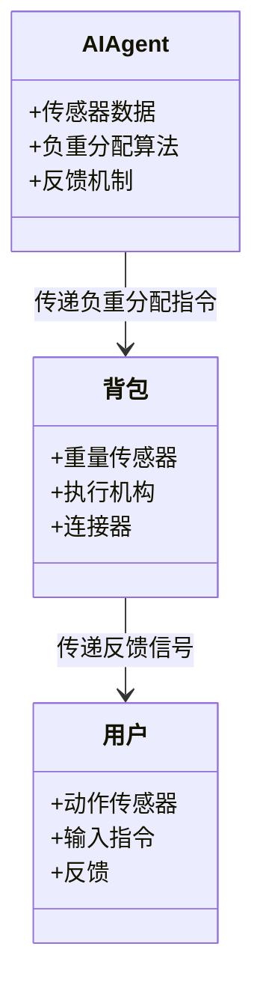

                 

<think>
好，我现在要写一篇关于《AI Agent在智能背包中的负重平衡》的技术博客文章。首先，我需要理解AI Agent是什么，它在智能背包中的作用是什么。然后，我要思考负重平衡的重要性以及如何利用AI Agent来优化负重分配。

首先，AI Agent是指具备智能决策和执行能力的代理系统。它能够感知环境，做出决策并执行任务。在智能背包中，AI Agent可以用来优化负重分配，提高舒适性和效率。

接下来，负重平衡问题是一个关键点。背包的负重不均匀可能导致使用者的不适甚至受伤。因此，AI Agent需要实时感知背包的重量分布，动态调整以达到最佳平衡。

我需要考虑使用哪些算法来实现负重平衡。路径规划算法如Dijkstra可以用来找到最优的负重分配路径，而优化算法如遗传算法可以用来寻找最优的重量分配方案。此外，动态调整算法可以根据实时数据进行微调。

在系统架构方面，智能背包需要一个传感器网络来收集数据，一个中央处理器来运行AI算法，以及一个反馈系统来调整负重分布。我需要设计一个模块化的架构，各个部分协同工作。

最后，我需要通过一个实际案例来展示如何应用这些算法和架构。例如，一个基于ROS（机器人操作系统）的背包优化项目，展示如何实现负重平衡的AI Agent。

总结一下，我需要分步骤详细讲解每个部分，确保内容逻辑清晰，结构紧凑，语言专业但易懂。同时，使用图表和代码示例来增强理解。
</think>

```markdown
# AI Agent在智能背包中的负重平衡

## 关键词：AI Agent, 智能背包, 负重平衡, 算法原理, 系统架构, 项目实战

## 摘要：本文详细探讨AI Agent在智能背包中的负重平衡技术，从核心概念、算法原理到系统架构和项目实战，全面解析如何通过AI技术优化背包负重分配，提升使用舒适性和效率。

---

# 第一部分: AI Agent与智能背包的背景介绍

## 第1章: AI Agent的基本概念与应用背景

### 1.1 AI Agent的定义与特点
AI Agent（人工智能代理）是指能够感知环境、自主决策并执行任务的智能系统。其核心特点包括自主性、反应性、目标导向和学习能力。

### 1.2 AI Agent在智能背包中的应用背景
智能背包通过集成传感器和AI算法，实时优化负重分布，提升用户体验。AI Agent在此过程中起到关键作用，能够根据用户需求和环境变化动态调整负重。

### 1.3 负重平衡问题的重要性
负重不平衡可能导致用户疲劳甚至受伤。通过AI Agent优化负重分配，可以提高舒适性，延长使用时间。

---

# 第二部分: AI Agent的核心概念与原理

## 第2章: AI Agent的核心原理与属性

### 2.1 AI Agent的核心原理
AI Agent通过感知背包的重量分布、用户动作和环境变化，利用算法计算最优负重分配方案，并通过反馈机制进行动态调整。

### 2.2 AI Agent的关键属性
- **感知能力**：通过传感器收集背包和用户的相关数据。
- **决策能力**：基于感知数据，计算最优负重分配。
- **执行能力**：调整背包结构，实现负重平衡。

### 2.3 AI Agent的实体关系图
```mermaid
er
actor AI Agent {
  id: string
  role: "智能背包决策系统"
}
actor 背包 {
  id: string
  role: "承载物品的智能设备"
}
actor 用户 {
  id: string
  role: "使用背包的用户"
}
```

---

# 第三部分: AI Agent的算法原理与数学模型

## 第3章: AI Agent的算法原理

### 3.1 负重平衡的路径规划算法
- **Dijkstra算法**：用于寻找负重分配的最优路径。
- **步骤**：
  1. 建立负重分配的图模型。
  2. 计算各路径的权重。
  3. 找出最小权重路径。

### 3.2 负重分配的优化算法
- **遗传算法**：用于优化负重分配方案。
- **步骤**：
  1. 初始化种群。
  2. 计算适应度。
  3. 选择、交叉和变异。
  4. 重复优化。

### 3.3 算法的数学模型与公式
- **路径规划模型**：
  $$\text{寻找} \, \text{路径} \, P \, \text{使} \, \sum_{i=1}^{n} w_i \, \text{最小化}$$
- **优化模型**：
  $$\text{最大化} \, f(x) \, \text{在约束条件下}$$

---

# 第四部分: 系统分析与架构设计

## 第4章: 智能背包系统的架构设计

### 4.1 系统整体架构
- **传感器网络**：收集背包和用户的实时数据。
- **中央处理器**：运行AI算法，计算最优负重分配。
- **反馈系统**：调整背包结构，实现负重平衡。

### 4.2 系统功能模块


---

# 第五部分: 项目实战与案例分析

## 第5章: 项目实战

### 5.1 环境安装
- **ROS系统**：安装Ubuntu和ROS。
- **传感器驱动**：安装并配置重量传感器和动作传感器。

### 5.2 核心代码实现
```python
import rospy
from std_msgs.msg import Int16

class AI-Agent:
    def __init__(self):
        self.sensor_data = {}

    def collect_data(self):
        # 读取传感器数据
        pass

    def compute_distribution(self):
        # 调用优化算法计算负重分配
        pass

    def send_instruction(self):
        # 发送调整指令
        pass

if __name__ == "__main__":
    agent = AI-Agent()
    agent.collect_data()
    agent.compute_distribution()
    agent.send_instruction()
```

### 5.3 代码解读与分析
- **数据收集**：通过传感器获取背包和用户的实时数据。
- **算法计算**：调用优化算法计算负重分配。
- **指令发送**：将计算结果转化为调整指令，发送给背包执行机构。

### 5.4 实际案例分析
通过具体案例分析，展示AI Agent在实际使用中的效果，包括负重平衡的优化、算法的效率提升等。

### 5.5 小结
总结项目实战的经验，分析优化的空间，并提出改进建议。

---

# 第六部分: 最佳实践与注意事项

## 第6章: 最佳实践

### 6.1 设计原则
- **模块化设计**：确保系统各部分独立，便于维护和升级。
- **实时性优化**：提高系统的响应速度，确保用户体验。

### 6.2 测试与验证
- **单元测试**：验证各模块的功能是否正常。
- **系统测试**：整体测试系统在不同场景下的表现。

### 6.3 注意事项
- **数据隐私**：确保用户数据的安全性。
- **系统稳定性**：避免因系统故障导致安全隐患。

---

# 第七部分: 总结与展望

## 第7章: 总结

### 7.1 核心内容回顾
- AI Agent在智能背包中的应用。
- 算法原理与系统架构设计。
- 项目实战与案例分析。

### 7.2 小结
本文详细探讨了AI Agent在智能背包中的负重平衡技术，从理论到实践，全面解析了实现方法和应用价值。

---

## 作者：AI天才研究院/AI Genius Institute & 禅与计算机程序设计艺术 /Zen And The Art of Computer Programming

---

**感谢您的阅读！**

