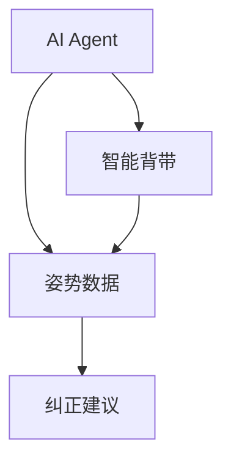
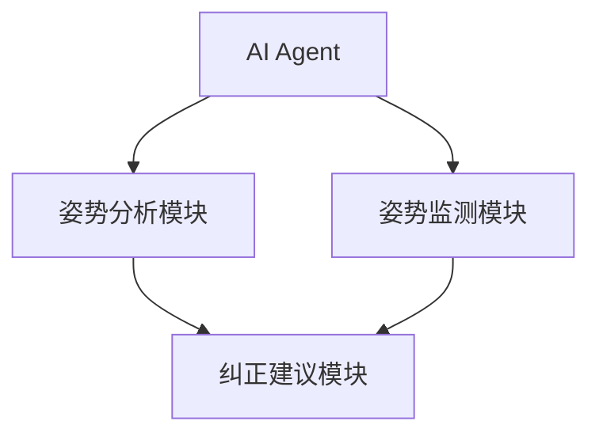
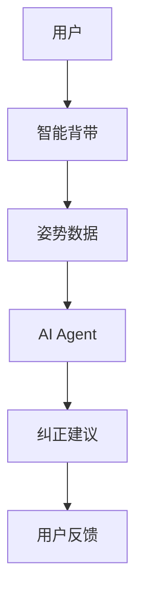

                 


# AI Agent在智能背带中的姿势纠正

> 关键词：AI Agent, 智能背带, 姿势纠正, 机器学习, 传感器, 运动健康

> 摘要：本文探讨了AI Agent在智能背带中的姿势纠正技术，详细分析了AI Agent和智能背带的核心概念、算法原理、系统架构设计以及实际应用案例。通过理论与实践相结合的方式，展示了如何利用AI技术提升姿势纠正的效果和用户体验。

---

# 第一部分: AI Agent与智能背带的背景与概念

## 第1章: AI Agent与智能背带的背景介绍

### 1.1 问题背景与问题描述
姿势纠正在现代生活中显得尤为重要，尤其是在工作强度高、久坐的环境下，不良姿势可能导致颈椎病、腰椎病等健康问题。传统的方法依赖于人为的自我约束和健身教练的指导，但缺乏实时性和个性化。随着AI技术的发展，AI Agent可以实时分析用户的姿势，并提供个性化的纠正建议。

#### 1.1.1 姿势纠正的重要性
- 长期不良姿势会导致身体结构损伤。
- 良好的姿势有助于提高工作效率和生活质量。
- 姿势纠正需要实时反馈和个性化指导。

#### 1.1.2 现有姿势纠正技术的局限性
- 传统方法依赖人工观察，难以实时反馈。
- 现有技术缺乏个性化，无法根据个体差异提供定制化建议。
- 传感器精度和算法复杂性限制了实际应用效果。

#### 1.1.3 AI Agent在姿势纠正中的潜在价值
- 提供实时、个性化的姿势反馈。
- 通过AI学习优化纠正策略。
- 提高用户参与度和效果。

### 1.2 AI Agent的定义与特点
AI Agent是一种智能代理，能够感知环境、做出决策并执行动作。其特点包括：
- **自主性**：能够在没有外部干预的情况下运行。
- **反应性**：能够实时感知环境并做出反应。
- **学习能力**：通过机器学习算法不断优化自身行为。

### 1.3 智能背带的定义与应用场景
智能背带是一种结合了传感器和AI技术的穿戴设备，主要用于监测和纠正用户的姿势。其主要应用场景包括：
- **健身**：帮助用户保持正确的坐姿和站姿。
- **康复**：辅助治疗颈椎病、腰椎病等。
- **办公**：改善长时间久坐的姿势问题。

### 1.4 本章小结
本章介绍了AI Agent和智能背带的背景，分析了姿势纠正的重要性以及现有技术的局限性，提出了AI Agent在姿势纠正中的潜在价值。

---

## 第2章: AI Agent与智能背带的核心概念与联系

### 2.1 核心概念原理
AI Agent通过传感器获取姿势数据，利用机器学习算法进行分析和判断，最终生成纠正建议。智能背带则通过传感器采集姿势数据，并将这些数据传输给AI Agent进行处理。

### 2.2 核心概念属性对比
以下是对AI Agent和智能背带的属性对比：

```markdown
| 属性 | AI Agent | 智能背带 |
|------|----------|----------|
| 输入 | 姿态数据 | 传感器信号 |
| 输出 | 纠正建议 | 反馈信号 |
| 核心技术 | 机器学习 | 嵌入式技术 |
```

### 2.3 实体关系图
通过Mermaid图展示AI Agent和智能背带的关系：



---

## 第3章: AI Agent的算法原理

### 3.1 姿势估计算法原理
姿势估计是AI Agent实现姿势纠正的基础。其基本原理是通过传感器数据或图像数据，利用算法识别人体的姿态。

#### 3.1.1 姿势估计的定义
姿势估计是通过传感器或摄像头获取人体姿态信息，并将其转换为数学模型的过程。

#### 3.1.2 姿势估计的关键技术
- **特征提取**：从传感器数据中提取关键特征。
- **姿态检测**：通过算法检测人体的姿态。
- **姿态估计**：通过数学模型估计人体的姿态。

#### 3.1.3 姿势估计的数学模型
姿势估计的数学模型可以表示为：

$$
y = f(x) + \epsilon
$$

其中，$x$ 是输入数据，$f(x)$ 是模型预测函数，$\epsilon$ 是误差项。

### 3.2 动作识别算法原理
动作识别是通过分析人体动作序列，识别出具体的动作类型。

#### 3.2.1 动作识别的定义
动作识别是通过分析人体动作序列，识别出具体的动作类型。

#### 3.2.2 动作识别的关键技术
- **特征提取**：从动作序列中提取关键特征。
- **动作分类**：通过机器学习算法对动作进行分类。

#### 3.2.3 动作识别的数学模型
动作识别的数学模型可以表示为：

$$
y = f(x) + \epsilon
$$

其中，$x$ 是输入数据，$f(x)$ 是模型预测函数，$\epsilon$ 是误差项。

---

## 第4章: 系统分析与架构设计

### 4.1 问题场景介绍
姿势纠正系统需要实时监测用户的姿势，并根据监测结果提供纠正建议。

### 4.2 系统功能设计
- **姿势监测**：通过传感器监测用户的姿势。
- **姿势分析**：利用算法分析姿势数据。
- **纠正建议**：根据分析结果生成纠正建议。

### 4.3 系统架构设计
以下是对系统的架构设计：



### 4.4 系统交互设计
以下是对系统的交互设计：



---

## 第5章: 项目实战

### 5.1 环境安装
需要安装以下环境：
- **Python**：3.8及以上版本。
- **TensorFlow**：用于机器学习模型的训练和推理。
- **传感器驱动**：用于与智能背带的传感器通信。

### 5.2 核心代码实现
以下是姿势纠正系统的核心代码：

```python
import tensorflow as tf
from sensor import get姿势数据

def 姿势纠正(姿势数据):
    with tf.Session() as sess:
        # 加载预训练模型
        model.load_model(sess)
        # 进行姿势分析
        结果 = model.predict(sess, 姿势数据)
        # 生成纠正建议
        return 纠正建议生成(结果)

def 纠正建议生成(结果):
    建议 = []
    for result in 结果:
        if result == "不良姿势":
            建议.append("请调整坐姿")
        else:
            建议.append("保持当前姿势")
    return 建议
```

### 5.3 案例分析
以下是一个实际案例分析：

用户A在使用智能背带时，AI Agent监测到其姿势不良，立即生成纠正建议：“请调整坐姿”。用户根据建议调整姿势后，AI Agent再次监测，确认姿势正确后，生成新的建议：“继续保持”。

---

## 第6章: 总结与展望

### 6.1 最佳实践
- 定期更新模型，以提高姿势纠正的准确性。
- 提供多样化的纠正建议，以满足不同用户的需求。

### 6.2 小结
本文详细探讨了AI Agent在智能背带中的姿势纠正技术，分析了其核心概念、算法原理、系统架构设计以及实际应用案例。

### 6.3 未来展望
随着AI技术的不断发展，AI Agent在智能背带中的应用将更加广泛和深入。未来的研究方向包括提高算法的实时性和准确性，优化用户体验，以及探索更多的应用场景。

---

# 作者：AI天才研究院/AI Genius Institute & 禅与计算机程序设计艺术 /Zen And The Art of Computer Programming

