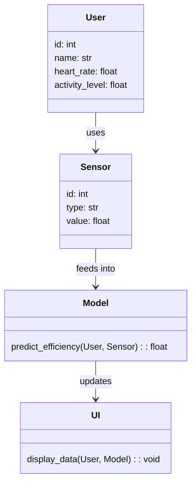
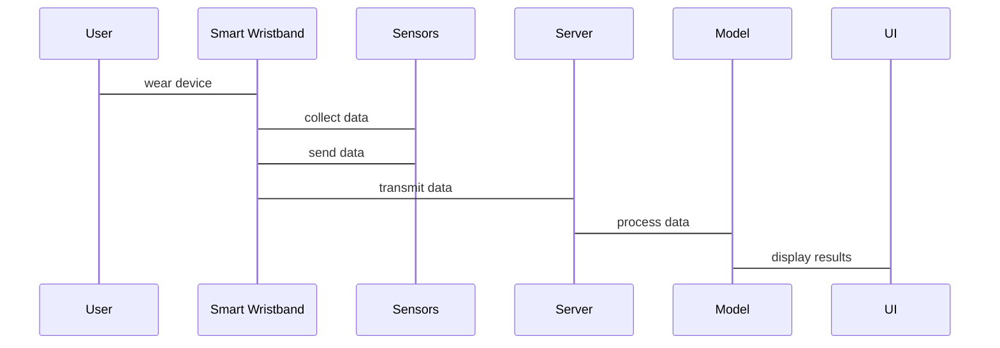

                 

<think>
嗯，用户让我帮忙撰写一篇关于《AI Agent在智能腕带中的工作效率监测》的技术博客文章，并且已经提供了一个详细的目录大纲。看起来用户希望这篇文章结构清晰、内容丰富，涵盖从基础到实现的各个方面。

首先，我需要理解用户的需求。用户可能是一位技术专家，或者正在研究智能腕带和AI Agent领域的人。他需要一篇专业的技术博客，既要有理论深度，又要包含实际应用，帮助读者系统地理解AI Agent在工作效率监测中的作用。

接下来，我要按照用户提供的大纲逐步展开。首先，我会先写“AI Agent概述”，介绍AI Agent的基本概念和分类，以及智能腕带的基本原理。这部分需要确保读者能够理解AI Agent是什么，以及它如何在智能腕带中应用。

然后是数据采集与处理部分。我需要详细讲解智能腕带的传感器类型，数据采集的流程，以及数据预处理的技术。这部分要具体，可能需要包括一些传感器的工作原理和数据处理的方法，甚至加入一些数学公式或图表来辅助说明。

接下来是AI Agent的核心算法。这部分是关键，需要介绍常用的机器学习算法，比如线性回归、SVM等，以及它们如何应用于工作效率监测。我会用数学公式和代码示例来说明这些算法的实现，确保读者能够理解这些算法的工作原理。

系统架构设计部分需要展示AI Agent在智能腕带中的整体架构，可能包括前端和后端的设计，数据流的处理，以及系统的交互流程。我会用Mermaid图来展示这些架构，使内容更直观。

项目实战部分是读者最关心的，需要提供一个完整的案例，从环境搭建到代码实现，再到结果分析。这部分要详细，让读者能够跟着一步步操作。

最后，总结与展望部分可以回顾整个内容，并展望未来的发展方向，比如新的算法或应用场景。

我还需要确保每个部分都包含足够的细节，比如在数据采集部分，不仅要介绍传感器，还要讲数据预处理的方法；在算法部分，不仅要解释理论，还要给出具体的数学公式和代码示例。此外，系统架构部分需要用Mermaid图来展示，这样读者可以更直观地理解系统结构。

总的来说，我需要把这本书分成几个主要部分：基础、数据处理、算法、系统架构、项目实战、总结。每个部分下再细分章节，确保内容全面且逻辑清晰。这样读者才能系统地学习和应用AI Agent在智能腕带中的应用。
</think>

# AI Agent在智能腕带中的工作效率监测

## 关键词：AI Agent，智能腕带，工作效率监测，数据采集，机器学习，系统架构

## 摘要：  
AI Agent（人工智能代理）在智能腕带中的工作效率监测是一种结合了传感器技术、机器学习算法和实时数据分析的创新应用。本文从AI Agent的基本概念出发，深入探讨其在智能腕带中的数据采集、算法实现、系统架构设计以及实际应用场景。通过理论与实践相结合的方式，详细分析了AI Agent如何帮助用户优化工作效率，实现个性化的工作管理。

---

# 第一部分: AI Agent与智能腕带基础

## 第1章: AI Agent概述

### 1.1 AI Agent的基本概念

#### 1.1.1 什么是AI Agent
AI Agent（人工智能代理）是一种能够感知环境、自主决策并执行任务的智能实体。它通过传感器获取数据，利用算法进行分析，并根据结果采取行动或提供反馈。AI Agent的核心在于其智能性，能够适应不同的环境和任务需求。

#### 1.1.2 AI Agent的核心特征
- **自主性**：AI Agent能够自主决策，无需外部干预。
- **反应性**：能够实时感知环境变化并做出响应。
- **学习能力**：通过数据和经验不断优化自身算法。
- **协作性**：能够与其他系统或用户进行交互和协作。

#### 1.1.3 AI Agent的分类与应用场景
AI Agent可以分为简单反射型、基于模型的反射型、目标驱动型和效用驱动型。在智能腕带中，AI Agent主要应用于健康监测、工作效率优化和行为分析等领域。

### 1.2 智能腕带的基本原理

#### 1.2.1 智能腕带的功能与结构
智能腕带是一种 wearable device，通常集成了多种传感器（如心率传感器、加速度传感器、体温传感器等），能够实时采集用户的生理数据和行为数据。

#### 1.2.2 智能腕带的主要传感器类型
- **心率传感器**：用于监测用户的心率变化。
- **加速度传感器**：用于监测用户的运动状态和活动量。
- **体温传感器**：用于监测用户的体温变化。
- **陀螺仪**：用于监测用户的运动方向和姿态。

#### 1.2.3 智能腕带的数据采集与传输机制
智能腕带通过传感器采集数据后，将数据通过蓝牙或Wi-Fi传输到终端设备（如手机或电脑）进行处理和分析。

---

## 第2章: AI Agent在工作效率监测中的作用

### 2.1 工作效率监测的定义与目标

#### 2.1.1 工作效率监测的背景与意义
随着远程办公和混合办公模式的普及，如何高效利用时间成为个人和企业关注的焦点。AI Agent通过实时监测用户的生理数据和行为数据，帮助用户优化工作状态。

#### 2.1.2 AI Agent在工作效率监测中的优势
- **实时性**：能够实时监测用户的生理指标和行为习惯。
- **个性化**：根据用户的特征提供定制化的建议。
- **主动性**：能够主动提醒用户调整工作状态。

#### 2.1.3 工作效率监测的核心指标与数据特征
- **心率变化**：反映用户的情绪和压力水平。
- **运动状态**：反映用户的活动量和专注程度。
- **时间分配**：分析用户的工作和休息时间分配。

### 2.2 AI Agent与工作效率监测的结合

#### 2.2.1 AI Agent在工作效率监测中的功能模块
- **数据采集模块**：采集用户的生理数据和行为数据。
- **数据分析模块**：利用机器学习算法对数据进行分析。
- **反馈模块**：根据分析结果提供反馈和建议。

#### 2.2.2 AI Agent如何实现工作效率的智能化分析
通过机器学习算法，AI Agent能够识别用户的疲劳状态、专注程度，并预测工作效率的变化趋势。

#### 2.2.3 AI Agent在工作效率监测中的边界与外延
AI Agent的工作效率监测仅限于基于传感器数据的分析，无法直接测量用户的主观感受。

---

# 第二部分: 数据采集与处理

## 第3章: 数据采集技术

### 3.1 智能腕带的主要传感器

#### 3.1.1 心率传感器
心率传感器通过光电传感器或电极传感器监测用户的心率变化。心率数据可以反映用户的情绪状态和压力水平。

#### 3.1.2 体温传感器
体温传感器通过热敏电阻或红外传感器监测用户的体温变化。体温数据可以反映用户的健康状况。

#### 3.1.3 加速度传感器
加速度传感器通过加速度计监测用户的运动状态和活动量。加速度数据可以用于分析用户的运动模式和行为习惯。

#### 3.1.4 其他辅助传感器
包括陀螺仪、气压传感器等，用于更精确地监测用户的运动方向和环境变化。

### 3.2 数据采集的实现原理

#### 3.2.1 传感器数据采集的流程
1. **数据采集**：传感器将物理信号转换为数字信号。
2. **数据传输**：通过蓝牙或Wi-Fi将数据传输到终端设备。
3. **数据存储**：将数据存储在本地或云端数据库中。

#### 3.2.2 数据采集的实时性与准确性
- **实时性**：传感器数据采集需要实时传输，以保证数据的及时性。
- **准确性**：传感器数据需要经过校准和滤波处理，以保证数据的准确性。

#### 3.2.3 数据采集中的干扰因素与处理方法
- **干扰因素**：传感器噪声、环境干扰、设备误差。
- **处理方法**：通过滤波算法（如移动平均滤波、中位数滤波）消除噪声。

### 3.3 数据预处理技术

#### 3.3.1 数据清洗与标准化
- **数据清洗**：去除异常值和无效数据。
- **数据标准化**：将数据归一化处理，便于后续分析。

#### 3.3.2 数据平滑处理
通过滑动平均法或指数平滑法，消除数据中的短期波动。

#### 3.3.3 时间序列数据的特征提取
- **特征提取**：从时间序列数据中提取均值、方差、最大值、最小值等特征。
- **特征选择**：通过特征重要性分析，选择对工作效率影响较大的特征。

---

## 第4章: 基于机器学习的工作效率监测算法

### 4.1 机器学习在工作效率监测中的应用

#### 4.1.1 监督学习在工作效率监测中的应用
- **线性回归**：用于预测工作效率的趋势。
- **支持向量机（SVM）**：用于分类用户的疲劳状态。

#### 4.1.2 无监督学习在工作效率监测中的应用
- **聚类分析**：用于识别用户的典型工作模式。

#### 4.1.3 深度学习在工作效率监测中的应用
- **LSTM网络**：用于时间序列数据的预测和分类。

### 4.2 常见的工作效率监测算法

#### 4.2.1 线性回归模型
线性回归是一种简单但有效的回归算法，适用于线性关系较强的场景。其数学模型为：

$$ y = \beta_0 + \beta_1x + \epsilon $$

其中，$y$ 是目标变量，$x$ 是自变量，$\beta_0$ 和 $\beta_1$ 是回归系数，$\epsilon$ 是误差项。

#### 4.2.2 支持向量机（SVM）
SVM 是一种监督学习算法，适用于分类和回归任务。其核心思想是将数据映射到高维空间，并在高维空间中找到一个超平面，使得数据点被最大化地分割。

#### 4.2.3 随机森林与梯度提升树
随机森林是一种基于决策树的集成算法，适用于分类和回归任务。梯度提升树是一种基于树的集成算法，适用于分类和回归任务。

### 4.3 算法实现与优化

#### 4.3.1 算法实现
以下是一个简单的线性回归实现示例：

```python
import numpy as np
from sklearn.linear_model import LinearRegression

# 生成数据
X = np.array([1, 2, 3, 4, 5]).reshape(-1, 1)
y = np.array([2, 4, 5, 4, 5])

# 训练模型
model = LinearRegression()
model.fit(X, y)

# 预测
print(model.predict([[6]]))
```

#### 4.3.2 算法优化
通过交叉验证和网格搜索，优化模型的超参数，提高模型的性能。

---

## 第5章: 系统架构设计

### 5.1 问题场景介绍
AI Agent在智能腕带中的工作效率监测系统需要实现数据采集、数据分析和反馈提醒三大功能。

### 5.2 系统功能设计

#### 5.2.1 领域模型（mermaid 类图）


#### 5.2.2 系统架构设计（mermaid 架构图）


#### 5.2.3 系统交互设计（mermaid 序列图）


---

## 第6章: 项目实战

### 6.1 环境安装
- **硬件**：智能腕带（支持蓝牙或Wi-Fi连接）。
- **软件**：Python、TensorFlow、Keras、Scikit-learn。

### 6.2 系统核心实现源代码

#### 6.2.1 数据采集与预处理
```python
import pandas as pd
import numpy as np

# 读取数据
data = pd.read_csv('work_efficiency.csv')

# 数据清洗
data.dropna(inplace=True)

# 数据标准化
from sklearn.preprocessing import StandardScaler
scaler = StandardScaler()
scaled_data = scaler.fit_transform(data[['heart_rate', 'activity_level']])
```

#### 6.2.2 算法实现
```python
from sklearn.model_selection import train_test_split
from sklearn.linear_model import LinearRegression

# 划分训练集和测试集
X_train, X_test, y_train, y_test = train_test_split(scaled_data, data['efficiency'], test_size=0.2)

# 训练模型
model = LinearRegression()
model.fit(X_train, y_train)

# 预测结果
y_pred = model.predict(X_test)
```

#### 6.2.3 结果分析
```python
from sklearn.metrics import mean_squared_error

print(mean_squared_error(y_test, y_pred))
```

---

## 第7章: 总结与展望

### 7.1 总结
本文详细介绍了AI Agent在智能腕带中的工作效率监测的实现过程，包括数据采集、算法实现和系统架构设计。通过理论与实践相结合的方式，展示了AI Agent在工作效率监测中的巨大潜力。

### 7.2 展望
未来，随着传感器技术的不断发展和算法的优化，AI Agent在智能腕带中的应用将更加广泛。例如，可以结合增强现实技术，为用户提供更直观的工作效率反馈。

---

## 作者：AI天才研究院/AI Genius Institute & 禅与计算机程序设计艺术 /Zen And The Art of Computer Programming

