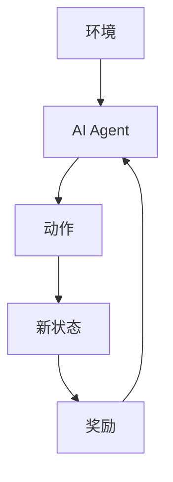
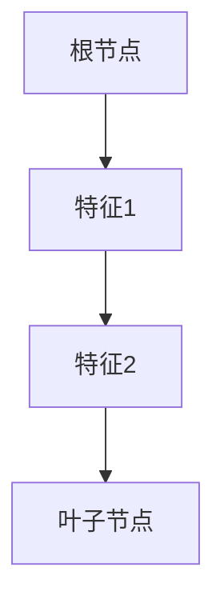

                 


# AI Agent在智能航空管理中的应用

> 关键词：AI Agent，智能航空管理，算法原理，系统架构，项目实战

> 摘要：本文深入探讨了AI Agent在智能航空管理中的应用，从核心概念到算法原理，再到系统架构和项目实战，全面解析了AI Agent如何提升航空管理的效率和智能化水平。

---

## 第一部分: AI Agent在智能航空管理中的应用概述

### 第1章: AI Agent的基本概念与背景

#### 1.1 AI Agent的定义与特点
- **AI Agent的定义**：AI Agent（智能体）是一种能够感知环境并采取行动以实现目标的实体。
- **AI Agent的核心特点**：
  - 自主性：无需外部干预，自主决策。
  - 反应性：能够实时感知环境并做出反应。
  - 深度学习能力：通过数据和反馈不断优化决策。
  - 协作性：能够与其他系统或AI Agent协同工作。

#### 1.2 智能航空管理的背景
- **航空管理的基本概念**：涉及航班调度、机场运营、风险管理等多个方面。
- **智能航空管理的发展现状**：随着AI技术的进步，智能航空管理逐渐成为行业趋势。
- **智能航空管理的挑战与机遇**：
  - 挑战：复杂性高、实时性强、决策涉及多方利益。
  - 机遇：提升效率、降低成本、提高安全性。

#### 1.3 AI Agent在航空管理中的应用
- **AI Agent在航空管理中的作用**：
  - 实时监控：监测航班状态、天气变化等信息。
  - 自动决策：优化航班调度、资源分配。
  - 风险管理：预测和应对突发事件。
- **AI Agent在航空管理中的具体应用领域**：
  - 航班调度优化。
  - 机场资源管理。
  - 飞行安全监控。
- **AI Agent在航空管理中的优势与局限性**：
  - 优势：高效、精准、适应性强。
  - 局限性：依赖数据质量、计算资源限制。

---

## 第2章: AI Agent的核心概念与联系

### 2.1 AI Agent的原理
- **知识表示**：将航空管理中的知识转化为数据结构，如图、树等。
- **感知与推理**：通过传感器或数据源获取信息，并利用推理算法（如逻辑推理、概率推理）进行分析。
- **决策与行动**：基于推理结果，选择最优行动方案，并执行。

### 2.2 AI Agent的属性特征对比
| 属性       | 传统规则引擎         | 基于AI的Agent       |
|------------|----------------------|---------------------|
| 决策能力   | 基于固定规则         | 基于动态学习模型     |
| 适应性     | 有限                 | 强                 |
| 学习能力   | 无                   | 有                 |
| 知识更新   | 定期维护             | 自动更新           |

### 2.3 ER实体关系图
```mermaid
er
actor(用户) --> 航班调度系统
actor(用户) --> 机场管理系统
航班调度系统 --> 航班信息表
航班调度系统 --> 机场信息表
机场管理系统 --> 机场设备表
机场管理系统 --> 航班状态表
```

---

## 第3章: AI Agent的算法原理

### 3.1 算法原理概述
- **强化学习**：通过奖励机制训练AI Agent，使其在复杂环境中做出最优决策。
- **决策树**：基于特征的分层决策模型，适用于分类和回归问题。
- **贝叶斯网络**：通过概率推理进行决策，适用于不确定性较高的场景。

### 3.2 算法流程图
#### 强化学习流程图


#### 决策树流程图


### 3.3 数学模型与公式
- **强化学习公式**：
  $$ Q(s, a) = Q(s, a) + \alpha \cdot (r + \gamma \cdot \max Q(s', a) - Q(s, a)) $$
- **决策树算法**：基于信息增益或基尼指数进行节点分裂。
- **贝叶斯网络公式**：
  $$ P(A|B) = \frac{P(B|A) \cdot P(A)}{P(B)} $$

---

## 第4章: 智能航空管理系统的分析与设计

### 4.1 系统分析
- **问题场景介绍**：航班调度优化，涉及多个机场、航空公司和时间安排。
- **项目介绍**：开发一个基于AI Agent的航班调度系统。
- **系统功能设计**：
  - 数据采集：实时采集航班信息、天气数据等。
  - 数据处理：清洗、转换和存储数据。
  - 模型训练：训练AI Agent的决策模型。
  - 结果展示：可视化展示优化后的航班调度方案。
- **系统架构设计**：
  ```mermaid
  architecture
  Client/前端 --> 中间件 --> 后端/服务层 --> 数据库
  ```
- **系统交互序列图**：
  ```mermaid
  sequenceDiagram
    actor 用户
    participant 中间件
    participant 后端
    participant 数据库
    用户->>中间件: 请求航班调度
    中间件->>后端: 调用API
    后端->>数据库: 查询数据
    后端-->>中间件: 返回数据
    中间件-->>用户: 展示结果
  ```

---

## 第5章: 项目实战

### 5.1 环境安装
- **开发环境安装**：安装Python、Jupyter Notebook。
- **依赖库安装**：使用pip安装numpy、pandas、scikit-learn、keras、tensorflow。

### 5.2 核心代码实现
#### 5.2.1 AI Agent核心算法实现
```python
import numpy as np

# 示例：基于强化学习的航班调度优化
class AI-Agent:
    def __init__(self, states, actions):
        self.states = states
        self.actions = actions
        self.Q = np.zeros((len(states), len(actions)))

    def choose_action(self, state):
        if np.random.random() < 0.1:
            return np.random.choice(self.actions)
        else:
            return np.argmax(self.Q[state])

    def update_Q(self, state, action, reward, next_state):
        self.Q[state][action] += 0.1 * (reward + 0.95 * max(self.Q[next_state]) - self.Q[state][action])
```

#### 5.2.2 系统功能模块实现
```python
import pandas as pd
from sklearn.tree import DecisionTreeClassifier

# 数据处理模块
def preprocess_data(data):
    # 数据清洗和转换
    return data.dropna().astype(int)

# 模型训练模块
def train_model(X, y):
    model = DecisionTreeClassifier()
    model.fit(X, y)
    return model

# 模型预测模块
def predict_model(model, data):
    return model.predict(data)
```

### 5.3 案例分析
- **典型案例介绍**：优化某机场的航班调度，减少延误率20%，提升资源利用率。

---

## 第6章: 最佳实践

### 6.1 小结
- 本文详细介绍了AI Agent在智能航空管理中的应用，从概念到实现，全面解析了其在航空管理中的潜力和价值。

### 6.2 注意事项
- 数据质量和实时性是影响AI Agent性能的关键因素。
- 模型的解释性和可维护性需要重点关注。

### 6.3 拓展阅读
- 《强化学习导论》
- 《机器学习实战》
- 《分布式系统设计与实现》

---

## 作者：AI天才研究院 & 禅与计算机程序设计艺术

通过本文的深入探讨，读者可以全面了解AI Agent在智能航空管理中的应用，掌握其核心原理和实际实现方法，为未来的相关研究和实践提供参考。

