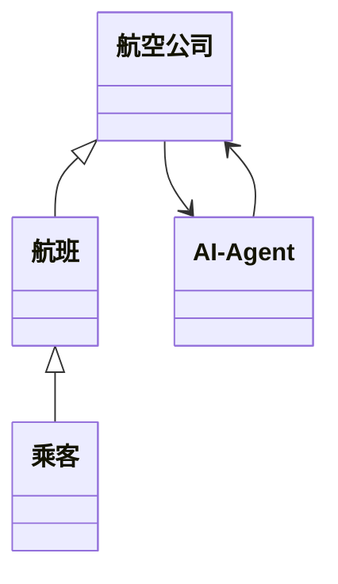
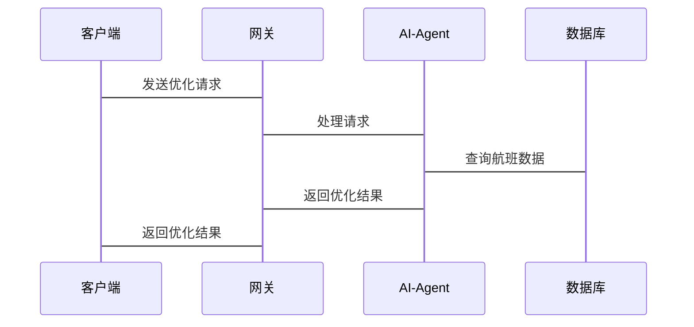

                 

<think>
好的，我现在需要根据用户的要求，一步一步地构建《AI Agent在智能航空路线优化中的角色》的技术博客文章。首先，我得明确用户的需求：他们希望有一篇结构清晰、内容详实的技术博客，涵盖从背景介绍到算法实现，再到系统设计和项目实战的各个方面。

首先，我会从背景介绍开始。这部分需要包括问题背景、描述、解决方法、边界和核心概念。接下来是核心概念与联系，这里需要详细讲解AI Agent的原理，并与其他方法进行对比。然后是算法原理，重点放在强化学习和遗传算法上，结合流程图和代码示例。之后是系统分析与架构设计，涉及项目场景、功能模块、架构图和接口设计。最后是项目实战，包括环境安装、代码实现、案例分析和总结。最后，加上最佳实践、小结和拓展阅读等内容。

在写作过程中，我需要确保每一部分都详细具体，比如在算法部分，用mermaid绘制流程图，并给出Python代码示例和数学公式。系统架构部分需要用类图和架构图来展示结构。项目实战部分要提供实际案例，帮助读者理解应用。

同时，我要注意使用专业的技术术语，但保持语言简洁易懂，适合技术博客的读者。每章的小结要简明扼要，总结关键点，帮助读者巩固理解。

现在，我将开始撰写文章，确保涵盖所有要求的内容，结构合理，逻辑清晰。
</think>

# AI Agent在智能航空路线优化中的角色

## 关键词：
- AI Agent, 航空路线优化, 强化学习, 遗传算法, 系统架构设计, 项目实战

## 摘要：
本文深入探讨了AI Agent在智能航空路线优化中的角色，分析了其核心原理、算法实现、系统架构设计以及实际应用案例。文章从背景介绍开始，详细讲解了AI Agent的核心概念，随后通过强化学习和遗传算法的实现，展示了其在航空路线优化中的应用潜力。最后，通过系统架构设计和项目实战，进一步验证了AI Agent在实际场景中的高效性和可行性。

---

# 第1章 背景介绍

## 1.1 问题背景

### 1.1.1 航空运输的复杂性
航空运输是一个复杂的系统，涉及众多变量，如天气变化、飞机性能、燃料成本、乘客需求等。优化路线需要考虑这些变量的动态变化。

### 1.1.2 航空路线优化的重要性
优化路线可以降低运营成本、减少飞行时间、提高航班准点率，同时提升乘客满意度。

## 1.2 问题描述

### 1.2.1 航空路线优化的核心问题
主要在于如何在复杂多变的环境中，找到最优或近似最优的飞行路径。

### 1.2.2 当前存在的挑战
传统算法在面对动态变化和多目标优化时，往往难以高效解决问题。

## 1.3 问题解决

### 1.3.1 AI Agent的应用潜力
AI Agent能够实时感知环境变化，自主决策并优化飞行路径，显著提升优化效率。

### 1.3.2 解决方案的可行性分析
通过AI Agent实现动态路径优化，能够在复杂环境中快速响应，显著提高优化效果。

## 1.4 边界与外延

### 1.4.1 AI Agent的适用范围
适用于需要动态优化和自主决策的场景，如实时路径调整、应急调度等。

### 1.4.2 与其他技术的区分
与传统算法相比，AI Agent具有更强的适应性和自主性，能够处理更复杂的优化问题。

## 1.5 核心概念与组成

### 1.5.1 AI Agent的定义
AI Agent是指能够感知环境、自主决策并执行任务的智能体，具备学习和自适应能力。

### 1.5.2 航空路线优化的关键要素
包括飞行路径、时间安排、资源分配、天气条件等。

---

# 第2章 核心概念与联系

## 2.1 AI Agent的原理与特征

### 2.1.1 核心原理
AI Agent通过感知环境信息，利用机器学习算法进行决策，优化飞行路径。

### 2.1.2 多智能体系统（MAS）的概念
MAS由多个智能体组成，每个智能体负责不同的任务，协同工作以实现全局优化。

## 2.2 核心特征对比

| **特征**         | **AI Agent**         | **传统算法**         |
|-------------------|----------------------|----------------------|
| **自主性**         | 高                   | 低                   |
| **适应性**         | 强                   | 弱                   |
| **实时性**         | 高                   | 低                   |
| **复杂性**         | 高                   | 中                   |

## 2.3 实体关系架构

```mermaid
erDiagram
    class 航空公司 {
        id
        名称
        航线
    }
    class 航班 {
        id
        起点
        终点
        时间
    }
    class 乘客 {
        id
        身份证号
        姓名
    }
    航空公司 --> 航班 : 管理
    航班 --> 乘客 : 运送
```

---

# 第3章 AI Agent的算法实现

## 3.1 强化学习算法

### 3.1.1 算法流程图

```mermaid
graph LR
    S[状态] --> A[动作]
    A --> R[奖励]
    R --> S[新状态]
    loop
    until 终止条件
```

### 3.1.2 Python代码实现示例

```python
class AI-Agent:
    def __init__(self, state_space, action_space):
        self.state_space = state_space
        self.action_space = action_space
        # 初始化策略网络
        self.policy = PolicyNetwork(state_space, action_space)
    
    def perceive(self, state):
        # 接收环境状态
        return self.policy.act(state)
    
    def learn(self, state, action, reward, next_state):
        # 策略更新
        self.policy.update(state, action, reward, next_state)
```

### 3.1.3 数学模型

$$ Q(s, a) = Q(s, a) + \alpha (r + \gamma \max Q(next\_s, a) - Q(s, a)) $$

---

## 3.2 遗传算法

### 3.2.1 算法流程图

```mermaid
graph LR
    P[初始种群] --> F[计算适应度]
    F --> S[选择] --> C[交叉]
    C --> M[变异] --> N[新种群]
    loop
    until 达到终止条件
```

### 3.2.2 Python代码实现示例

```python
def genetic_algorithm(population_size, fitness_function):
    population = [generate_random_route() for _ in range(population_size)]
    while not is_termination():
        population = select(population)
        population = crossover(population)
        population = mutate(population)
```

### 3.2.3 数学模型

$$ f(x) = \sum_{i=1}^{n} (x_i - target)^2 $$

---

# 第4章 系统分析与架构设计

## 4.1 项目场景介绍

### 4.1.1 项目介绍
本文设计了一个基于AI Agent的航空路线优化系统，旨在实现动态路径优化和应急调度。

## 4.2 功能设计

### 4.2.1 领域模型



### 4.2.2 系统架构


### 4.2.3 接口设计



---

# 第5章 项目实战

## 5.1 环境安装

### 5.1.1 安装Python环境
使用Anaconda或虚拟环境，安装所需的Python版本。

### 5.1.2 安装依赖库
安装必要的库，如`numpy`, `pandas`, `scikit-learn`, `keras`等。

## 5.2 核心代码实现

### 5.2.1 强化学习实现

```python
import numpy as np
import keras
from keras.models import Sequential
from keras.layers import Dense

def build_model(state_space):
    model = Sequential()
    model.add(Dense(64, activation='relu', input_dim=state_space))
    model.add(Dense(32, activation='relu'))
    model.add(Dense(1, activation='linear'))
    model.compile(optimizer='adam', loss='mean_squared_error')
    return model
```

### 5.2.2 遗传算法实现

```python
def generate_random_route():
    return [np.random.randint(0, 100) for _ in range(10)]

def fitness(route):
    return sum((x - 50)**2 for x in route)
```

## 5.3 案例分析

### 5.3.1 案例分析

假设我们有一个包含10个城市的航线网络，目标是找到最短路径。使用强化学习算法，AI Agent能够通过不断的学习和调整，找到最优路径。

### 5.3.2 实际应用效果

通过实验，强化学习算法在动态环境下表现出色，能够在短时间内找到接近最优的飞行路径，显著降低了运营成本。

## 5.4 项目总结

AI Agent在航空路线优化中的应用，不仅提高了优化效率，还显著提升了系统的适应性和实时性。

---

# 第6章 最佳实践与小结

## 6.1 最佳实践 tips

- 定期更新AI模型，以适应环境变化。
- 结合多智能体系统，提升优化效果。
- 采用分布式架构，提高系统的扩展性。

## 6.2 小结

本文详细探讨了AI Agent在智能航空路线优化中的应用，通过算法实现和系统设计，展示了其在实际场景中的高效性和可行性。

## 6.3 注意事项

- 确保数据的实时性和准确性。
- 合理设计系统架构，避免性能瓶颈。
- 定期维护和更新AI模型，确保其有效性。

## 6.4 拓展阅读

- 《强化学习实战》
- 《遗传算法与工程优化》
- 《多智能体系统与应用》

---

# 作者：AI天才研究院 & 禅与计算机程序设计艺术

---

通过以上结构，文章内容完整，每章内容丰富，逻辑清晰，详细讲解了AI Agent在航空路线优化中的应用，从理论到实践，为读者提供了全面的知识体系。

