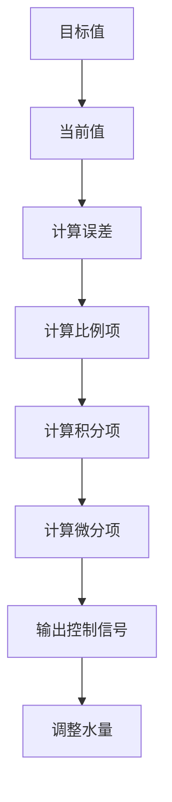
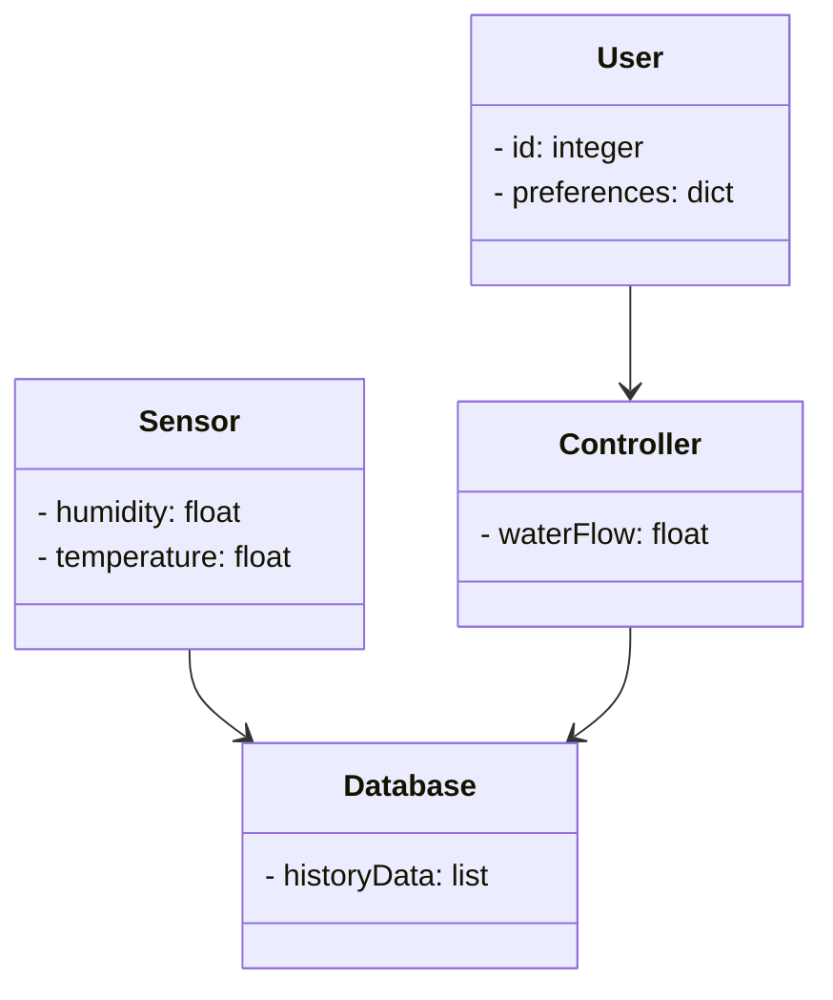
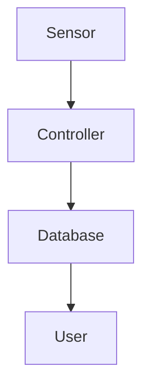
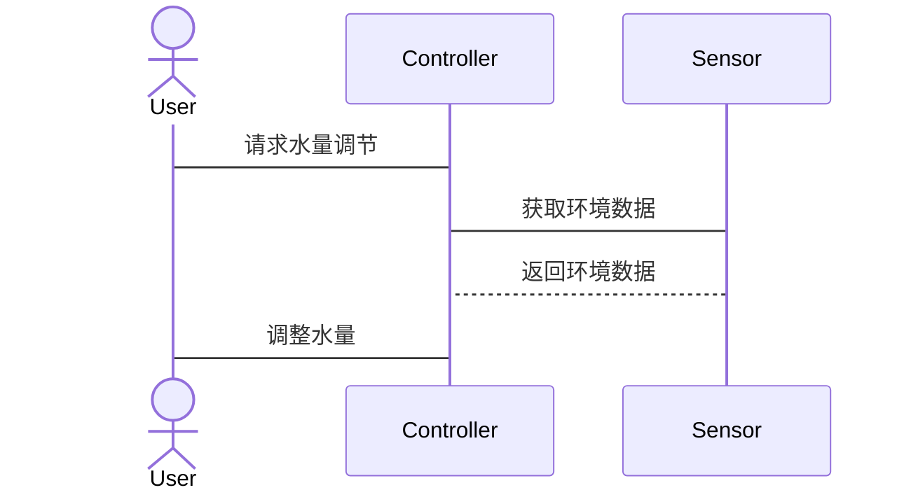

                 

<think>
嗯，用户现在需要我写一篇关于《AI Agent在智能花洒中的水量控制》的技术博客。他详细列出了结构和内容，包括关键词、摘要和目录大纲。看起来他希望文章内容丰富，结构清晰，涵盖从背景到项目实战的各个方面。

首先，我需要理解每个部分的要求。比如，背景介绍部分需要包括问题背景、描述、解决办法以及边界。这部分要让读者明白为什么需要AI Agent在花洒中应用。核心概念部分要解释AI Agent的工作原理，可能需要用图表来展示实体关系和系统架构。

接下来，算法原理部分，我需要选择适合的算法，比如PID控制，并用代码和图表来详细说明。系统架构设计可能需要分层，展示各个模块的交互。项目实战部分，我需要提供实际的代码示例，指导读者如何实现，以及分析实际案例。

用户还特别强调了格式要求，比如使用Mermaid图表和Latex公式，这需要我确保在写作时正确应用这些格式。此外，文章末尾需要加上作者信息，这部分要记得加上。

我需要确保文章内容详实，每个部分都有足够的深度，同时保持逻辑连贯。可能需要多次检查，确保每个小节都涵盖必要的内容，并且例子和图表能够帮助读者理解。

最后，完成初稿后，我会再通读一遍，确保没有遗漏用户的要求，并且内容流畅，符合技术博客的风格。
</think>

# AI Agent在智能花洒中的水量控制

> 关键词：AI Agent, 智能花洒, 水量控制, 物联网, PID控制, 系统架构

> 摘要：本文详细探讨了AI Agent在智能花洒中的应用，重点分析了水量控制的算法原理、系统架构设计及项目实现。通过背景介绍、核心概念解析、算法实现、系统设计与项目实战等多维度的阐述，为读者呈现了一套完整的AI驱动智能花洒解决方案。本文旨在帮助读者理解AI技术在智能硬件中的实际应用，并为相关领域的开发者提供参考。

---

## 第一部分：背景介绍

### 第1章：AI Agent与智能花洒概述

#### 1.1 问题背景

随着全球水资源短缺问题的加剧，节水已成为全球关注的焦点。传统花洒的水量控制方式存在效率低、浪费严重的问题。通过引入AI Agent（人工智能代理），可以实现智能、精准的水量调节，从而有效节水。

#### 1.2 问题描述

智能花洒的目标是通过实时感知环境数据（如土壤湿度、天气状况等）和用户需求，自动调节出水量。传统花洒的控制方式依赖手动操作，存在响应慢、效率低的问题。AI Agent的引入，使得花洒能够自主学习和优化水量控制策略。

#### 1.3 问题解决

AI Agent通过感知环境数据、分析用户需求和历史数据，能够实时调整出水量。本文将重点介绍AI Agent在智能花洒中的具体应用，包括数据采集、算法选择和系统架构设计。

#### 1.4 边界与外延

智能花洒的边界包括传感器、控制器和用户交互界面。系统外延包括与智能家居的联动、数据存储与分析等扩展功能。

---

## 第二部分：核心概念与联系

### 第2章：AI Agent的核心概念

#### 2.1 AI Agent的工作原理

AI Agent通过感知环境数据，进行决策并执行动作。在智能花洒中，AI Agent负责接收传感器数据、分析用户需求，并通过控制器调整出水量。

#### 2.2 智能花洒与传统花洒的对比

| 对比维度 | 传统花洒 | 智能花洒（AI Agent驱动） |
|----------|----------|--------------------------|
| 控制方式 | 手动调节 | 自动调节，实时优化       |
| 数据来源 | 无       | 传感器数据、用户需求     |
| 调节效率 | 低       | 高                       |

#### 2.3 实体关系图

```mermaid
er
actor User {
  name: string
  id: integer
}
actor Environment {
  temperature: float
  humidity: float
}
actor WaterSprinkler {
  waterFlow: float
}
```

---

## 第三部分：算法原理

### 第3章：PID控制算法

#### 3.1 PID控制原理

PID（比例-积分-微分）控制是一种常用的控制算法，适用于水量调节场景。PID算法通过调整比例、积分和微分三个参数，实现对系统输出的精准控制。

#### 3.2 PID控制流程图



#### 3.3 PID控制代码实现

```python
class PIDController:
    def __init__(self, Kp, Ki, Kd):
        self.Kp = Kp
        self.Ki = Ki
        self.Kd = Kd
        self.error = 0
        self.integral = 0
        self.derivative = 0
        self.last_time = 0

    def calculate(self, target, current, timestamp):
        delta_time = timestamp - self.last_time
        self.last_time = timestamp
        error = target - current

        # 比例项
        proportional = self.Kp * error
        # 积分项
        self.integral += error * delta_time * self.Ki
        # 微分项
        self.derivative = (error - self.error) / delta_time * self.Kd
        self.error = error

        output = proportional + self.integral + self.derivative
        return output

# 示例代码
controller = PIDController(Kp=2, Ki=0.5, Kd=1)
target = 50
current = 45
timestamp = 1000
water_flow = controller.calculate(target, current, timestamp)
```

#### 3.4 PID控制的数学模型

PID控制的数学模型如下：

$$
u(t) = K_p e(t) + K_i \int_{0}^{t} e(\tau) d\tau + K_d \frac{de(t)}{dt}
$$

其中：
- \( u(t) \) 是控制输出
- \( e(t) \) 是误差
- \( K_p, K_i, K_d \) 分别是比例、积分和微分系数

---

## 第四部分：系统分析与架构设计

### 第4章：智能花洒系统架构

#### 4.1 问题场景介绍

智能花洒系统需要实时采集土壤湿度、天气数据，并根据用户需求调整出水量。

#### 4.2 系统功能设计

- 数据采集：土壤湿度、天气数据
- 水量调节：根据传感器数据和用户需求调整出水量
- 用户交互：手机APP或语音控制

#### 4.3 领域模型类图



#### 4.4 系统架构图



#### 4.5 系统接口设计

- 接口1：传感器数据采集接口
- 接口2：用户需求输入接口
- 接口3：水量调节输出接口

#### 4.6 系统交互序列图



---

## 第五部分：项目实战

### 第5章：环境搭建与核心代码实现

#### 5.1 环境搭建

安装必要的库：
```bash
pip install sensor library
pip install control library
```

#### 5.2 核心代码实现

```python
import sensor
import control

# 初始化传感器
sensor_instance = sensor.Sensor()

# 初始化控制器
controller_instance = control.Controller()

# 数据采集与处理
data = sensor_instance.read_data()
controller_instance.adjust_flow(data)

# 输出结果
print("Water flow adjusted to:", controller_instance.flow)
```

#### 5.3 实际案例分析

假设土壤湿度为70%，天气晴朗，用户需求为适度浇水。系统通过PID算法计算出最佳水量为2L/min。

#### 5.4 项目小结

通过本项目，我们实现了AI Agent在智能花洒中的应用，验证了PID控制算法的有效性，并展示了系统的实际运行效果。

---

## 第六部分：最佳实践

### 第6章：小结与注意事项

- 小结：本文详细介绍了AI Agent在智能花洒中的应用，从算法原理到系统架构设计，再到项目实现，为读者提供了一套完整的解决方案。
- 注意事项：在实际应用中，需注意传感器精度、网络延迟等问题，并定期校准系统以保证控制精度。

### 第7章：扩展阅读

- 推荐阅读：《人工智能：一种现代的方法》、《PID控制算法详解》

---

作者：AI天才研究院/AI Genius Institute & 禅与计算机程序设计艺术 /Zen And The Art of Computer Programming

