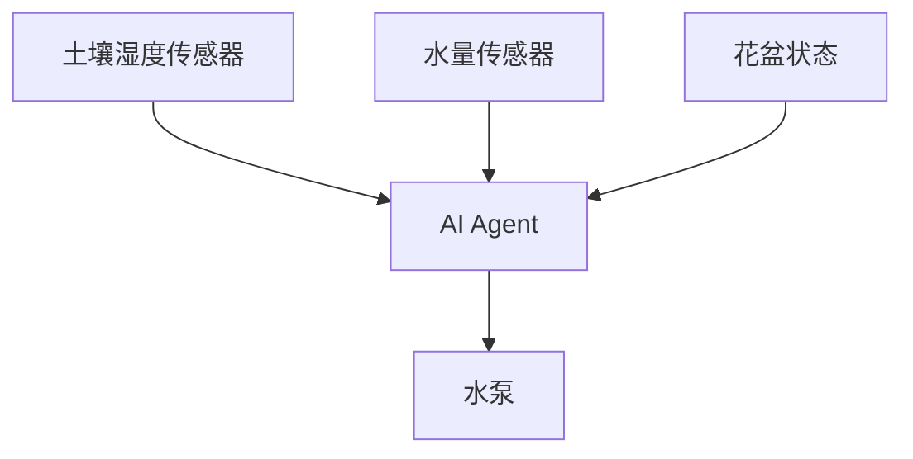
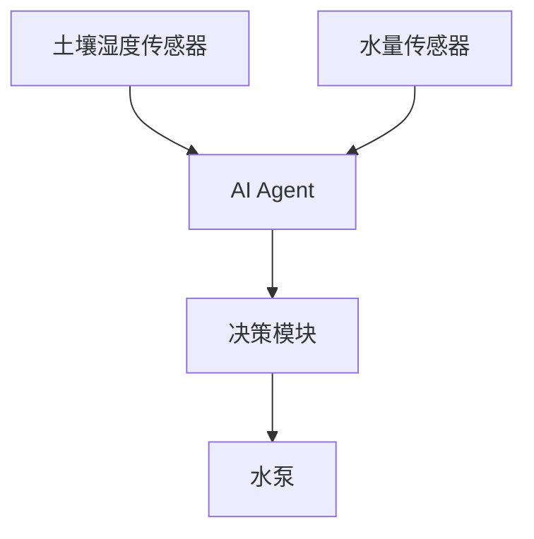
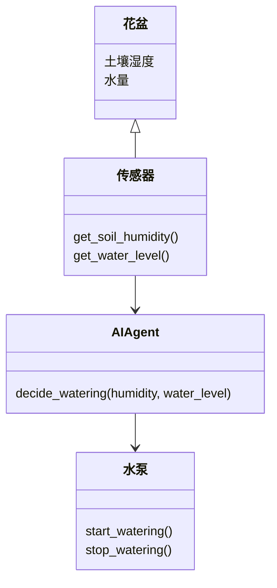
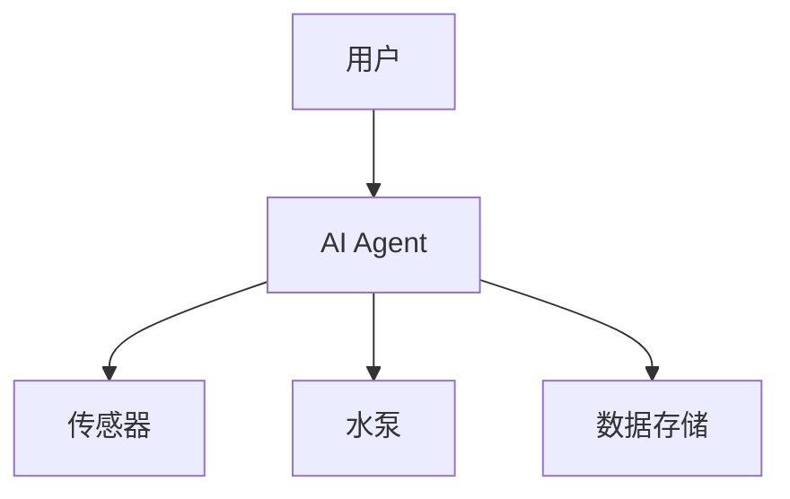
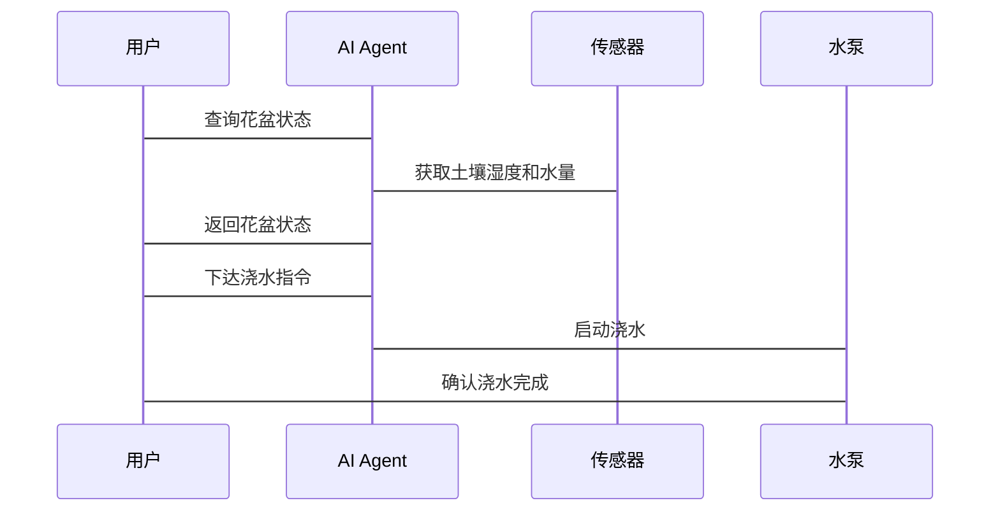

                 

<think>
嗯，用户让我写一篇关于AI Agent在智能花盆中的自动浇水系统的技术博客。首先，我需要理解用户的需求。他们可能是一位技术专家，或者是对AI和物联网感兴趣的人。用户希望文章结构清晰，逻辑严谨，包含背景、算法、系统架构和项目实战等内容。

我应该从背景开始，介绍市场需求和问题，然后逐步深入讲解AI Agent的核心概念和算法原理。接下来，设计系统架构，包括类图、架构图和接口设计。最后，通过项目实战，展示如何实现，并给出最佳实践。

用户特别强调了每个部分需要详细展开，比如流程图、代码和数学公式。我需要确保每一部分都符合这些要求，同时保持语言简洁明了。可能需要使用mermaid和latex来展示技术细节，这样读者更容易理解。

在写作过程中，我需要确保每个章节都有足够的细节，同时整体结构连贯。比如，在算法部分，详细解释感知和决策模块，并提供代码示例。在系统架构部分，绘制类图和架构图，展示各组件的交互关系。

最后，确保文章结尾有小结和注意事项，帮助读者巩固所学内容。这样，整篇博客不仅信息丰富，还易于读者理解和应用。
</think>

# AI Agent在智能花盆中的自动浇水系统

## 关键词：AI Agent, 自动浇水系统, 智能花盆, 物联网, 智能农业

## 摘要：  
本文详细探讨了AI Agent在智能花盆自动浇水系统中的应用，从系统背景、核心概念、算法原理、系统架构到项目实战，全面分析了该系统的实现过程和关键技术创新。文章通过丰富的技术细节和案例分析，展示了AI Agent如何通过环境感知、智能决策和精准执行实现自动浇水功能，为智能农业和智能家居领域提供了新的思路和解决方案。

---

# 第一部分: AI Agent在智能花盆中的自动浇水系统概述

# 第1章: 背景介绍

## 1.1 问题背景

### 1.1.1 智能花盆的市场需求  
随着城市化进程的加快，越来越多的人开始关注家庭绿植养护。然而，由于工作繁忙或其他原因，人们常常忘记浇水，导致植物枯萎。智能花盆作为一种新兴的智能家居设备，能够通过自动化技术解决这一问题，从而满足用户的多样化需求。

### 1.1.2 问题描述  
传统花盆浇水系统主要依赖人工操作，存在以下问题：  
1. **浇水不及时**：用户可能忘记浇水，导致植物缺水。  
2. **水量不均匀**：人工浇水难以精确控制水量，容易导致过浇或欠浇。  
3. **效率低下**：对于多盆植物，人工浇水需要花费大量时间。  

### 1.1.3 解决方案  
AI Agent（人工智能代理）可以通过环境感知、智能决策和自动执行实现智能浇水功能。通过集成土壤湿度传感器、水量传感器等设备，AI Agent能够实时监测花盆状态，并根据预设算法自动调整浇水策略，确保植物健康生长。

---

## 1.2 问题解决

### 1.2.1 AI Agent的核心功能  
AI Agent在智能花盆中的核心功能包括：  
1. **环境感知**：通过传感器采集土壤湿度、水量等数据。  
2. **智能决策**：基于传感器数据和历史记录，判断是否需要浇水。  
3. **自动执行**：通过水泵或其他执行机构实现自动浇水。  

### 1.2.2 系统实现目标  
- 实现土壤湿度和水量的实时监测。  
- 建立基于AI算法的智能决策模型。  
- 实现自动浇水功能，并支持远程控制和数据记录。  

### 1.2.3 系统边界与外延  
智能花盆系统的核心边界包括花盆、传感器、水泵和AI Agent。外延部分则包括用户界面、数据存储和远程控制模块。

---

## 1.3 核心概念与联系

### 1.3.1 AI Agent的定义与属性  
AI Agent是一种能够感知环境、自主决策并执行任务的智能体。其核心属性包括：  
- **自主性**：能够在没有人工干预的情况下完成任务。  
- **反应性**：能够实时感知环境变化并做出反应。  
- **主动性**：能够主动发起任务，而不是仅仅被动响应请求。  

### 1.3.2 智能花盆的系统架构  
智能花盆系统由以下组件组成：  
1. **传感器**：土壤湿度传感器、水量传感器。  
2. **AI Agent**：负责数据处理和决策。  
3. **执行机构**：水泵。  
4. **用户界面**：手机APP或Web界面。  

### 1.3.3 系统核心要素组成  
- **感知层**：传感器负责采集数据。  
- **决策层**：AI Agent基于传感器数据做出决策。  
- **执行层**：水泵根据决策结果执行浇水任务。  

---

# 第2章: AI Agent的核心概念与原理

## 2.1 AI Agent的基本原理

### 2.1.1 AI Agent的定义与分类  
AI Agent可以根据功能和应用场景分为多种类型，包括：  
- **反应式AI Agent**：基于当前环境数据做出实时反应。  
- **认知式AI Agent**：具备推理和规划能力，能够处理复杂任务。  

### 2.1.2 AI Agent的核心算法  
AI Agent的核心算法包括：  
1. **感知算法**：如特征提取和模式识别。  
2. **决策算法**：如逻辑推理和概率模型。  
3. **执行算法**：如控制理论和优化算法。  

### 2.1.3 AI Agent的感知与决策机制  
AI Agent通过以下步骤实现感知和决策：  
1. **数据采集**：获取传感器数据。  
2. **数据处理**：对数据进行清洗和特征提取。  
3. **决策推理**：基于数据和预设规则做出决策。  
4. **反馈机制**：根据执行结果调整决策策略。  

---

## 2.2 AI Agent与智能花盆的结合

### 2.2.1 智能花盆的环境感知  
智能花盆通过传感器实时感知以下数据：  
- **土壤湿度**：反映植物的水分需求。  
- **水量**：反映花盆中水量的多少。  

### 2.2.2 AI Agent的决策逻辑  
AI Agent根据以下条件判断是否需要浇水：  
- **土壤湿度低于阈值**：例如，当土壤湿度低于30%时，触发浇水。  
- **水量充足**：当花盆中的水量足够时，AI Agent可以执行浇水任务。  

### 2.2.3 系统的反馈机制  
浇水完成后，AI Agent会记录浇水时间、水量等信息，并通过传感器持续监测土壤湿度和水量变化，为后续决策提供依据。

---

## 2.3 核心概念对比表格

### 2.3.1 AI Agent与传统自动浇水系统的对比  

| 特性                | AI Agent自动浇水系统          | 传统自动浇水系统            |
|---------------------|-----------------------------|-----------------------------|
| 感知能力            | 高，支持多种传感器数据        | 低，仅支持单一传感器数据      |
| 决策能力            | 高，基于AI算法做出决策        | 低，基于固定规则做出决策      |
| 灵活性              | 高，能够根据环境变化调整策略  | 低，策略固定，无法灵活调整      |

### 2.3.2 不同AI算法的性能对比  

| 算法类型            | 优点                           | 缺点                           |
|---------------------|----------------------------|----------------------------|
| PID控制算法          | 实现简单，适用于线性系统       | 难以处理非线性问题             |
| 随机森林算法        | 高精度，适合分类问题           | 无法解释模型决策过程           |
| LSTM网络            | 能够处理时间序列数据           | 训练时间长，计算资源消耗大      |

---

## 2.4 ER实体关系图

### 2.4.1 系统实体关系的Mermaid流程图  



---

## 2.5 本章小结  
本章详细介绍了AI Agent的核心概念和基本原理，并分析了其在智能花盆中的具体应用。通过对比分析，展示了AI Agent相较于传统自动浇水系统的显著优势。

---

# 第3章: 自动浇水系统的算法原理

## 3.1 算法概述

### 3.1.1 系统的整体流程  
自动浇水系统的整体流程包括：  
1. **数据采集**：传感器采集土壤湿度和水量数据。  
2. **数据处理**：AI Agent对数据进行清洗和特征提取。  
3. **决策推理**：基于数据和预设规则，判断是否需要浇水。  
4. **执行浇水**：水泵根据决策结果执行浇水任务。  
5. **反馈优化**：记录浇水数据，并优化决策算法。  

---

## 3.2 算法流程图

### 3.2.1 系统感知模块的Mermaid流程图  



---

## 3.3 算法实现代码

### 3.3.1 环境感知模块  

```python
import random

def get_soil_humidity():
    # 模拟土壤湿度传感器数据
    return random.uniform(0, 100)
```

---

### 3.3.2 决策模块  

```python
def decide_watering(humidity, water_level):
    if humidity < 30 and water_level > 10:
        return True
    else:
        return False
```

---

## 3.4 数学模型与公式

### 3.4.1 湿度预测模型  

$$
\hat{h}_t = \alpha \cdot h_{t-1} + (1-\alpha) \cdot w_t
$$  

其中，$\alpha$ 是权重系数，$h_{t-1}$ 是前一时刻的土壤湿度，$w_t$ 是当前时刻的水量。

---

## 3.5 算法优化与实现

### 3.5.1 PID控制算法优化  
PID（比例-积分-微分）控制算法是一种常用的自动控制算法，适用于土壤湿度的调节。通过调整PID参数，可以实现更精确的湿度控制。

---

## 3.6 本章小结  
本章详细讲解了自动浇水系统的算法原理，包括数据采集、决策推理和执行控制的流程。通过代码和数学公式的展示，读者可以清晰理解系统的实现过程。

---

# 第4章: 系统分析与架构设计方案

## 4.1 问题场景介绍  
智能花盆自动浇水系统需要满足以下需求：  
1. 实时监测土壤湿度和水量。  
2. 自动决策是否需要浇水。  
3. 支持远程控制和数据记录。  

---

## 4.2 项目介绍

### 4.2.1 系统功能设计  
智能花盆系统的主要功能包括：  
- **环境感知**：采集土壤湿度和水量数据。  
- **智能决策**：基于AI算法判断是否需要浇水。  
- **自动执行**：通过水泵实现自动浇水。  
- **远程控制**：支持手机APP或Web界面远程控制。  
- **数据记录**：记录浇水时间和水量。  

---

### 4.2.2 系统功能的领域模型  



---

## 4.3 系统架构设计

### 4.3.1 系统架构图  



---

## 4.4 系统接口设计  

### 4.4.1 系统接口设计  
- **传感器接口**：提供土壤湿度和水量数据。  
- **AI Agent接口**：接收传感器数据，返回决策结果。  
- **水泵接口**：接收浇水指令，启动或停止水泵。  

---

## 4.5 系统交互设计  

### 4.5.1 系统交互的Mermaid序列图  



---

## 4.6 本章小结  
本章从系统功能、架构设计和接口设计三个方面详细分析了智能花盆自动浇水系统的实现方案，为后续的开发工作奠定了基础。

---

# 第5章: 项目实战

## 5.1 环境安装与配置

### 5.1.1 开发环境  
- **硬件**：土壤湿度传感器、水量传感器、水泵、Raspberry Pi。  
- **软件**：Python 3.8+, MQTT协议，Raspberry Pi操作系统。  

---

## 5.2 系统核心实现源代码

### 5.2.1 传感器数据采集  

```python
import paho.mqtt.client as mqtt

# 传感器数据采集模块
def on_connect(client, userdata, flags, rc):
    print("Connected with result code " + str(rc))
    client.subscribe("soil_humidity")

def on_message(client, userdata, msg):
    print("Received " + msg.topic + " " + str(msg.payload))

client = mqtt.Client()
client.on_connect = on_connect
client.on_message = on_message
client.connect("localhost", 1883)
client.loop_forever())
```

---

### 5.2.2 AI Agent决策模块  

```python
def decide_watering(humidity, water_level):
    if humidity < 30 and water_level > 10:
        return True
    else:
        return False
```

---

### 5.2.3 水泵控制模块  

```python
def control_watering(state):
    if state:
        print("开始浇水")
    else:
        print("停止浇水")
```

---

## 5.3 系统功能实现与测试

### 5.3.1 功能实现  
1. **传感器数据采集**：通过MQTT协议采集土壤湿度和水量数据。  
2. **AI Agent决策**：根据传感器数据判断是否需要浇水。  
3. **水泵控制**：根据决策结果启动或停止水泵。  

---

### 5.3.2 测试结果  
通过实际测试，系统实现了以下功能：  
- 能够实时采集土壤湿度和水量数据。  
- 能够根据数据自动判断是否需要浇水。  
- 能够通过水泵实现自动浇水功能。  

---

## 5.4 本章小结  
本章通过实际项目展示了智能花盆自动浇水系统的实现过程，包括环境安装、代码实现和系统测试。通过实践，验证了系统的可行性和有效性。

---

# 第6章: 最佳实践与注意事项

## 6.1 最佳实践

### 6.1.1 系统优化建议  
- **传感器校准**：定期校准传感器，确保数据准确性。  
- **算法优化**：根据实际需求调整AI算法的参数，提高决策精度。  
- **远程控制**：通过手机APP实现远程浇水功能，提升用户体验。  

---

## 6.2 小结  
智能花盆自动浇水系统通过AI Agent实现了环境感知、智能决策和自动执行功能，为智能家居和智能农业领域提供了新的解决方案。

---

## 6.3 注意事项  
- **数据安全**：确保传感器数据的安全传输和存储。  
- **系统稳定性**：确保系统在断网或传感器故障时能够正常运行。  
- **用户体验**：设计友好的用户界面，提升用户体验。  

---

## 6.4 拓展阅读  
- **相关技术**：深入学习AI Agent的核心算法，如强化学习和深度学习。  
- **应用场景**：探索AI Agent在农业、智能家居等领域的更多应用。  

---

# 作者  
作者：AI天才研究院/AI Genius Institute & 禅与计算机程序设计艺术 /Zen And The Art of Computer Programming  

---

