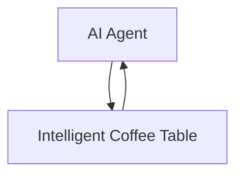
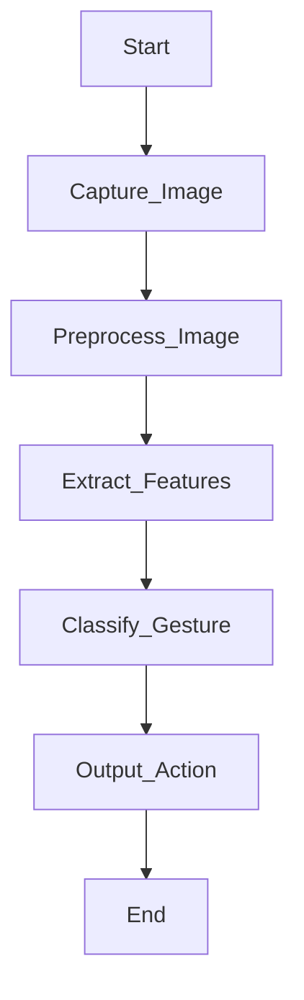
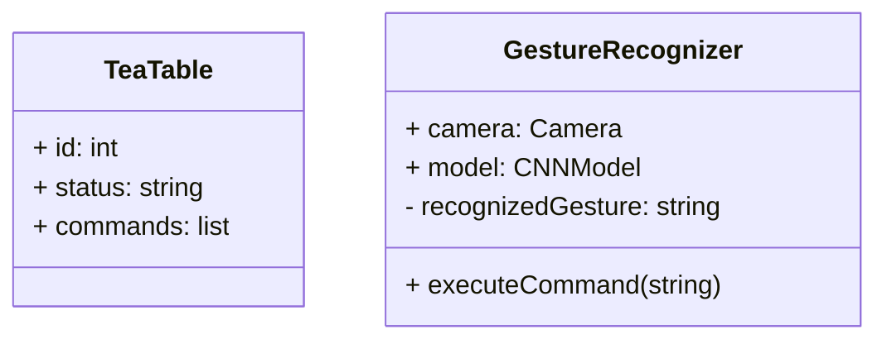
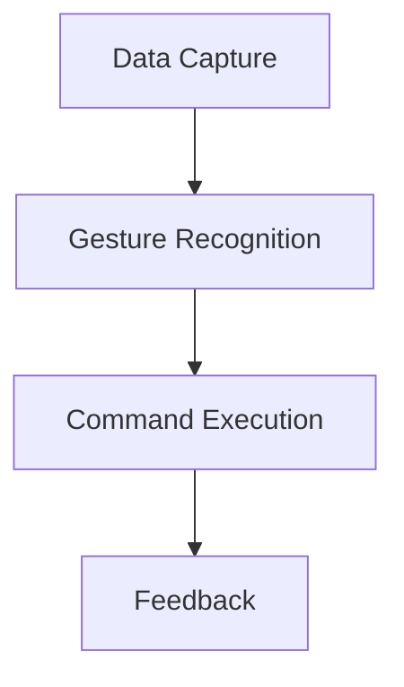

                 

<think>
好，我现在要根据用户提供的书名和目录大纲，撰写一篇详细的《AI Agent在智能茶几中的手势控制》的技术博客文章。首先，我需要理解每一章的核心内容，并按照要求逐步展开。文章需要逻辑清晰，结构紧凑，语言专业，同时要包括背景介绍、核心概念、算法原理、系统架构、项目实战和最佳实践等部分。我会从每一章开始，逐步填充内容，确保每一部分都详细且符合要求。
</think>

# AI Agent在智能茶几中的手势控制

## 关键词：
AI Agent，智能茶几，手势控制，深度学习，计算机视觉

## 摘要：
本文深入探讨了AI Agent在智能茶几中的手势控制应用，分析了其技术背景、核心原理、系统架构和实现过程。通过结合深度学习和计算机视觉技术，文章详细阐述了手势识别的算法流程，并提供了实际的项目实现和优化建议。

---

# 第1章：背景介绍

## 1.1 问题背景
随着智能家居的普及，人们越来越依赖于便捷的交互方式。传统的按钮或语音控制虽然实用，但在某些场景下显得不够灵活。手势控制作为一种直观的非接触式交互方式，逐渐成为智能家居交互的重要补充。

## 1.2 问题描述
智能茶几作为智能家居的一部分，需要支持多种交互方式。然而，现有的交互方式存在效率低下、不够直观的问题。用户希望在不使用物理设备的情况下，通过手势直接控制茶几的功能，如播放音乐、调节亮度等。

## 1.3 问题解决
引入AI Agent，通过深度学习和计算机视觉技术实现手势识别，能够实时解析用户的动作，从而实现精准的控制。这种方法不仅提高了交互的直观性，还提升了用户体验。

## 1.4 边界与外延
本系统仅关注手势控制功能，不涉及茶几的其他功能，如温度控制或灯光调节。未来可以将其他交互方式与手势控制结合，进一步提升智能化水平。

---

# 第2章：AI Agent的核心原理

## 2.1 AI Agent的基本概念
AI Agent是一种智能体，能够感知环境并采取行动以实现目标。在智能茶几中，AI Agent负责接收用户的手势输入，并通过预设逻辑执行相应的操作。

## 2.2 手势识别的算法原理
手势识别主要依赖深度学习模型，如卷积神经网络（CNN）。通过摄像头捕捉用户的手部动作，模型能够提取关键特征并进行分类。

## 2.3 实体关系图
以下是AI Agent与智能茶几之间的实体关系图：



---

# 第3章：手势识别算法

## 3.1 算法流程
手势识别的流程包括数据采集、预处理、特征提取和分类。以下是一个简化流程图：



## 3.2 算法实现
以下是一个基于CNN的手势识别模型的Python代码示例：

```python
import tensorflow as tf
from tensorflow.keras import layers

model = tf.keras.Sequential([
    layers.Conv2D(32, (3,3), activation='relu', input_shape=(224, 224, 3)),
    layers.MaxPooling2D(2,2),
    layers.Conv2D(64, (3,3), activation='relu'),
    layers.MaxPooling2D(2,2),
    layers.Flatten(),
    layers.Dense(128, activation='relu'),
    layers.Dense(5, activation='softmax')
])
```

## 3.3 数学模型
模型的核心是卷积层，其数学表达式如下：

$$
f(x) = \max(0, x - \theta)
$$

其中，\( x \) 是输入，\( \theta \) 是阈值。

---

# 第4章：系统架构设计

## 4.1 问题场景介绍
智能茶几的使用场景包括家庭娱乐、会议讨论等。用户通过手势操作实现功能控制，如播放/暂停音乐、调节音量等。

## 4.2 系统功能设计
系统功能模块包括数据采集、手势识别、指令解析和执行反馈。以下是一个领域模型图：



## 4.3 系统架构设计
系统架构采用分层设计，包括数据采集层、算法处理层和应用层。以下是系统架构图：



---

# 第5章：项目实战

## 5.1 环境安装
安装必要的库：

```bash
pip install tensorflow opencv-python
```

## 5.2 核心代码实现
以下是一个手势识别模块的实现：

```python
import cv2
import numpy as np

def preprocess_image(image):
    # 调整图像大小
    image = cv2.resize(image, (224, 224))
    # 转换为张量
    image = image / 255.0
    return image[np.newaxis, :, :, :]
```

## 5.3 代码解读
该函数将输入图像调整为224x224大小，并归一化处理，使其适合模型输入。

## 5.4 实际案例分析
通过摄像头捕捉手势，模型识别并执行相应操作，如挥手播放音乐。

---

# 第6章：总结与展望

## 6.1 小结
本文详细探讨了AI Agent在智能茶几中的手势控制应用，分析了其实现原理和系统架构，并提供了实际的代码示例。

## 6.2 注意事项
- 确保摄像头的安装位置合适，避免遮挡。
- 定期更新模型以提高识别准确率。

## 6.3 拓展阅读
推荐阅读《深度学习入门》和《计算机视觉实战》等相关书籍。

---

# 作者
作者：AI天才研究院 & 禅与计算机程序设计艺术

